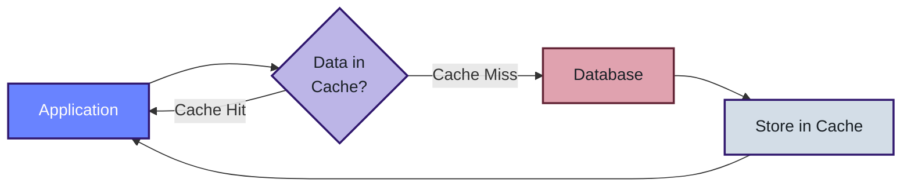
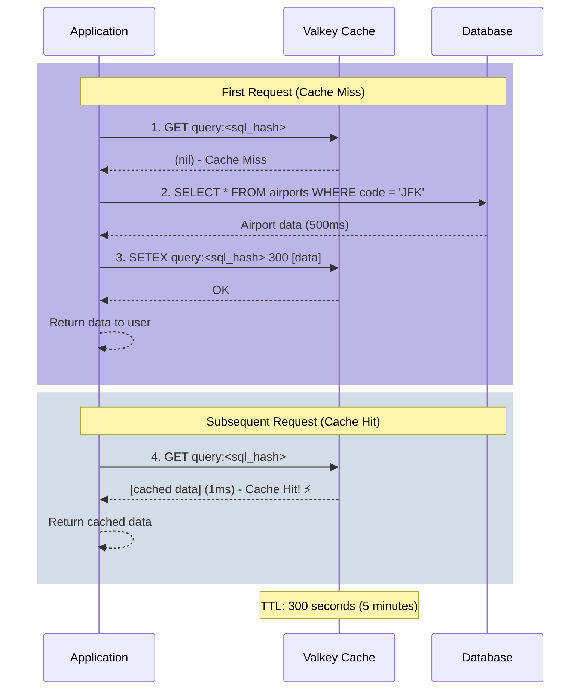

# Cache-Aside (Lazy Loading)

## Overview

Cache-Aside, also known as Lazy Loading, is a caching strategy where the application is responsible for managing the cache. Data is loaded into the cache only when it's requested, not proactively. This pattern is called "lazy" because the cache is populated on-demand rather than ahead of time.

## How It Works

The Cache-Aside pattern follows a simple three-step process:

1. **Check the Cache First**: When the application needs data, it first checks if the data exists in the cache
2. **Cache Miss - Query the Database**: If the data isn't in the cache (a "miss"), the application queries the database directly
3. **Update the Cache**: After retrieving data from the database, the application stores it in the cache for future requests

This approach ensures that only frequently accessed data occupies cache space, making efficient use of memory resources.

## Benefits

- **Memory Efficiency**: Only stores data that's actually being used
- **Simple to Implement**: The application has full control over what gets cached and when
- **Resilient**: If the cache fails, the application can still function by querying the database
- **Flexible TTL**: Each cache entry can have its own expiration time

## Trade-offs

- **Initial Latency**: The first request for any data will always be slow (cache miss)
- **Cache Stampede Risk**: Multiple requests for the same uncached data can hit the database simultaneously
- **Stale Data Possible**: Cached data may become outdated if the database is updated directly

## Flow Diagram



## Detailed Sequence



## Implementation Pseudocode

```python
def get_data(query):
    """
    Cache-Aside pattern in simple pseudocode
    """
    # Generate a unique key for this query
    cache_key = hash(query)
    
    # Step 1: Check the cache first
    data = cache.get(cache_key)
    
    if data exists:
        # Cache Hit! Return immediately
        return data
    
    # Step 2: Cache Miss - Query the database
    data = database.execute(query)
    
    # Step 3: Store result in cache for next time
    cache.set(cache_key, data, ttl=300)  # Cache for 5 minutes
    
    return data
```

### Real-World Example

```python
# Example: Getting airport information
query = "SELECT * FROM airports WHERE code = 'JFK'"

# First call - Cache Miss (slow: ~500ms)
result = get_data(query)  # Queries database, stores in cache

# Second call - Cache Hit (fast: ~1ms)
result = get_data(query)  # Returns from cache instantly

# After 5 minutes, cache expires
# Next call - Cache Miss again (slow: ~500ms)
result = get_data(query)  # Queries database, refreshes cache
```

## When to Use Cache-Aside

✅ **Good For:**
- Read-heavy workloads where the same data is requested frequently
- Data that doesn't change often
- Applications where you want fine-grained control over caching logic
- Scenarios where cache failures shouldn't break the application

❌ **Not Ideal For:**
- Write-heavy workloads (consider Write-Through or Write-Behind)
- Data that must always be fresh and up-to-date
- Scenarios requiring cache warming at startup
