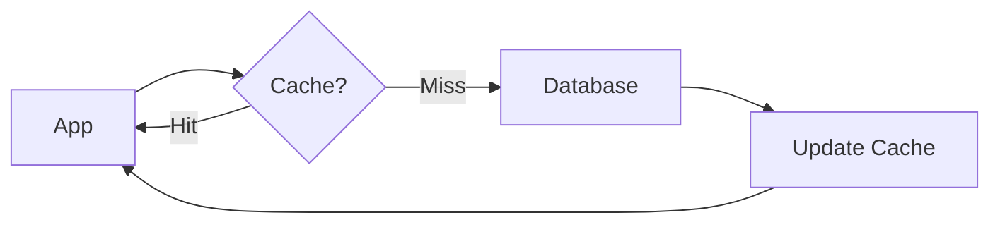
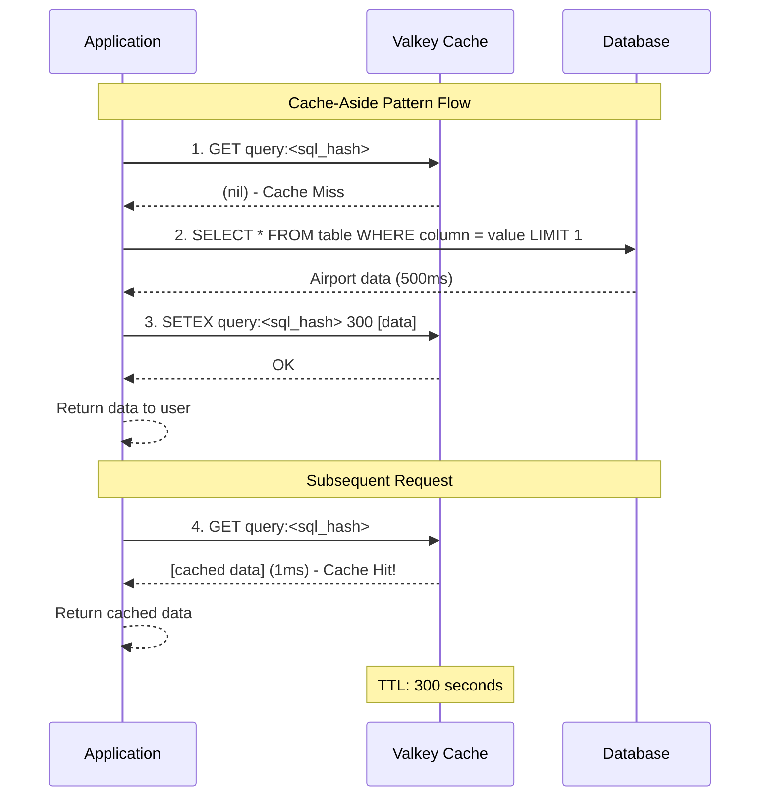

# Cache-Aside (Lazy Loading)

Load data into cache only when requested.

```mermaid
graph LR
    A[App] --> B{Cache?}
    B -->|Miss| C[Database]
    C --> D[Update Cache]
    D --> A
    B -->|Hit| A
```

```mermaid
sequenceDiagram
    participant App as Application
    participant Cache as Valkey Cache
    participant RDBMS as Database
    Note over App,RDBMS: Cache-Aside Pattern Flow
    App->>Cache: 1. GET query:<sql_hash>
    Cache-->>App: (nil) - Cache Miss
    App->>RDBMS: 2. SELECT * FROM table WHERE column = value LIMIT 1;
    RDBMS-->>App: Airport data (500ms)
    App->>Cache: 3. SETEX query:<sql_hash> 300 [data]
    Cache-->>App: OK
    App-->>App: Return data to user
    Note over App,RDBMS: Subsequent Request
    App->>Cache: 4. GET query:<sql_hash>
    Cache-->>App: [cached data] (1ms) - Cache Hit!
    App-->>App: Return cached data
    Note over Cache: TTL: 300 seconds
```
