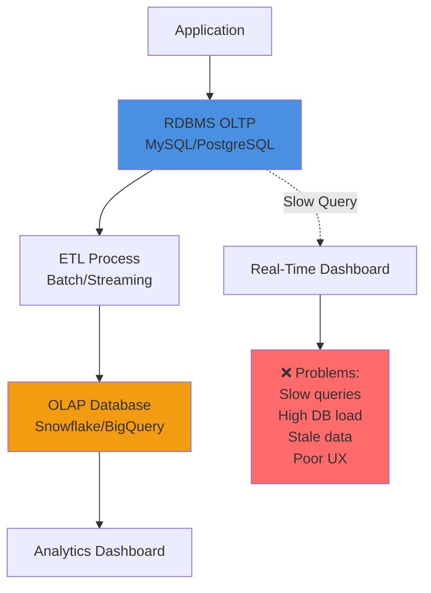
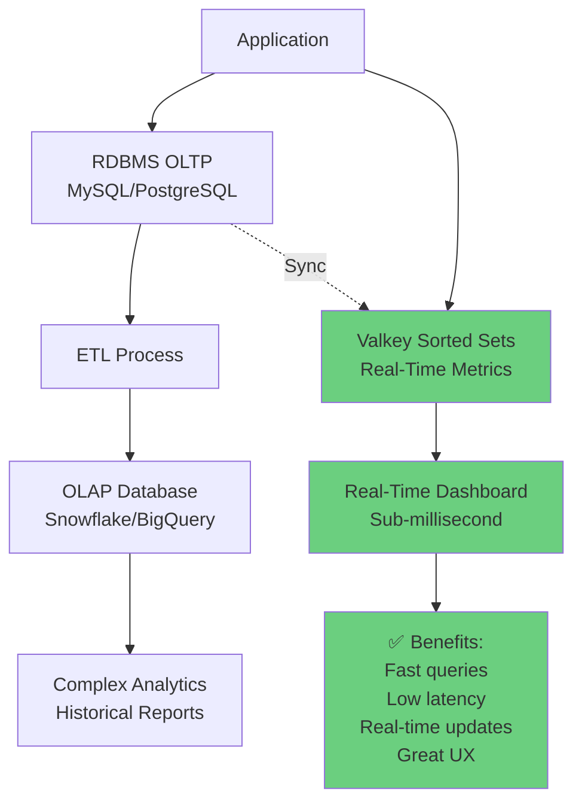
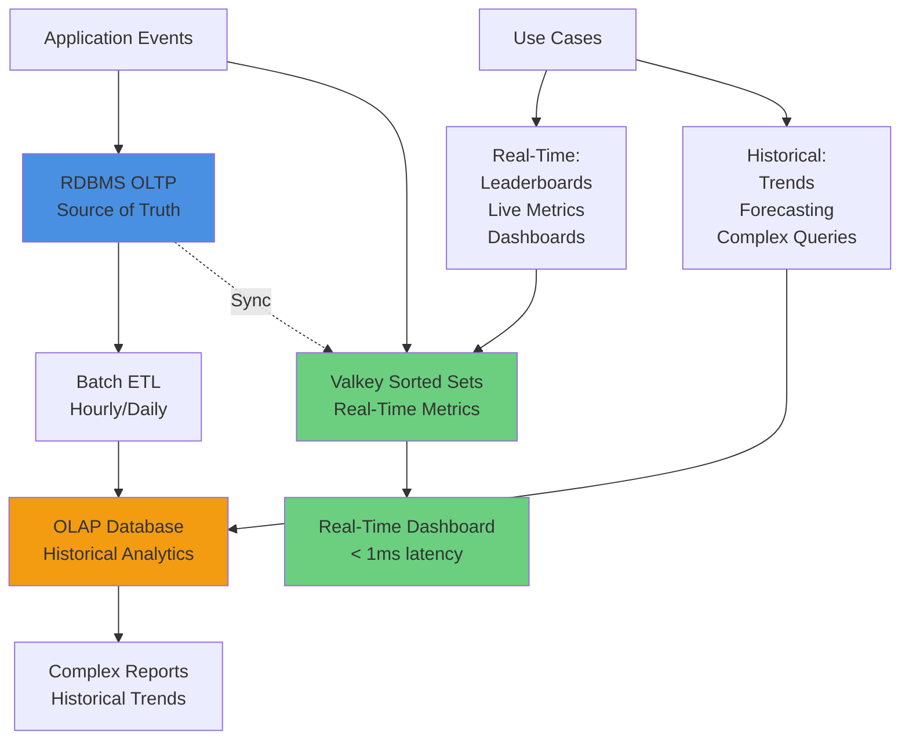

# Leaderboards and Real-Time Metrics with Valkey Sorted Sets

## Overview

Valkey Sorted Sets provide a powerful data structure for real-time leaderboards and metrics that complement traditional RDBMS OLTP systems. While they don't replace OLAP analytical databases for complex queries, they fill a critical niche for real-time reporting and dashboards where sub-millisecond performance is essential.

## The Real-Time Metrics Challenge

### Traditional Approach: RDBMS + OLAP



**Problems with RDBMS for Real-Time Metrics:**
- ❌ **Slow Queries**: Aggregations on large tables take seconds
- ❌ **Database Load**: Real-time queries compete with transactional workload
- ❌ **Scalability**: Performance degrades with data volume
- ❌ **Latency**: Users wait for query results
- ❌ **Cost**: Expensive to scale for read-heavy analytics

**OLAP Databases Are Great But:**
- ✅ Excellent for complex analytical queries
- ✅ Handle massive datasets efficiently
- ✅ Support sophisticated aggregations
- ⚠️ **But**: Typically have higher latency (seconds)
- ⚠️ **But**: Designed for batch processing, not real-time updates
- ⚠️ **But**: Overkill for simple leaderboards and counters

## The Solution: Valkey Sorted Sets

### Hybrid Architecture



**Benefits of Valkey Sorted Sets:**
- ✅ **Sub-millisecond Queries**: Get top 10 in < 1ms
- ✅ **Real-Time Updates**: Instant score updates
- ✅ **Low Latency**: Perfect for live dashboards
- ✅ **Scalability**: Handle millions of entries efficiently
- ✅ **Simple Operations**: Increment, rank, range queries
- ✅ **Offload RDBMS**: Reduce database query load

## What Are Sorted Sets?

Sorted Sets (ZSET) are a Valkey data structure that stores unique members with associated scores, automatically sorted by score.

### Key Characteristics

```
Sorted Set: "airport:bookings:daily:2025-11-25"

┌─────────┬────────┬──────────────────┐
│ Score   │ Member │ Description      │
├─────────┼────────┼──────────────────┤
│ 15420   │ SEA    │ Seattle          │
│ 12350   │ LAX    │ Los Angeles      │
│ 10890   │ JFK    │ New York JFK     │
│ 9876    │ ORD    │ Chicago O'Hare   │
│ 8543    │ DFW    │ Dallas/Fort Worth│
│ 7234    │ ATL    │ Atlanta          │
│ 6123    │ DEN    │ Denver           │
│ 5432    │ SFO    │ San Francisco    │
│ 4321    │ MIA    │ Miami            │
│ 3210    │ BOS    │ Boston           │
└─────────┴────────┴──────────────────┘

Automatically sorted by score (descending)
```

**Properties:**
- **Unique Members**: Each member appears only once
- **Scored**: Each member has a numeric score
- **Sorted**: Automatically maintained in score order
- **Fast Operations**: O(log N) for most operations
- **Range Queries**: Get top N, bottom N, or by score range
- **Rank Queries**: Get member's rank in O(log N)

## Core Operations

### 1. Add/Update Scores

```bash
# Add or update member scores
ZADD airport:bookings:daily:2025-11-25 15420 SEA
ZADD airport:bookings:daily:2025-11-25 12350 LAX
ZADD airport:bookings:daily:2025-11-25 10890 JFK

# Add multiple members at once
ZADD airport:bookings:daily:2025-11-25 9876 ORD 8543 DFW 7234 ATL

# Increment score (atomic operation)
ZINCRBY airport:bookings:daily:2025-11-25 1 SEA
# Returns: "15421" (new score)
```

### 2. Get Top N (Leaderboard)

```bash
# Get top 10 airports by bookings (highest scores first)
ZREVRANGE airport:bookings:daily:2025-11-25 0 9 WITHSCORES

# Output:
# 1) "SEA"
# 2) "15421"
# 3) "LAX"
# 4) "12350"
# 5) "JFK"
# 6) "10890"
# ...
```

### 3. Get Member Rank

```bash
# Get SEA's rank (0-based, highest score = rank 0)
ZREVRANK airport:bookings:daily:2025-11-25 SEA
# Returns: 0 (1st place)

# Get LAX's rank
ZREVRANK airport:bookings:daily:2025-11-25 LAX
# Returns: 1 (2nd place)
```

### 4. Get Member Score

```bash
# Get SEA's booking count
ZSCORE airport:bookings:daily:2025-11-25 SEA
# Returns: "15421"
```

### 5. Get Count

```bash
# Get total number of airports
ZCARD airport:bookings:daily:2025-11-25
# Returns: 10
```

### 6. Range by Score

```bash
# Get airports with 10,000+ bookings
ZRANGEBYSCORE airport:bookings:daily:2025-11-25 10000 +inf WITHSCORES

# Output:
# 1) "JFK"
# 2) "10890"
# 3) "LAX"
# 4) "12350"
# 5) "SEA"
# 6) "15421"
```

## Use Cases

### 1. Airport Booking Leaderboard

**Scenario**: Display top airports by daily bookings in real-time.

**RDBMS Approach (Slow):**
```sql
-- Query takes 500ms-2s on large table
SELECT airport_code, COUNT(*) as booking_count
FROM bookings
WHERE booking_date = '2025-11-25'
GROUP BY airport_code
ORDER BY booking_count DESC
LIMIT 10;
```

**Valkey Sorted Set Approach (Fast):**
```bash
# Query takes < 1ms
ZREVRANGE airport:bookings:daily:2025-11-25 0 9 WITHSCORES
```

**Update Pattern:**
```python
# When booking is created
def create_booking(airport_code, booking_date):
    # 1. Insert into RDBMS (source of truth)
    db.execute(
        "INSERT INTO bookings (airport_code, booking_date, ...) VALUES (?, ?, ...)",
        airport_code, booking_date
    )
    
    # 2. Increment Valkey sorted set (real-time metrics)
    cache_key = f"airport:bookings:daily:{booking_date}"
    valkey.zincrby(cache_key, 1, airport_code)
    
    # 3. Set expiration (cleanup old data)
    valkey.expire(cache_key, 86400 * 7)  # 7 days
```

**Benefits:**
- ✅ Real-time updates (instant)
- ✅ Sub-millisecond queries
- ✅ No database load
- ✅ Scales to millions of bookings

### 2. Airline Performance Metrics

**Scenario**: Track on-time performance percentage for airlines.

```python
# Update on-time performance
def update_airline_performance(airline_code, on_time_percentage):
    cache_key = "airline:performance:monthly:2025-11"
    
    # Store percentage as score (0-100)
    valkey.zadd(cache_key, {airline_code: on_time_percentage})
    
    # Set expiration
    valkey.expire(cache_key, 86400 * 60)  # 60 days

# Get top 10 airlines by on-time performance
def get_top_airlines():
    cache_key = "airline:performance:monthly:2025-11"
    
    # Get top 10 (highest scores first)
    results = valkey.zrevrange(cache_key, 0, 9, withscores=True)
    
    return [
        {"airline": airline, "on_time_pct": score}
        for airline, score in results
    ]

# Example output:
# [
#   {"airline": "DL", "on_time_pct": 92.5},
#   {"airline": "AA", "on_time_pct": 89.3},
#   {"airline": "UA", "on_time_pct": 87.1},
#   ...
# ]
```

### 3. Real-Time Flight Delay Tracking

**Scenario**: Track average delay minutes by airport.

```python
# Update average delay
def update_airport_delay(airport_code, avg_delay_minutes):
    cache_key = "airport:delays:realtime"
    
    # Store delay as score (negative for early, positive for late)
    valkey.zadd(cache_key, {airport_code: avg_delay_minutes})

# Get airports with worst delays
def get_most_delayed_airports(limit=10):
    cache_key = "airport:delays:realtime"
    
    # Get highest delays (highest scores first)
    results = valkey.zrevrange(cache_key, 0, limit-1, withscores=True)
    
    return [
        {"airport": airport, "avg_delay_min": score}
        for airport, score in results
    ]

# Get airports with best performance (least delays)
def get_best_performing_airports(limit=10):
    cache_key = "airport:delays:realtime"
    
    # Get lowest delays (lowest scores first)
    results = valkey.zrange(cache_key, 0, limit-1, withscores=True)
    
    return [
        {"airport": airport, "avg_delay_min": score}
        for airport, score in results
    ]
```

### 4. Passenger Loyalty Points

**Scenario**: Track passenger loyalty points for tier status.

```python
# Update passenger points
def add_loyalty_points(passenger_id, points):
    cache_key = "loyalty:points:2025"
    
    # Increment points atomically
    new_score = valkey.zincrby(cache_key, points, passenger_id)
    
    return new_score

# Get passenger rank
def get_passenger_rank(passenger_id):
    cache_key = "loyalty:points:2025"
    
    # Get rank (0-based, highest points = rank 0)
    rank = valkey.zrevrank(cache_key, passenger_id)
    
    if rank is None:
        return None
    
    # Convert to 1-based rank
    return rank + 1

# Get top 100 passengers
def get_top_passengers(limit=100):
    cache_key = "loyalty:points:2025"
    
    results = valkey.zrevrange(cache_key, 0, limit-1, withscores=True)
    
    return [
        {
            "passenger_id": passenger_id,
            "points": int(score),
            "rank": idx + 1
        }
        for idx, (passenger_id, score) in enumerate(results)
    ]

# Get passengers in point range (e.g., Gold tier: 50k-100k points)
def get_passengers_by_tier(min_points, max_points):
    cache_key = "loyalty:points:2025"
    
    results = valkey.zrangebyscore(
        cache_key,
        min_points,
        max_points,
        withscores=True
    )
    
    return [
        {"passenger_id": passenger_id, "points": int(score)}
        for passenger_id, score in results
    ]
```

## Complementing RDBMS and OLAP

### Data Flow Architecture



### When to Use Each

| Requirement | RDBMS OLTP | Valkey Sorted Sets | OLAP Database |
|-------------|------------|-------------------|---------------|
| **Source of Truth** | ✅ Yes | ❌ No | ❌ No |
| **Real-Time Updates** | ✅ Yes | ✅ Yes | ⚠️ Batch |
| **Real-Time Queries** | ⚠️ Slow | ✅ Fast (< 1ms) | ⚠️ Slow |
| **Simple Leaderboards** | ⚠️ Slow | ✅ Perfect | ❌ Overkill |
| **Complex Analytics** | ⚠️ Limited | ❌ No | ✅ Excellent |
| **Historical Trends** | ✅ Yes | ⚠️ Limited | ✅ Excellent |
| **Data Volume** | ✅ Large | ⚠️ Hot data only | ✅ Massive |
| **Query Latency** | 100ms-2s | < 1ms | 1s-10s |
| **Cost** | $$$ | $ | $$$$ |

### Complementary Roles

**RDBMS OLTP (MySQL/PostgreSQL):**
- ✅ **Role**: Source of truth for transactional data
- ✅ **Strengths**: ACID compliance, complex relationships, data integrity
- ✅ **Use For**: Bookings, passengers, flights, payments
- ⚠️ **Weakness**: Slow for real-time aggregations

**Valkey Sorted Sets:**
- ✅ **Role**: Real-time metrics and leaderboards
- ✅ **Strengths**: Sub-millisecond queries, real-time updates, simple operations
- ✅ **Use For**: Top N queries, rankings, live dashboards
- ⚠️ **Weakness**: Not for complex analytics or source of truth

**OLAP Database (Snowflake/BigQuery):**
- ✅ **Role**: Historical analytics and complex queries
- ✅ **Strengths**: Massive scale, complex aggregations, historical trends
- ✅ **Use For**: Business intelligence, forecasting, trend analysis
- ⚠️ **Weakness**: Higher latency, batch processing

## Performance Comparison

### Scenario: Get Top 10 Airports by Daily Bookings

**Dataset**: 1 million bookings across 500 airports

**RDBMS Query:**
```sql
SELECT airport_code, COUNT(*) as booking_count
FROM bookings
WHERE booking_date = '2025-11-25'
GROUP BY airport_code
ORDER BY booking_count DESC
LIMIT 10;
```

**Performance:**
- Query time: 500ms - 2s (depending on indexes)
- Database CPU: High (full table scan or index scan)
- Scalability: Degrades with data volume
- Concurrent queries: Limited by database capacity

**Valkey Sorted Set:**
```bash
ZREVRANGE airport:bookings:daily:2025-11-25 0 9 WITHSCORES
```

**Performance:**
- Query time: < 1ms
- Memory: ~50KB for 500 airports
- Scalability: Constant time O(log N)
- Concurrent queries: Thousands per second

**Improvement:**
- **500-2000x faster** query time
- **Zero database load** (offloaded to Valkey)
- **Better UX** (instant results)
- **Higher throughput** (more concurrent users)

## Implementation Patterns

### Pattern 1: Write-Through Updates

Update both RDBMS and Valkey in the same transaction:

```python
def create_booking(airport_code, booking_date, passenger_id):
    """
    Create booking with write-through to Valkey
    """
    try:
        # 1. Insert into RDBMS (source of truth)
        booking_id = db.execute(
            "INSERT INTO bookings (airport_code, booking_date, passenger_id) "
            "VALUES (?, ?, ?)",
            airport_code, booking_date, passenger_id
        )
        
        # 2. Update Valkey sorted set (real-time metrics)
        cache_key = f"airport:bookings:daily:{booking_date}"
        valkey.zincrby(cache_key, 1, airport_code)
        valkey.expire(cache_key, 86400 * 7)  # 7 days TTL
        
        # 3. Update other metrics
        valkey.zincrby(f"airport:bookings:monthly:{booking_date[:7]}", 1, airport_code)
        
        return booking_id
        
    except Exception as e:
        # Rollback RDBMS transaction
        db.rollback()
        raise
```

### Pattern 2: Async Updates (Event-Driven)

Update Valkey asynchronously via message queue:

```python
# Producer: Publish booking event
def create_booking(airport_code, booking_date, passenger_id):
    # 1. Insert into RDBMS
    booking_id = db.execute(...)
    
    # 2. Publish event to message queue
    event_bus.publish("booking.created", {
        "booking_id": booking_id,
        "airport_code": airport_code,
        "booking_date": booking_date
    })
    
    return booking_id

# Consumer: Update Valkey metrics
def handle_booking_created(event):
    airport_code = event["airport_code"]
    booking_date = event["booking_date"]
    
    # Update Valkey sorted sets
    cache_key = f"airport:bookings:daily:{booking_date}"
    valkey.zincrby(cache_key, 1, airport_code)
    valkey.expire(cache_key, 86400 * 7)
```

### Pattern 3: Periodic Sync (Batch)

Rebuild Valkey metrics from RDBMS periodically:

```python
def rebuild_daily_metrics(date):
    """
    Rebuild daily metrics from RDBMS
    Run hourly or when Valkey data is lost
    """
    # 1. Query RDBMS for daily bookings
    results = db.execute(
        "SELECT airport_code, COUNT(*) as booking_count "
        "FROM bookings "
        "WHERE booking_date = ? "
        "GROUP BY airport_code",
        date
    )
    
    # 2. Rebuild Valkey sorted set
    cache_key = f"airport:bookings:daily:{date}"
    
    # Clear existing data
    valkey.delete(cache_key)
    
    # Batch insert
    pipeline = valkey.pipeline()
    for row in results:
        pipeline.zadd(cache_key, {row["airport_code"]: row["booking_count"]})
    pipeline.expire(cache_key, 86400 * 7)
    pipeline.execute()
    
    print(f"Rebuilt metrics for {date}: {len(results)} airports")
```

## Data Lifecycle Management

### TTL Strategy

```python
# Daily metrics: 7 days retention
valkey.expire("airport:bookings:daily:2025-11-25", 86400 * 7)

# Monthly metrics: 60 days retention
valkey.expire("airport:bookings:monthly:2025-11", 86400 * 60)

# Yearly metrics: 2 years retention
valkey.expire("airport:bookings:yearly:2025", 86400 * 730)

# Real-time metrics: 24 hours retention
valkey.expire("airport:delays:realtime", 86400)
```

### Cleanup Pattern

```python
def cleanup_old_metrics():
    """
    Clean up old metrics that should have expired
    Run daily as a safety measure
    """
    # Get all daily metric keys
    cursor = 0
    while True:
        cursor, keys = valkey.scan(
            cursor,
            match="airport:bookings:daily:*",
            count=100
        )
        
        for key in keys:
            # Extract date from key
            date_str = key.split(":")[-1]
            date = datetime.strptime(date_str, "%Y-%m-%d")
            
            # Delete if older than 7 days
            if (datetime.now() - date).days > 7:
                valkey.delete(key)
                print(f"Deleted old metric: {key}")
        
        if cursor == 0:
            break
```

## Best Practices

### 1. Use Appropriate Granularity

```python
# ✅ Good: Separate keys for different time periods
"airport:bookings:daily:2025-11-25"
"airport:bookings:monthly:2025-11"
"airport:bookings:yearly:2025"

# ❌ Bad: Single key for all time
"airport:bookings:all"  # Grows indefinitely
```

### 2. Set Expiration

```python
# ✅ Good: Always set TTL
valkey.zadd(cache_key, {airport: count})
valkey.expire(cache_key, 86400 * 7)

# ❌ Bad: No expiration
valkey.zadd(cache_key, {airport: count})  # Memory leak!
```

### 3. Use Atomic Operations

```python
# ✅ Good: Atomic increment
valkey.zincrby(cache_key, 1, airport_code)

# ❌ Bad: Read-modify-write (race condition)
current = valkey.zscore(cache_key, airport_code) or 0
valkey.zadd(cache_key, {airport_code: current + 1})
```

### 4. Batch Operations

```python
# ✅ Good: Use pipeline for multiple operations
pipeline = valkey.pipeline()
for airport, count in results:
    pipeline.zadd(cache_key, {airport: count})
pipeline.expire(cache_key, 86400 * 7)
pipeline.execute()

# ❌ Bad: Individual operations
for airport, count in results:
    valkey.zadd(cache_key, {airport: count})
valkey.expire(cache_key, 86400 * 7)
```

### 5. Handle Missing Data

```python
# ✅ Good: Fallback to RDBMS if Valkey data missing
def get_top_airports(date, limit=10):
    cache_key = f"airport:bookings:daily:{date}"
    
    # Try Valkey first
    results = valkey.zrevrange(cache_key, 0, limit-1, withscores=True)
    
    if results:
        return results
    
    # Fallback: Query RDBMS and rebuild cache
    results = db.execute(
        "SELECT airport_code, COUNT(*) as count "
        "FROM bookings WHERE booking_date = ? "
        "GROUP BY airport_code ORDER BY count DESC LIMIT ?",
        date, limit
    )
    
    # Rebuild cache for future requests
    rebuild_daily_metrics(date)
    
    return results
```

## Monitoring and Observability

### Key Metrics

```python
# Track Valkey sorted set metrics
def get_sorted_set_stats(cache_key):
    return {
        "total_members": valkey.zcard(cache_key),
        "memory_usage": valkey.memory_usage(cache_key),
        "ttl_seconds": valkey.ttl(cache_key),
        "top_10": valkey.zrevrange(cache_key, 0, 9, withscores=True)
    }

# Monitor query performance
def monitor_query_performance():
    start = time.time()
    results = valkey.zrevrange(cache_key, 0, 9, withscores=True)
    latency_ms = (time.time() - start) * 1000
    
    # Log if slow
    if latency_ms > 10:
        logger.warning(f"Slow Valkey query: {latency_ms:.2f}ms")
    
    return results
```

## Limitations and Considerations

### What Sorted Sets Are NOT

❌ **Not a Replacement for RDBMS:**
- No ACID transactions across multiple keys
- No complex joins or relationships
- Not the source of truth

❌ **Not a Replacement for OLAP:**
- Limited to simple aggregations
- No complex analytical queries
- No historical trend analysis

❌ **Not for All Data:**
- Keep only hot/recent data
- Use TTL to prevent memory bloat
- Archive old data to OLAP

### When NOT to Use Sorted Sets

- **Complex Analytics**: Use OLAP database
- **Historical Trends**: Use OLAP database
- **Source of Truth**: Use RDBMS
- **Large Datasets**: Use OLAP database (Valkey is in-memory)
- **Complex Queries**: Use RDBMS or OLAP

## Conclusion

Valkey Sorted Sets provide a powerful complement to RDBMS OLTP and OLAP databases for real-time metrics and leaderboards:

**Key Benefits:**
- ✅ Sub-millisecond query performance (500-2000x faster than RDBMS)
- ✅ Real-time updates (instant)
- ✅ Offload database (reduce RDBMS query load)
- ✅ Better user experience (instant dashboards)
- ✅ Cost-effective (reduce database scaling costs)

**Complementary Architecture:**
- **RDBMS**: Source of truth for transactional data
- **Valkey Sorted Sets**: Real-time metrics and leaderboards
- **OLAP**: Historical analytics and complex queries

**Use Cases:**
- Airport booking leaderboards
- Airline performance metrics
- Real-time delay tracking
- Passenger loyalty points
- Live dashboards and monitoring

By using Valkey Sorted Sets for real-time metrics while maintaining RDBMS as the source of truth and OLAP for complex analytics, you get the best of all worlds: real-time performance, data integrity, and analytical power.
