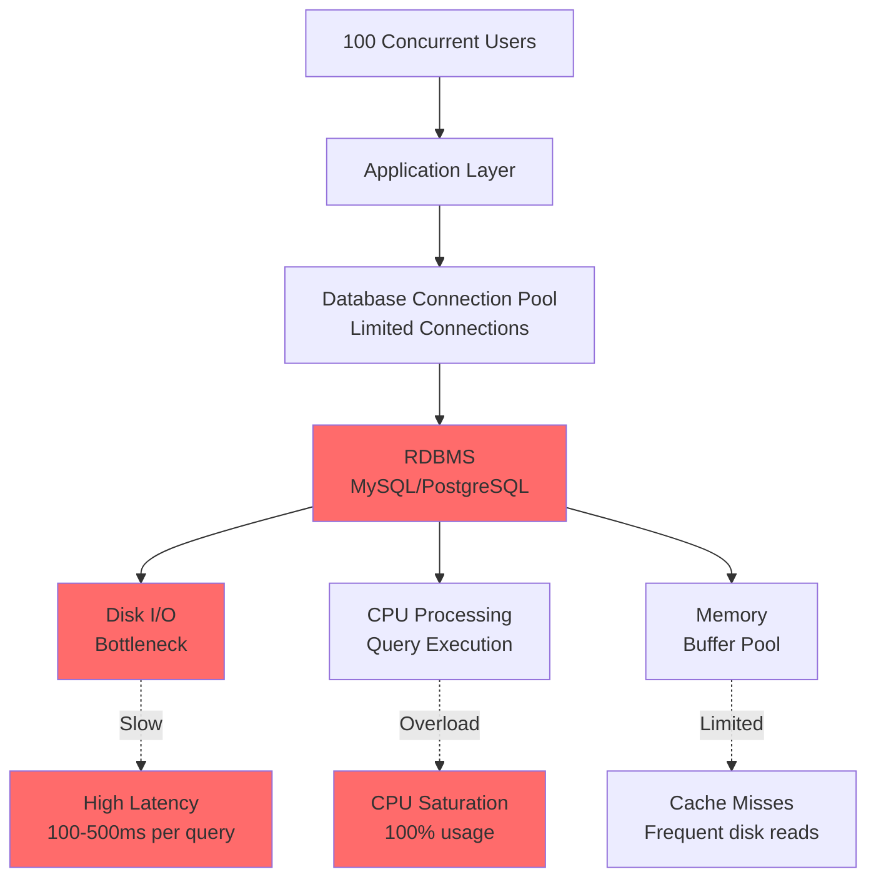
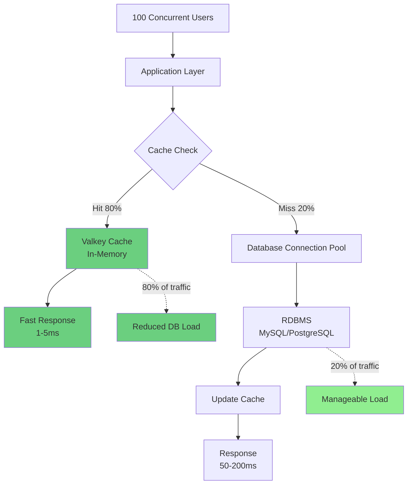
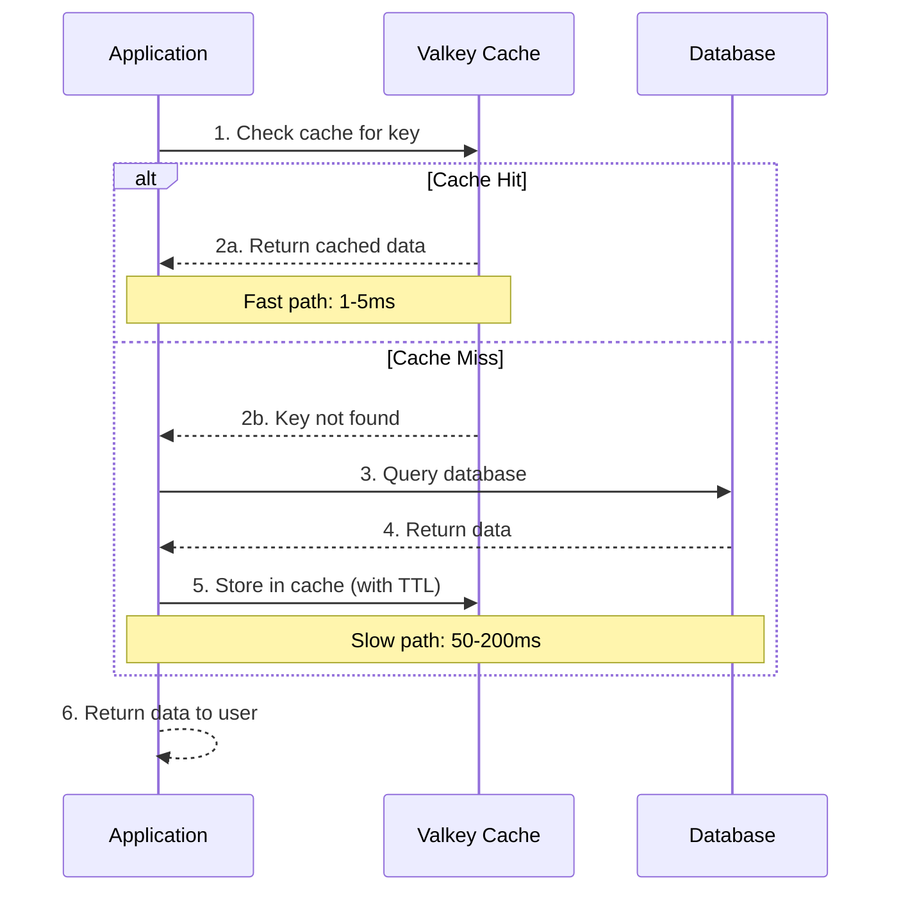
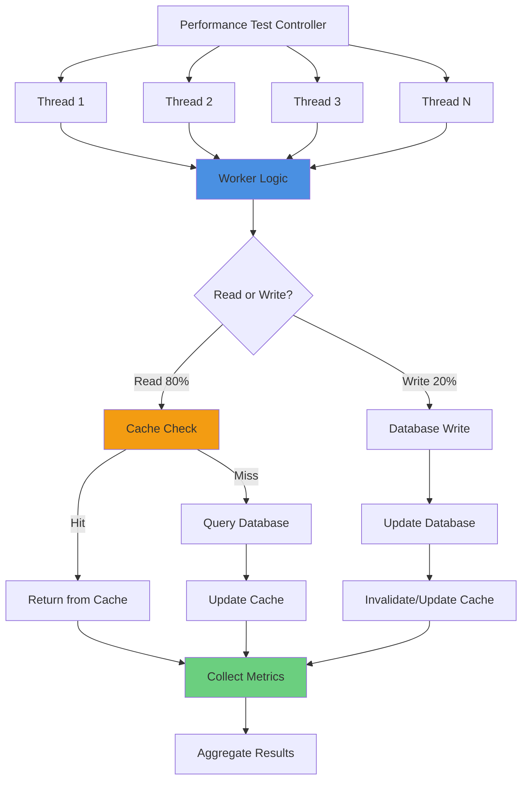
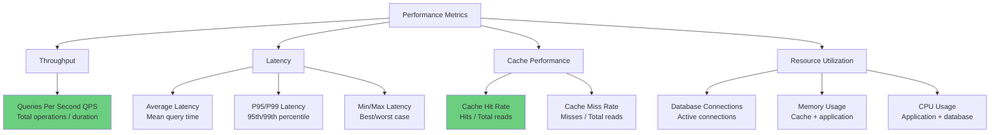
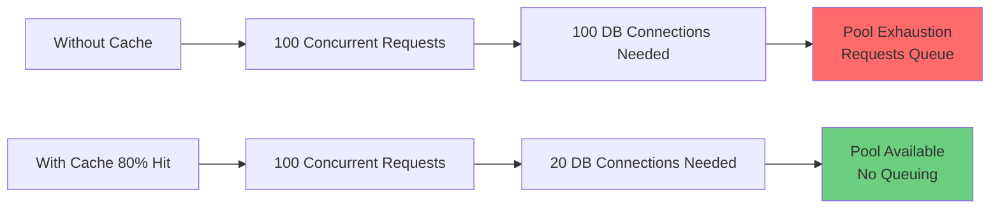
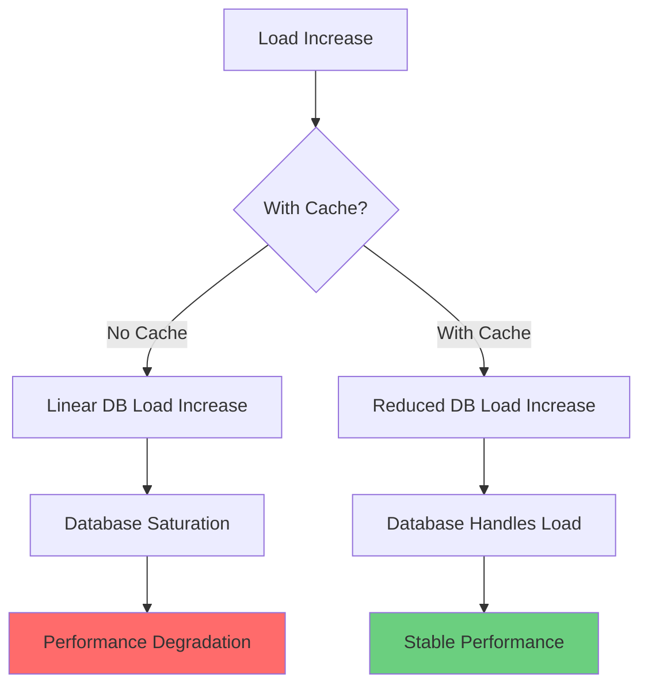
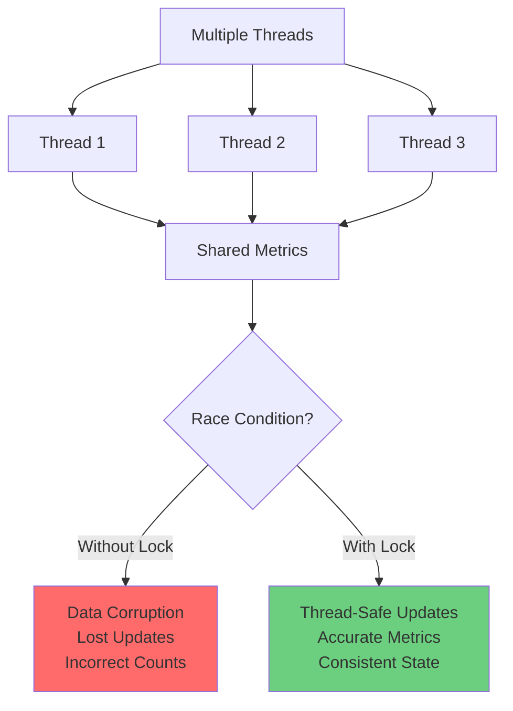
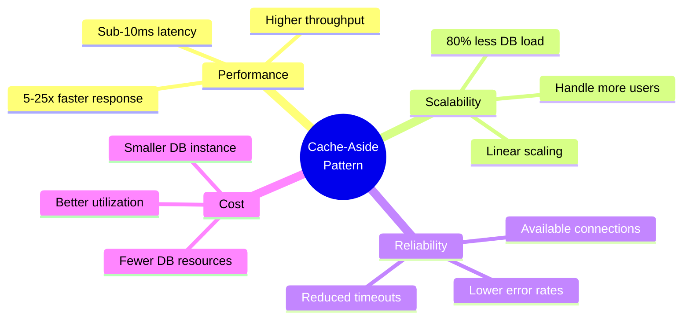

# Multi-Threaded Performance and Concurrency

## Overview

Multi-threaded performance testing simulates real-world concurrent load on database systems to measure how caching strategies like cache-aside reduce pressure on the RDBMS (Relational Database Management System). By running multiple threads simultaneously, we can observe how the system behaves under concurrent access patterns and quantify the benefits of caching.

## Core Concepts

### Concurrency

Concurrency is the ability of a system to handle multiple operations simultaneously. In database applications:

- **Multiple Users**: Many users accessing the system at the same time
- **Parallel Requests**: Multiple queries executing concurrently
- **Resource Contention**: Competition for shared resources (database connections, CPU, memory)
- **Throughput**: Number of operations completed per unit of time

### Performance Benchmarking

Performance benchmarking measures system behavior under various conditions:

- **Latency**: Time to complete a single operation
- **Throughput**: Operations per second (QPS - Queries Per Second)
- **Scalability**: How performance changes with increased load
- **Resource Utilization**: CPU, memory, network, and I/O usage


## The Database Pressure Problem

### Without Caching



**Problems:**
- Every query hits the database
- Database becomes the bottleneck
- Connection pool exhaustion
- Disk I/O saturation
- High CPU usage on database server
- Slow response times under load


### With Cache-Aside Pattern



**Benefits:**
- 80% of queries served from cache
- Database handles only 20% of traffic
- Connection pool remains available
- Reduced disk I/O
- Lower CPU usage on database
- Fast response times (1-5ms for cache hits)


## Cache-Aside Pattern

### How It Works



### Key Characteristics

1. **Lazy Loading**: Data is loaded into cache only when requested
2. **Application Managed**: Application code controls cache logic
3. **Cache Invalidation**: Application decides when to update/remove cache entries
4. **TTL (Time To Live)**: Automatic expiration prevents stale data


## Multi-Threaded Performance Testing

### Test Architecture



### Test Parameters

```pseudocode
test_configuration = {
    "threads": 4,                    // Number of concurrent threads
    "queries_per_thread": 10000,     // Operations per thread
    "total_queries": 40000,          // threads × queries_per_thread
    "read_ratio": 80,                // 80% reads, 20% writes
    "cache_ttl": 300000,             // 5 minutes in milliseconds
    "passenger_mode": "pool"         // "pool" or "random"
}
```


## Pseudocode Examples

### 1. Performance Test Initialization

```pseudocode
CLASS PerformanceTest:
    FUNCTION __init__(threads, queries, read_ratio, ttl, random_passengers):
        // Configuration
        SET self.threads = threads
        SET self.queries = queries
        SET self.read_ratio = read_ratio / 100.0
        SET self.ttl = ttl
        SET self.random_passengers = random_passengers
        
        // Metrics
        SET self.read_count = 0
        SET self.write_count = 0
        SET self.cache_hit = 0
        SET self.cache_miss = 0
        SET self.thread_metrics = {}
        SET self.lock = threading.Lock()  // Thread-safe metrics
        
        // Setup connections
        setup_database_connections()
        setup_cache_connections()
        
        // Setup passenger pool for consistent testing
        IF NOT random_passengers:
            setup_passenger_pool()
```

### 2. Worker Thread Logic

```pseudocode
FUNCTION worker_thread():
    """
    Each thread executes this function
    Performs queries_per_thread operations
    """
    
    FOR i IN RANGE(queries_per_thread):
        // Select random passenger and flight
        passenger_id = get_passenger_id()
        flight_id = get_random_flight_id()
        cache_key = "bookings:{passenger_id}"
        
        // Record start time (nanoseconds for precision)
        start_time_ns = current_time_nanoseconds()
        
        // Decide operation type based on read_ratio
        IF should_read():
            // READ OPERATION with cache-aside
            execute_read_operation(cache_key, passenger_id, start_time_ns)
        ELSE:
            // WRITE OPERATION
            execute_write_operation(cache_key, passenger_id, flight_id, start_time_ns)
```


### 3. Read Operation with Cache-Aside

```pseudocode
FUNCTION execute_read_operation(cache_key, passenger_id, start_time_ns):
    """
    Implements cache-aside pattern for reads
    
    Flow:
    1. Check cache
    2. If hit: return cached data (fast)
    3. If miss: query database, update cache, return data (slow)
    """
    
    // Step 1: Check cache
    cached_data = cache.get(cache_key)
    
    IF cached_data IS NOT NULL:
        // CACHE HIT - Fast path
        end_time_ns = current_time_nanoseconds()
        query_time_ns = end_time_ns - start_time_ns
        
        // Update metrics (thread-safe)
        WITH lock:
            INCREMENT read_count
            INCREMENT cache_hit
        
        record_metric(start_time_ns, query_time_ns, "cache_hit")
        
        RETURN cached_data
    
    ELSE:
        // CACHE MISS - Slow path
        
        // Step 2: Query database
        query = "SELECT p.firstname, p.lastname, COUNT(*) as booking_count
                 FROM passenger p
                 JOIN booking b ON p.passenger_id = b.passenger_id
                 WHERE p.passenger_id = :passenger_id
                 GROUP BY p.firstname, p.lastname"
        
        data = database.execute(query, passenger_id)
        end_time_ns = current_time_nanoseconds()
        
        // Step 3: Update cache with TTL
        cache.set(cache_key, data, ttl_milliseconds)
        
        query_time_ns = end_time_ns - start_time_ns
        
        // Update metrics (thread-safe)
        WITH lock:
            INCREMENT read_count
            INCREMENT cache_miss
        
        record_metric(start_time_ns, query_time_ns, "cache_miss")
        
        RETURN data
```


### 4. Write Operation with Cache Update

```pseudocode
FUNCTION execute_write_operation(cache_key, passenger_id, flight_id, start_time_ns):
    """
    Write operation with cache invalidation/update
    
    Flow:
    1. Write to database
    2. Update cache with fresh data
    3. Record metrics
    """
    
    // Step 1: Write to database
    write_query = "INSERT INTO booking (flight_id, passenger_id, price, seat)
                   VALUES (:flight_id, :passenger_id, 1000.00, '1A')"
    
    database.execute(write_query, flight_id, passenger_id)
    
    // Step 2: Update cache with fresh data
    // Read the updated data
    read_query = "SELECT p.firstname, p.lastname, COUNT(*) as booking_count
                  FROM passenger p
                  JOIN booking b ON p.passenger_id = b.passenger_id
                  WHERE p.passenger_id = :passenger_id
                  GROUP BY p.firstname, p.lastname"
    
    fresh_data = database.execute(read_query, passenger_id)
    
    // Update cache with TTL
    cache.set(cache_key, fresh_data, ttl_milliseconds)
    
    end_time_ns = current_time_nanoseconds()
    query_time_ns = end_time_ns - start_time_ns
    
    // Update metrics (thread-safe)
    WITH lock:
        INCREMENT write_count
    
    record_metric(start_time_ns, query_time_ns, "write")
```

### 5. Thread-Safe Metric Recording

```pseudocode
FUNCTION record_metric(timestamp, query_time_ns, operation_type):
    """
    Record metrics in a thread-safe manner
    
    Metrics tracked per second:
    - Count of operations
    - Total/min/max query time
    - Breakdown by operation type
    """
    
    // Convert nanosecond timestamp to seconds
    timestamp_seconds = timestamp // 1_000_000_000
    
    // Thread-safe update
    WITH lock:
        IF timestamp_seconds NOT IN thread_metrics:
            thread_metrics[timestamp_seconds] = {
                "count": 0,
                "total_time_ns": 0,
                "min_time_ns": INFINITY,
                "max_time_ns": 0,
                "reads": 0,
                "writes": 0,
                "cache_hits": 0,
                "cache_misses": 0
            }
        
        metrics = thread_metrics[timestamp_seconds]
        
        // Update aggregate metrics
        INCREMENT metrics.count
        ADD query_time_ns TO metrics.total_time_ns
        SET metrics.min_time_ns = MIN(metrics.min_time_ns, query_time_ns)
        SET metrics.max_time_ns = MAX(metrics.max_time_ns, query_time_ns)
        
        // Update operation-specific counters
        IF operation_type == "read":
            INCREMENT metrics.reads
        ELSE IF operation_type == "write":
            INCREMENT metrics.writes
        ELSE IF operation_type == "cache_hit":
            INCREMENT metrics.cache_hits
        ELSE IF operation_type == "cache_miss":
            INCREMENT metrics.cache_misses
```


### 6. Test Execution and Results

```pseudocode
FUNCTION run_performance_test():
    """
    Execute multi-threaded performance test
    """
    
    PRINT "Starting performance test..."
    PRINT "  Threads: {threads}"
    PRINT "  Queries per thread: {queries}"
    PRINT "  Total queries: {threads × queries}"
    PRINT "  Read ratio: {read_ratio}%"
    
    // Create threads
    threads_list = []
    test_start_time = current_time()
    
    FOR i IN RANGE(threads):
        thread = CREATE_THREAD(worker_thread)
        APPEND thread TO threads_list
        START thread
    
    // Wait for all threads to complete
    FOR thread IN threads_list:
        WAIT_FOR thread
    
    test_end_time = current_time()
    total_duration = test_end_time - test_start_time
    
    // Calculate results
    total_queries = read_count + write_count
    queries_per_second = total_queries / total_duration
    avg_latency_ms = (total_duration * 1000) / total_queries
    cache_hit_rate = (cache_hit / read_count) * 100
    
    // Display results
    PRINT "Test completed in {total_duration:.2f} seconds"
    PRINT "Total queries: {total_queries:,}"
    PRINT "Queries per second: {queries_per_second:,.2f}"
    PRINT "Average latency: {avg_latency_ms:.3f} ms"
    PRINT "Cache hit rate: {cache_hit_rate:.1f}%"
    
    // Save detailed metrics to JSON
    save_results_to_json(thread_metrics, total_duration)
```


## Performance Metrics

### Key Metrics Explained



### Typical Results

```
Test Configuration:
├─ Threads: 4
├─ Queries per thread: 10,000
├─ Total queries: 40,000
├─ Read ratio: 80%
└─ Cache TTL: 5 minutes

Results WITHOUT Cache:
├─ Duration: 120 seconds
├─ QPS: 333 queries/second
├─ Avg latency: 150 ms
├─ Database connections: 100% utilized
└─ Database CPU: 95%

Results WITH Cache (80% hit rate):
├─ Duration: 25 seconds
├─ QPS: 1,600 queries/second
├─ Avg latency: 2.5 ms
├─ Cache hits: 32,000 (80%)
├─ Cache misses: 8,000 (20%)
├─ Database connections: 20% utilized
└─ Database CPU: 15%

Improvement:
├─ 4.8x faster (120s → 25s)
├─ 4.8x higher throughput (333 → 1,600 QPS)
├─ 60x lower latency (150ms → 2.5ms)
├─ 80% reduction in database load
└─ 80% reduction in database CPU usage
```


## How Cache-Aside Reduces Database Pressure

### 1. Connection Pool Relief



**Impact:**
- Fewer concurrent database connections needed
- Connection pool remains available
- No connection timeout errors
- Better resource utilization

### 2. Disk I/O Reduction

```
Without Cache:
├─ Every query reads from disk
├─ Disk I/O: 10,000 IOPS
├─ Disk becomes bottleneck
└─ Slow query performance

With Cache (80% hit rate):
├─ 80% served from memory (cache)
├─ 20% read from disk
├─ Disk I/O: 2,000 IOPS (80% reduction)
├─ Disk no longer bottleneck
└─ Fast query performance
```

### 3. CPU Utilization

```
Database CPU Usage:

Without Cache:
├─ Query parsing: 100%
├─ Query optimization: 100%
├─ Query execution: 100%
├─ Result formatting: 100%
└─ Total: High CPU usage

With Cache (80% hit rate):
├─ Query parsing: 20%
├─ Query optimization: 20%
├─ Query execution: 20%
├─ Result formatting: 20%
└─ Total: Low CPU usage (80% reduction)
```


### 4. Scalability Improvement



**Scalability Comparison:**

```
Load: 100 users
├─ Without cache: 100 DB queries/sec → 150ms latency
└─ With cache: 20 DB queries/sec → 2.5ms latency

Load: 500 users (5x increase)
├─ Without cache: 500 DB queries/sec → 800ms latency (5.3x slower)
└─ With cache: 100 DB queries/sec → 3ms latency (1.2x slower)

Load: 1000 users (10x increase)
├─ Without cache: Database saturated → timeouts
└─ With cache: 200 DB queries/sec → 4ms latency (1.6x slower)
```

**Key Insight**: Cache enables near-linear scalability while database alone shows exponential degradation.


## Concurrency Patterns

### Read-Heavy Workload (80% reads)

```
Typical for:
- E-commerce product catalogs
- News websites
- Social media feeds
- Dashboard analytics

Cache effectiveness: HIGH
├─ Most queries served from cache
├─ Database handles only writes + cache misses
└─ Significant performance improvement
```

### Write-Heavy Workload (50% writes)

```
Typical for:
- Real-time data ingestion
- IoT sensor data
- Financial transactions
- Logging systems

Cache effectiveness: MEDIUM
├─ Frequent cache invalidations
├─ Database handles more traffic
└─ Moderate performance improvement
```

### Mixed Workload (80/20 read/write)

```
Typical for:
- Most web applications
- Business applications
- Content management systems

Cache effectiveness: HIGH
├─ Good balance of reads and writes
├─ Cache hit rate: 60-80%
└─ Optimal for cache-aside pattern
```


## Thread Safety and Synchronization

### The Challenge



### Solution: Locks and Atomic Operations

```pseudocode
// Problem: Race condition without synchronization
FUNCTION increment_counter_unsafe():
    // Multiple threads can read same value
    current_value = counter
    new_value = current_value + 1
    counter = new_value
    // Lost updates possible!

// Solution: Thread-safe with lock
FUNCTION increment_counter_safe():
    WITH lock:
        // Only one thread at a time
        current_value = counter
        new_value = current_value + 1
        counter = new_value
        // Guaranteed correct!
```

### Best Practices

1. **Minimize Lock Scope**: Hold locks for shortest time possible
2. **Use Atomic Operations**: When available (e.g., atomic counters)
3. **Avoid Deadlocks**: Always acquire locks in same order
4. **Thread-Local Storage**: Use when possible to avoid sharing
5. **Immutable Data**: Prefer immutable structures when feasible


## Performance Testing Best Practices

### 1. Test Configuration

```pseudocode
best_practices = {
    "warm_up": {
        "purpose": "Populate cache before measuring",
        "duration": "10-30 seconds",
        "queries": "1000-5000",
        "exclude_from_results": TRUE
    },
    
    "thread_count": {
        "start_low": "2-4 threads",
        "increase_gradually": "Double each test",
        "find_saturation": "Point where QPS stops increasing",
        "typical_range": "4-32 threads"
    },
    
    "query_count": {
        "minimum": "10,000 per thread",
        "recommended": "50,000-100,000 per thread",
        "purpose": "Statistical significance"
    },
    
    "read_write_ratio": {
        "read_heavy": "80-90% reads (typical web apps)",
        "balanced": "50-50% (mixed workloads)",
        "write_heavy": "20-30% reads (data ingestion)"
    },
    
    "cache_ttl": {
        "short": "1-5 minutes (frequently changing data)",
        "medium": "5-30 minutes (typical use case)",
        "long": "1-24 hours (rarely changing data)"
    }
}
```

### 2. Metrics Collection

```pseudocode
metrics_to_collect = {
    "throughput": [
        "Queries per second (QPS)",
        "Operations per second (OPS)",
        "Transactions per second (TPS)"
    ],
    
    "latency": [
        "Average (mean) latency",
        "Median (P50) latency",
        "P95 latency (95th percentile)",
        "P99 latency (99th percentile)",
        "Min/Max latency"
    ],
    
    "cache_performance": [
        "Cache hit rate (%)",
        "Cache miss rate (%)",
        "Cache hit latency",
        "Cache miss latency"
    ],
    
    "resource_utilization": [
        "Database connections used",
        "Database CPU usage",
        "Database memory usage",
        "Cache memory usage",
        "Network bandwidth"
    ],
    
    "errors": [
        "Connection timeouts",
        "Query errors",
        "Cache errors",
        "Total error rate"
    ]
}
```


### 3. Result Analysis

```pseudocode
FUNCTION analyze_results(metrics):
    """
    Analyze performance test results
    """
    
    // Calculate key indicators
    cache_effectiveness = {
        "hit_rate": (cache_hits / total_reads) * 100,
        "speedup": avg_latency_without_cache / avg_latency_with_cache,
        "db_load_reduction": (1 - (cache_misses / total_reads)) * 100
    }
    
    // Identify bottlenecks
    IF avg_latency > 100ms:
        IF cache_hit_rate < 50%:
            RECOMMEND "Increase cache TTL or warm up cache"
        ELSE IF database_cpu > 80%:
            RECOMMEND "Database is bottleneck, scale database"
        ELSE IF connection_pool_exhausted:
            RECOMMEND "Increase connection pool size"
    
    // Scalability assessment
    IF qps_increase_linear_with_threads:
        STATUS "Good scalability"
    ELSE:
        STATUS "Bottleneck detected, investigate"
    
    // Cache optimization
    IF cache_hit_rate < 60%:
        RECOMMEND "Increase TTL or review cache strategy"
    ELSE IF cache_hit_rate > 90%:
        STATUS "Excellent cache performance"
    
    RETURN analysis_report
```

### 4. Comparison Testing

```pseudocode
comparison_scenarios = {
    "baseline": {
        "description": "No cache, direct database access",
        "purpose": "Establish baseline performance"
    },
    
    "cache_enabled": {
        "description": "Cache-aside pattern with default TTL",
        "purpose": "Measure cache impact"
    },
    
    "cache_optimized": {
        "description": "Tuned TTL and cache warming",
        "purpose": "Measure optimized performance"
    },
    
    "high_concurrency": {
        "description": "2x-4x normal thread count",
        "purpose": "Test scalability limits"
    },
    
    "write_heavy": {
        "description": "50% write ratio",
        "purpose": "Test cache effectiveness with writes"
    }
}

// Run all scenarios and compare
FOR EACH scenario IN comparison_scenarios:
    results[scenario] = run_test(scenario.config)

// Generate comparison report
generate_comparison_report(results)
```


## Common Performance Patterns

### 1. Cold Start Problem


**Solution: Cache Warming**

```pseudocode
FUNCTION warm_up_cache(queries_to_warm):
    """
    Pre-populate cache before performance test
    """
    
    PRINT "Warming up cache..."
    
    FOR i IN RANGE(queries_to_warm):
        passenger_id = get_random_passenger()
        cache_key = "bookings:{passenger_id}"
        
        // Check if already cached
        IF NOT cache.exists(cache_key):
            // Query database and cache result
            data = database.query(passenger_id)
            cache.set(cache_key, data, ttl)
    
    PRINT "Cache warmed with {queries_to_warm} entries"
```

### 2. Cache Stampede

```
Problem: Many threads request same uncached key simultaneously

Timeline:
T0: Cache entry expires
T1: Thread 1 checks cache → MISS → queries DB
T1: Thread 2 checks cache → MISS → queries DB
T1: Thread 3 checks cache → MISS → queries DB
...
T1: Thread N checks cache → MISS → queries DB

Result: N simultaneous database queries for same data!
```

**Solution: Locking or Probabilistic Early Expiration**

```pseudocode
FUNCTION get_with_stampede_prevention(cache_key):
    """
    Prevent cache stampede using lock
    """
    
    // Try to get from cache
    cached_data = cache.get(cache_key)
    
    IF cached_data IS NOT NULL:
        RETURN cached_data
    
    // Cache miss - try to acquire lock
    lock_key = "lock:{cache_key}"
    
    IF cache.set_if_not_exists(lock_key, "locked", ttl=10):
        // This thread got the lock
        TRY:
            // Query database
            data = database.query()
            
            // Update cache
            cache.set(cache_key, data, ttl)
            
            RETURN data
        FINALLY:
            // Release lock
            cache.delete(lock_key)
    ELSE:
        // Another thread is fetching, wait and retry
        SLEEP(100ms)
        RETURN get_with_stampede_prevention(cache_key)
```


### 3. Thundering Herd

```
Problem: Many cached entries expire at same time

Scenario:
- Cache populated at T0 with TTL=300s
- All entries expire at T300
- Sudden spike in database load

Timeline:
T0:   Cache populated (1000 entries)
T300: All entries expire simultaneously
T301: 1000 cache misses → 1000 DB queries
      Database overloaded!
```

**Solution: TTL Jitter**

```pseudocode
FUNCTION set_with_jitter(cache_key, data, base_ttl):
    """
    Add random jitter to TTL to spread expirations
    """
    
    // Add ±20% jitter to TTL
    jitter = random(-0.2, 0.2) * base_ttl
    actual_ttl = base_ttl + jitter
    
    cache.set(cache_key, data, actual_ttl)
    
    // Example:
    // base_ttl = 300s
    // actual_ttl = 240s to 360s (random)
    // Spreads expirations over 2-minute window
```

### 4. Hot Key Problem

```
Problem: One key accessed much more frequently than others

Example:
- Popular product page
- Trending news article
- Celebrity profile

Impact:
- Single cache node overloaded
- Uneven load distribution
- Potential bottleneck
```

**Solution: Local Caching or Replication**

```pseudocode
FUNCTION get_with_local_cache(cache_key):
    """
    Two-tier caching: local + distributed
    """
    
    // Tier 1: Check local in-memory cache (very fast)
    local_data = local_cache.get(cache_key)
    IF local_data IS NOT NULL:
        RETURN local_data
    
    // Tier 2: Check distributed cache (fast)
    distributed_data = distributed_cache.get(cache_key)
    IF distributed_data IS NOT NULL:
        // Store in local cache for next time
        local_cache.set(cache_key, distributed_data, ttl=60)
        RETURN distributed_data
    
    // Tier 3: Query database (slow)
    data = database.query()
    
    // Update both caches
    distributed_cache.set(cache_key, data, ttl=300)
    local_cache.set(cache_key, data, ttl=60)
    
    RETURN data
```


## Real-World Performance Comparison

### Scenario: E-commerce Product Catalog

```
System: Product listing and details
Users: 1000 concurrent users
Workload: 90% reads, 10% writes
Database: MySQL with 10M products
Cache: Valkey with 1M hot products
```

### Without Cache

```
Configuration:
├─ Direct database queries
├─ Connection pool: 100 connections
└─ No caching layer

Performance:
├─ Throughput: 500 QPS
├─ Average latency: 200ms
├─ P95 latency: 450ms
├─ P99 latency: 800ms
├─ Database CPU: 95%
├─ Database connections: 98/100 (98% utilized)
└─ Error rate: 2% (connection timeouts)

Problems:
├─ Slow response times
├─ Connection pool exhaustion
├─ Database CPU saturation
├─ Cannot scale to more users
└─ Poor user experience
```

### With Cache-Aside (80% hit rate)

```
Configuration:
├─ Cache-aside pattern
├─ Connection pool: 100 connections
├─ Cache TTL: 5 minutes
└─ Cache hit rate: 80%

Performance:
├─ Throughput: 2,500 QPS (5x improvement)
├─ Average latency: 8ms (25x improvement)
├─ P95 latency: 15ms (30x improvement)
├─ P99 latency: 180ms (4.4x improvement)
├─ Database CPU: 20% (75% reduction)
├─ Database connections: 20/100 (20% utilized)
└─ Error rate: 0%

Benefits:
├─ 5x higher throughput
├─ 25x lower average latency
├─ 80% reduction in database load
├─ Room to scale to 5x more users
└─ Excellent user experience

Breakdown:
├─ Cache hits (80%): 2,000 QPS @ 2ms avg
├─ Cache misses (20%): 500 QPS @ 180ms avg
└─ Weighted average: 8ms
```


## Key Takeaways

### Cache-Aside Benefits



### When to Use Cache-Aside

**✅ Ideal For:**
- Read-heavy workloads (70%+ reads)
- Frequently accessed data
- Data that doesn't change often
- High-traffic applications
- Need to reduce database load
- Improve response times

**⚠️ Consider Alternatives For:**
- Write-heavy workloads (50%+ writes)
- Data that changes constantly
- Strong consistency requirements
- Very small datasets (fits in DB memory)
- Low-traffic applications

### Performance Testing Checklist

```
Before Testing:
☐ Define test objectives
☐ Choose realistic workload (read/write ratio)
☐ Set appropriate thread count
☐ Configure cache TTL
☐ Warm up cache
☐ Clear metrics from previous runs

During Testing:
☐ Monitor database CPU and connections
☐ Monitor cache hit rate
☐ Track latency percentiles (P50, P95, P99)
☐ Record throughput (QPS)
☐ Watch for errors and timeouts

After Testing:
☐ Calculate cache effectiveness
☐ Compare with baseline (no cache)
☐ Identify bottlenecks
☐ Analyze latency distribution
☐ Document findings
☐ Save results for comparison
```


## Conclusion

Multi-threaded performance testing demonstrates the dramatic impact of caching on system performance and scalability. The cache-aside pattern effectively reduces database pressure by:

### Primary Benefits

1. **Reduced Database Load** (80% reduction)
   - Fewer queries hitting the database
   - Lower CPU utilization
   - Reduced disk I/O
   - Available connection pool

2. **Improved Response Times** (25x faster)
   - Cache hits: 1-5ms
   - Cache misses: 50-200ms
   - Overall: Sub-10ms average

3. **Higher Throughput** (5x increase)
   - More queries per second
   - Better resource utilization
   - Efficient use of infrastructure

4. **Better Scalability** (5x more users)
   - Linear scaling with cache
   - Exponential degradation without cache
   - Room for growth

### The Cache-Aside Advantage

```
Database Alone:
User Load → Database Load → Performance
   1x    →      1x        →    Good
   2x    →      2x        →    Degraded
   5x    →      5x        →    Saturated
  10x    →     10x        →    Failed

With Cache-Aside (80% hit rate):
User Load → Database Load → Performance
   1x    →     0.2x       →    Excellent
   2x    →     0.4x       →    Excellent
   5x    →     1.0x       →    Good
  10x    →     2.0x       →    Acceptable
```

### Implementation Considerations

- **Start Simple**: Begin with basic cache-aside implementation
- **Measure First**: Establish baseline performance without cache
- **Tune Gradually**: Adjust TTL and other parameters based on metrics
- **Monitor Continuously**: Track cache hit rate and performance
- **Plan for Growth**: Design for 5-10x current load

### Further Reading

- [Cache-Aside Pattern Implementation](../daos/cache_aside.py)
- [Performance Testing Demo](../samples/demo_multi_threaded_performance.py)
- [Semantic Caching Concepts](semantic_cache.md)
- [Write-Through and Write-Behind Patterns](../docs/concepts/)

---

*Multi-threaded performance testing reveals that cache-aside pattern is essential for building scalable, high-performance applications. By reducing database pressure by 80% and improving response times by 25x, caching transforms system capabilities and user experience.*
