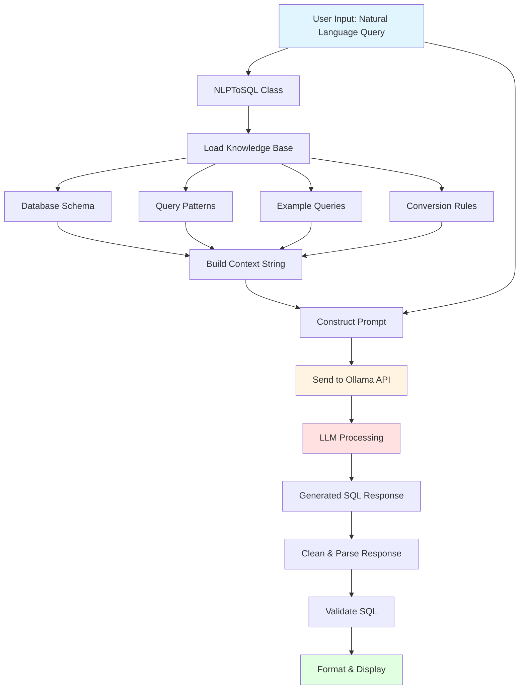
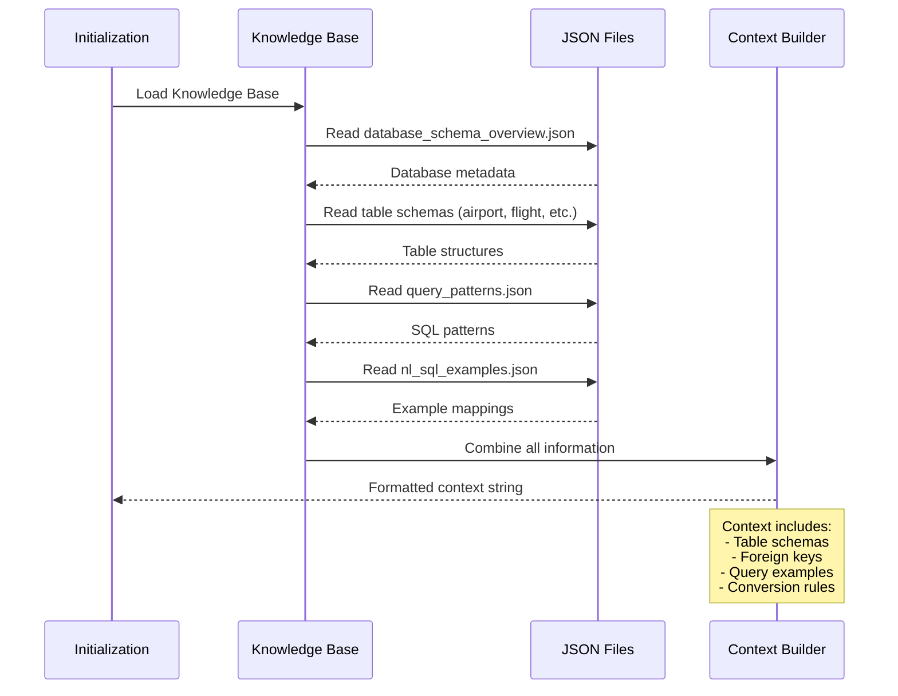
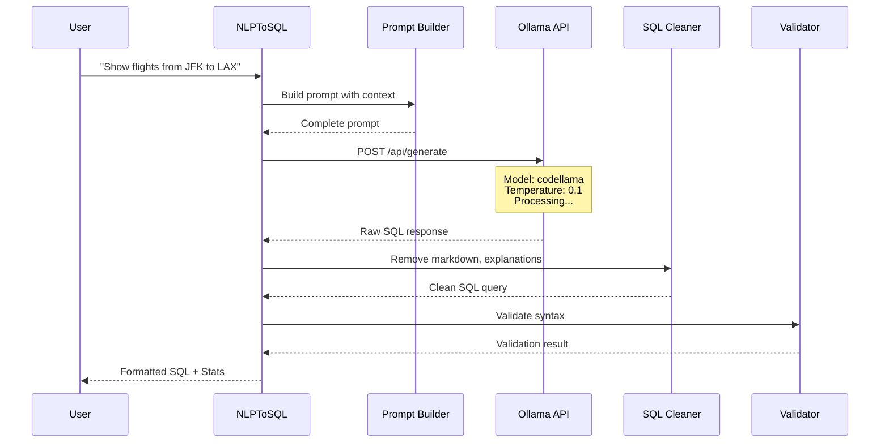
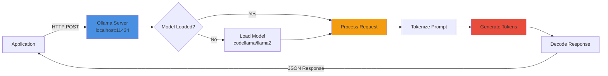
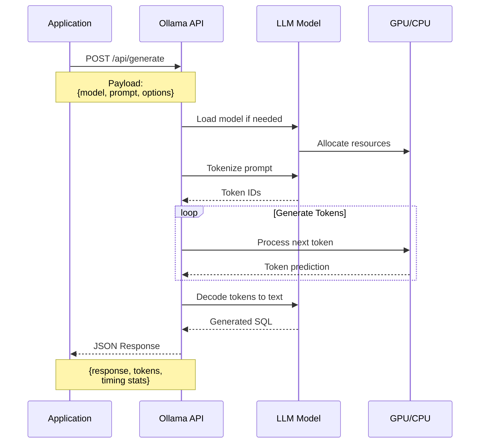
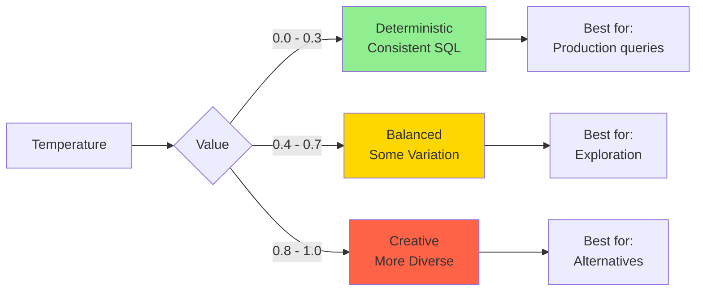
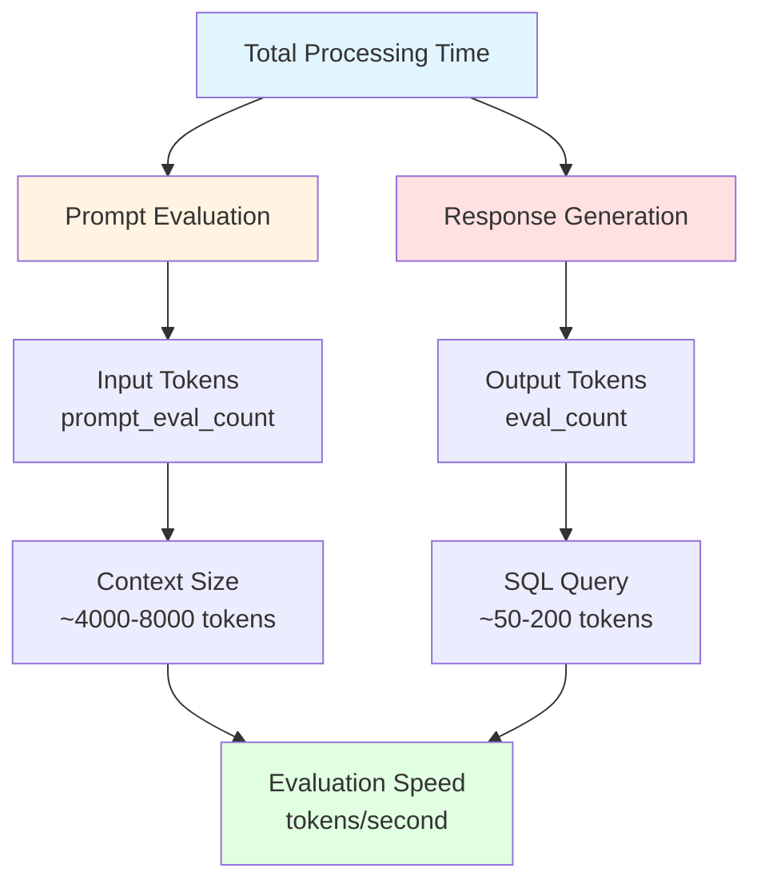
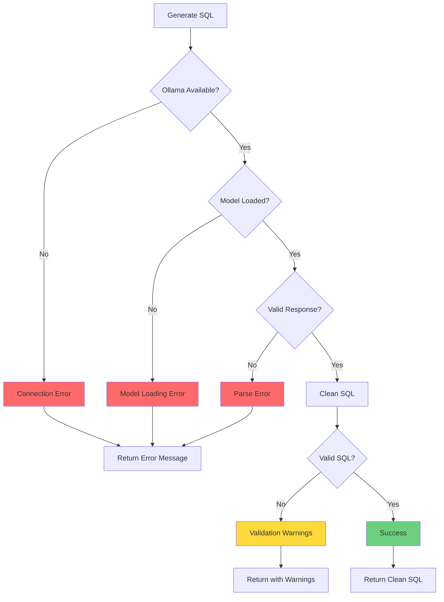
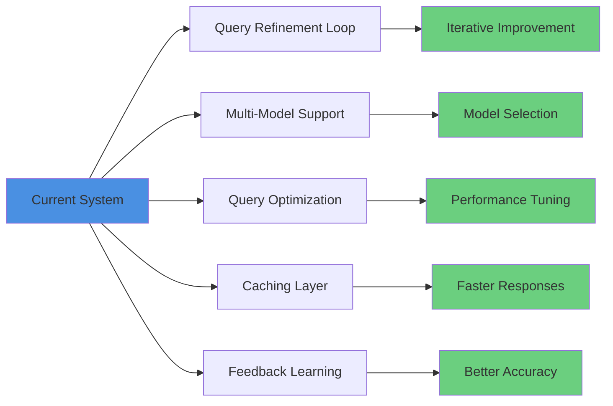

# Natural Language to SQL (NLP to SQL)

## Overview

Natural Language to SQL (NLP to SQL) is a technique that uses Generative AI models to convert human-readable questions into executable SQL queries. This approach democratizes database access by allowing users to query databases using natural language instead of learning SQL syntax.

## Core Concepts

### 1. Knowledge Base Context

The system uses a structured knowledge base containing:
- **Database Schema**: Table structures, columns, data types, relationships
- **Query Patterns**: Common SQL patterns and best practices
- **Example Queries**: Natural language to SQL mappings
- **Conversion Rules**: Entity recognition and keyword mappings

### 2. Prompt Engineering

The system constructs a comprehensive prompt that includes:
- Database schema information
- Table relationships and foreign keys
- Query examples and patterns
- Conversion rules and best practices
- The user's natural language query

### 3. LLM Integration

Uses Ollama (local LLM runtime) to:
- Process the enriched prompt
- Generate SQL queries based on context
- Apply learned patterns from examples
- Follow specified rules and constraints

## Architecture Flow



## Detailed Component Flow

### Knowledge Base Loading



### Query Generation Process



## Ollama Integration

### How Ollama Works



### Request/Response Flow



## Pseudocode Examples

### 1. Initialization

```pseudocode
CLASS NLPToSQL:
    FUNCTION __init__(knowledge_base_path, model):
        // Load configuration from environment
        SET kb_path = knowledge_base_path OR env.KNOWLEDGE_BASE_PATH
        SET ollama_url = env.OLLAMA_URL OR "http://localhost:11434/api/generate"
        SET model = model OR env.OLLAMA_MODEL OR "codellama"
        
        // Load and prepare context
        SET context = load_knowledge_base()
        
        // Calculate statistics
        CALCULATE context_lines, context_chars, estimated_tokens
        DISPLAY initialization_info()
```

### 2. Knowledge Base Loading

```pseudocode
FUNCTION load_knowledge_base():
    INITIALIZE context_parts = []
    
    // Load database overview
    IF EXISTS(kb_path / "database_schema_overview.json"):
        overview = READ_JSON("database_schema_overview.json")
        APPEND "=== DATABASE OVERVIEW ===" TO context_parts
        APPEND database_name, description TO context_parts
        
        FOR EACH table IN overview.tables:
            APPEND table.name, table.description TO context_parts
    
    // Load table schemas
    tables = ["airport", "flight", "passenger", "booking", ...]
    APPEND "=== TABLE SCHEMAS ===" TO context_parts
    
    FOR EACH table_name IN tables:
        IF EXISTS(kb_path / "{table_name}.json"):
            table_data = READ_JSON("{table_name}.json")
            APPEND table_name TO context_parts
            APPEND columns, types TO context_parts
            APPEND foreign_keys TO context_parts
            APPEND indexes TO context_parts
    
    // Load query patterns
    IF EXISTS(kb_path / "query_patterns.json"):
        patterns = READ_JSON("query_patterns.json")
        APPEND "=== QUERY PATTERNS ===" TO context_parts
        FOR EACH pattern IN patterns.patterns:
            APPEND pattern.name, use_case, example TO context_parts
    
    // Load NL to SQL examples
    IF EXISTS(kb_path / "nl_sql_examples.json"):
        examples = READ_JSON("nl_sql_examples.json")
        APPEND "=== EXAMPLE QUERIES ===" TO context_parts
        FOR EACH example IN examples:
            APPEND example.prompt, example.sql TO context_parts
    
    RETURN JOIN(context_parts, "\n")
```

### 3. Prompt Construction

```pseudocode
FUNCTION build_prompt(natural_language_query):
    prompt = """
    You are a SQL query generator for the Flughafen airport database.
    
    {context}
    
    IMPORTANT RULES:
    1. Use backticks for reserved keywords: `from`, `to`
    2. Use table aliases: a (airport), f (flight), p (passenger)
    3. Use LEFT JOIN for optional relationships
    4. Use INNER JOIN for required relationships
    5. Always add LIMIT clause
    6. Return ONLY the SQL query, no explanations
    7. Use best practices
    8. Be explicit about table names and fields
    9. Use LIMIT and OFFSET for pagination
    
    Natural Language Query: {natural_language_query}
    
    SQL Query:
    """
    
    RETURN prompt
```

### 4. SQL Generation

```pseudocode
FUNCTION generate_sql(natural_language_query):
    // Build the prompt
    prompt = build_prompt(natural_language_query)
    
    // Prepare API payload
    payload = {
        "model": model,
        "prompt": prompt,
        "stream": false,
        "options": {
            "temperature": 0.1,    // Low for deterministic output
            "top_p": 0.9,          // Nucleus sampling
            "top_k": 40            // Top-k sampling
        }
    }
    
    TRY:
        // Send request to Ollama
        START_TIMER()
        response = HTTP_POST(ollama_url, payload, timeout=120)
        END_TIMER()
        
        // Extract response
        result = PARSE_JSON(response)
        sql_query = result.response.STRIP()
        
        // Clean the SQL
        sql_query = clean_sql(sql_query)
        
        // Return with metadata
        RETURN {
            "sql": sql_query,
            "time_taken": elapsed_time,
            "prompt_eval_count": result.prompt_eval_count,
            "eval_count": result.eval_count,
            "total_tokens": prompt_tokens + output_tokens
        }
    
    CATCH RequestException AS e:
        RETURN {
            "sql": "Error: " + e.message,
            "time_taken": 0,
            "tokens": 0
        }
```

### 5. SQL Cleaning

```pseudocode
FUNCTION clean_sql(sql):
    // Remove markdown code blocks
    sql = REMOVE(sql, "```sql", "```")
    
    // Remove common prefixes
    prefixes = ["SQL Query:", "Query:", "SQL:"]
    FOR EACH prefix IN prefixes:
        IF sql.STARTS_WITH(prefix):
            sql = sql.SUBSTRING(LENGTH(prefix)).STRIP()
    
    // Split into lines
    lines = SPLIT(sql, "\n")
    sql_lines = []
    found_semicolon = false
    
    FOR EACH line IN lines:
        line_stripped = STRIP(line)
        
        // Skip empty lines at start
        IF EMPTY(sql_lines) AND EMPTY(line_stripped):
            CONTINUE
        
        // Check for explanation patterns
        explanation_patterns = [
            "this sql", "this query", "note:", 
            "explanation:", "this will"
        ]
        
        is_explanation = ANY(
            line_stripped.STARTS_WITH(pattern) 
            FOR pattern IN explanation_patterns
        )
        
        // Stop if we hit an explanation after SQL
        IF NOT EMPTY(sql_lines) AND is_explanation:
            BREAK
        
        // Check for SQL keywords
        sql_keywords = [
            "SELECT", "FROM", "WHERE", "JOIN", 
            "LIMIT", "ORDER", "GROUP"
        ]
        
        first_word = FIRST_WORD(line_stripped).UPPER()
        
        IF EMPTY(sql_lines):
            // First line must start with SQL keyword
            IF first_word IN sql_keywords:
                APPEND line TO sql_lines
        ELSE:
            // Subsequent lines
            IF NOT EMPTY(line_stripped) AND NOT is_explanation:
                APPEND line TO sql_lines
                IF ";" IN line:
                    found_semicolon = true
    
    // Join and clean
    sql = JOIN(sql_lines, "\n").STRIP()
    sql = REMOVE_TRAILING(sql, ";").STRIP()
    
    RETURN sql
```

### 6. SQL Validation

```pseudocode
FUNCTION validate_sql(sql):
    result = {
        "is_valid": false,
        "formatted_sql": "",
        "errors": [],
        "warnings": []
    }
    
    TRY:
        // Parse SQL
        parsed = SQL_PARSE(sql)
        
        IF EMPTY(parsed):
            APPEND "Empty or invalid SQL query" TO result.errors
            RETURN result
        
        // Format SQL
        result.formatted_sql = SQL_FORMAT(sql, {
            "reindent": true,
            "keyword_case": "upper",
            "indent_width": 2
        })
        
        // Validation checks
        sql_upper = UPPER(sql)
        
        IF NOT CONTAINS(parsed, "SELECT"):
            APPEND "Not a SELECT statement" TO result.warnings
        
        IF CONTAINS(sql_upper, "SELECT *"):
            APPEND "Using SELECT * - specify columns" TO result.warnings
        
        IF NOT CONTAINS(sql_upper, "LIMIT"):
            APPEND "No LIMIT clause" TO result.warnings
        
        // Check balanced parentheses
        IF COUNT(sql, "(") != COUNT(sql, ")"):
            APPEND "Unbalanced parentheses" TO result.errors
            RETURN result
        
        // Check balanced quotes
        IF COUNT(sql, "'") % 2 != 0:
            APPEND "Unbalanced quotes" TO result.errors
            RETURN result
        
        // Mark as valid
        result.is_valid = true
        
    CATCH Exception AS e:
        APPEND "Parsing error: " + e.message TO result.errors
    
    RETURN result
```

## Key Parameters

### Ollama Configuration

```pseudocode
ollama_options = {
    "temperature": 0.1,     // Low = more deterministic, focused
                            // High = more creative, varied
    
    "top_p": 0.9,          // Nucleus sampling threshold
                            // Consider tokens with cumulative 
                            // probability up to 0.9
    
    "top_k": 40,           // Consider only top 40 tokens
                            // Limits vocabulary at each step
    
    "stream": false        // Get complete response at once
                            // vs. streaming tokens
}
```

### Temperature Effects



## Performance Metrics

### Token Processing



### Typical Metrics

```pseudocode
// Example performance metrics
metrics = {
    "context_size": "4000-8000 tokens",
    "input_tokens": "4000-8000 (context + query)",
    "output_tokens": "50-200 (SQL query)",
    "generation_time": "2-10 seconds",
    "tokens_per_second": "20-50 tokens/s",
    "output_input_ratio": "0.01-0.05"
}
```

## Error Handling



## Best Practices

### 1. Context Optimization

```pseudocode
// Keep context focused and relevant
context_strategy = {
    "include": [
        "Relevant table schemas only",
        "Common query patterns",
        "5-10 example queries",
        "Critical foreign key relationships"
    ],
    
    "exclude": [
        "Unused tables",
        "Excessive examples",
        "Redundant information",
        "Implementation details"
    ],
    
    "optimize": [
        "Use concise descriptions",
        "Prioritize recent patterns",
        "Group related information",
        "Limit token count to 8000"
    ]
}
```

### 2. Prompt Engineering

```pseudocode
// Effective prompt structure
prompt_structure = {
    "1_role": "Define AI role and purpose",
    "2_context": "Provide database schema and rules",
    "3_examples": "Show input/output patterns",
    "4_constraints": "Specify limitations and requirements",
    "5_query": "Present user's natural language query",
    "6_instruction": "Clear output format instruction"
}
```

### 3. Response Processing

```pseudocode
// Clean and validate responses
response_pipeline = [
    "Remove markdown formatting",
    "Strip explanatory text",
    "Extract pure SQL",
    "Validate syntax",
    "Format consistently",
    "Check for common issues",
    "Add helpful warnings"
]
```

## Use Cases

### Simple Queries
- Single table lookups
- Basic filtering
- Column selection

### Complex Queries
- Multi-table joins
- Aggregations and grouping
- Subqueries
- Window functions

### Advanced Patterns
- Recursive CTEs
- Conditional logic
- Date/time operations
- String manipulation

## Limitations

1. **Context Window**: Limited by model's token capacity
2. **Accuracy**: Depends on quality of examples and schema
3. **Complexity**: Very complex queries may need refinement
4. **Ambiguity**: Natural language can be interpreted multiple ways
5. **Performance**: Generation takes 2-10 seconds per query

## Future Enhancements



## Conclusion

NLP to SQL bridges the gap between natural language and database queries by leveraging:
- **Structured knowledge bases** for context
- **LLM capabilities** for understanding and generation
- **Prompt engineering** for accurate results
- **Validation and formatting** for reliability

This approach makes database querying accessible to non-technical users while maintaining the power and precision of SQL.
