# Semantic Caching for NLP to SQL

## Overview

Semantic Caching is an intelligent caching strategy that uses vector embeddings and similarity search to identify when a new query is semantically similar to a previously processed query. Instead of exact string matching, it understands the meaning of queries and returns cached results for similar requests, dramatically reducing latency and computational costs.

## The Problem

Traditional caching relies on exact matches:

```
Query 1: "Show me all passengers on flight 115"
Query 2: "Get passenger list for flight 115"
Query 3: "List all passengers for flight number 115"

Traditional Cache:
❌ Query 2: Cache MISS (different wording)
❌ Query 3: Cache MISS (different wording)
Result: 3 expensive LLM calls, 3x latency, 3x cost

Semantic Cache:
✅ Query 2: Cache HIT (similar meaning, 0.92 similarity)
✅ Query 3: Cache HIT (similar meaning, 0.89 similarity)
Result: 1 LLM call, ~10ms lookups for others, 66% cost reduction
```

## Core Concept

```mermaid
graph TB
    A[User Query] --> B{Exact Match?}
    B -->|Yes| C[Return Cached Result<br/>~1ms]
    B -->|No| D[Generate Embedding]
    D --> E[Vector Similarity Search]
    E --> F{Similar Query Found?<br/>similarity ≥ threshold}
    F -->|Yes| G[Return Cached Result<br/>~10ms]
    F -->|No| H[Generate with LLM<br/>~2-10s]
    H --> I[Cache Result + Embedding]
    I --> J[Return New Result]
    
    style C fill:#6bcf7f
    style G fill:#90EE90
    style H fill:#ff6b6b
```




## Architecture

### System Components


### Data Flow


## Cache Storage Structure

### Three-Layer Storage Model

```mermaid
graph TB
    A[Storage Layers] --> B[Layer 1: Semantic Mapping]
    A --> C[Layer 2: Query Results]
    A --> D[Layer 3: Vector Embeddings]
    
    B --> E["Key: semantic:prompt:hash<br/>Value: db:query:hash2<br/>Purpose: Fast exact lookup"]
    
    C --> F["Key: db:query:hash2<br/>Value: JSON result<br/>Purpose: Store SQL + metadata"]
    
    D --> G["Key: embedding:prompt:hash<br/>Fields: prompt, query_key, embedding<br/>Purpose: Vector similarity search"]
    
    E --> H[String Key-Value<br/>O(1) lookup]
    F --> I[String Key-Value<br/>O(1) retrieval]
    G --> J[Hash with Vector Field<br/>Indexed by VSS]
    
    style B fill:#e1f5ff
    style C fill:#ffe1e1
    style D fill:#e1ffe1
```

### Storage Example

```
Prompt: "Show me all passengers on flight 115"
Hash: abc123...

Layer 1 - Semantic Mapping:
┌─────────────────────────────────────────────────────────┐
│ Key: semantic:prompt:abc123                             │
│ Value: db:query:def456                                  │
│ Type: STRING                                            │
│ Purpose: Maps prompt hash to query result               │
└─────────────────────────────────────────────────────────┘

Layer 2 - Query Result:
┌─────────────────────────────────────────────────────────┐
│ Key: db:query:def456                                    │
│ Value: {                                                │
│   "sql": "SELECT p.* FROM passenger p...",              │
│   "time_taken": 3.45,                                   │
│   "prompt_eval_count": 4523,                            │
│   "eval_count": 87,                                     │
│   "total_tokens": 4610                                  │
│ }                                                       │
│ Type: STRING (JSON)                                     │
│ Purpose: Store generated SQL and metadata               │
└─────────────────────────────────────────────────────────┘

Layer 3 - Vector Embedding:
┌─────────────────────────────────────────────────────────┐
│ Key: embedding:prompt:abc123                            │
│ Fields:                                                 │
│   - prompt: "Show me all passengers on flight 115"      │
│   - query_key: "db:query:def456"                        │
│   - embedding: <binary vector, 384 dims, 1536 bytes>    │
│ Type: HASH                                              │
│ Purpose: Enable vector similarity search                │
│ Indexed: Yes (prompt_embeddings index)                  │
└─────────────────────────────────────────────────────────┘
```


## Pseudocode Examples

### 1. Initialization

```pseudocode
CLASS SemanticSQLCache:
    FUNCTION __init__(valkey_host, valkey_port, embedding_model, 
                      similarity_threshold, ollama_model, use_mmr):
        // Load configuration from environment
        SET valkey_host = valkey_host OR ENV["VECTOR_HOST"] OR "localhost"
        SET valkey_port = valkey_port OR ENV["VECTOR_PORT"] OR 6379
        SET embedding_model = embedding_model OR ENV["EMBEDDING_MODEL"] OR "all-MiniLM-L6-v2"
        SET similarity_threshold = similarity_threshold OR ENV["SIMILARITY_THRESHOLD"] OR 0.70
        SET ollama_model = ollama_model OR ENV["OLLAMA_MODEL"] OR "codellama"
        
        // Connect to Valkey
        PRINT "Connecting to Valkey at {valkey_host}:{valkey_port}"
        SET valkey_client = Valkey.connect(valkey_host, valkey_port)
        
        TRY:
            valkey_client.ping()
            PRINT "✅ Connected successfully"
        CATCH Exception:
            PRINT "❌ Connection failed"
            RAISE
        
        // Initialize components (lazy-loaded)
        SET semantic_search = NULL  // Loaded on first use
        SET nlp_converter = NLPToSQL(model=ollama_model)
        SET similarity_threshold = similarity_threshold
        
        PRINT "Configuration:"
        PRINT "  Similarity threshold: {similarity_threshold}"
        PRINT "  Ollama model: {ollama_model}"
        PRINT "  Embedding model: {embedding_model}"
        PRINT "  Use MMR: {use_mmr}"
        
        // Create vector index
        create_index()
```


### 2. Main Cache Logic

```pseudocode
FUNCTION get_or_generate_sql(prompt, verbose):
    """
    Main entry point: Get SQL from cache or generate new
    
    Returns cached result if:
    1. Exact match exists, OR
    2. Similar prompt exists with similarity ≥ threshold
    
    Otherwise generates new SQL and caches it
    """
    
    START_TIMER()
    
    // Step 1: Generate hash and embedding
    prompt_hash = hash_text(prompt)
    prompt_embedding = generate_embedding(prompt)
    
    IF verbose:
        PRINT "Processing prompt: {prompt}"
        PRINT "  Hash: {prompt_hash}"
        PRINT "  Embedding dimension: {LENGTH(prompt_embedding)}"
    
    // Step 2: Check for exact match
    semantic_key = "semantic:prompt:{prompt_hash}"
    cached_query_key = valkey_client.get(semantic_key)
    
    IF cached_query_key IS NOT NULL:
        IF verbose:
            PRINT "🎯 Exact cache hit!"
            PRINT "  Semantic key: {semantic_key}"
            PRINT "  Query key: {cached_query_key}"
        
        // Retrieve cached result
        query_data = valkey_client.get(cached_query_key)
        
        IF query_data IS NOT NULL:
            result = JSON_PARSE(query_data)
            result["cache_hit"] = TRUE
            result["cache_type"] = "exact"
            result["lookup_time"] = ELAPSED_TIME()
            
            RETURN result
    
    // Step 3: Search for similar prompts
    IF verbose:
        PRINT "🔍 Searching for similar prompts..."
        embedding_count = COUNT(valkey_client.scan("embedding:prompt:*"))
        PRINT "  Embeddings in cache: {embedding_count}"
    
    similar_prompts = search_similar_prompts(prompt_embedding, k=5)
    
    IF verbose AND similar_prompts IS NOT EMPTY:
        PRINT "📊 Found {LENGTH(similar_prompts)} similar prompt(s):"
        FOR EACH (i, sim) IN ENUMERATE(similar_prompts):
            PRINT "  {i}. Similarity: {sim.similarity:.3f} | Prompt: {sim.prompt[:60]}..."
        PRINT "  Threshold: {similarity_threshold}"
    
    // Step 4: Check if any similar prompt meets threshold
    FOR EACH similar IN similar_prompts:
        IF similar.similarity >= similarity_threshold:
            IF verbose:
                PRINT "✨ Found similar prompt (similarity: {similar.similarity:.3f})"
                PRINT "  Original: {similar.prompt}"
                PRINT "  Current:  {prompt}"
            
            // Retrieve cached result
            query_data = valkey_client.get(similar.query_key)
            
            IF query_data IS NOT NULL:
                result = JSON_PARSE(query_data)
                result["cache_hit"] = TRUE
                result["cache_type"] = "semantic"
                result["similarity"] = similar.similarity
                result["similar_prompt"] = similar.prompt
                result["lookup_time"] = ELAPSED_TIME()
                
                // Cache this exact prompt for future exact matches
                valkey_client.set(semantic_key, similar.query_key)
                
                RETURN result
    
    // Step 5: No similar prompt found, generate new SQL
    IF verbose:
        PRINT "🤖 No similar prompt found. Generating new SQL with LLM..."
    
    result = nlp_converter.generate_sql(prompt)
    result["cache_hit"] = FALSE
    result["lookup_time"] = ELAPSED_TIME()
    
    // Step 6: Cache the new result
    cache_result(prompt, prompt_hash, prompt_embedding, result, verbose)
    
    RETURN result
```


### 3. Caching New Results

```pseudocode
FUNCTION cache_result(prompt, prompt_hash, prompt_embedding, result, verbose):
    """
    Store a new result in all three cache layers
    
    Creates:
    1. Query result (db:query:hash)
    2. Semantic mapping (semantic:prompt:hash)
    3. Vector embedding (embedding:prompt:hash)
    """
    
    // Generate hash for the SQL query
    sql_hash = hash_text(result.sql)
    query_key = "db:query:{sql_hash}"
    
    IF verbose:
        PRINT "─" * 70
        PRINT "💾 Caching new result:"
        PRINT "─" * 70
    
    // Layer 1: Store query result
    valkey_client.set(query_key, JSON_STRINGIFY(result))
    
    IF verbose:
        PRINT "1️⃣  Query Result Key:"
        PRINT "   Key: {query_key}"
        PRINT "   Value: {JSON_STRINGIFY(result, indent=2)}"
    
    // Layer 2: Store semantic mapping
    semantic_key = "semantic:prompt:{prompt_hash}"
    valkey_client.set(semantic_key, query_key)
    
    IF verbose:
        PRINT "2️⃣  Semantic Mapping Key:"
        PRINT "   Key: {semantic_key}"
        PRINT "   Value: {query_key}"
    
    // Layer 3: Store embedding for vector search
    embedding_key = "embedding:prompt:{prompt_hash}"
    embedding_data = {
        "prompt": prompt,
        "query_key": query_key,
        "embedding": prompt_embedding.as_float32().to_bytes()
    }
    
    valkey_client.hset(embedding_key, embedding_data)
    
    IF verbose:
        PRINT "3️⃣  Embedding Hash Key:"
        PRINT "   Key: {embedding_key}"
        PRINT "   Fields:"
        PRINT "     - prompt: {prompt}"
        PRINT "     - query_key: {query_key}"
        PRINT "     - embedding: <{LENGTH(prompt_embedding)} dimensional vector>"
        PRINT "   Vector preview: [{prompt_embedding[:3]}...{prompt_embedding[-3:]}]"
        PRINT "─" * 70
```


### 4. Similarity Search

```pseudocode
FUNCTION search_similar_prompts(embedding, k):
    """
    Search for K most similar prompts using vector search
    
    Uses SemanticSearch core to:
    1. Query vector index with HNSW
    2. Calculate cosine similarity
    3. Return top K results
    """
    
    // Delegate to semantic search core
    similar_prompts = semantic_search.search_similar(
        embedding=embedding,
        index_name="prompt_embeddings",
        key_prefix="embedding:prompt:",
        k=k
    )
    
    RETURN similar_prompts
    
    // Returns list of:
    // [
    //   {
    //     "prompt": "original prompt text",
    //     "query_key": "db:query:hash",
    //     "similarity": 0.92
    //   },
    //   ...
    // ]
```

### 5. Index Creation

```pseudocode
FUNCTION create_index(verbose):
    """
    Create vector search index for prompt embeddings
    
    Index configuration:
    - Name: prompt_embeddings
    - Prefix: embedding:prompt:
    - Vector field: embedding (FLOAT32, 384 dims, COSINE)
    - Additional fields: prompt (TAG), query_key (TAG)
    """
    
    semantic_search.create_vector_index(
        index_name="prompt_embeddings",
        key_prefix="embedding:prompt:",
        additional_fields=[
            ("prompt", "TAG"),      // For filtering
            ("query_key", "TAG")    // For retrieval
        ],
        verbose=verbose
    )
    
    // This creates a Valkey command like:
    // FT.CREATE prompt_embeddings
    //   ON HASH
    //   PREFIX 1 embedding:prompt:
    //   SCHEMA
    //     prompt TAG
    //     query_key TAG
    //     embedding VECTOR HNSW 6
    //       TYPE FLOAT32
    //       DIM 384
    //       DISTANCE_METRIC COSINE
```


## Similarity Threshold

### Choosing the Right Threshold


### Threshold Examples

```
Prompt 1: "Show me all passengers on flight 115"

Similarity Scores:
0.98 - "Show all passengers on flight 115"           ✅ Almost identical
0.92 - "Get passenger list for flight 115"           ✅ Same intent
0.89 - "List passengers for flight number 115"       ✅ Same intent
0.85 - "Who is on flight 115?"                       ✅ Same intent
0.78 - "Passenger manifest for flight 115"           ⚠️  Same intent, different style
0.65 - "Flight 115 information"                      ⚠️  Related but broader
0.45 - "Show me flight schedules"                    ❌ Different intent
0.23 - "Airport weather information"                 ❌ Completely different

Threshold = 0.70:
✅ Cache hits: 0.98, 0.92, 0.89, 0.85, 0.78
❌ Cache misses: 0.65, 0.45, 0.23

Result: Good balance between reuse and accuracy
```

### Threshold Configuration

```pseudocode
threshold_guidelines = {
    "0.95": {
        "use_case": "Critical queries requiring exact intent",
        "cache_hit_rate": "Low (~20%)",
        "accuracy": "Very High",
        "example": "Financial transactions, legal queries"
    },
    
    "0.85": {
        "use_case": "Important queries with some flexibility",
        "cache_hit_rate": "Medium (~40%)",
        "accuracy": "High",
        "example": "Business analytics, reporting"
    },
    
    "0.70": {
        "use_case": "General purpose queries (RECOMMENDED)",
        "cache_hit_rate": "Good (~60%)",
        "accuracy": "Balanced",
        "example": "Search, exploration, general SQL"
    },
    
    "0.60": {
        "use_case": "Exploratory queries with high tolerance",
        "cache_hit_rate": "High (~75%)",
        "accuracy": "Medium",
        "example": "Brainstorming, discovery"
    },
    
    "0.50": {
        "use_case": "Maximum reuse, accept some errors",
        "cache_hit_rate": "Very High (~85%)",
        "accuracy": "Low",
        "example": "Development, testing only"
    }
}
```


## Performance Benefits

### Latency Comparison


### Cost Reduction

```pseudocode
// Example: 1000 queries per day

scenario_without_cache = {
    "queries_per_day": 1000,
    "llm_calls": 1000,
    "avg_tokens_per_call": 5000,  // 4500 input + 500 output
    "total_tokens_per_day": 5_000_000,
    "cost_per_1M_tokens": 0.50,  // Example pricing
    "daily_cost": 2.50,
    "monthly_cost": 75.00,
    "avg_latency": "5 seconds"
}

scenario_with_semantic_cache = {
    "queries_per_day": 1000,
    "cache_hit_rate": 0.60,  // 60% cache hits
    "cache_hits": 600,
    "cache_misses": 400,
    "llm_calls": 400,  // Only for cache misses
    "total_tokens_per_day": 2_000_000,  // 60% reduction
    "daily_cost": 1.00,  // 60% reduction
    "monthly_cost": 30.00,  // Save $45/month
    "avg_latency": "2.02 seconds",  // 60% * 0.01s + 40% * 5s
    
    "savings": {
        "cost_reduction": "60%",
        "monthly_savings": "$45",
        "latency_improvement": "60% faster average",
        "token_reduction": "3M tokens/day"
    }
}

// Higher cache hit rates = greater savings
// 70% hit rate = 70% cost reduction
// 80% hit rate = 80% cost reduction
```


### Performance Metrics

```
Typical Performance (384-dim embeddings, 1000 cached prompts):

Exact Cache Hit:
├─ Lookup time: 1-5 ms
├─ Operations: 1 GET
└─ Cost: Free (no LLM call)

Semantic Cache Hit:
├─ Embedding generation: 10-30 ms
├─ Vector search: 5-20 ms
├─ Result retrieval: 1-5 ms
├─ Total: 16-55 ms
├─ Operations: 1 embedding + 1 vector search + 1 GET
└─ Cost: Free (no LLM call)

Cache Miss:
├─ Embedding generation: 10-30 ms
├─ Vector search: 5-20 ms
├─ LLM generation: 2,000-10,000 ms
├─ Cache storage: 5-10 ms
├─ Total: 2,020-10,060 ms
├─ Operations: 1 embedding + 1 vector search + 1 LLM call + 3 SETs
└─ Cost: ~$0.0025 per query (example)

Speedup:
├─ Semantic hit vs miss: 50x - 500x faster
├─ Exact hit vs miss: 400x - 10,000x faster
└─ Cost savings: 100% on cache hits
```


## Cache Lifecycle

### Query Processing States


### Cache Evolution Over Time


## Advanced Features

### MMR Reranking for Diversity

When multiple similar prompts exist, MMR ensures diverse results:


```pseudocode
// Without MMR:
similar_prompts = [
    {prompt: "passengers on flight 115", similarity: 0.95},
    {prompt: "passenger list flight 115", similarity: 0.94},  // Very similar to #1
    {prompt: "passengers flight 115", similarity: 0.93},      // Very similar to #1
    {prompt: "flight 115 passengers", similarity: 0.92},      // Very similar to #1
    {prompt: "who is on flight 115", similarity: 0.85}        // Different phrasing
]
// Returns: First result (might be too narrow)

// With MMR (lambda=0.5):
reranked = mmr_rerank(similar_prompts)
// Returns: Result that balances similarity and diversity
// Might prefer #5 if it provides better coverage
```

### Lazy Loading

```pseudocode
// Semantic search is expensive to initialize (loads embedding model)
// Use lazy loading to defer initialization until needed

CLASS SemanticSQLCache:
    FUNCTION __init__():
        SET _semantic_search = NULL  // Not initialized yet
        // ... other initialization
    
    PROPERTY semantic_search:
        GET:
            IF _semantic_search IS NULL:
                // First access: load the model
                PRINT "Loading embedding model..."
                SET _semantic_search = SemanticSearch(...)
            RETURN _semantic_search
    
    FUNCTION get_or_generate_sql(prompt):
        // Model is loaded only when first query arrives
        embedding = self.semantic_search.generate_embedding(prompt)
        // ...

// Benefits:
// - Faster startup time
// - Only load if actually needed
// - Better resource utilization
```


## Best Practices

### 1. Threshold Tuning

```pseudocode
threshold_tuning_strategy = {
    "start_conservative": {
        "initial_threshold": 0.85,
        "reason": "Ensure high accuracy first",
        "monitor": "False positive rate"
    },
    
    "collect_metrics": {
        "track": [
            "Cache hit rate",
            "User satisfaction with results",
            "False positive rate (wrong results)",
            "False negative rate (missed opportunities)"
        ]
    },
    
    "adjust_gradually": {
        "if_too_strict": "Lower threshold by 0.05",
        "if_too_loose": "Raise threshold by 0.05",
        "test_period": "1-2 weeks per adjustment"
    },
    
    "optimal_range": {
        "general_use": "0.70 - 0.80",
        "high_accuracy": "0.85 - 0.95",
        "high_reuse": "0.60 - 0.70"
    }
}
```

### 2. Cache Management

```pseudocode
cache_management = {
    "monitoring": [
        "Track cache size (number of entries)",
        "Monitor memory usage",
        "Measure hit rate over time",
        "Log slow queries"
    ],
    
    "maintenance": [
        "Set TTL (Time To Live) for entries",
        "Implement LRU (Least Recently Used) eviction",
        "Periodic cleanup of old entries",
        "Rebuild index if performance degrades"
    ],
    
    "optimization": [
        "Batch embed multiple queries",
        "Pre-warm cache with common queries",
        "Use connection pooling",
        "Enable Valkey persistence"
    ]
}
```


### 3. Error Handling

```pseudocode
error_handling_strategy = {
    "embedding_failure": {
        "fallback": "Skip semantic search, generate with LLM",
        "log": "Warning: Embedding generation failed",
        "retry": "No (fail fast, use LLM)"
    },
    
    "vector_search_failure": {
        "fallback": "Use brute force search or skip to LLM",
        "log": "Warning: Vector search unavailable",
        "retry": "No (use fallback)"
    },
    
    "cache_retrieval_failure": {
        "fallback": "Generate with LLM",
        "log": "Error: Cache retrieval failed",
        "retry": "Yes (1 retry with exponential backoff)"
    },
    
    "llm_generation_failure": {
        "fallback": "Return error to user",
        "log": "Error: LLM generation failed",
        "retry": "Yes (2 retries with exponential backoff)"
    },
    
    "cache_storage_failure": {
        "fallback": "Return result anyway (don't cache)",
        "log": "Warning: Cache storage failed",
        "retry": "No (non-critical)"
    }
}
```

### 4. Testing Strategy

```pseudocode
testing_checklist = [
    "Unit Tests",
    "  - Test exact match lookup",
    "  - Test similarity search",
    "  - Test threshold filtering",
    "  - Test cache storage",
    
    "Integration Tests",
    "  - Test full cache flow",
    "  - Test with real embeddings",
    "  - Test with real LLM",
    "  - Test error scenarios",
    
    "Performance Tests",
    "  - Measure cache hit latency",
    "  - Measure cache miss latency",
    "  - Test with various cache sizes",
    "  - Test concurrent queries",
    
    "Accuracy Tests",
    "  - Validate similar queries return same SQL",
    "  - Validate different queries return different SQL",
    "  - Test edge cases (very short/long prompts)",
    "  - Test multilingual queries (if supported)"
]
```


## Use Cases Beyond NLP to SQL

### 1. API Response Caching

```
Use Case: Cache API responses for similar queries

Example:
Query 1: "weather in San Francisco"
Query 2: "SF weather forecast"
Query 3: "San Francisco weather today"

Result: All three queries return cached weather data
Benefit: Reduce API calls, faster responses
```

### 2. RAG (Retrieval Augmented Generation)

```
Use Case: Cache LLM responses for similar questions

Example:
Query 1: "How do I configure SSL certificates?"
Query 2: "SSL certificate setup guide"
Query 3: "Configure HTTPS with SSL"

Result: All three queries return cached documentation
Benefit: Reduce LLM costs, consistent answers
```

### 3. Search Query Optimization

```
Use Case: Cache search results for similar queries

Example:
Query 1: "best restaurants in downtown"
Query 2: "top restaurants downtown area"
Query 3: "good places to eat downtown"

Result: All three queries return cached search results
Benefit: Reduce database load, faster search
```

### 4. Translation Caching

```
Use Case: Cache translations for similar phrases

Example:
Query 1: "Hello, how are you?"
Query 2: "Hi, how are you doing?"
Query 3: "Hello, how are you doing?"

Result: All three queries return similar translations
Benefit: Reduce translation API costs
```


## Limitations and Considerations

### 1. Semantic Limitations

```
Challenges:

Context Sensitivity:
❌ "Book a flight" (travel) vs "Book a table" (restaurant)
   → May have high similarity but different intent

Negation:
❌ "Show flights to Paris" vs "Don't show flights to Paris"
   → Embeddings may be similar despite opposite meaning

Temporal Context:
❌ "Flights today" vs "Flights tomorrow"
   → Similar embeddings but different time constraints

Domain Specificity:
❌ "Apple stock price" vs "Apple fruit price"
   → Homonyms can cause confusion

Mitigation Strategies:
✅ Add metadata filters (date, category, etc.)
✅ Use domain-specific embedding models
✅ Implement query preprocessing
✅ Add explicit negation detection
✅ Combine with keyword matching
```

### 2. Cold Start Problem


```pseudocode
cold_start_solutions = {
    "pre_warming": {
        "strategy": "Pre-populate cache with common queries",
        "implementation": [
            "Analyze historical query logs",
            "Identify top 100-1000 queries",
            "Generate and cache results before launch"
        ],
        "benefit": "Immediate high hit rate"
    },
    
    "gradual_warmup": {
        "strategy": "Accept initial slow performance",
        "implementation": [
            "Monitor hit rate over time",
            "Expect 0% → 60% over 2-4 weeks",
            "Communicate expectations to users"
        ],
        "benefit": "Natural, no extra work"
    },
    
    "hybrid_approach": {
        "strategy": "Pre-warm + gradual",
        "implementation": [
            "Pre-warm with top 50 queries",
            "Let cache grow naturally",
            "Achieve 30% hit rate immediately"
        ],
        "benefit": "Best of both worlds"
    }
}
```


### 3. Resource Requirements

```pseudocode
resource_requirements = {
    "memory": {
        "embedding_model": "80-500 MB",
        "per_cached_query": "~2 KB (embedding + metadata)",
        "example_1000_queries": "~2 MB + model",
        "example_100k_queries": "~200 MB + model",
        "recommendation": "Plan for 500 MB - 1 GB total"
    },
    
    "cpu": {
        "embedding_generation": "Medium (10-30ms per query)",
        "vector_search": "Low (5-20ms per query)",
        "recommendation": "Multi-core CPU beneficial"
    },
    
    "storage": {
        "per_query": "~3 KB total (all 3 layers)",
        "example_1000_queries": "~3 MB",
        "example_100k_queries": "~300 MB",
        "recommendation": "Plan for growth, enable persistence"
    },
    
    "network": {
        "valkey_latency": "< 1ms (local), 5-20ms (remote)",
        "llm_latency": "2-10 seconds",
        "recommendation": "Co-locate Valkey with application"
    }
}
```

### 4. Cache Invalidation

```pseudocode
invalidation_strategies = {
    "time_based": {
        "method": "TTL (Time To Live)",
        "implementation": "SET key value EX 86400  // 24 hours",
        "use_case": "Time-sensitive data (weather, prices)",
        "pros": "Simple, automatic",
        "cons": "May cache stale data until expiry"
    },
    
    "event_based": {
        "method": "Invalidate on data change",
        "implementation": "DELETE keys when source data updates",
        "use_case": "Frequently changing data",
        "pros": "Always fresh data",
        "cons": "Requires change detection"
    },
    
    "manual": {
        "method": "Admin-triggered flush",
        "implementation": "clear_cache() command",
        "use_case": "Schema changes, major updates",
        "pros": "Full control",
        "cons": "Requires manual intervention"
    },
    
    "lru_eviction": {
        "method": "Least Recently Used",
        "implementation": "Valkey maxmemory-policy allkeys-lru",
        "use_case": "Limited memory, automatic cleanup",
        "pros": "Automatic, keeps popular items",
        "cons": "May evict still-valid entries"
    }
}
```


## Monitoring and Metrics

### Key Metrics to Track


### Monitoring Dashboard

```pseudocode
monitoring_dashboard = {
    "real_time_metrics": {
        "current_qps": "Queries per second",
        "cache_hit_rate": "Percentage of cache hits",
        "avg_latency": "Average response time",
        "error_rate": "Percentage of errors"
    },
    
    "historical_trends": {
        "hit_rate_over_time": "Daily/weekly/monthly trends",
        "latency_distribution": "P50, P95, P99 percentiles",
        "cache_growth": "Number of entries over time",
        "cost_savings": "Cumulative savings"
    },
    
    "alerts": {
        "hit_rate_drop": "Alert if < 40% for 1 hour",
        "high_latency": "Alert if P95 > 100ms for cache hits",
        "memory_pressure": "Alert if > 80% memory used",
        "error_spike": "Alert if error rate > 5%"
    },
    
    "debugging_tools": {
        "query_inspector": "View similar queries for any prompt",
        "cache_explorer": "Browse cached entries",
        "similarity_analyzer": "Test similarity scores",
        "performance_profiler": "Identify slow operations"
    }
}
```


## Implementation Checklist

### Setup Phase

```pseudocode
setup_checklist = [
    "1. Infrastructure",
    "   ✓ Install Valkey with RediSearch module",
    "   ✓ Configure memory limits and persistence",
    "   ✓ Set up monitoring and alerting",
    
    "2. Dependencies",
    "   ✓ Install sentence-transformers",
    "   ✓ Install valkey/redis client",
    "   ✓ Install numpy",
    "   ✓ Download embedding model",
    
    "3. Configuration",
    "   ✓ Choose embedding model (all-MiniLM-L6-v2)",
    "   ✓ Set similarity threshold (0.70)",
    "   ✓ Configure Valkey connection",
    "   ✓ Set up environment variables",
    
    "4. Testing",
    "   ✓ Test embedding generation",
    "   ✓ Test vector index creation",
    "   ✓ Test similarity search",
    "   ✓ Test full cache flow",
    
    "5. Deployment",
    "   ✓ Deploy to staging",
    "   ✓ Run load tests",
    "   ✓ Monitor metrics",
    "   ✓ Deploy to production"
]
```

### Production Readiness

```pseudocode
production_checklist = [
    "Performance",
    "   ✓ Benchmark cache hit latency (<50ms)",
    "   ✓ Benchmark cache miss latency (<10s)",
    "   ✓ Test with expected load (QPS)",
    "   ✓ Verify memory usage is acceptable",
    
    "Reliability",
    "   ✓ Implement error handling",
    "   ✓ Add retry logic for failures",
    "   ✓ Test fallback mechanisms",
    "   ✓ Enable Valkey persistence",
    
    "Monitoring",
    "   ✓ Set up metrics collection",
    "   ✓ Create monitoring dashboard",
    "   ✓ Configure alerts",
    "   ✓ Set up logging",
    
    "Operations",
    "   ✓ Document cache management procedures",
    "   ✓ Create runbook for common issues",
    "   ✓ Set up backup/restore procedures",
    "   ✓ Plan for cache invalidation",
    
    "Optimization",
    "   ✓ Tune similarity threshold",
    "   ✓ Optimize embedding model choice",
    "   ✓ Configure connection pooling",
    "   ✓ Enable compression if needed"
]
```


## Comparison: Traditional vs Semantic Caching


### Side-by-Side Comparison

```
Scenario: 100 user queries with variations

Traditional Exact Match Cache:
├─ "Show passengers on flight 115"        → Cache MISS (first time)
├─ "Show passengers on flight 115"        → Cache HIT (exact match)
├─ "Get passenger list for flight 115"    → Cache MISS (different wording)
├─ "List passengers for flight 115"       → Cache MISS (different wording)
├─ "Passengers on flight number 115"      → Cache MISS (different wording)
├─ ... (95 more queries with variations)
│
├─ Cache Hit Rate: ~15%
├─ LLM Calls: 85
├─ Total Cost: $0.21 (85 × $0.0025)
└─ Avg Latency: 4.3s

Semantic Cache (threshold=0.70):
├─ "Show passengers on flight 115"        → Cache MISS (first time)
├─ "Show passengers on flight 115"        → Cache HIT (exact, 1.00)
├─ "Get passenger list for flight 115"    → Cache HIT (semantic, 0.92)
├─ "List passengers for flight 115"       → Cache HIT (semantic, 0.89)
├─ "Passengers on flight number 115"      → Cache HIT (semantic, 0.87)
├─ ... (95 more queries with variations)
│
├─ Cache Hit Rate: ~65%
├─ LLM Calls: 35
├─ Total Cost: $0.09 (35 × $0.0025)
├─ Cost Savings: $0.12 (57% reduction)
└─ Avg Latency: 1.8s (58% faster)

Winner: Semantic Cache
- 4.3x better hit rate
- 57% cost reduction
- 58% faster average response
```


## Real-World Example

### Complete Flow Walkthrough

```
Step-by-Step: Processing Three Similar Queries

═══════════════════════════════════════════════════════════════════
Query 1: "Show me all passengers on flight 115"
═══════════════════════════════════════════════════════════════════

1. Generate hash: abc123...
2. Generate embedding: [0.23, -0.45, 0.67, ..., 0.12] (384 dims)
3. Check exact match: semantic:prompt:abc123 → NOT FOUND
4. Search similar prompts: 0 results (empty cache)
5. Generate with LLM: 3.2 seconds
   SQL: SELECT p.* FROM passenger p 
        JOIN booking b ON p.passengerid = b.passengerid
        WHERE b.flightid = 115
        LIMIT 10
6. Cache result:
   - db:query:def456 → {sql, time_taken, tokens}
   - semantic:prompt:abc123 → db:query:def456
   - embedding:prompt:abc123 → {prompt, query_key, embedding}
7. Return: cache_hit=false, time=3.2s

═══════════════════════════════════════════════════════════════════
Query 2: "Get passenger list for flight 115"
═══════════════════════════════════════════════════════════════════

1. Generate hash: xyz789...
2. Generate embedding: [0.21, -0.43, 0.69, ..., 0.15] (384 dims)
3. Check exact match: semantic:prompt:xyz789 → NOT FOUND
4. Search similar prompts:
   Found 1 result:
   - "Show me all passengers on flight 115" (similarity: 0.92)
5. Check threshold: 0.92 ≥ 0.70 ✓
6. Retrieve cached result: db:query:def456
7. Create exact mapping: semantic:prompt:xyz789 → db:query:def456
8. Return: cache_hit=true, cache_type=semantic, 
           similarity=0.92, time=0.035s

Speedup: 91x faster (3.2s → 0.035s)
Cost: $0 (no LLM call)

═══════════════════════════════════════════════════════════════════
Query 3: "Get passenger list for flight 115" (exact repeat)
═══════════════════════════════════════════════════════════════════

1. Generate hash: xyz789...
2. Generate embedding: [0.21, -0.43, 0.69, ..., 0.15] (384 dims)
3. Check exact match: semantic:prompt:xyz789 → db:query:def456 ✓
4. Retrieve cached result: db:query:def456
5. Return: cache_hit=true, cache_type=exact, time=0.003s

Speedup: 1067x faster (3.2s → 0.003s)
Cost: $0 (no LLM call)

═══════════════════════════════════════════════════════════════════
Summary
═══════════════════════════════════════════════════════════════════

Total Queries: 3
LLM Calls: 1 (33%)
Cache Hits: 2 (67%)
Total Time: 3.238s (avg: 1.08s per query)
Total Cost: $0.0025 (1 LLM call)

Without Cache:
Total Time: 9.6s (avg: 3.2s per query)
Total Cost: $0.0075 (3 LLM calls)

Savings:
Time: 66% faster
Cost: 67% reduction
```


## Conclusion

Semantic caching revolutionizes traditional caching by understanding query meaning rather than exact text matching. By leveraging vector embeddings and similarity search, it achieves:

### Key Benefits


### When to Use Semantic Caching

**Ideal For:**
- ✅ NLP to SQL generation (as demonstrated)
- ✅ LLM-powered applications with repetitive queries
- ✅ API response caching with query variations
- ✅ RAG (Retrieval Augmented Generation) systems
- ✅ Search query optimization
- ✅ Translation services
- ✅ Any expensive computation with similar inputs

**Not Ideal For:**
- ❌ Queries requiring real-time data
- ❌ Highly unique, never-repeated queries
- ❌ Exact match requirements (use traditional cache)
- ❌ Very low latency requirements (<1ms)
- ❌ Limited memory/compute resources

### Success Factors

```pseudocode
success_factors = {
    "1. Right Threshold": "Balance hit rate and accuracy (0.70-0.80)",
    "2. Good Embedding Model": "Choose appropriate model for domain",
    "3. Proper Monitoring": "Track metrics and adjust over time",
    "4. Cache Management": "Implement TTL, eviction, invalidation",
    "5. Error Handling": "Graceful fallbacks for all failure modes",
    "6. Testing": "Validate accuracy and performance",
    "7. Documentation": "Clear runbooks and procedures"
}
```

### ROI Calculation

```
Example: Medium-sized application
- 10,000 queries/day
- 60% cache hit rate
- $0.0025 per LLM call

Without Semantic Cache:
- LLM calls: 10,000/day
- Cost: $25/day = $750/month
- Avg latency: 3s

With Semantic Cache:
- LLM calls: 4,000/day (60% cached)
- Cost: $10/day = $300/month
- Avg latency: 1.2s (60% faster)

Savings:
- Cost: $450/month (60% reduction)
- Latency: 60% improvement
- ROI: Pays for infrastructure in days

Implementation Cost:
- Valkey server: ~$50/month
- Development time: 1-2 weeks
- Maintenance: Minimal

Break-even: < 1 month
```

### Next Steps

1. **Evaluate Your Use Case**: Analyze query patterns and repetition
2. **Start Small**: Implement for one feature/endpoint
3. **Monitor Metrics**: Track hit rate, latency, cost savings
4. **Tune Threshold**: Adjust based on accuracy requirements
5. **Scale Gradually**: Expand to more features as confidence grows

---

*Semantic caching transforms expensive LLM operations into fast cache lookups, delivering better performance, lower costs, and improved user experience. By understanding meaning rather than matching text, it achieves cache hit rates 4-5x higher than traditional caching.*

*For implementation details, refer to `daos/semantic_cache.py` and `core/semantic_search.py`.*
