# Semantic Search with Valkey Vector Similarity Search (VSS)

## Overview

Semantic Search enables finding similar content based on meaning rather than exact keyword matches. By converting text into high-dimensional vector embeddings, we can measure semantic similarity mathematically and retrieve contextually relevant results even when exact words don't match.

## What are Vector Embeddings?

### Concept

Vector embeddings are numerical representations of text that capture semantic meaning in a high-dimensional space. Words, sentences, or documents with similar meanings are positioned close together in this vector space.

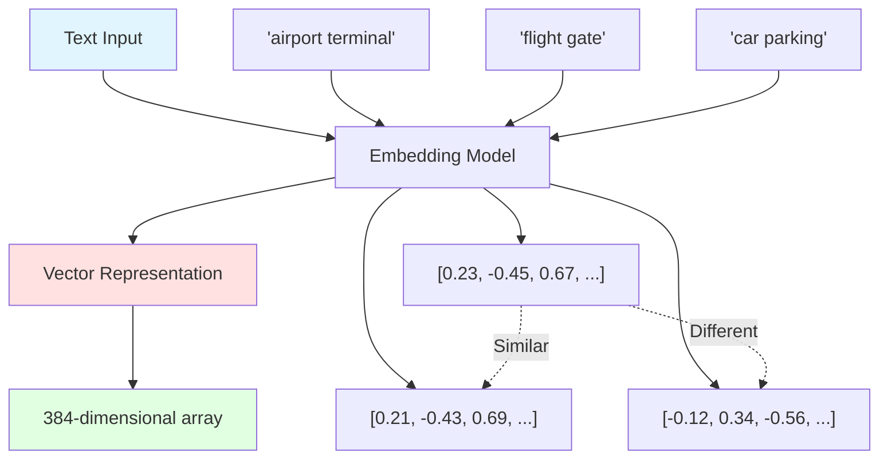

### Key Properties

1. **Dimensionality**: Typically 384, 768, or 1536 dimensions
2. **Semantic Proximity**: Similar meanings = closer vectors
3. **Mathematical Operations**: Can calculate similarity using cosine distance
4. **Language Understanding**: Captures context, synonyms, and relationships


### Example: Semantic Similarity

```
Query: "airport terminal"
Embedding: [0.23, -0.45, 0.67, 0.12, ...]

Similar Results:
✓ "flight gate"        → [0.21, -0.43, 0.69, 0.15, ...] (similarity: 0.95)
✓ "departure lounge"   → [0.25, -0.47, 0.65, 0.10, ...] (similarity: 0.92)
✗ "car parking"        → [-0.12, 0.34, -0.56, 0.78, ...] (similarity: 0.45)
```

## Valkey Vector Similarity Search (VSS)

Valkey (Redis-compatible) provides native vector search capabilities through the RediSearch module, enabling fast approximate nearest neighbor (ANN) search.

### Architecture Overview

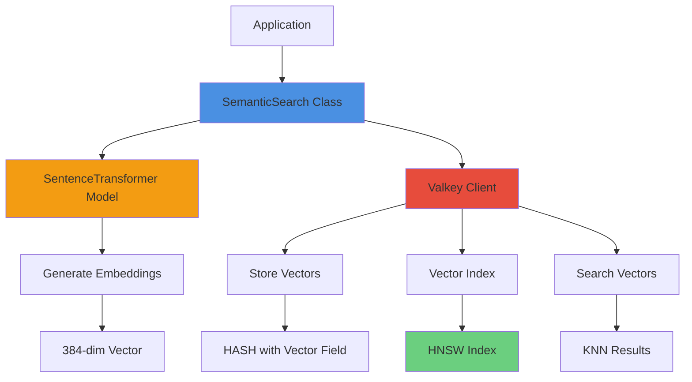

### Core Components

1. **Embedding Model**: SentenceTransformer (e.g., all-MiniLM-L6-v2)
2. **Vector Storage**: Valkey HASH with binary vector field
3. **Vector Index**: HNSW (Hierarchical Navigable Small World) algorithm
4. **Search**: KNN (K-Nearest Neighbors) query


## System Flow

### Complete Semantic Search Pipeline

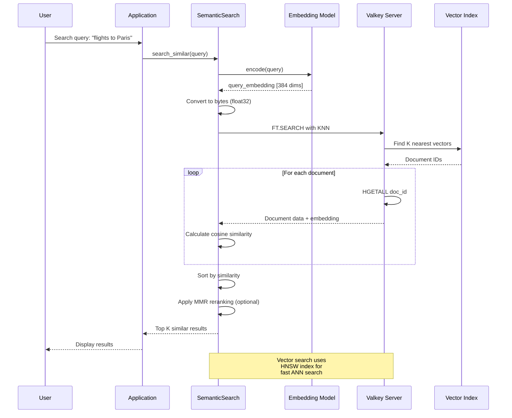


### Index Creation Flow

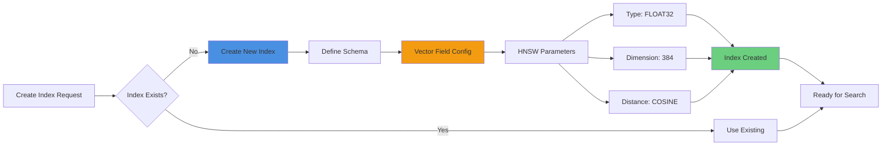


## Pseudocode Examples

### 1. Initialization

```pseudocode
CLASS SemanticSearch:
    FUNCTION __init__(valkey_client, embedding_model, use_mmr, mmr_lambda):
        // Load configuration
        IF embedding_model IS NULL:
            embedding_model = ENV["EMBEDDING_MODEL"] OR "all-MiniLM-L6-v2"
        
        // Connect to Valkey
        IF valkey_client IS NULL:
            host = ENV["VECTOR_HOST"] OR "localhost"
            port = ENV["VECTOR_PORT"] OR 6379
            valkey_client = Valkey.connect(host, port)
            
            // Test connection
            TRY:
                valkey_client.ping()
                PRINT "✅ Connected to Valkey"
            CATCH Exception:
                PRINT "❌ Connection failed"
                RAISE
        
        SET self.valkey_client = valkey_client
        
        // Load embedding model
        PRINT "Loading embedding model: {embedding_model}"
        SET self.embedding_model = SentenceTransformer(embedding_model)
        SET self.vector_dim = embedding_model.get_dimension()
        PRINT "✅ Model loaded. Dimension: {vector_dim}"
        
        // Configure MMR
        SET self.use_mmr = use_mmr
        SET self.mmr_lambda = mmr_lambda
```


### 2. Generate Embedding

```pseudocode
FUNCTION generate_embedding(text):
    """
    Convert text to vector embedding
    
    Input: "flights to Paris"
    Output: [0.23, -0.45, 0.67, ..., 0.12] (384 dimensions)
    """
    
    // Use pre-trained model to encode text
    embedding = self.embedding_model.encode(
        text,
        convert_to_numpy=TRUE
    )
    
    // Returns numpy array of shape (384,)
    RETURN embedding
```

### 3. Cosine Similarity

```pseudocode
FUNCTION cosine_similarity(vec1, vec2):
    """
    Calculate similarity between two vectors
    
    Formula: cos(θ) = (A · B) / (||A|| × ||B||)
    
    Range: -1 (opposite) to 1 (identical)
    Typical: 0.7-1.0 (similar), 0.3-0.7 (related), 0-0.3 (different)
    """
    
    // Dot product of vectors
    dot_product = SUM(vec1[i] * vec2[i] FOR i IN 0 TO length)
    
    // Magnitude (L2 norm) of each vector
    magnitude_1 = SQRT(SUM(vec1[i]^2 FOR i IN 0 TO length))
    magnitude_2 = SQRT(SUM(vec2[i]^2 FOR i IN 0 TO length))
    
    // Cosine similarity
    similarity = dot_product / (magnitude_1 * magnitude_2)
    
    RETURN similarity
```


### 4. Create Vector Index

```pseudocode
FUNCTION create_vector_index(index_name, key_prefix, additional_fields):
    """
    Create HNSW vector search index in Valkey
    
    Example:
        index_name = "semantic_cache_idx"
        key_prefix = "embedding:prompt:"
        additional_fields = [("prompt", "TEXT"), ("response", "TEXT")]
    """
    
    TRY:
        // Check if index already exists
        info = valkey_client.execute("FT.INFO", index_name)
        PRINT "✅ Index '{index_name}' already exists"
        RETURN TRUE
        
    CATCH ResponseError AS e:
        IF "unknown index" IN error_message:
            // Index doesn't exist, create it
            PRINT "Creating vector search index '{index_name}'"
            PRINT "   Vector dimension: {vector_dim}"
            PRINT "   Distance metric: COSINE"
            PRINT "   Algorithm: HNSW"
            
            // Build command arguments
            command = [
                "FT.CREATE", index_name,
                "ON", "HASH",                    // Index HASH data structures
                "PREFIX", "1", key_prefix,       // Only index keys with this prefix
                "SCHEMA"                         // Define fields
            ]
            
            // Add additional text/tag fields
            FOR EACH (field_name, field_type) IN additional_fields:
                APPEND field_name, field_type TO command
            
            // Add vector field with HNSW configuration
            APPEND [
                "embedding", "VECTOR", "HNSW", "6",
                "TYPE", "FLOAT32",               // 32-bit floating point
                "DIM", vector_dim,               // e.g., 384
                "DISTANCE_METRIC", "COSINE"      // Cosine similarity
            ] TO command
            
            // Execute index creation
            valkey_client.execute(*command)
            PRINT "✅ Index created successfully"
            RETURN TRUE
            
        ELSE:
            PRINT "⚠️ Error checking index: {e}"
            RETURN FALSE
```


### 5. Vector Search

```pseudocode
FUNCTION search_similar(embedding, index_name, key_prefix, k, return_embeddings):
    """
    Search for K most similar vectors
    
    Args:
        embedding: Query vector [384 dims]
        index_name: "semantic_cache_idx"
        key_prefix: "embedding:prompt:"
        k: Number of results (e.g., 5)
        return_embeddings: Include vectors in results (needed for MMR)
    """
    
    // Determine if we need embeddings for MMR reranking
    IF return_embeddings IS NULL:
        return_embeddings = self.use_mmr
    
    TRY:
        // Convert numpy array to bytes (FLOAT32 format)
        embedding_bytes = embedding.as_float32().to_bytes()
        
        // Fetch more results if using MMR (for diversity)
        search_k = k * 3 IF self.use_mmr ELSE k
        
        // Build KNN query
        // Syntax: *=>[KNN {k} @field $param AS score]
        query = Query(
            "*=>[KNN {search_k} @embedding $vec AS score]"
        ).return_fields("*")  // Return all fields
         .dialect(2)          // Use RediSearch dialect 2
        
        // Execute vector search
        results = valkey_client.ft(index_name).search(
            query,
            {"vec": embedding_bytes}  // Pass vector as parameter
        )
        
        PRINT "Vector search executed: {results.total} results"
        
        // Process results
        similar_items = []
        candidate_ids = EXTRACT document_ids FROM results
        
        // Fetch full data for each candidate
        FOR EACH doc_id IN candidate_ids:
            // Get all hash fields
            hash_data = valkey_client.hgetall(doc_id)
            
            IF hash_data IS EMPTY:
                CONTINUE
            
            item = {}
            candidate_embedding = NULL
            
            // Parse hash fields
            FOR EACH (field_name, field_value) IN hash_data:
                IF field_name == "embedding":
                    // Convert bytes back to numpy array
                    candidate_embedding = from_bytes(field_value, FLOAT32)
                    
                    IF return_embeddings:
                        item["embedding"] = candidate_embedding
                ELSE:
                    // Decode text fields
                    item[field_name] = decode_utf8(field_value)
            
            // Calculate cosine similarity manually
            IF candidate_embedding IS NOT NULL:
                similarity = cosine_similarity(embedding, candidate_embedding)
                item["similarity"] = similarity
                APPEND item TO similar_items
        
        // Apply MMR reranking if enabled
        IF self.use_mmr AND similar_items IS NOT EMPTY:
            similar_items = mmr_rerank(embedding, similar_items, top_k=k)
        ELSE:
            similar_items = similar_items[0:k]
        
        RETURN similar_items
        
    CATCH Exception AS e:
        // Fallback to brute force search
        PRINT "⚠️ Vector search failed, using brute-force"
        RETURN brute_force_search(embedding, key_prefix, k)
```


### 6. Brute Force Fallback

```pseudocode
FUNCTION brute_force_search(embedding, key_prefix, k, return_embeddings):
    """
    Fallback when vector index is unavailable
    Scans all keys and calculates similarity manually
    """
    
    similar_items = []
    
    // Scan all keys with prefix
    keys = valkey_client.scan_iter("{key_prefix}*", count=100)
    
    IF keys IS EMPTY:
        RETURN []
    
    // Calculate similarity for each key
    FOR EACH key IN keys:
        TRY:
            // Get hash data
            data = valkey_client.hgetall(key)
            IF data IS EMPTY:
                CONTINUE
            
            item = {}
            stored_embedding = NULL
            
            // Parse fields
            FOR EACH (field_name, field_value) IN data:
                IF field_name == "embedding":
                    stored_embedding = from_bytes(field_value, FLOAT32)
                    IF return_embeddings:
                        item["embedding"] = stored_embedding
                ELSE:
                    item[field_name] = decode_utf8(field_value)
            
            // Calculate similarity
            IF stored_embedding IS NOT NULL:
                similarity = cosine_similarity(embedding, stored_embedding)
                item["similarity"] = similarity
                APPEND item TO similar_items
                
        CATCH Exception:
            CONTINUE
    
    // Sort by similarity (descending)
    SORT similar_items BY similarity DESC
    
    // Apply MMR if enabled
    IF self.use_mmr AND similar_items IS NOT EMPTY:
        RETURN mmr_rerank(embedding, similar_items, top_k=k)
    
    RETURN similar_items[0:k]
```


### 7. MMR Reranking (Maximal Marginal Relevance)

```pseudocode
FUNCTION mmr_rerank(query_embedding, candidates, lambda_param, top_k):
    """
    Rerank results to balance relevance and diversity
    
    MMR Score = λ × Relevance - (1-λ) × Max_Similarity_to_Selected
    
    λ = 1.0: Pure relevance (no diversity)
    λ = 0.5: Balanced
    λ = 0.0: Pure diversity (no relevance)
    """
    
    IF lambda_param IS NULL:
        lambda_param = self.mmr_lambda  // Default: 0.5
    
    IF candidates IS EMPTY OR LENGTH(candidates) <= 1:
        RETURN candidates[0:top_k]
    
    // Extract embeddings from candidates
    candidate_embeddings = []
    FOR EACH candidate IN candidates:
        embedding = candidate["embedding"]
        IF embedding IS bytes:
            embedding = from_bytes(embedding, FLOAT32)
        APPEND embedding TO candidate_embeddings
    
    selected_indices = []
    remaining_indices = [0, 1, 2, ..., LENGTH(candidates)-1]
    
    // Step 1: Select first item with highest similarity to query
    first_idx = MAX(remaining_indices, 
                    KEY=lambda i: candidates[i]["similarity"])
    APPEND first_idx TO selected_indices
    REMOVE first_idx FROM remaining_indices
    
    // Step 2: Iteratively select remaining items
    WHILE LENGTH(selected_indices) < MIN(top_k, LENGTH(candidates)) 
          AND remaining_indices IS NOT EMPTY:
        
        mmr_scores = []
        
        FOR EACH idx IN remaining_indices:
            // Relevance: similarity to query
            relevance = candidates[idx]["similarity"]
            
            // Diversity: max similarity to already selected items
            // (we want to MINIMIZE this)
            max_sim_to_selected = MAX(
                cosine_similarity(
                    candidate_embeddings[idx],
                    candidate_embeddings[selected_idx]
                )
                FOR selected_idx IN selected_indices
            )
            
            // MMR score: balance relevance and diversity
            mmr_score = (lambda_param * relevance) - 
                       ((1 - lambda_param) * max_sim_to_selected)
            
            APPEND (idx, mmr_score) TO mmr_scores
        
        // Select item with highest MMR score
        best_idx = MAX(mmr_scores, KEY=lambda x: x[1])[0]
        APPEND best_idx TO selected_indices
        REMOVE best_idx FROM remaining_indices
    
    // Return reranked results
    RETURN [candidates[i] FOR i IN selected_indices]
```


## HNSW Algorithm

### Hierarchical Navigable Small World

HNSW is an approximate nearest neighbor (ANN) algorithm that provides fast vector search with high recall.

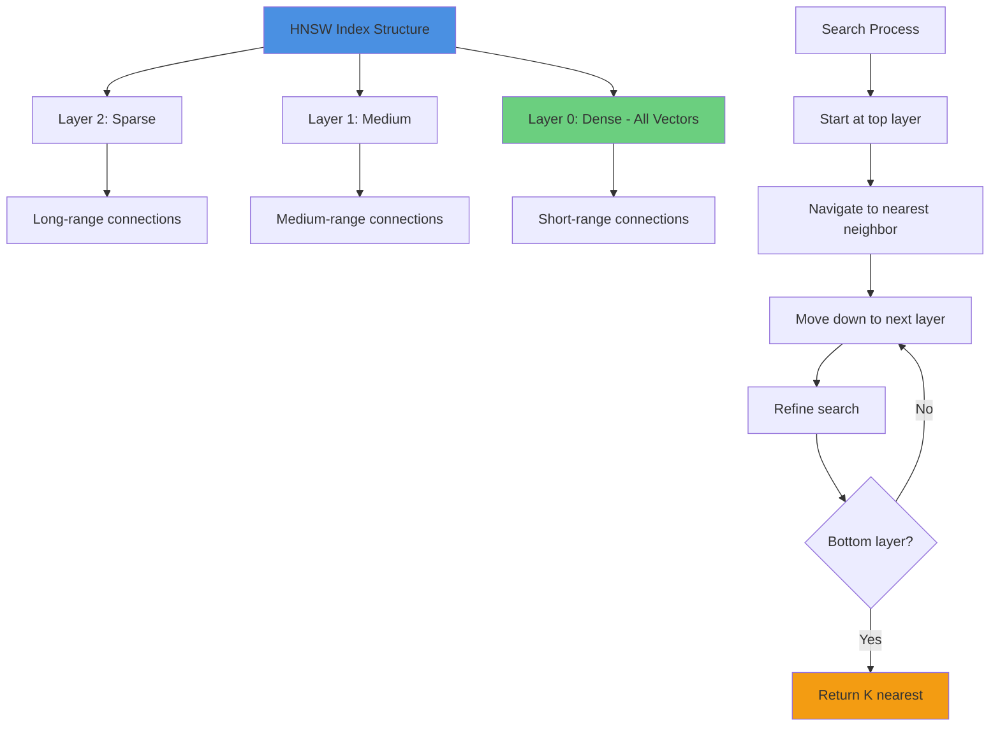

### HNSW Properties

```pseudocode
hnsw_properties = {
    "time_complexity": "O(log N)",      // N = number of vectors
    "space_complexity": "O(N × M)",     // M = connections per node
    "search_accuracy": "95-99% recall", // vs exact search
    "build_time": "O(N × log N)",       // Index construction
    
    "advantages": [
        "Fast search (milliseconds)",
        "High recall rate",
        "Scalable to millions of vectors",
        "Memory efficient"
    ],
    
    "trade_offs": [
        "Approximate (not exact) results",
        "Index build time",
        "Memory overhead for graph structure"
    ]
}
```


## Distance Metrics

### Cosine Similarity vs Other Metrics

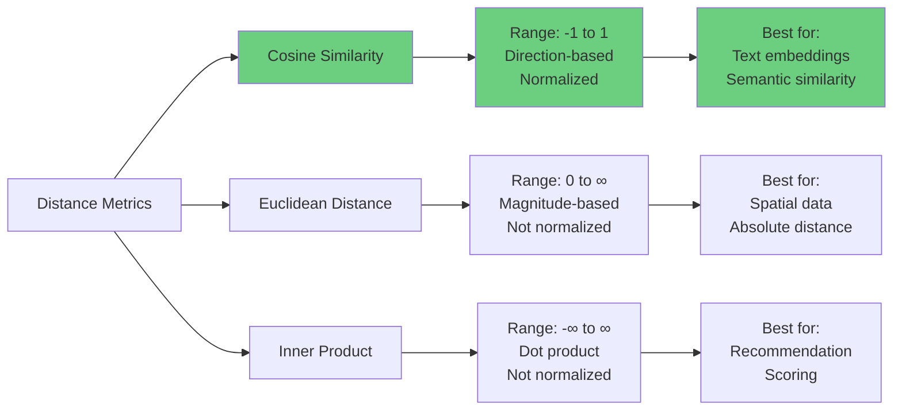

### Cosine Similarity Visualization

```
Vector A: [3, 4]
Vector B: [6, 8]  (same direction, different magnitude)
Vector C: [4, 3]  (different direction)

Cosine Similarity:
A vs B = 1.0   (identical direction)
A vs C = 0.96  (similar direction)

Euclidean Distance:
A vs B = 5.0   (far apart in space)
A vs C = 1.4   (close in space)

For semantic search, cosine is preferred because:
- Focuses on meaning (direction) not length
- Normalized: fair comparison across different text lengths
- Range [0,1] for similarity is intuitive
```


## Data Storage Format

### Vector Storage in Valkey

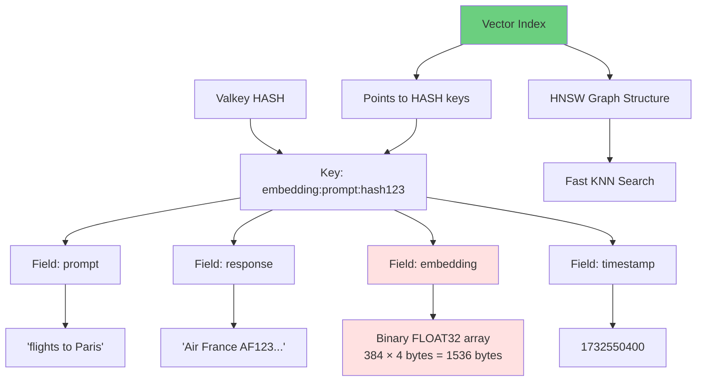

### Storage Pseudocode

```pseudocode
FUNCTION store_with_embedding(key, data, embedding):
    """
    Store data with vector embedding in Valkey
    
    Example:
        key = "embedding:prompt:abc123"
        data = {
            "prompt": "flights to Paris",
            "response": "Air France AF123...",
            "timestamp": 1732550400
        }
        embedding = [0.23, -0.45, ..., 0.12]  // 384 dims
    """
    
    // Convert embedding to binary format (FLOAT32)
    embedding_bytes = embedding.as_float32().to_bytes()
    
    // Store in HASH
    valkey_client.hset(key, {
        "prompt": data["prompt"],
        "response": data["response"],
        "timestamp": data["timestamp"],
        "embedding": embedding_bytes  // Binary vector
    })
    
    // Vector index automatically indexes this key
    // if it matches the index prefix
```


## MMR (Maximal Marginal Relevance)

### Why MMR?

Without MMR, search results can be redundant - multiple very similar items that don't add new information.

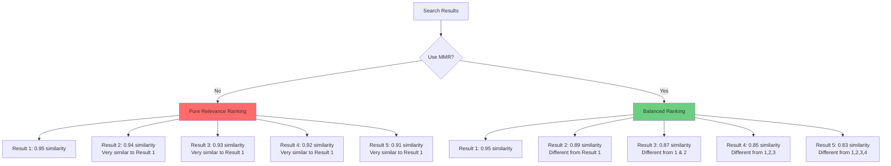

### MMR Algorithm Flow

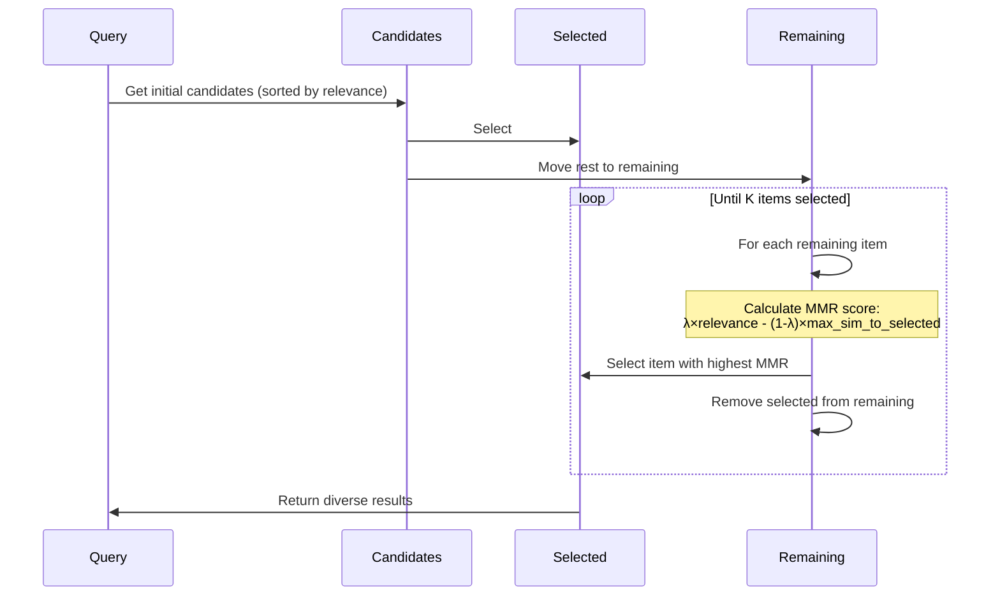


### MMR Lambda Parameter

```pseudocode
// Lambda controls relevance vs diversity trade-off

lambda_examples = {
    "1.0": {
        "behavior": "Pure relevance",
        "result": "Top K most similar items",
        "use_case": "When exact matches are critical"
    },
    
    "0.7": {
        "behavior": "Favor relevance, some diversity",
        "result": "Mostly similar, slightly varied",
        "use_case": "General search with minor diversity"
    },
    
    "0.5": {
        "behavior": "Balanced",
        "result": "Mix of similar and diverse items",
        "use_case": "Default for most applications"
    },
    
    "0.3": {
        "behavior": "Favor diversity, some relevance",
        "result": "Varied results, still relevant",
        "use_case": "Exploration and discovery"
    },
    
    "0.0": {
        "behavior": "Pure diversity",
        "result": "Maximum variety, may lose relevance",
        "use_case": "When avoiding redundancy is critical"
    }
}
```


## Performance Characteristics

### Search Performance

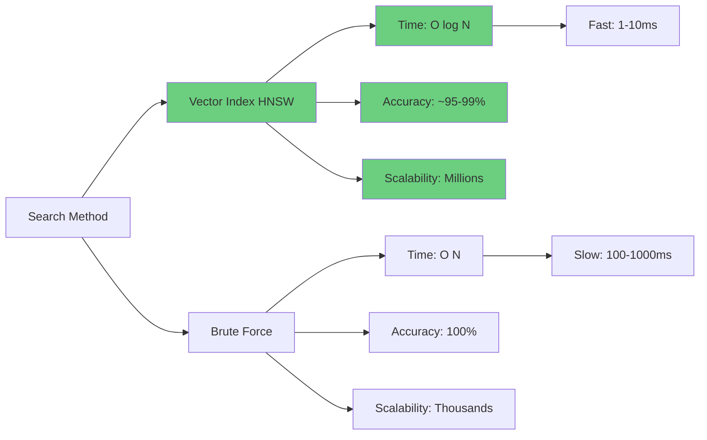

### Typical Metrics

```pseudocode
performance_metrics = {
    "embedding_generation": {
        "time": "10-50ms per text",
        "model_size": "80-500MB",
        "cpu_usage": "Medium",
        "gpu_usage": "Optional (faster)"
    },
    
    "vector_storage": {
        "size_per_vector": "1.5KB (384 dims × 4 bytes)",
        "overhead": "~20% for HNSW index",
        "memory_usage": "All vectors + index in RAM"
    },
    
    "search_performance": {
        "hnsw_search": "1-10ms for 1M vectors",
        "brute_force": "100-1000ms for 10K vectors",
        "recall_rate": "95-99% (HNSW)",
        "throughput": "1000+ queries/sec"
    },
    
    "scalability": {
        "vectors": "Millions",
        "dimensions": "384-1536 typical",
        "index_build": "Minutes for 1M vectors",
        "memory": "~2GB per 1M vectors (384 dims)"
    }
}
```


## Use Cases

### 1. Semantic Cache

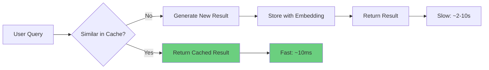

Example:
```
Query 1: "flights from New York to Paris"
Query 2: "NYC to Paris flights"  ← Similar! (0.92 similarity)
Query 3: "weather in Tokyo"      ← Different (0.23 similarity)

Result: Query 2 gets cached result from Query 1
```

### 2. Document Search

```
Corpus: 10,000 technical documents
Query: "How to configure SSL certificates"

Results:
1. "SSL/TLS Configuration Guide" (0.89)
2. "Certificate Management Best Practices" (0.85)
3. "HTTPS Setup Tutorial" (0.82)
4. "Security Configuration Overview" (0.78)
5. "Web Server SSL Guide" (0.75)
```

### 3. Recommendation System

```
User viewed: "Introduction to Machine Learning"
Embedding: [0.45, -0.23, 0.67, ...]

Similar content:
1. "Deep Learning Fundamentals" (0.88)
2. "Neural Networks Explained" (0.85)
3. "AI for Beginners" (0.82)
```


## Best Practices

### 1. Embedding Model Selection

```pseudocode
model_selection = {
    "all-MiniLM-L6-v2": {
        "dimensions": 384,
        "speed": "Fast",
        "quality": "Good",
        "use_case": "General purpose, production"
    },
    
    "all-mpnet-base-v2": {
        "dimensions": 768,
        "speed": "Medium",
        "quality": "Better",
        "use_case": "Higher quality needs"
    },
    
    "text-embedding-ada-002": {
        "dimensions": 1536,
        "speed": "API call",
        "quality": "Best",
        "use_case": "OpenAI API, highest quality"
    }
}

// Trade-off: Dimensions vs Speed vs Quality
// More dimensions = Better quality but slower and more storage
```

### 2. Index Configuration

```pseudocode
index_best_practices = {
    "prefix_strategy": [
        "Use specific prefixes for different use cases",
        "Example: 'embedding:cache:', 'embedding:docs:'",
        "Enables multiple indexes on same Valkey instance"
    ],
    
    "field_selection": [
        "Only index fields you'll search on",
        "Store metadata but don't index everything",
        "Balance between functionality and performance"
    ],
    
    "distance_metric": [
        "COSINE: Best for text embeddings (normalized)",
        "L2 (Euclidean): For spatial data",
        "IP (Inner Product): For recommendation systems"
    ]
}
```


### 3. Search Optimization

```pseudocode
search_optimization = {
    "k_value": {
        "guideline": "Fetch 2-3x more if using MMR",
        "reason": "MMR needs candidates to diversify from",
        "example": "Want 5 results? Fetch 15, then MMR to 5"
    },
    
    "similarity_threshold": {
        "guideline": "Filter results below threshold",
        "typical_values": {
            "high_confidence": 0.8,
            "medium_confidence": 0.6,
            "low_confidence": 0.4
        },
        "example": "Only return results with similarity > 0.7"
    },
    
    "caching": {
        "guideline": "Cache embeddings for repeated queries",
        "benefit": "Skip embedding generation (10-50ms saved)",
        "implementation": "Hash query text → store embedding"
    },
    
    "batch_processing": {
        "guideline": "Generate embeddings in batches",
        "benefit": "Better GPU utilization",
        "example": "Encode 32 texts at once vs one at a time"
    }
}
```

### 4. Error Handling

```pseudocode
error_handling_strategy = {
    "vector_search_unavailable": {
        "fallback": "Brute force search",
        "detection": "Catch index not found error",
        "graceful_degradation": "Slower but still functional"
    },
    
    "embedding_model_failure": {
        "fallback": "Keyword search or error message",
        "prevention": "Pre-load model at startup",
        "monitoring": "Track model load failures"
    },
    
    "valkey_connection_failure": {
        "fallback": "In-memory cache or error",
        "retry_strategy": "Exponential backoff",
        "circuit_breaker": "Stop retrying after N failures"
    }
}
```


## Limitations and Considerations

### 1. Semantic Limitations

```
Challenges:
- Homonyms: "bank" (financial) vs "bank" (river)
- Context: "Apple" (fruit) vs "Apple" (company)
- Negation: "not good" may be close to "good" in vector space
- Idioms: "kick the bucket" ≠ literal meaning

Mitigation:
- Use context-aware models
- Add metadata filters
- Combine with keyword search
- Use domain-specific models
```

### 2. Performance Trade-offs

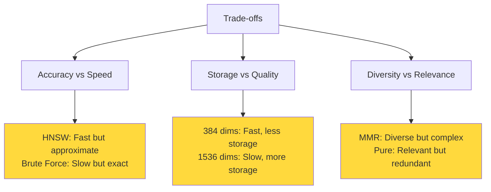

### 3. Resource Requirements

```pseudocode
resource_requirements = {
    "memory": {
        "embedding_model": "80-500MB",
        "vectors_in_index": "~2KB per vector (384 dims)",
        "hnsw_overhead": "~20% additional",
        "example": "1M vectors = ~2.4GB RAM"
    },
    
    "cpu": {
        "embedding_generation": "Medium-High",
        "vector_search": "Low (with index)",
        "mmr_reranking": "Medium",
        "recommendation": "Multi-core CPU beneficial"
    },
    
    "gpu": {
        "required": "No",
        "beneficial": "Yes (2-10x faster embeddings)",
        "use_case": "High-throughput scenarios"
    },
    
    "storage": {
        "vectors": "1.5KB per item (384 dims)",
        "metadata": "Variable (text fields)",
        "index": "~20% of vector size",
        "example": "1M items = ~2GB total"
    }
}
```


## Advanced Concepts

### Hybrid Search

Combining semantic and keyword search for best results:

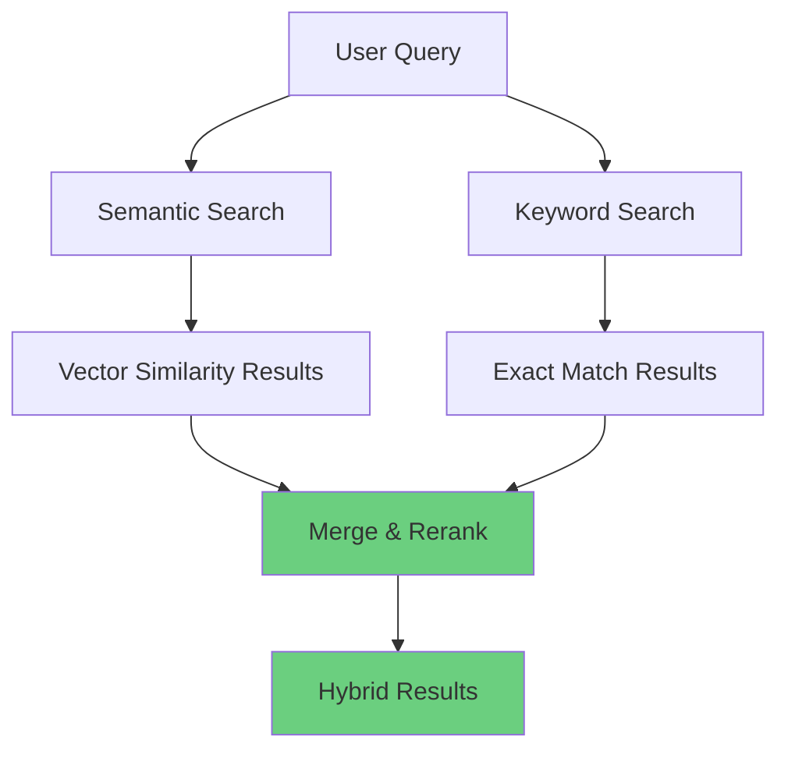

```pseudocode
FUNCTION hybrid_search(query, k):
    // Get semantic results
    embedding = generate_embedding(query)
    semantic_results = search_similar(embedding, k=k*2)
    
    // Get keyword results
    keyword_results = full_text_search(query, k=k*2)
    
    // Merge with weighted scoring
    combined = {}
    FOR EACH result IN semantic_results:
        combined[result.id] = {
            "score": 0.7 * result.similarity,  // 70% weight
            "data": result
        }
    
    FOR EACH result IN keyword_results:
        IF result.id IN combined:
            combined[result.id].score += 0.3 * result.score  // 30% weight
        ELSE:
            combined[result.id] = {
                "score": 0.3 * result.score,
                "data": result
            }
    
    // Sort by combined score
    SORT combined BY score DESC
    RETURN combined[0:k]
```


### Multi-Vector Search

Searching with multiple query vectors for complex queries:

```pseudocode
FUNCTION multi_vector_search(queries, k):
    """
    Search with multiple related queries
    
    Example:
        queries = [
            "airport terminal facilities",
            "flight departure gates",
            "passenger services"
        ]
    """
    
    all_results = {}
    
    // Search with each query
    FOR EACH query IN queries:
        embedding = generate_embedding(query)
        results = search_similar(embedding, k=k*2)
        
        FOR EACH result IN results:
            IF result.id IN all_results:
                // Aggregate scores (max, average, or sum)
                all_results[result.id].score = MAX(
                    all_results[result.id].score,
                    result.similarity
                )
            ELSE:
                all_results[result.id] = result
    
    // Sort by aggregated score
    SORT all_results BY score DESC
    RETURN all_results[0:k]
```

### Filtered Vector Search

Combining vector search with metadata filters:

```pseudocode
FUNCTION filtered_vector_search(query, filters, k):
    """
    Search with semantic similarity + metadata filters
    
    Example:
        query = "international flights"
        filters = {
            "airline": "Air France",
            "date": "2024-12-01"
        }
    """
    
    // Generate embedding
    embedding = generate_embedding(query)
    
    // Fetch more candidates for filtering
    candidates = search_similar(embedding, k=k*5)
    
    // Apply filters
    filtered_results = []
    FOR EACH candidate IN candidates:
        matches_all_filters = TRUE
        
        FOR EACH (field, value) IN filters:
            IF candidate[field] != value:
                matches_all_filters = FALSE
                BREAK
        
        IF matches_all_filters:
            APPEND candidate TO filtered_results
            
            IF LENGTH(filtered_results) >= k:
                BREAK
    
    RETURN filtered_results
```


## Comparison: Semantic vs Traditional Search

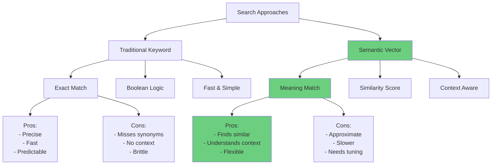

### Example Comparison

```
Query: "cheap flights to Paris"

Traditional Keyword Search:
✓ "cheap flights to Paris"           (exact match)
✓ "flights to Paris cheap"           (all keywords)
✗ "affordable Paris airfare"         (different words)
✗ "budget travel to France capital"  (synonyms)

Semantic Vector Search:
✓ "cheap flights to Paris"           (0.98 - exact)
✓ "affordable Paris airfare"         (0.89 - synonyms)
✓ "budget travel to France capital"  (0.82 - context)
✓ "low-cost tickets to CDG"          (0.78 - related)
```


## Implementation Checklist

### Setup Phase

```pseudocode
setup_checklist = [
    "1. Install dependencies",
    "   - valkey/redis client",
    "   - sentence-transformers",
    "   - numpy",
    
    "2. Configure Valkey",
    "   - Enable RediSearch module",
    "   - Set memory limits",
    "   - Configure persistence",
    
    "3. Select embedding model",
    "   - Choose based on use case",
    "   - Download model files",
    "   - Test embedding generation",
    
    "4. Create vector index",
    "   - Define schema",
    "   - Set HNSW parameters",
    "   - Choose distance metric",
    
    "5. Test search",
    "   - Insert sample vectors",
    "   - Run test queries",
    "   - Verify results"
]
```

### Production Considerations

```pseudocode
production_checklist = [
    "Performance",
    "   - Monitor search latency",
    "   - Track index size",
    "   - Optimize K value",
    
    "Reliability",
    "   - Implement fallback search",
    "   - Handle connection failures",
    "   - Add retry logic",
    
    "Scalability",
    "   - Plan for vector growth",
    "   - Consider sharding",
    "   - Monitor memory usage",
    
    "Monitoring",
    "   - Track search accuracy",
    "   - Log slow queries",
    "   - Alert on failures",
    
    "Maintenance",
    "   - Regular index optimization",
    "   - Clean up old vectors",
    "   - Update embedding model"
]
```


## Conclusion

Semantic search with Valkey VSS provides powerful similarity-based retrieval by:

1. **Converting text to vectors** using embedding models that capture semantic meaning
2. **Storing vectors efficiently** in Valkey with HNSW indexing for fast search
3. **Finding similar content** using cosine similarity in high-dimensional space
4. **Optimizing results** with MMR reranking for diversity

### Key Takeaways

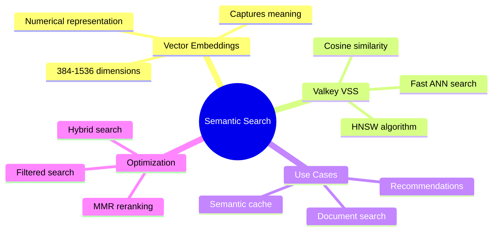

### When to Use

**Use Semantic Search when:**
- Finding similar content by meaning, not just keywords
- Handling synonyms and paraphrases
- Building recommendation systems
- Implementing semantic caching
- Searching across languages (with multilingual models)

**Use Traditional Search when:**
- Exact matches are required
- Simple keyword filtering is sufficient
- Performance is critical (keyword search is faster)
- Resources are limited (no embedding model needed)

### Further Reading

- Valkey Vector Search Documentation
- SentenceTransformers Model Hub
- HNSW Algorithm Paper
- MMR Algorithm Paper
- Embedding Model Comparison Studies

---

*This document provides conceptual understanding of semantic search with Valkey VSS. For implementation details, refer to the source code in `core/semantic_search.py`.*
