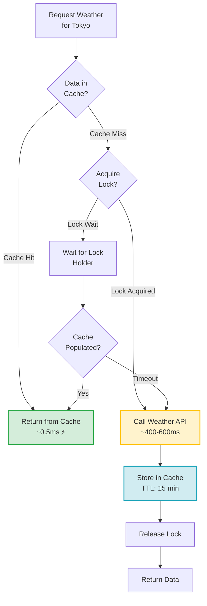
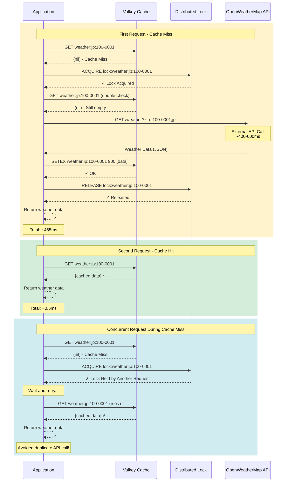

# Weather API Caching - Cache-Aside Pattern

## Overview

The Weather API Cache demo demonstrates how the cache-aside pattern can dramatically reduce latency and costs when calling external third-party APIs. By caching weather data from OpenWeatherMap API, we avoid repeated expensive API calls for the same data within a time window.

## The Problem

External API calls introduce several challenges:

- **High Latency**: Network round-trips to third-party services typically take 300-600ms per request
- **API Costs**: Many APIs charge per request, making frequent calls expensive
- **Rate Limits**: APIs often limit the number of requests per time period
- **Reliability**: External services may be slow or temporarily unavailable

## The Solution: Cache-Aside with Lazy Loading

The cache-aside pattern solves these problems by:

1. **Check Cache First**: Before calling the API, check if the data exists in cache
2. **Cache Miss**: If not cached, call the external API
3. **Store in Cache**: Save the API response in cache with a TTL (Time-To-Live)
4. **Cache Hit**: Subsequent requests return data from cache instantly

### Distributed Locking

To prevent **cache stampede** (multiple simultaneous requests for the same uncached data), the implementation uses distributed locking:

- When a cache miss occurs, acquire a lock for that cache key
- Other requests wait for the lock holder to populate the cache
- Once populated, all waiting requests get the cached data

## Flow Diagram



## Sequence Diagram: Fetching Weather for Tokyo



## Performance Benefits

### Latency Reduction

| Scenario | Latency | Speedup |
|----------|---------|---------|
| **Direct API Call** | 400-600ms | 1.0x (baseline) |
| **Cache Hit** | 0.5-1ms | **400-1200x faster** |

### Cost Savings

With a 15-minute TTL:
- **Without Cache**: 1 API call per request
- **With Cache**: 1 API call per 15 minutes (for the same location)
- **Savings**: Up to 99% reduction in API calls for frequently requested locations

### Example Calculation

For a weather app with 1000 users checking weather every 5 minutes:
- **Without Cache**: 1000 users × 12 checks/hour = 12,000 API calls/hour
- **With Cache (15 min TTL)**: ~4 API calls/hour per location
- **Cost Reduction**: ~99.97% fewer API calls

## Cache Key Strategy

The demo uses a structured cache key format:

```
weather:<country_code>:<zip_code>
```

Examples:
- `weather:jp:100-0001` (Tokyo, Japan)
- `weather:us:10001` (New York, USA)
- `weather:gb:sw1a` (London, UK)

This format ensures:
- **Uniqueness**: Each location has a unique key
- **Readability**: Easy to understand and debug
- **Pattern Matching**: Can query all weather keys with `weather:*`

## TTL Configuration

The Time-To-Live determines how long data stays cached:

| TTL | Use Case | Trade-off |
|-----|----------|-----------|
| **15 minutes** | Real-time weather apps | More API calls, fresher data |
| **30 minutes** | General weather info | Balanced approach |
| **60 minutes** | Weather trends/history | Fewer API calls, older data |

## Key Takeaways

- **Dramatic Performance Improvement**: 400-1200x faster response times with cache hits
- **Cost Reduction**: Up to 99% reduction in API calls
- **Distributed Locking**: Prevents cache stampede and duplicate API calls
- **Configurable TTL**: Balance between data freshness and performance
- **Lazy Loading**: Cache is populated on-demand, not proactively
- **Resilience**: Application continues working even if cache fails (falls back to API)

## When to Use This Pattern

✅ **Good For:**
- External API calls with high latency
- APIs with usage-based pricing
- Data that doesn't change frequently (weather, exchange rates, etc.)
- High-traffic applications with repeated requests
- APIs with rate limits

❌ **Not Ideal For:**
- Data that must be real-time (stock prices, live sports scores)
- APIs with no latency or cost concerns
- Data that changes constantly
- Single-use queries with no repetition
