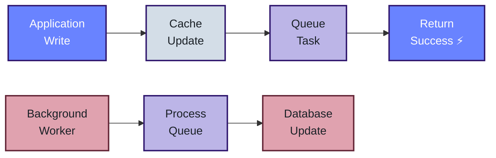
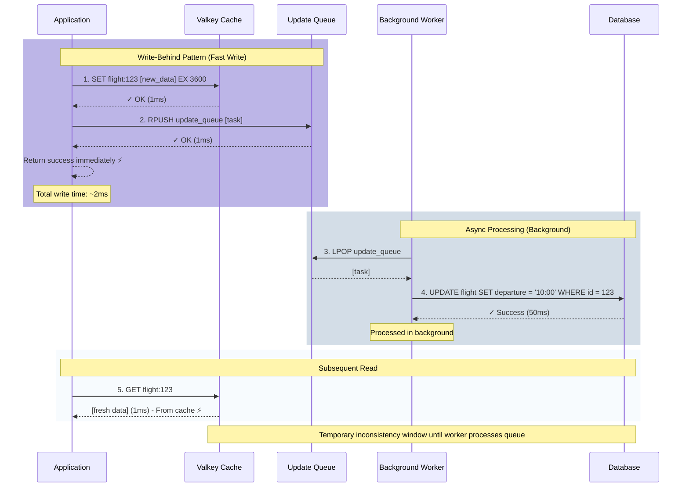

# Write-Behind (Write-Back)

## Overview

Write-Behind, also known as Write-Back, is a high-performance caching strategy that prioritizes write speed over immediate consistency. When data is written or updated, the application writes to the cache immediately and returns success, while the database update happens asynchronously in the background. This provides the fastest possible write performance at the cost of eventual consistency.

## How It Works

The Write-Behind pattern follows an asynchronous write process:

1. **Application Initiates Write**: When data needs to be created or updated, the application starts the write operation
2. **Write to Cache Immediately**: The data is written to the cache and the operation returns success instantly
3. **Queue Database Update**: The database update is queued for background processing
4. **Async Worker Processes Queue**: A separate background worker periodically processes the queue and updates the database

This approach maximizes write throughput by decoupling the fast cache write from the slower database write.

## Benefits

- **Maximum Write Performance**: Writes complete in milliseconds (cache speed)
- **High Throughput**: Can handle massive write volumes without database bottlenecks
- **Batch Processing**: Database updates can be batched for efficiency
- **Reduced Database Load**: Database writes are smoothed out over time
- **Resilience**: Application continues working even if database is temporarily slow

## Trade-offs

- **Eventual Consistency**: Cache and database are temporarily out of sync
- **Data Loss Risk**: If cache fails before queue is processed, updates may be lost
- **Complexity**: Requires background workers and queue management
- **Stale Reads from Database**: Direct database queries may return outdated data
- **Ordering Challenges**: Must ensure updates are applied in correct order

## Flow Diagram



## Detailed Sequence



## Implementation Pseudocode

```python
def update_data(id, new_value):
    """
    Write-Behind pattern in simple pseudocode
    """
    # Step 1: Write to cache immediately (fast!)
    cache_key = f"data:{id}"
    cache.set(cache_key, new_value, ttl=3600)
    
    # Step 2: Queue the database update for later
    task = {
        "id": id,
        "value": new_value,
        "timestamp": now()
    }
    queue.push(task)
    
    # Step 3: Return success immediately (don't wait for database)
    return success  # Total time: ~2ms


def background_worker():
    """
    Background worker that processes the queue
    Runs continuously in a separate process/thread
    """
    while True:
        # Get next task from queue
        task = queue.pop()
        
        if task exists:
            # Update database asynchronously
            database.update(task.id, task.value)
        
        sleep(100ms)  # Process queue every 100ms
```

### Real-World Example

```python
# Example: Updating flight departure time
flight_id = 123
new_departure = "10:00 AM"

# Write-Behind: Updates cache and queues database update
result = update_data(flight_id, new_departure)
# Returns in ~2ms (cache + queue time only)

# Immediate read gets data from cache
flight = get_data(flight_id)  # Returns updated time instantly

# Database update happens in background (50ms later)
# Background worker processes the queue asynchronously

# Another user reads the same data
flight = get_data(flight_id)  # Gets data from cache (consistent)

# Direct database query (bypassing cache) might show old data
# until background worker completes the update
```

## Comparison with Other Patterns

| Aspect | Write-Behind | Write-Through | Cache-Aside |
|--------|--------------|---------------|-------------|
| **Write Speed** | Fastest (~2ms) | Slower (~51ms) | Fast (~50ms) |
| **Consistency** | Eventual | Strong | Eventual |
| **Database Load** | Low (batched) | High (every write) | Medium |
| **Complexity** | High (needs workers) | Medium | Low |
| **Data Loss Risk** | Yes (if cache fails) | No | No |
| **Best For** | High-throughput writes | Strong consistency | Read-heavy loads |

## When to Use Write-Behind

✅ **Good For:**
- High-throughput write operations (analytics, logging, metrics)
- Applications that can tolerate eventual consistency
- Scenarios where write performance is critical
- Batch processing workloads
- Social media likes, view counts, activity feeds
- Gaming leaderboards and statistics

❌ **Not Ideal For:**
- Financial transactions requiring immediate consistency
- Critical data that cannot be lost
- Applications requiring strong consistency guarantees
- Scenarios where database must be immediately up-to-date
- Systems without infrastructure for background workers

## Handling Failures

Write-Behind requires careful consideration of failure scenarios:

- **Cache Failure**: Queued updates may be lost; consider persistent queues
- **Database Failure**: Implement retry logic with exponential backoff
- **Worker Failure**: Use multiple workers and health monitoring
- **Ordering**: Use timestamps or sequence numbers to ensure correct order
