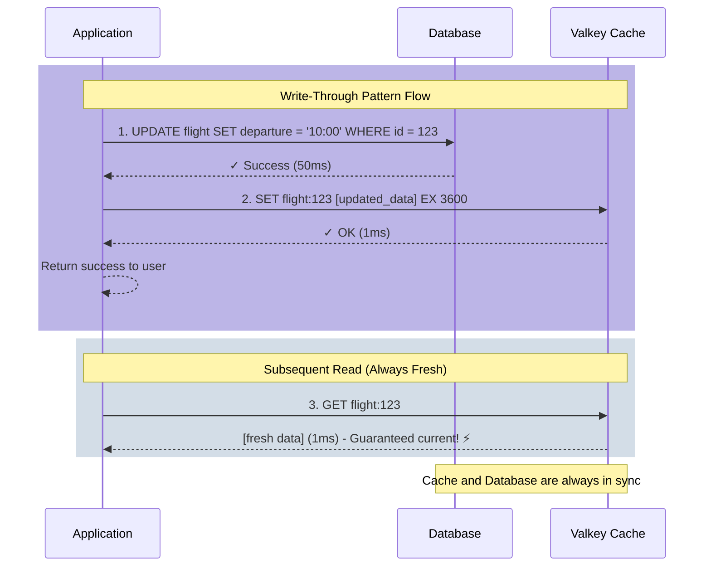

# Write-Through Cache

## Overview

Write-Through is a caching strategy that prioritizes data consistency. When data is written or updated, the application writes to both the cache and the database simultaneously (or sequentially). This ensures that the cache and database are always synchronized, eliminating the risk of serving stale data.

## How It Works

The Write-Through pattern follows a synchronized write process:

1. **Application Initiates Write**: When data needs to be created or updated, the application starts the write operation
2. **Write to Database First**: The data is written to the database (the source of truth)
3. **Update Cache Immediately**: After the database write succeeds, the cache is updated with the same data
4. **Confirm Success**: Only after both writes complete successfully does the operation return success

This approach guarantees that reads will always return the most recent data, as the cache is kept in sync with the database.

## Benefits

- **Strong Consistency**: Cache and database are always synchronized
- **No Stale Data**: Reads always return the most up-to-date information
- **Predictable Behavior**: Every write updates both storage layers
- **Simplified Read Logic**: No need to check if cache is fresh

## Trade-offs

- **Write Latency**: Every write operation is slower because it must update two systems
- **Write Amplification**: All writes hit both cache and database, even for rarely-read data
- **Complexity**: Requires handling failures in either the cache or database
- **Cache Pollution**: Infrequently accessed data still occupies cache space

## Flow Diagram


## Detailed Sequence



## Implementation Pseudocode

```python
def update_data(id, new_value):
    """
    Write-Through pattern in simple pseudocode
    """
    try:
        # Step 1: Write to database first (source of truth)
        database.update(id, new_value)
        
        # Step 2: Immediately update the cache
        cache_key = f"data:{id}"
        cache.set(cache_key, new_value, ttl=3600)
        
        return success
        
    except DatabaseError:
        # If database fails, don't update cache
        return error
    
    except CacheError:
        # Database succeeded but cache failed
        # Data is still consistent (database is source of truth)
        # Cache will be populated on next read (cache-aside)
        return success_with_warning
```

### Real-World Example

```python
# Example: Updating flight departure time
flight_id = 123
new_departure = "10:00 AM"

# Write-Through: Updates both database and cache
result = update_data(flight_id, new_departure)

# Immediate read gets fresh data from cache
flight = get_data(flight_id)  # Returns updated time instantly

# Another user reads the same data
flight = get_data(flight_id)  # Also gets updated time - no stale data!
```

## Comparison with Cache-Aside

| Aspect | Write-Through | Cache-Aside |
|--------|---------------|-------------|
| **Write Path** | Updates cache + database | Only updates database |
| **Read Path** | Always reads from cache | Checks cache, falls back to database |
| **Consistency** | Strong (always in sync) | Eventual (may serve stale data) |
| **Write Speed** | Slower (two writes) | Faster (one write) |
| **Best For** | Data that must be current | Read-heavy workloads |

## When to Use Write-Through

✅ **Good For:**
- Applications requiring strong data consistency
- Financial transactions or inventory systems
- User profile updates that must be immediately visible
- Scenarios where stale data is unacceptable
- Write-heavy workloads where data is frequently updated and read

❌ **Not Ideal For:**
- High-throughput write operations where latency matters
- Data that's written but rarely read
- Applications that can tolerate eventual consistency
- Scenarios where write performance is critical
