# 1.1 Explore the Sample Airport App

## Objective

Demonstrate caching benefits visually through the Airport App.

## What You'll Learn

- How to run the Airport App
- Visual demonstration of caching performance improvements
- Real-world impact of caching on user experience

## Instructions


from the cli run

```bash
uv run streamlit run airport_app.py
```

you can expect an output like this


```bash
$ uv run streamlit run airport_app.py

  You can now view your Streamlit app in your browser.

  Local URL: http://localhost:8501
  Network URL: http://10.0.4.55:8501
  External URL: http://76.49.142.98:8501
```

1. Open the url in the browser, see the landing page for the Airport App

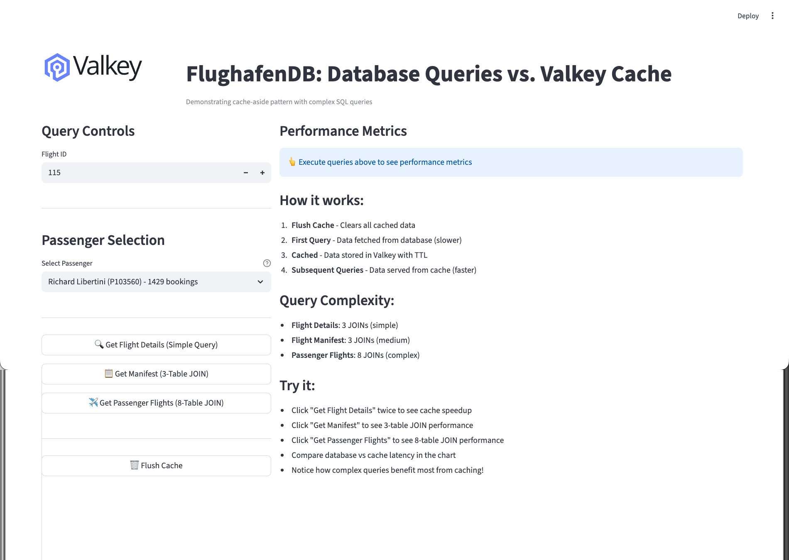

2. Select a flight (default 115)

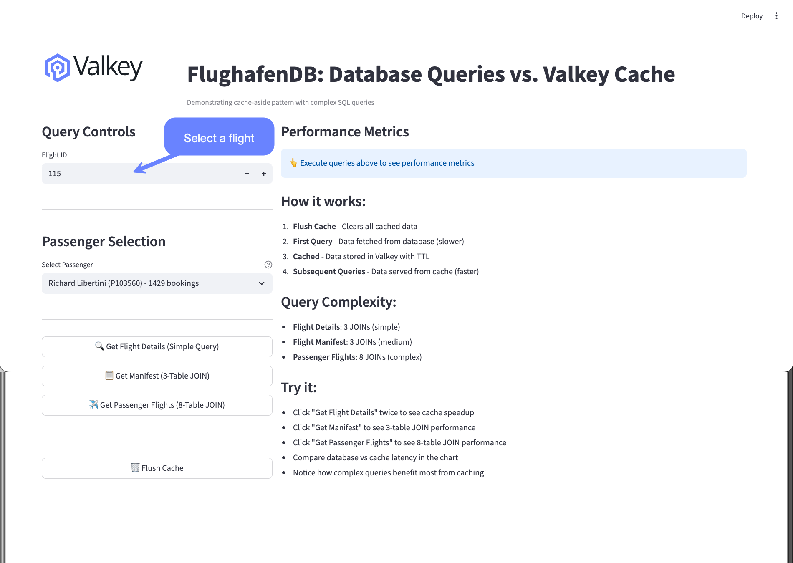

3. Click on the buttom to Get Flight Details (Simple Query)

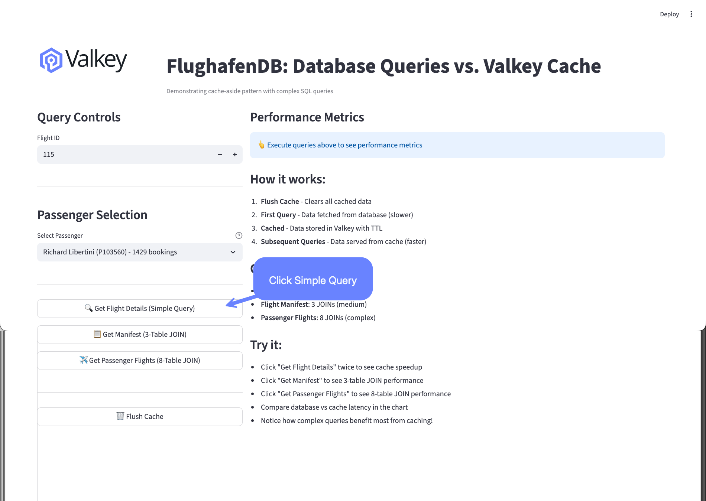

4. On the right side we will see the latency from the RDBMS 2.551 ms (red)

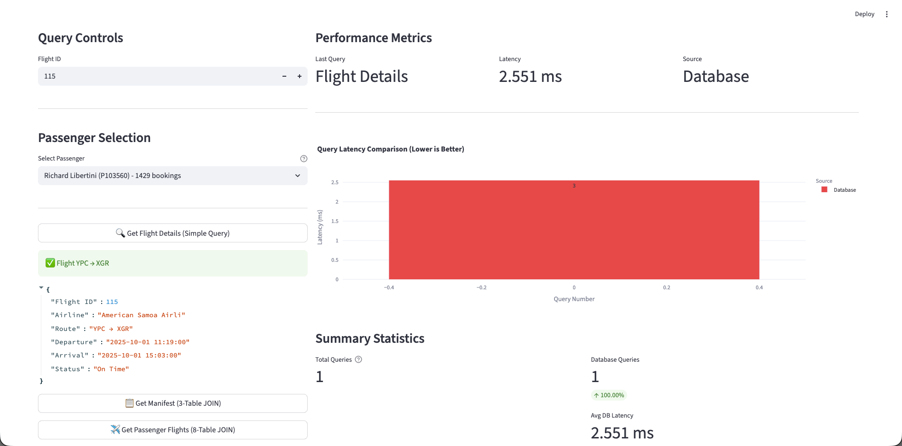

5. Click the same button again (Simple Query)

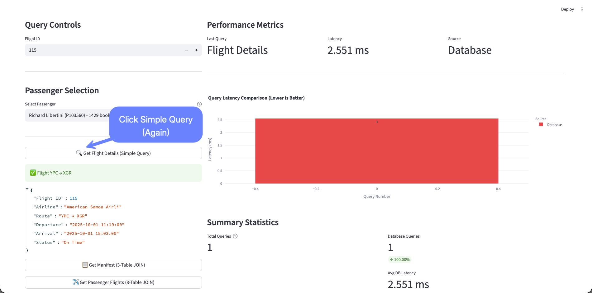

6. Observe the latency difference when data is fetched from the Valkey Cache 1.082ms about 50% improvement

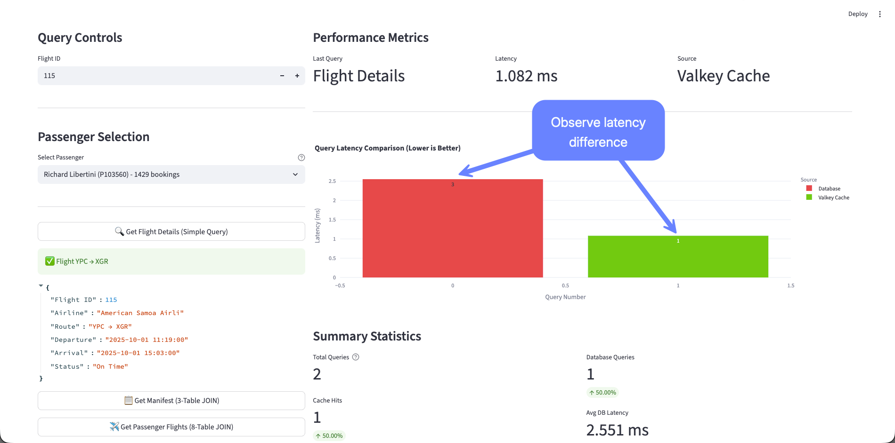

7. Scroll down and click twice on the button Get Manifest (3-Table JOIN)

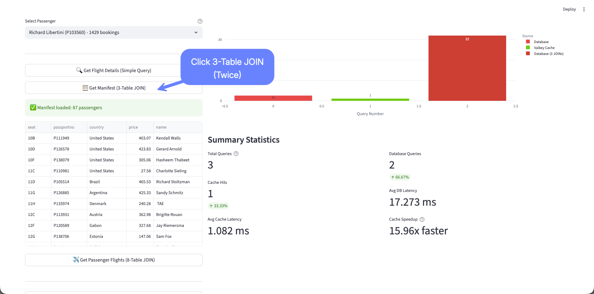

8. Now we can observe a more dramatic latency difference: 31.994ms from RDBMS and 2.665ms from Valkey Cache

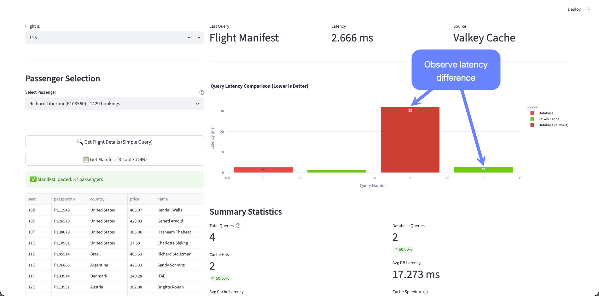

9. Click twice on the button Get Passenger Flights (8-Table JOIN)

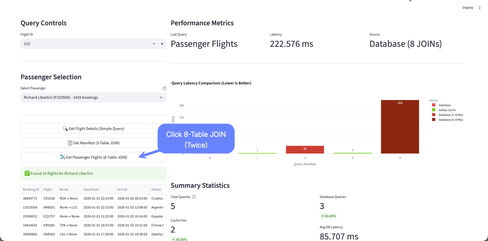

10. Observe the latency difference between running a semi-complex query with the RDBMS 222.575ms vs simple Key/Value access on Valkey Cache 1.77ms.

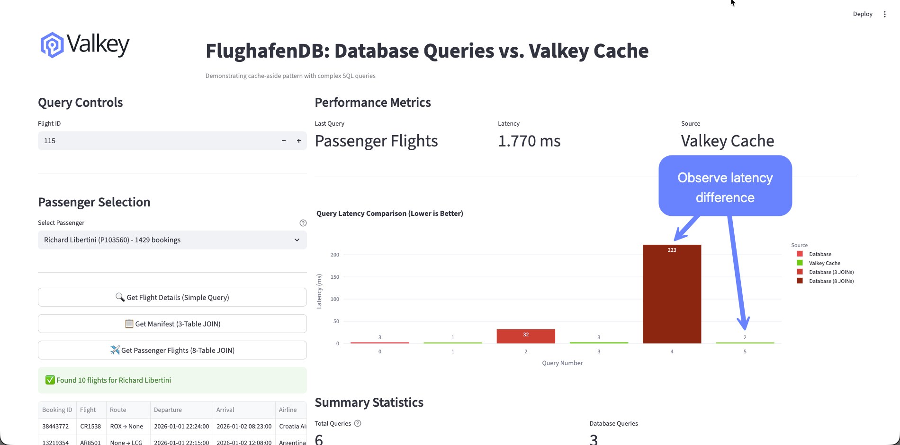

11. Scroll down to see a Summary of the Caching benefits, we had a 50% cache hit and a 46.6x performance improvement

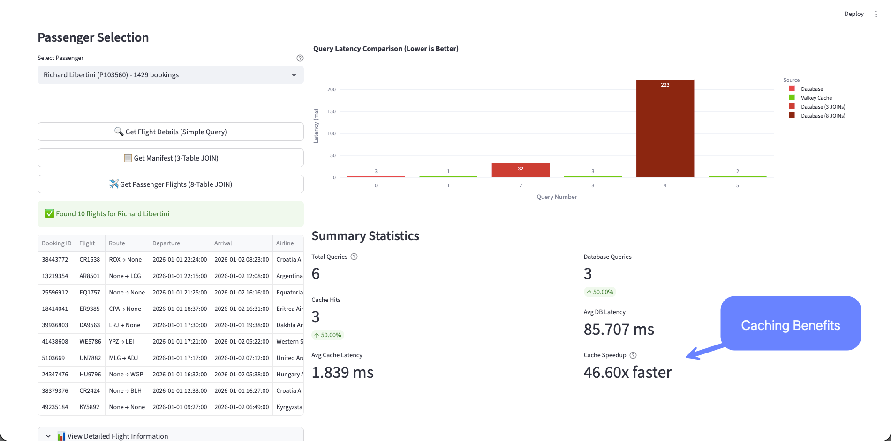

12. Click multiple times on the 3 buttons randomly and the responses should come from the Valkey Cache with consistent responses in single digit milliseconds.

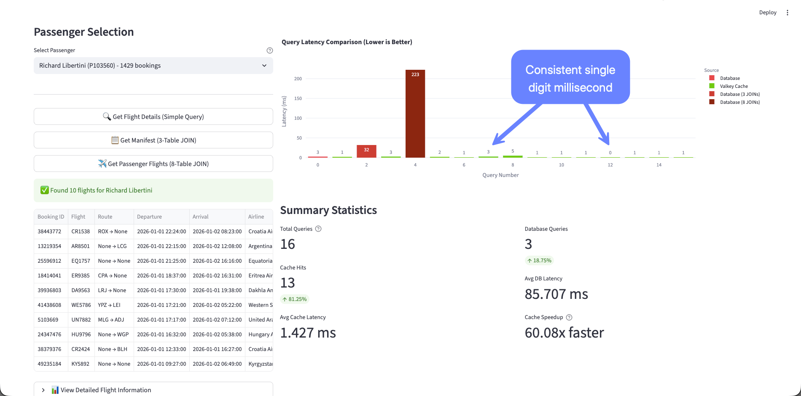

## Key Takeaways

- Caching can dramatically reduce response times
- Visual metrics help understand performance improvements
- User experience is significantly enhanced with proper caching
