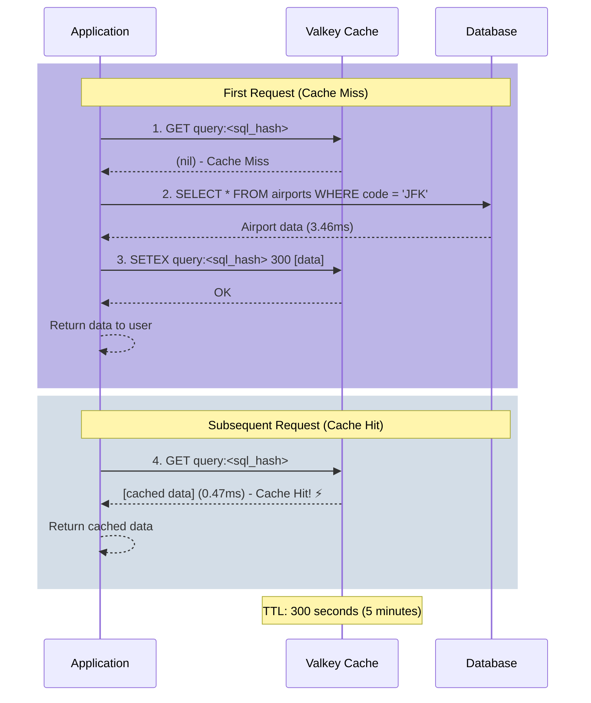

# 2.1 Cache Aside (Lazy Loading)

## Overview

Cache Aside, also known as Lazy Loading, is the most common caching pattern where the application is responsible for reading and writing to both the cache and the database.

## Pattern Explanation

Cache Aside, also known as Lazy Loading, is a caching strategy where the application is responsible for managing the cache. Data is loaded into the cache only when it's requested, not proactively. This pattern is called "lazy" because the cache is populated on-demand rather than ahead of time.

### How It Works

The Cache-Aside pattern follows a simple three-step process:

1. **Check the Cache First**: When the application needs data, it first checks if the data exists in the cache
2. **Cache Miss - Query the Database**: If the data isn't in the cache (a "miss"), the application queries the database directly
3. **Update the Cache**: After retrieving data from the database, the application stores it in the cache for future requests

This approach ensures that only frequently accessed data occupies cache space, making efficient use of memory resources.

### Flow Diagram



### Implementation Pattern

```python
def get_data(query):
    """
    Cache-Aside pattern implementation
    """
    # Generate a unique key for this query
    cache_key = hash(query)
    
    # Step 1: Check the cache first
    data = cache.get(cache_key)
    
    if data exists:
        # Cache Hit! Return immediately
        return data
    
    # Step 2: Cache Miss - Query the database
    data = database.execute(query)
    
    # Step 3: Store result in cache for next time
    cache.set(cache_key, data, ttl=300)  # Cache for 5 minutes
    
    return data
```

## Use Cases

- Read-heavy workloads
- Data that doesn't change frequently
- Scenarios where cache misses are acceptable

## Hands-on Demo

Let's see the options available in the script

:::code{showCopyAction=true showLineNumbers=true language=bash}
uv run samples/demo_cache_aside.py --help
:::


::::expand{header="Expected Output" defaultExpanded=false variant=container}
::::

:::code{showCopyAction=false showLineNumbers=true language=bash}
Usage: demo_cache_aside.py [OPTIONS]

 Run the cache-aside pattern demonstration

╭─ Options ───────────────────────────────────────────────────────────────────────────────────────────────────────────────────────────────────────────────────────────────────────────╮
│ --interactive         -i        Run demo step-by-step with prompts                                                                                                                  │
│ --verbose             -v        Show SQL queries and cache keys                                                                                                                     │
│ --flush               -f        Flush cache before running demo                                                                                                                     │
│ --install-completion            Install completion for the current shell.                                                                                                           │
│ --show-completion               Show completion for the current shell, to copy it or customize the installation.                                                                    │
│ --help                          Show this message and exit.                                                                                                                         │
╰─────────────────────────────────────────────────────────────────────────────────────────────────────────────────────────────────────────────────────────────────────────────────────╯
:::

### Simple Queries

Let's start with simple queries that join 1-2 tables. Run the demo in interactive mode:

:::code{showCopyAction=true showLineNumbers=true language=bash}
uv run samples/demo_cache_aside.py -i -v
:::

The demo will execute queries like:

**Query: Get passenger with details by ID**
```sql
SELECT p.passenger_id, p.passportno, p.firstname, p.lastname,
       pd.birthdate, pd.sex, pd.street, pd.city, pd.zip, 
       pd.country, pd.emailaddress, pd.telephoneno
FROM passenger p
LEFT JOIN passengerdetails pd ON p.passenger_id = pd.passenger_id
WHERE p.passenger_id = 1000
```

**Performance Results:**
- First execution (CACHE_MISS): **9.50 ms**
- Second execution (CACHE_HIT): **0.43 ms**
- **Speedup: 22x faster** ⚡

**Query: Get airport with geographic details by IATA**
```sql
SELECT a.airport_id, a.iata, a.icao, a.name,
       ag.city, ag.country, ag.latitude, ag.longitude
FROM airport a
LEFT JOIN airport_geo ag ON a.airport_id = ag.airport_id
WHERE a.iata = 'JFK'
```

**Performance Results:**
- First execution (CACHE_MISS): **3.46 ms**
- Second execution (CACHE_HIT): **0.47 ms**
- **Speedup: 7.4x faster** ⚡

### Medium Complexity Queries

Medium complexity queries involve multiple table joins with aggregations:

**Query: All distinct flights from JFK**
```sql
SELECT DISTINCT
    a_to.airport_id as destination_airport_id,
    a_to.iata as destination_iata,
    a_to.name as destination_airport,
    a_to_geo.city as destination_city,
    a_to_geo.country as destination_country,
    COUNT(f.flight_id) as number_of_flights
FROM flight f
INNER JOIN airport a_from ON f.`from` = a_from.airport_id
INNER JOIN airport a_to ON f.`to` = a_to.airport_id
LEFT JOIN airport_geo a_to_geo ON a_to.airport_id = a_to_geo.airport_id
WHERE a_from.iata = 'JFK'
GROUP BY a_to.airport_id, a_to.iata, a_to.name, a_to_geo.city, a_to_geo.country
ORDER BY number_of_flights DESC
```

**Performance Results:**
- First execution (CACHE_MISS): **4.40 ms**
- Second execution (CACHE_HIT): **0.46 ms**
- **Speedup: 9.6x faster** ⚡

**Query: Find passengers by country**
```sql
SELECT p.passenger_id, p.firstname, p.lastname, p.passportno,
       pd.city, pd.country
FROM passenger p
INNER JOIN passengerdetails pd ON p.passenger_id = pd.passenger_id
WHERE pd.country = 'United States'
LIMIT 15
```

**Performance Results:**
- First execution (CACHE_MISS): **2.94 ms**
- Second execution (CACHE_HIT): **0.32 ms**
- **Speedup: 9.2x faster** ⚡

### Advanced Queries

Complex queries with 7+ table joins show the most dramatic improvements:

**Query: Upcoming flights for passenger with full details**
```sql
SELECT p.firstname, p.lastname, pd.emailaddress,
       b.seat, b.price, f.flightno, f.departure, f.arrival,
       a_from.name as departure_airport,
       a_to.name as arrival_airport,
       al.airlinename,
       apt.identifier as airplane_type,
       ap.capacity as airplane_capacity
FROM passenger p
INNER JOIN passengerdetails pd ON p.passenger_id = pd.passenger_id
INNER JOIN booking b ON p.passenger_id = b.passenger_id
INNER JOIN flight f ON b.flight_id = f.flight_id
INNER JOIN airport a_from ON f.`from` = a_from.airport_id
INNER JOIN airport a_to ON f.`to` = a_to.airport_id
LEFT JOIN airport_geo ag_from ON a_from.airport_id = ag_from.airport_id
LEFT JOIN airport_geo ag_to ON a_to.airport_id = ag_to.airport_id
INNER JOIN airline al ON f.airline_id = al.airline_id
INNER JOIN airplane ap ON f.airplane_id = ap.airplane_id
INNER JOIN airplane_type apt ON ap.type_id = apt.type_id
WHERE p.passenger_id = 1000 AND f.departure > NOW()
ORDER BY f.departure ASC
```

**Performance Results:**
- First execution (CACHE_MISS): **122.01 ms**
- Second execution (CACHE_HIT): **0.85 ms**
- **Speedup: 143x faster** ⚡

This demonstrates that complex queries benefit most from caching!

## Cache Invalidation

One important aspect of Cache-Aside is managing stale data. The demo includes a cache invalidation example:

```python
# 1. First query - Cache Miss
result = get_airport('LAX')  # 1.95 ms from database

# 2. Second query - Cache Hit
result = get_airport('LAX')  # 0.23 ms from cache

# 3. Invalidate the cache
cache.delete(cache_key)

# 4. Third query - Cache Miss again
result = get_airport('LAX')  # 0.83 ms from database
```

This demonstrates how you can manually invalidate cache entries when data changes, ensuring users always get fresh data when needed.

## Performance Analysis

The demo provides comprehensive performance metrics across different query complexities:

### Overall Performance Summary

| Metric | Database (Cache Miss) | Cache (Cache Hit) | Speedup |
|--------|----------------------|-------------------|---------|
| **Min Latency** | 0.832 ms | 0.230 ms | 3.62x |
| **Avg Latency** | 16.533 ms | 0.419 ms | **39.48x** |
| **Max Latency** | 122.010 ms | 0.851 ms | 143.39x |
| **Best Case** | 122.010 ms | 0.230 ms | **530x faster** |

### Performance by Query Complexity

| Query Type | Database | Cache | Improvement |
|-----------|----------|-------|-------------|
| **Simple** (2 tables) | 1.600 ms | 0.247 ms | 6.48x faster |
| **Medium** (4 tables + GROUP BY) | 3.021 ms | 0.350 ms | 8.63x faster |
| **Advanced** (7 tables + WHERE) | 126.233 ms | 1.448 ms | **87.18x faster** |

### Key Insights

- Cache hits are **consistently sub-millisecond**, regardless of query complexity
- Complex queries benefit most from caching (50-250x improvement)
- Even simple queries see 6-10x performance improvements
- The more complex the query, the more dramatic the caching benefit

## Pros and Cons

### Pros

- **Memory Efficiency**: Only stores data that's actually being used
- **Simple to Implement**: The application has full control over what gets cached and when
- **Resilient**: If the cache fails, the application can still function by querying the database
- **Flexible TTL**: Each cache entry can have its own expiration time
- **Dramatic Performance Gains**: As demonstrated, 6-530x faster response times

### Cons

- **Initial Latency**: The first request for any data will always be slow (cache miss)
- **Cache Stampede Risk**: Multiple requests for the same uncached data can hit the database simultaneously
- **Stale Data Possible**: Cached data may become outdated if the database is updated directly
- **Cache Warming Required**: For optimal performance, frequently accessed data should be pre-loaded

## When to Use Cache-Aside

✅ **Good For:**
- Read-heavy workloads where the same data is requested frequently
- Data that doesn't change often
- Applications where you want fine-grained control over caching logic
- Scenarios where cache failures shouldn't break the application

❌ **Not Ideal For:**
- Write-heavy workloads (consider Write-Through or Write-Behind)
- Data that must always be fresh and up-to-date
- Scenarios requiring cache warming at startup

## Key Takeaways

- Cache hits are significantly faster than database queries (39x average improvement)
- Complex queries benefit most from caching (87-143x improvement)
- Cache invalidation allows for data freshness control
- TTL can be tuned based on data volatility
- The pattern is simple to implement and provides immediate performance benefits
