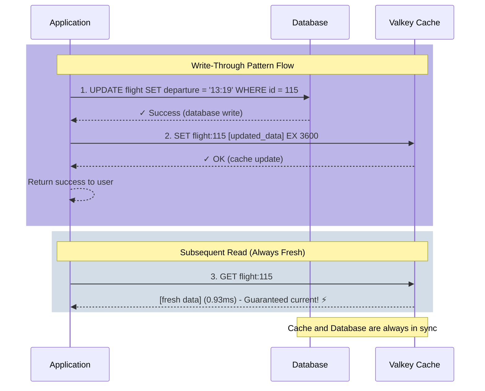

# 2.2 Write Through

## Overview

Write Through is a caching pattern where data is written to the cache and the database simultaneously, ensuring data consistency.

## Pattern Explanation

Write-Through is a caching strategy that prioritizes data consistency. When data is written or updated, the application writes to both the cache and the database simultaneously (or sequentially). This ensures that the cache and database are always synchronized, eliminating the risk of serving stale data.

### How It Works

The Write-Through pattern follows a synchronized write process:

1. **Application Initiates Write**: When data needs to be created or updated, the application starts the write operation
2. **Write to Database First**: The data is written to the database (the source of truth)
3. **Update Cache Immediately**: After the database write succeeds, the cache is updated with the same data
4. **Confirm Success**: Only after both writes complete successfully does the operation return success

This approach guarantees that reads will always return the most recent data, as the cache is kept in sync with the database.

### Flow Diagram



### Implementation Pattern

```python
def update_data(id, new_value):
    """
    Write-Through pattern implementation
    """
    try:
        # Step 1: Write to database first (source of truth)
        database.update(id, new_value)
        
        # Step 2: Immediately update the cache
        cache_key = f"data:{id}"
        cache.set(cache_key, new_value, ttl=3600)
        
        return success
        
    except DatabaseError:
        # If database fails, don't update cache
        return error
    
    except CacheError:
        # Database succeeded but cache failed
        # Data is still consistent (database is source of truth)
        # Cache will be populated on next read (cache-aside)
        return success_with_warning
```

## Use Cases

- Data that needs to be synchronized between cache and RDBMS
- Write-heavy workloads requiring consistency
- Applications where data freshness is critical

## Hands-on Demo

Let's see the options available in the script:

:::code{showCopyAction=true showLineNumbers=true language=bash}
uv run samples/demo_write_through_cache.py --help
:::

::::expand{header="Expected Output" defaultExpanded=false variant=container}

:::code{showCopyAction=false showLineNumbers=true language=bash}
Usage: demo_write_through_cache.py [OPTIONS]

 Run the write-through cache pattern demonstration

╭─ Options ───────────────────────────────────────────────────────────────────────────────────────────────────────────────────────────────────────────────────────────────────────────╮
│ --flight-id           -f      INTEGER  Flight ID to use for demonstration [default: 115]                                                                                            │
│ --interactive         -i               Run demo step-by-step with prompts                                                                                                           │
│ --verbose             -v               Show detailed information and SQL queries                                                                                                    │
│ --flush                                Flush cache before running demo                                                                                                              │
│ --install-completion                   Install completion for the current shell.                                                                                                    │
│ --show-completion                      Show completion for the current shell, to copy it or customize the installation.                                                             │
│ --help                                 Show this message and exit.                                                                                                                  │
╰─────────────────────────────────────────────────────────────────────────────────────────────────────────────────────────────────────────────────────────────────────────────────────╯
:::

::::

Run the demo in interactive mode with verbose output:

:::code{showCopyAction=true showLineNumbers=true language=bash}
uv run samples/demo_write_through_cache.py -i -v --flush
:::

### Step 1: Initial Read - Cache-Aside Pattern

The demo starts by reading flight data for the first time, demonstrating a cache miss:

```sql
SELECT f.flight_id, f.flightno, f.departure, f.arrival,
       f.airline_id, f.airplane_id,
       dep.iata as from_airport,
       arr.iata as to_airport,
       al.airlinename
FROM flight f
JOIN airport dep ON f.from = dep.airport_id
JOIN airport arr ON f.to = arr.airport_id
JOIN airline al ON f.airline_id = al.airline_id
WHERE f.flight_id = 115
```

**Performance Results:**
- Cache Status: ✗ CACHE_MISS
- Latency: **9.886 ms** (database query)
- Data cached for subsequent reads

**Initial Flight Data:**
```
Flight ID:  115
Flight No:  AM5136
Route:      YPC → XGR
Airline:    American Samoa Airlines
Departure:  2025-10-01T11:19:00
Arrival:    2025-10-01T15:03:00
```

### Step 2: Second Read - Cache Hit

Reading the same flight data again demonstrates cache performance:

**Performance Results:**
- Cache Status: ✓ CACHE_HIT
- Latency: **0.687 ms**
- **Speedup: 14.4x faster** than database query ⚡

| Source | Latency | Speedup |
|--------|---------|---------|
| Database (MISS) | 9.886 ms | 1.0x |
| Cache (HIT) | 0.687 ms | **14.4x** |

### Step 3: Update Flight Times - Write-Through Pattern

The demo simulates a flight delay by adding 2 hours to departure and arrival times:

**Flight Time Update:**
| | Old Time | New Time |
|-----------|---------------------|---------------------|
| Departure | 2025-10-01 11:19:00 | 2025-10-01 13:19:00 |
| Arrival | 2025-10-01 15:03:00 | 2025-10-01 17:03:00 |

**Write-Through Process:**

The update executes three SQL queries:

1. **SELECT** - Fetch current flight data
2. **UPDATE** - Update flight times in database
3. **INSERT** - Log the change in flight_log table (audit trail)

After the database updates, the cache is immediately updated with the new data, ensuring consistency.

### Step 4: Verify Data Consistency

The demo verifies that database and cache contain identical data:

**Consistency Verification:**
| Field | Database | Cache | Match |
|-----------|---------------------|---------------------|-------|
| flight_id | 115 | 115 | ✓ |
| flightno | AM5136 | AM5136 | ✓ |
| departure | 2025-10-01T13:19:00 | 2025-10-01T13:19:00 | ✓ |
| arrival | 2025-10-01T17:03:00 | 2025-10-01T17:03:00 | ✓ |

✓ **Data is CONSISTENT between database and cache**

### Step 5: Read Updated Flight Data

Reading the updated flight data shows the cache contains the latest information:

**Performance Results:**
- Cache Status: ✓ CACHE_HIT
- Latency: **0.930 ms**
- Data reflects the 2-hour delay immediately

**Updated Flight Data (from cache):**
```
Flight ID:  115
Flight No:  AM5136
Route:      YPC → XGR
Airline:    American Samoa Airlines
Departure:  2025-10-01T13:19:00  ← Updated
Arrival:    2025-10-01T17:03:00    ← Updated
```

### Step 6: Restore Original Times

The demo restores the original flight times to avoid permanently modifying the database, demonstrating another write-through operation that maintains consistency.


## Performance Analysis

### Read Performance

Write-Through maintains the same excellent read performance as Cache-Aside:

- **Cache Hit Latency**: 0.687 - 0.930 ms
- **Database Query Latency**: 9.886 ms
- **Read Speedup**: 14.4x faster with cache

### Write Performance Trade-off

Write-Through adds overhead to write operations because it must update both systems:

1. **Database Write**: Execute UPDATE query
2. **Cache Update**: Update cache with new data
3. **Audit Logging**: Insert change record (optional)

However, this ensures:
- **Zero stale data** - cache is always current
- **Immediate consistency** - no synchronization delay
- **Predictable behavior** - all writes update both layers

### Pattern Comparison

| Aspect | Cache-Aside | Write-Through |
|--------|-------------|---------------|
| **Read Performance** | Fast (cached) | Fast (cached) |
| **Write Performance** | Fast (DB only) | Slower (DB + Cache) |
| **Consistency** | May have stale data | Always consistent |
| **Use Case** | Read-heavy workloads | Write-heavy with consistency needs |

## Pros and Cons

### Pros

- **Strong Consistency**: Cache and database are always synchronized
- **No Stale Data**: Reads always return the most up-to-date information
- **Predictable Behavior**: Every write updates both storage layers
- **Simplified Read Logic**: No need to check if cache is fresh
- **Audit Trail**: Changes can be logged for compliance (as demonstrated)
- **Fast Reads**: Maintains cache-aside read performance (14.4x faster)

### Cons

- **Write Latency**: Every write operation is slower because it must update two systems
- **Write Amplification**: All writes hit both cache and database, even for rarely-read data
- **Complexity**: Requires handling failures in either the cache or database
- **Cache Pollution**: Infrequently accessed data still occupies cache space

## When to Use Write-Through

✅ **Good For:**
- Applications requiring strong data consistency
- Financial transactions or inventory systems
- User profile updates that must be immediately visible
- Scenarios where stale data is unacceptable
- Write-heavy workloads where data is frequently updated and read
- Systems requiring audit trails for compliance

❌ **Not Ideal For:**
- High-throughput write operations where latency matters
- Data that's written but rarely read
- Applications that can tolerate eventual consistency
- Scenarios where write performance is critical

## Key Takeaways

- **Consistency**: Database and cache are always in sync
- **Write-Through**: Updates go to both database and cache simultaneously
- **Audit Trail**: All changes can be logged in a separate table for compliance
- **Cache-Aside Reads**: Reads still benefit from cache performance (14.4x faster)
- **Data Integrity**: No stale data in cache after updates
- **Trade-off**: Slower writes in exchange for guaranteed consistency
