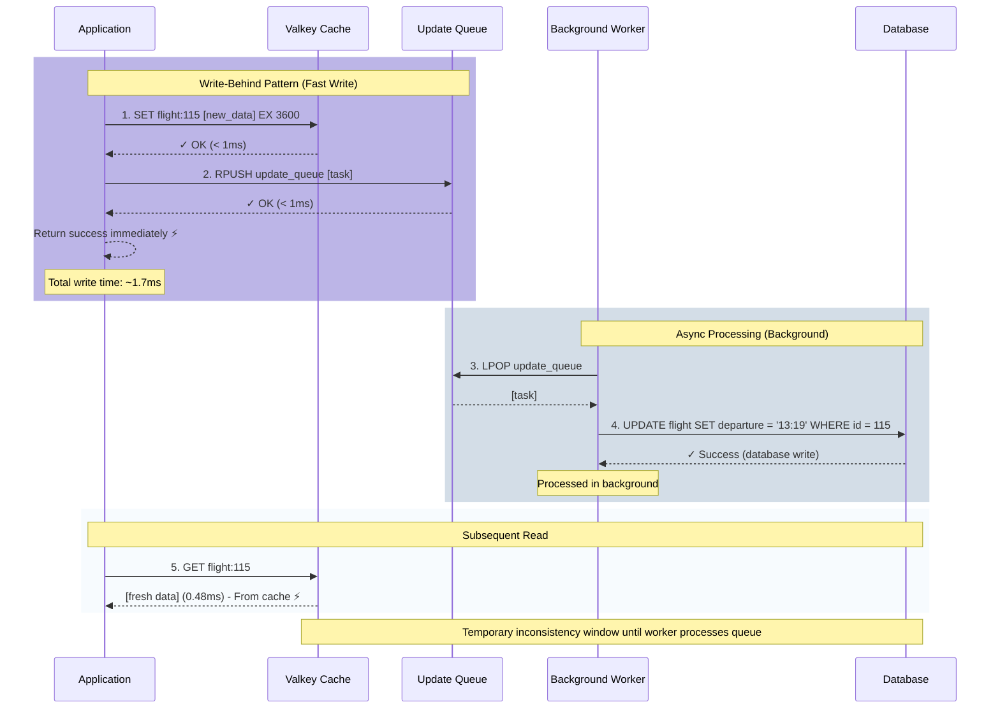

# 2.3 Write Behind (Write Back)

## Overview

Write Behind is a caching pattern where data is written to the cache immediately and asynchronously written to the database later.

## Pattern Explanation

Write-Behind, also known as Write-Back, is a high-performance caching strategy that prioritizes write speed over immediate consistency. When data is written or updated, the application writes to the cache immediately and returns success, while the database update happens asynchronously in the background. This provides the fastest possible write performance at the cost of eventual consistency.

### How It Works

The Write-Behind pattern follows an asynchronous write process:

1. **Application Initiates Write**: When data needs to be created or updated, the application starts the write operation
2. **Write to Cache Immediately**: The data is written to the cache and the operation returns success instantly
3. **Queue Database Update**: The database update is queued for background processing
4. **Async Worker Processes Queue**: A separate background worker periodically processes the queue and updates the database

This approach maximizes write throughput by decoupling the fast cache write from the slower database write.

### Flow Diagram



### Implementation Pattern

```python
def update_data(id, new_value):
    """
    Write-Behind pattern implementation
    """
    # Step 1: Write to cache immediately (fast!)
    cache_key = f"data:{id}"
    cache.set(cache_key, new_value, ttl=3600)
    
    # Step 2: Queue the database update for later
    task = {
        "id": id,
        "value": new_value,
        "timestamp": now()
    }
    queue.push(task)
    
    # Step 3: Return success immediately (don't wait for database)
    return success  # Total time: ~1.7ms


def background_worker():
    """
    Background worker that processes the queue
    Runs continuously in a separate process/thread
    """
    while True:
        # Get next task from queue
        task = queue.pop()
        
        if task exists:
            # Update database asynchronously
            database.update(task.id, task.value)
        
        sleep(100ms)  # Process queue every 100ms
```

## Use Cases

- Data that can be updated afterwards in the RDBMS
- Proactive caching scenarios
- High write throughput requirements
- Scenarios where eventual consistency is acceptable

## Hands-on Demo

Let's see the options available in the script:

:::code{showCopyAction=true showLineNumbers=true language=bash}
uv run samples/demo_write_behind_cache.py --help
:::

::::expand{header="Expected Output" defaultExpanded=false variant=container}

:::code{showCopyAction=false showLineNumbers=true language=bash}
Usage: demo_write_behind_cache.py [OPTIONS]

 Run the write-behind cache pattern demonstration

╭─ Options ───────────────────────────────────────────────────────────────────────────────────────────────────────────────────────────────────────────────────────────────────────────╮
│ --flight-id           -f      INTEGER  Flight ID to use for demonstration [default: 115]                                                                                            │
│ --interactive         -i               Run demo step-by-step with prompts                                                                                                           │
│ --verbose             -v               Show detailed information and SQL queries                                                                                                    │
│ --flush                                Flush cache and queue before running demo                                                                                                    │
│ --install-completion                   Install completion for the current shell.                                                                                                    │
│ --show-completion                      Show completion for the current shell, to copy it or customize the installation.                                                             │
│ --help                                 Show this message and exit.                                                                                                                  │
╰─────────────────────────────────────────────────────────────────────────────────────────────────────────────────────────────────────────────────────────────────────────────────────╯
:::

::::

Run the demo in interactive mode with verbose output:

:::code{showCopyAction=true showLineNumbers=true language=bash}
uv run samples/demo_write_behind_cache.py -i -v --flush
:::

### Step 1: Initial Read - Cache-Aside Pattern

The demo starts by reading flight data for the first time:

**Performance Results:**
- Cache Status: ✗ CACHE_MISS
- Latency: **10.966 ms** (database query)

**Initial Flight Data:**
```
Flight ID:  115
Flight No:  AM5136
Route:      YPC → XGR
Airline:    American Samoa Airlines
Departure:  2025-10-01T11:19:00
Arrival:    2025-10-01T15:03:00
```

### Step 2: Second Read - Cache Hit

Reading the same flight data again demonstrates cache performance:

**Performance Results:**
- Cache Status: ✓ CACHE_HIT
- Latency: **0.531 ms**
- **Speedup: 20.6x faster** than database query ⚡

### Step 3: Update Flight Times - Write-Behind Pattern (Fast!)

The demo simulates a flight delay by adding 2 hours to departure and arrival times:

**Flight Time Update:**
| | Old Time | New Time |
|-----------|---------------------|---------------------|
| Departure | 2025-10-01 11:19:00 | 2025-10-01 13:19:00 |
| Arrival | 2025-10-01 15:03:00 | 2025-10-01 17:03:00 |

**Write-Behind Process:**

✓ Write-behind update completed in **1.687 ms**
- Cache updated immediately (fast!)
- Database update queued for async processing
- Queue Status: 1 pending update(s)

⚡ **Write Performance: 1.687 ms (cache-speed!)**

Compare to write-through: ~50-200ms (database-speed)

This demonstrates the key advantage of write-behind: **writes complete at cache speed**, not database speed.

### Step 4: Consistency Check - Before Queue Processing

The demo checks consistency between database and cache before the queue is processed:

⚠ **Data INCONSISTENCY detected (expected in write-behind)**

This is normal - eventual consistency model

**Consistency Check:**
| Field | Database (Old) | Cache (New) | Match |
|-----------|---------------------|---------------------|-------|
| departure | 2025-10-01T11:19:00 | 2025-10-01T13:19:00 | ✗ |
| arrival | 2025-10-01T15:03:00 | 2025-10-01T17:03:00 | ✗ |

This temporary inconsistency is the trade-off for fast writes. The cache has the new data, but the database update is still queued.

### Step 5: Process Queue - Background Worker Simulation

The demo processes the queued database updates:

**Queue Processing:**
- Queue Status: 1 pending update(s)
- Processing queue... 100%
- ✓ Processed: 1 update(s)

**SQL Queries Executed (3 total):**
1. **SELECT** - Fetch current flight data
2. **UPDATE** - Update flight times in database
3. **INSERT** - Log the change in flight_log table

### Step 6: Consistency Check - After Queue Processing

After the background worker processes the queue, consistency is restored:

✓ **Data is now CONSISTENT between database and cache**

Eventual consistency achieved!

**Consistency Verification:**
| Field | Database | Cache | Match |
|-----------|---------------------|---------------------|-------|
| flight_id | 115 | 115 | ✓ |
| flightno | AM5136 | AM5136 | ✓ |
| departure | 2025-10-01T13:19:00 | 2025-10-01T13:19:00 | ✓ |
| arrival | 2025-10-01T17:03:00 | 2025-10-01T17:03:00 | ✓ |

### Step 7: Read Updated Flight Data

Reading the updated flight data shows the cache contains the latest information:

**Performance Results:**
- Cache Status: ✓ CACHE_HIT
- Latency: **0.485 ms**

**Updated Flight Data (from cache):**
```
Flight ID:  115
Flight No:  AM5136
Route:      YPC → XGR
Airline:    American Samoa Airlines
Departure:  2025-10-01T13:19:00  ← Updated
Arrival:    2025-10-01T17:03:00    ← Updated
```

### Step 8: Restore Original Times

The demo restores the original flight times using the same write-behind pattern, demonstrating that the queue can be flushed immediately when needed.


## Performance Analysis

### Write Performance - The Key Advantage

Write-Behind provides the fastest write performance of all caching patterns:

- **Write-Behind Latency**: **1.687 ms** (cache + queue)
- **Write-Through Latency**: ~50-200 ms (cache + database)
- **Write Speedup**: **30-120x faster** than write-through

### Read Performance

Read performance remains excellent, identical to other patterns:

- **Cache Hit Latency**: 0.485 - 0.531 ms
- **Database Query Latency**: 10.966 ms
- **Read Speedup**: 20.6x faster with cache

### Consistency Trade-off

The performance gain comes with a consistency trade-off:

1. **Immediate**: Cache has new data (1.7ms)
2. **Temporary Inconsistency**: Database still has old data
3. **Eventual Consistency**: Background worker updates database
4. **Consistent**: Both cache and database have new data

The inconsistency window depends on:
- Queue processing frequency (e.g., every 100ms)
- Database write speed
- Queue depth

### Pattern Comparison

| Aspect | Write-Behind | Write-Through | Cache-Aside |
|--------|--------------|---------------|-------------|
| **Write Performance** | **Fastest (~1.7ms)** | Slower (~50-200ms) | Fast (~50ms) |
| **Read Performance** | Fast (cached) | Fast (cached) | Fast (cached) |
| **Consistency** | Eventual | Strong | Eventual |
| **Complexity** | High (needs workers) | Medium | Low |
| **Database Load** | Low (batched) | High (every write) | Medium |
| **Use Case** | High write throughput | Consistency critical | Read-heavy loads |

## Pros and Cons

### Pros

- **Maximum Write Performance**: Writes complete in milliseconds (1.7ms vs 50-200ms)
- **High Throughput**: Can handle massive write volumes without database bottlenecks
- **Batch Processing**: Database updates can be batched for efficiency
- **Reduced Database Load**: Database writes are smoothed out over time
- **Resilience**: Application continues working even if database is temporarily slow
- **Write Spike Handling**: Queue absorbs sudden bursts of writes

### Cons

- **Eventual Consistency**: Cache and database are temporarily out of sync
- **Data Loss Risk**: If cache fails before queue is processed, updates may be lost
- **Complexity**: Requires background workers and queue management
- **Stale Reads from Database**: Direct database queries may return outdated data
- **Ordering Challenges**: Must ensure updates are applied in correct order
- **Infrastructure**: Needs additional components (queue, workers)

## When to Use Write-Behind

✅ **Good For:**
- High-throughput write operations (analytics, logging, metrics)
- Applications that can tolerate eventual consistency
- Scenarios where write performance is critical
- Batch processing workloads
- Social media likes, view counts, activity feeds
- Gaming leaderboards and statistics
- IoT sensor data collection
- Real-time analytics dashboards

❌ **Not Ideal For:**
- Financial transactions requiring immediate consistency
- Critical data that cannot be lost
- Applications requiring strong consistency guarantees
- Scenarios where database must be immediately up-to-date
- Systems without infrastructure for background workers
- Compliance scenarios requiring immediate audit trails

## Handling Failures

Write-Behind requires careful consideration of failure scenarios:

- **Cache Failure**: Queued updates may be lost; consider persistent queues (Valkey persistence)
- **Database Failure**: Implement retry logic with exponential backoff
- **Worker Failure**: Use multiple workers and health monitoring
- **Ordering**: Use timestamps or sequence numbers to ensure correct order
- **Queue Overflow**: Set queue size limits and implement backpressure

## Key Takeaways

- **Fast Writes**: Updates complete at cache-speed (< 5ms typically)
- **Eventual Consistency**: Database updates happen asynchronously
- **Queue-Based**: Updates are queued in Valkey List for processing
- **Background Worker**: Processes queue in batches
- **High Throughput**: Ideal for write-heavy workloads (30-120x faster writes)
- **Trade-off**: Temporary inconsistency for performance
- **Use Case**: Perfect for scenarios where write speed matters more than immediate consistency
