# 3.1 Weather API Caching

## Overview

Learn to use Valkey to cache external API responses, reducing both latency and costs. This demo showcases the cache-aside pattern with lazy loading for weather data from OpenWeatherMap API, demonstrating how caching can dramatically improve performance and reduce API costs.

## Objectives

- Cache external API responses effectively using cache-aside pattern
- Reduce API call costs by up to 99%
- Improve response times from 400-600ms to sub-millisecond
- Handle multiple cities and countries efficiently
- Understand TTL configuration for data freshness

## Use Case

Weather data from external APIs is perfect for caching because:
- **Weather doesn't change frequently**: Data remains valid for 15-60 minutes
- **API calls have rate limits and costs**: Most weather APIs charge per request
- **Users often query the same locations**: Popular cities get repeated requests
- **High latency**: External API calls typically take 300-600ms
- **Reliability concerns**: External services may be slow or temporarily unavailable

## The Problem

External API calls introduce several challenges:

- **High Latency**: Network round-trips to third-party services typically take 300-600ms per request
- **API Costs**: Many APIs charge per request, making frequent calls expensive
- **Rate Limits**: APIs often limit the number of requests per time period
- **Reliability**: External services may be slow or temporarily unavailable

## The Solution: Cache-Aside Pattern

The implementation uses the cache-aside pattern to optimize API calls:

1. **Check Cache First**: Before calling the API, check if the data exists in cache
2. **Cache Miss**: If not cached, call the external API
3. **Store in Cache**: Save the API response with TTL (15 minutes default)
4. **Cache Hit**: Subsequent requests return data from cache instantly

### Flow Diagram

```mermaid
sequenceDiagram
    participant App as Application
    participant Cache as Valkey Cache
    participant API as OpenWeatherMap API
    
    rect rgb(255, 243, 205)
    Note over App,API: First Request - Cache Miss
    App->>Cache: GET weather:in:400001
    Cache-->>App: (nil) - Cache Miss
    App->>API: GET /weather?zip=400001,in
    Note over API: External API Call<br/>~640ms
    API-->>App: Weather Data (JSON)
    App->>Cache: SETEX weather:in:400001 900 [data]
    Cache-->>App: ✓ OK
    App-->>App: Return weather data
    Note over App: Total: ~640ms
    end
    
    rect rgb(212, 237, 218)
    Note over App,API: Second Request - Cache Hit
    App->>Cache: GET weather:in:400001
    Cache-->>App: [cached data] ⚡
    App-->>App: Return weather data
    Note over App: Total: ~1ms (640x faster!)
    end
```



## Hands-on Demo

Let's see the options available in the script:

:::code{showCopyAction=true showLineNumbers=true language=bash}
uv run samples/demo_weather_api_cache.py --help
:::

::::expand{header="Expected Output" defaultExpanded=false variant=container}

:::code{showCopyAction=false showLineNumbers=true language=bash}
Usage: demo_weather_api_cache.py [OPTIONS]

 Run the weather API cache-aside pattern demonstration

╭─ Options ────────────────────────────────────────────────────────────────────────────────────────────────────────────────────────────────────────────────────────────────────────╮
│ --ttl                 -t      INTEGER  Cache TTL in minutes (15, 30, or 60) [default: 15]                                                                                        │
│ --cities              -c      INTEGER  Number of random cities to test (1-95) [default: 10]                                                                                      │
│ --interactive         -i               Run demo step-by-step with prompts                                                                                                        │
│ --verbose             -v               Show detailed information and cache keys                                                                                                  │
│ --flush               -f               Flush cache before running demo                                                                                                           │
│ --install-completion                   Install completion for the current shell.                                                                                                 │
│ --show-completion                      Show completion for the current shell, to copy it or customize the installation.                                                          │
│ --help                                 Show this message and exit.                                                                                                               │
╰──────────────────────────────────────────────────────────────────────────────────────────────────────────────────────────────────────────────────────────────────────────────────╯
:::

::::

Run the demo in interactive mode with verbose output:

:::code{showCopyAction=true showLineNumbers=true language=bash}
uv run samples/demo_weather_api_cache.py -i -f -v
:::

Run the demo a couple more times without flushing the cache to see performance benefits for previously seen cities:

:::code{showCopyAction=true showLineNumbers=true language=bash}
uv run samples/demo_weather_api_cache.py -i
:::

### Demo Configuration

The demo tests 10 random cities from around the world:

**Selected Cities (Example):**
| # | City | Country | ZIP |
|---|------|---------|-----|
| 1 | Mumbai | 🇮🇳 IN | 400001 |
| 2 | Edinburgh | 🇬🇧 GB | EH1 |
| 3 | Vancouver | 🇨🇦 CA | V6B |
| 4 | Perth | 🇦🇺 AU | 6000 |
| 5 | São Paulo | 🇧🇷 BR | 01310 |
| 6 | Córdoba | 🇦🇷 AR | X5000 |
| 7 | Semarang | 🇮🇩 ID | 50241 |
| 8 | Madrid | 🇪🇸 ES | 28001 |
| 9 | Toronto | 🇨🇦 CA | M5H |
| 10 | Monterrey | 🇲🇽 MX | 64000 |

**Configuration:**
- **Cache TTL**: 15 minutes (900 seconds)
- **Cache Key Format**: `weather:<country>:<zip>`
- **Number of Cities**: 10

### Phase 1: Fetch Without Cache (Baseline)

The demo first fetches weather data directly from the API without caching:

**Sample API Response (Mumbai):**
```json
{
  "coord": {"lon": 72.8777, "lat": 19.076},
  "weather": [
    {
      "id": 500,
      "main": "Rain",
      "description": "light rain",
      "icon": "10d"
    }
  ],
  "main": {
    "temp": 74.1,
    "feels_like": 62.1,
    "temp_min": 72.4,
    "temp_max": 84.4,
    "pressure": 1023,
    "humidity": 67
  },
  "wind": {"speed": 3.3, "deg": 273, "gust": 8.4},
  "name": "Mumbai",
  "cod": 200
}
```

**Performance Results (10 cities):**
- Mumbai: 465.767ms 🌦️
- Edinburgh: 360.689ms ☀️
- Vancouver: 615.124ms 🌦️
- Perth: 395.940ms ☀️
- São Paulo: 439.549ms 🌦️
- Córdoba: 611.646ms 🌦️
- Semarang: 639.258ms 🌦️
- Madrid: 572.894ms 🌦️
- Toronto: 351.061ms 🌦️
- Monterrey: 334.202ms 🌤️

**Total Time: 4.876s** (average 487.6ms per city)

### Phase 2: First Fetch With Cache (Populating)

The second phase fetches the same cities with caching enabled. Since the cache is empty, all requests are cache misses that populate the cache:

**Cache Key Examples:**
- `weather:in:400001` (Mumbai, India)
- `weather:gb:EH1` (Edinburgh, UK)
- `weather:ca:V6B` (Vancouver, Canada)
- `weather:au:6000` (Perth, Australia)

**Performance Results:**
- All 10 cities: **CACHE MISS (populated)**
- Latency range: 279-752ms (similar to direct API calls)
- **Total Time: 5.180s**

**Cache Statistics:**
- Hits: 0
- Misses: 10
- Hit Rate: 0.0%

### Phase 3: Second Fetch With Cache (Using Cache)

The third phase fetches the same cities again. Now all data is in cache:

**Performance Results:**
- Mumbai: **1.004ms** ✓ 🌦️ (was 465ms)
- Edinburgh: **0.566ms** ✓ 🌨️ (was 360ms)
- Vancouver: **0.590ms** ✓ 🌦️ (was 615ms)
- Perth: **0.586ms** ✓ 🌨️ (was 395ms)
- São Paulo: **0.482ms** ✓ 🌤️ (was 439ms)
- Córdoba: **0.435ms** ✓ 🌨️ (was 611ms)
- Semarang: **0.453ms** ✓ 🌤️ (was 639ms)
- Madrid: **0.567ms** ✓ ☀️ (was 572ms)
- Toronto: **0.471ms** ✓ ☀️ (was 351ms)
- Monterrey: **0.473ms** ✓ ☀️ (was 334ms)

**Total Time: 22.926ms** (average 2.3ms per city)

**Cache Statistics:**
- Hits: 10
- Misses: 0
- Hit Rate: **100.0%**

### Running Without Flush

Run the demo again without flushing to see cache hits immediately:

:::code{showCopyAction=true showLineNumbers=true language=bash}
uv run samples/demo_weather_api_cache.py -i
:::

This will show cache hits for any cities that were previously queried within the TTL window.

## Performance Metrics

### Performance Comparison

| Scenario | Time | vs Baseline | Note |
|----------|------|-------------|------|
| **Without cache** 🐌 | 4.876s | 1.0x | Direct API calls |
| **With cache (1st run)** ⚡ | 5.180s | 0.9x | Populating cache |
| **With cache (2nd run)** 🚀 | **22.926ms** | **212.7x** | Using cache |

### Cache Benefits

| Metric | Value |
|--------|-------|
| **Time saved** ⏱️ | 4.853s |
| **Speedup** ⚡ | **212.7x faster** |
| **Efficiency** 📈 | **99.5% reduction** |
| **Avg per city (cached)** 🏙️ | 2.293ms |
| **Avg per city (uncached)** 🏙️ | 487.616ms |

### Latency Reduction

| Scenario | Latency | Speedup |
|----------|---------|---------|
| **Direct API Call** | 400-600ms | 1.0x (baseline) |
| **Cache Hit** | 0.5-1ms | **400-1200x faster** |

### Cost Savings Analysis

With a 15-minute TTL:
- **Without Cache**: 1 API call per request
- **With Cache**: 1 API call per 15 minutes (for the same location)
- **Savings**: Up to 99% reduction in API calls for frequently requested locations

**Example Calculation:**

For a weather app with 1000 users checking weather every 5 minutes:
- **Without Cache**: 1000 users × 12 checks/hour = **12,000 API calls/hour**
- **With Cache (15 min TTL)**: ~4 API calls/hour per location
- **Cost Reduction**: **~99.97% fewer API calls**

### Cache Status

| Property | Value |
|----------|-------|
| **Total entries** 🗄️ | 10 weather records |
| **TTL** ⏰ | 15 minutes (900 seconds) |
| **Hit rate (Run #2)** ✅ | 100.0% |
| **Sample keys** 🔑 | `weather:in:400001`, `weather:gb:EH1`, `weather:au:6000` |

## Cache Key Strategy

The demo uses a structured cache key format:

```
weather:<country_code>:<zip_code>
```

**Examples:**
- `weather:jp:100-0001` (Tokyo, Japan)
- `weather:us:10001` (New York, USA)
- `weather:gb:sw1a` (London, UK)

This format ensures:
- **Uniqueness**: Each location has a unique key
- **Readability**: Easy to understand and debug
- **Pattern Matching**: Can query all weather keys with `weather:*`

## TTL Configuration

The Time-To-Live determines how long data stays cached:

| TTL | Use Case | Trade-off |
|-----|----------|-----------|
| **15 minutes** | Real-time weather apps | More API calls, fresher data |
| **30 minutes** | General weather info | Balanced approach |
| **60 minutes** | Weather trends/history | Fewer API calls, older data |

## Key Takeaways

- **Dramatic Performance Improvement**: 212.7x faster response times with cache hits
- **Cost Reduction**: Up to 99.97% reduction in API calls
- **Cache-Aside Pattern**: Simple and effective for external API caching
- **Configurable TTL**: Balance between data freshness and performance (15-60 minutes)
- **Lazy Loading**: Cache is populated on-demand, not proactively
- **Resilience**: Application continues working even if cache fails (falls back to API)
- **Real-time Data**: Weather includes temperature, conditions, and emoji visualization
- **Structured Keys**: `weather:<country>:<zip>` format ensures uniqueness and readability

## When to Use This Pattern

✅ **Good For:**
- External API calls with high latency (300-600ms+)
- APIs with usage-based pricing
- Data that doesn't change frequently (weather, exchange rates, etc.)
- High-traffic applications with repeated requests
- APIs with rate limits

❌ **Not Ideal For:**
- Data that must be real-time (stock prices, live sports scores)
- APIs with no latency or cost concerns
- Data that changes constantly
- Single-use queries with no repetition
