# 3.2 GenAI Semantic Caching

## Overview

Semantic caching is an intelligent caching strategy that uses vector embeddings and similarity search to identify when a new query is semantically similar to a previously processed query. Unlike traditional caching that requires exact string matches, semantic caching understands the **meaning** of queries and returns cached results for similar requests.

This approach dramatically reduces:
- **Latency**: 45-400x faster than LLM generation (~0.01-0.1s vs 2-10s)
- **LLM Calls**: 55-80% reduction in API calls
- **Token Usage**: 55-80% fewer tokens processed

## Objectives

- Implement semantic caching for NLP to SQL conversion
- Use Valkey Vector Similarity Search (VSS) for finding similar queries
- Understand the three-layer cache architecture
- Measure performance improvements and token savings
- Learn how similarity thresholds affect cache behavior

## The Problem: Traditional Caching Limitations

Traditional caching relies on exact string matches:

```
Query 1: "Show me all passengers on flight 115"
Query 2: "Get passenger list for flight 115"      ❌ Cache MISS (different wording)
Query 3: "Passenger list flight 115"              ❌ Cache MISS (different wording)

Result: 3 expensive LLM calls, 3x latency, 3x tokens
```

## The Solution: Semantic Caching

Semantic caching uses vector embeddings to understand meaning:

```
Query 1: "Show me all passengers on flight 115"   → Generate SQL (20s)
Query 2: "Get passenger list for flight 115"      ✅ Cache HIT (0.79 similarity, 0.1s)
Query 3: "Passenger list flight 115"              ✅ Cache HIT (0.80 similarity, 0.03s)

Result: 1 LLM call, 2 fast cache lookups, 66% token reduction
```

## How It Works

### Three-Layer Cache Architecture

```
Layer 1: Semantic Mapping (Fast Exact Lookup)
┌─────────────────────────────────────────────────┐
│ Key: semantic:prompt:<hash>                     │
│ Value: db:query:<hash2>                         │
│ Purpose: Maps prompt hash to query result       │
│ Lookup: O(1) - instant (~1ms)                   │
└─────────────────────────────────────────────────┘

Layer 2: Query Results (SQL + Metadata)
┌─────────────────────────────────────────────────┐
│ Key: db:query:<hash2>                           │
│ Value: {sql, time_taken, tokens, ...}           │
│ Purpose: Store generated SQL and metadata       │
│ Retrieval: O(1) - instant (~1ms)                │
└─────────────────────────────────────────────────┘

Layer 3: Vector Embeddings (Similarity Search)
┌─────────────────────────────────────────────────┐
│ Key: embedding:prompt:<hash>                    │
│ Fields: prompt, query_key, embedding (384 dims) │
│ Purpose: Enable vector similarity search        │
│ Search: O(log N) with HNSW index (~10-50ms)     │
└─────────────────────────────────────────────────┘
```

### Query Processing Flow

```mermaid
graph TB
    A[User Query] --> B[Generate Hash + Embedding]
    B --> C{Exact Match?}
    C -->|Yes| D[Return Cached Result<br/>~1ms]
    C -->|No| E[Vector Similarity Search]
    E --> F{Similar Query?<br/>similarity ≥ 0.70}
    F -->|Yes| G[Return Cached Result<br/>~10-100ms]
    F -->|No| H[Generate with LLM<br/>~2-20s]
    H --> I[Cache All 3 Layers]
    I --> J[Return New Result]
    
    style D fill:#6bcf7f
    style G fill:#90EE90
    style H fill:#ff6b6b
```



## Key Concepts

### Vector Embeddings

Vector embeddings convert text into high-dimensional numerical arrays that capture semantic meaning:

```
"Show me all passengers on flight 115"
    ↓ Embedding Model (all-MiniLM-L6-v2)
[0.23, -0.45, 0.67, ..., 0.12]  (384 dimensions)

"Get passenger list for flight 115"
    ↓ Embedding Model
[0.21, -0.43, 0.69, ..., 0.15]  (384 dimensions)

Cosine Similarity: 0.79 (similar meaning!)
```

### Similarity Threshold

The threshold determines when queries are "similar enough" to reuse cached results:

- **0.95-1.0**: Very strict - only nearly identical queries
- **0.70-0.90**: Balanced - recommended for most use cases
- **0.50-0.70**: Lenient - accepts more variations
- **Below 0.50**: Too loose - may return incorrect results

In this demo, we use **0.70** as the threshold.

### Cache Hit Types

1. **Exact Hit**: Same query text (hash match) → ~1ms lookup
2. **Semantic Hit**: Similar meaning (vector search) → ~10-100ms lookup
3. **Cache Miss**: No similar query found → ~2-20s LLM generation

## Hands-on Demo

### Demo Script Options

Let's see the options available in the script:

```bash
uv run samples/demo_semantic_cache.py --help
```

Expected Output:

```bash
 Usage: demo_semantic_cache.py [OPTIONS]

 Run the semantic cache pattern demonstration

╭─ Options ────────────────────────────────────────────────────────────────────────────────────────────────────────────────────────────────────────────────────────────────────────╮
│ --interactive         -i               Run in interactive mode for custom queries                                                                                                │
│ --verbose             -v               Show detailed information including embeddings and cache keys                                                                             │
│ --flush               -f               Flush cache before running demo                                                                                                           │
│ --host                        TEXT     Valkey host (default: from VECTOR_HOST env or localhost)                                                                                  │
│ --port                        INTEGER  Valkey port (default: from VECTOR_PORT env or 6379)                                                                                       │
│ --model                       TEXT     Ollama model for SQL generation (default: from OLLAMA_MODEL env or codellama)                                                             │
│ --threshold                   FLOAT    Similarity threshold 0-1 (default: from SIMILARITY_THRESHOLD env or 0.70)                                                                 │
│ --install-completion                   Install completion for the current shell.                                                                                                 │
│ --show-completion                      Show completion for the current shell, to copy it or customize the installation.                                                          │
│ --help                                 Show this message and exit.                                                                                                               │
╰──────────────────────────────────────────────────────────────────────────────────────────────────────────────────────────────────────────────────────────────────────────────────╯
```

### Running the Demo

Run the demo with verbose output and cache flush:

```bash
uv run samples/demo_semantic_cache.py -f -v
```

Flags explained:
- `-f` or `--flush`: Clear cache before running (start fresh)
- `-v` or `--verbose`: Show detailed information including embeddings and cache keys

## Demo Walkthrough

The demo runs 9 queries to demonstrate semantic caching behavior. Let's analyze the key patterns:

### Pattern 1: Flight Passenger Queries

**Query #1: "Flight manifest - all passengers on a specific flight 115"**
```
Status: 🤖 CACHE MISS - New Query
Action: Generating SQL with LLM
Time: 20.35 seconds
Tokens: 3,554 tokens

Keys Created:
✓ semantic:prompt:be4742aa... → Maps prompt to result
✓ db:query:ec0a852ef9...      → Stores SQL + metadata
✓ embedding:prompt:be4742aa... → Stores 384-dim vector

Generated SQL:
SELECT p.passenger_id, p.firstname, p.lastname, ...
FROM passenger p
LEFT JOIN passengerdetails pd ON p.passenger_id = pd.passenger_id
WHERE p.passenger_id IN (SELECT b.passenger_id FROM booking b WHERE b.flight_id = 115)
ORDER BY p.lastname, p.firstname
```

**Query #2: "Give me the passenger details from flight 115"**
```
Status: 🤖 CACHE MISS - New Query
Action: Generating SQL with LLM
Time: 4.83 seconds
Tokens: 3,538 tokens

Note: Different wording but similar intent. However, this is the second unique
query, so it generates new SQL (slightly different from Query #1).
```

**Query #3: "Show me all passengers on flight 115"**
```
Status: ✨ SEMANTIC CACHE HIT
Similarity: 0.7909 (threshold: 0.7)
Match Quality: Acceptable

Performance:
Cache lookup: 0.106 seconds
Est. LLM time: ~4.8 seconds
Speedup: 45.6x faster
Time saved: ~4.72 seconds

Matched Query: "Give me the passenger details from flight 115"

Keys Used:
✓ semantic:prompt:322c6cab... → Created for this query
✓ db:query:34415c7eef1b...   → Retrieved from Query #2
✓ embedding:prompt:322c6cab... → Stored for future lookups
```

**Key Insight**: Query #3 matched Query #2 with 79% similarity, avoiding an expensive LLM call!

**Query #4: "Passenger list flight 115"**
```
Status: ✨ SEMANTIC CACHE HIT
Similarity: 0.8043 (threshold: 0.7)
Match Quality: Good

Performance:
Cache lookup: 0.031 seconds
Est. LLM time: ~4.8 seconds
Speedup: 155.8x faster
Time saved: ~4.80 seconds

Matched Query: "Give me the passenger details from flight 115"
```

**Key Insight**: Even shorter phrasing matched with 80% similarity. Notice the faster lookup (31ms vs 106ms) - subsequent searches are faster!

### Pattern 2: Airport Information Queries

**Query #5: "Get airport with geographic details by IATA code JFK"**
```
Status: 🤖 CACHE MISS - New Query
Time: 3.97 seconds
Tokens: 3,515 tokens

Generated SQL:
SELECT a.airport_id, a.iata, a.icao, a.name, ag.city, ag.country, ...
FROM airport a
LEFT JOIN airport_geo ag ON a.airport_id = ag.airport_id
WHERE a.iata = 'JFK'
```

**Query #6: "Show me airport information for JFK including location"**
```
Status: ✨ SEMANTIC CACHE HIT
Similarity: 0.8255 (threshold: 0.7)
Match Quality: Good

Performance:
Cache lookup: 0.094 seconds
Speedup: 42.2x faster
Time saved: ~3.88 seconds

Matched Query: "Get airport with geographic details by IATA code JFK"
```

**Query #7: "Show me airport information for John F Kennedy including location"**
```
Status: ✨ SEMANTIC CACHE HIT
Similarity: 0.7403 (threshold: 0.7)
Match Quality: Acceptable

Performance:
Cache lookup: 0.010 seconds
Speedup: 397.0x faster
Time saved: ~3.96 seconds

Matched Query: "Get airport with geographic details by IATA code JFK"
```

**Key Insight**: Query #7 used "John F Kennedy" instead of "JFK" but still matched with 74% similarity! The embedding model understands that "John F Kennedy" and "JFK" refer to the same airport.

### Pattern 3: Exact Match

**Query #8: "How many bookings does passenger 1000 have?"**
```
Status: 🤖 CACHE MISS - New Query
Time: 2.59 seconds
Tokens: 3,491 tokens

Generated SQL:
SELECT COUNT(b.booking_id) as total_bookings
FROM passenger p
INNER JOIN booking b ON p.passenger_id = b.passenger_id
WHERE p.passenger_id = 1000
```

**Query #9: "How many bookings does passenger 1000 have?" (exact repeat)**
```
Status: 🎯 EXACT CACHE HIT
Match Type: Hash-based exact match

Performance:
Cache lookup: 0.068 seconds (instant!)
Speedup: 38.1x faster
Time saved: ~2.52 seconds

Keys Used:
✓ semantic:prompt:f4bda852a2... → Direct hash lookup
✓ db:query:8f971afe0c9971...   → Retrieved result
```

**Key Insight**: Exact matches are even faster than semantic matches because they skip the vector search step!

## Demo Results Summary

```
╔═══════════════════════════════════════════════════════════╗
║ DEMO SUMMARY - The Power of Semantic Caching             ║
╚═══════════════════════════════════════════════════════════╝

📈 Query Execution Summary
┌───────────────────┬───────────┐
│ Metric            │     Value │
├───────────────────┼───────────┤
│ Total queries     │         9 │
│ Cache hits        │ 5 (55.6%) │
│   • Semantic hits │         4 │
│   • Exact hits    │         1 │
│ Cache misses      │         4 │
│                   │           │
│ Total LLM time    │    31.74s │
│ Avg per new query │     7.93s │
└───────────────────┴───────────┘

⚡ Performance Impact: Cache Hit vs Cache Miss
┌───────────────────┬─────────────┬──────────────┬────────────────┐
│ Aspect            │ Cache Miss  │  Cache Hit   │  Improvement   │
├───────────────────┼─────────────┼──────────────┼────────────────┤
│ Latency           │   7.93s     │   0.003s     │ 2,645x faster  │
│ Tokens Used       │ ~2,500      │   0 tokens   │ 100% reduction │
│ Resource Usage    │ High (GPU)  │ Minimal      │ ~99% reduction │
└───────────────────┴─────────────┴──────────────┴────────────────┘

💰 Cumulative Savings from Semantic Caching
┌──────────────────────┬───────────────┬──────────────────────┐
│ Resource             │         Saved │ Impact               │
├──────────────────────┼───────────────┼──────────────────────┤
│ Time Saved           │        39.66s │ 5 queries × 7.9s avg │
│ Tokens Saved         │ 12,500 tokens │ 55.6% reduction      │
│ LLM Calls Avoided    │       5 calls │ 55.6% reduction      │
└──────────────────────┴───────────────┴──────────────────────┘

📊 Cache Statistics
┌──────────────────────┬───────┐
│ Metric               │ Value │
├──────────────────────┼───────┤
│ Cached prompts       │     8 │
│ Cached queries       │     4 │
│ Embeddings stored    │     4 │
│ Cache efficiency     │ 55.6% │
│ Similarity threshold │   0.7 │
└──────────────────────┴───────┘
```

## Performance Analysis

### Latency Improvements

```
Cache Miss (LLM Generation):
├─ Embedding generation: 10-30 ms
├─ Vector search: 5-20 ms
├─ LLM generation: 2,000-20,000 ms  ← Bottleneck
├─ Cache storage: 5-10 ms
└─ Total: ~2-20 seconds

Semantic Cache Hit:
├─ Embedding generation: 10-30 ms
├─ Vector search: 5-20 ms
├─ Result retrieval: 1-5 ms
└─ Total: ~16-55 ms (45-400x faster!)

Exact Cache Hit:
├─ Hash lookup: 1-5 ms
├─ Result retrieval: 1-5 ms
└─ Total: ~2-10 ms (200-10,000x faster!)
```

### Token Reduction

**Without Semantic Cache (9 queries):**
- LLM calls: 9
- Total tokens: ~45,000 tokens
- Average per query: ~5,000 tokens

**With Semantic Cache (9 queries):**
- LLM calls: 4 (55.6% reduction)
- Total tokens: ~20,000 tokens (55.6% reduction)
- Cache hits: 5 queries with 0 tokens
- **Token savings: ~25,000 tokens (55.6% reduction)**

**Scaled to Production:**
- 10,000 queries/day
- 60% cache hit rate (typical after warm-up)
- Token reduction: 60% fewer tokens processed
- LLM call reduction: 60% fewer API calls

## Key Concepts Demonstrated

### 1. Vector Embeddings Capture Meaning

The demo shows that embeddings understand semantic relationships:
- "JFK" ≈ "John F Kennedy" (0.74 similarity)
- "Show passengers" ≈ "Get passenger list" (0.79 similarity)
- "Passenger list flight 115" ≈ "Give me passenger details from flight 115" (0.80 similarity)

### 2. Similarity Threshold Controls Matching

With threshold = 0.70:
- Queries with ≥0.70 similarity → Cache hit
- Queries with <0.70 similarity → Cache miss

Adjusting the threshold:
- Higher (0.85): Fewer cache hits, higher accuracy
- Lower (0.60): More cache hits, potential false positives

### 3. Three-Layer Architecture Optimizes Performance

1. **Exact match layer**: Instant lookups for repeated queries
2. **Semantic layer**: Fast mapping from prompt to result
3. **Vector layer**: Enables similarity search for new variations

### 4. Cache Efficiency Improves Over Time

```
Day 1:  Empty cache → 0% hit rate
Day 2:  100 queries → 20% hit rate
Week 1: 500 queries → 45% hit rate
Month 1: 1000 queries → 60% hit rate
Steady state: 70-80% hit rate
```

## Interactive Mode

Try your own queries:

```bash
uv run samples/demo_semantic_cache.py -i
```

Example queries to try:
- "Show me flights from JFK to LAX"
- "Get flights departing from New York to Los Angeles"
- "List all passengers from Germany"
- "Find German passengers"
- "How many flights are there?"
- "Count total flights"

Observe how similar queries match and reuse cached results!

## Key Takeaways

✅ **Semantic caching understands meaning, not just text**
- Matches queries with different wording but same intent
- Handles synonyms, abbreviations, and paraphrasing

✅ **Dramatic performance improvements**
- 45-400x faster than LLM generation
- Sub-100ms response times for cache hits
- 2,645x average speedup in this demo

✅ **Significant resource reduction**
- 55-80% fewer LLM calls
- 55-80% token reduction
- Reduced load on LLM infrastructure

✅ **Powered by vector embeddings**
- 384-dimensional vectors capture semantic meaning
- Cosine similarity measures query similarity
- HNSW index enables fast approximate nearest neighbor search

✅ **Three-layer architecture for optimal performance**
- Exact matches: ~1ms (hash lookup)
- Semantic matches: ~10-100ms (vector search)
- Cache misses: ~2-20s (LLM generation)

✅ **Tunable similarity threshold**
- Balance between cache hit rate and accuracy
- 0.70 is a good starting point for most use cases
- Monitor and adjust based on false positive rate

## Further Reading

For deeper understanding of the concepts:
- [Semantic Cache Concepts](../../../concepts/semantic_cache.md) - Complete conceptual guide
- [Semantic Search Concepts](../../../concepts/semantic_search.md) - Vector similarity search details
- [NLP to SQL Concepts](../../../concepts/nlp_to_sql.md) - LLM-based SQL generation

## Next Steps

Try experimenting with:
1. Different similarity thresholds (`--threshold 0.8`)
2. Different embedding models (in code configuration)
3. Your own domain-specific queries
4. Measuring cache hit rates over time
5. Comparing token usage with and without caching
