# 4.1 Performance Testing

## Overview

Learn to conduct comprehensive performance testing to understand caching behavior under various scenarios. Multi-threaded performance testing simulates real-world concurrent load on database systems to measure how caching strategies like cache-aside reduce pressure on the RDBMS (Relational Database Management System).

## Core Concepts

### What is Multi-Threaded Performance Testing?

Multi-threaded performance testing uses multiple concurrent threads to simulate real-world user load. Each thread executes database operations independently, creating realistic contention for shared resources like database connections, CPU, and memory.

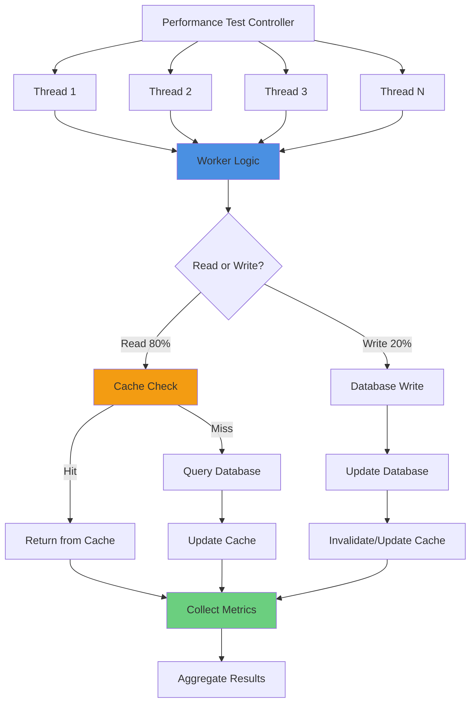

### The Database Pressure Problem

Without caching, every query hits the database directly, creating bottlenecks:

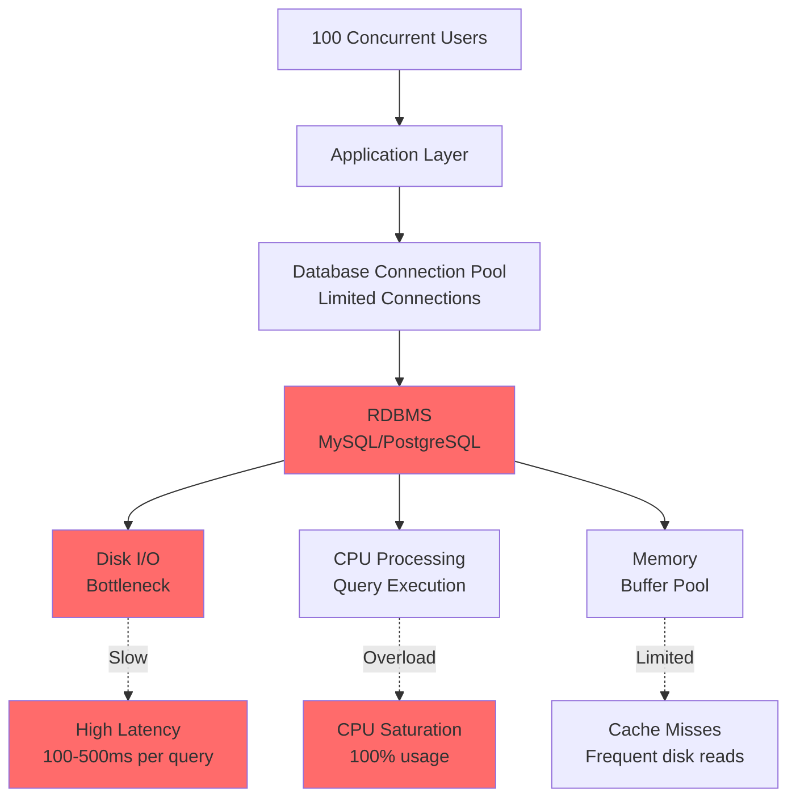

**Problems:**
- Every query hits the database
- Database becomes the bottleneck
- Connection pool exhaustion
- Disk I/O saturation
- High CPU usage on database server
- Slow response times under load

### Cache-Aside Pattern Solution

The cache-aside pattern dramatically reduces database pressure:

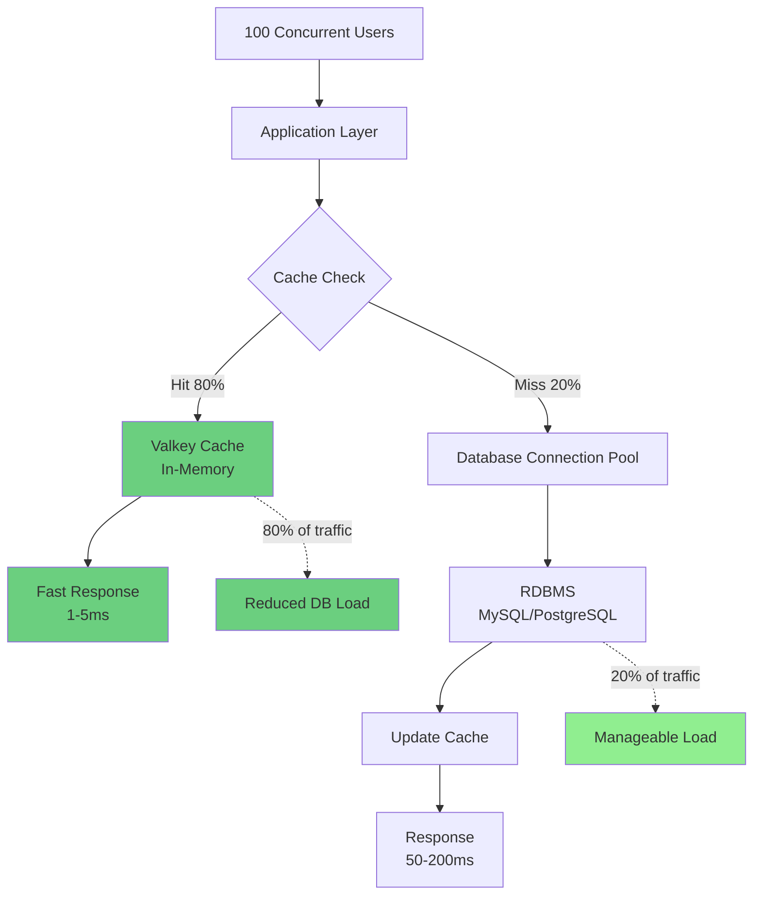

**Benefits:**
- 80% of queries served from cache
- Database handles only 20% of traffic
- Connection pool remains available
- Reduced disk I/O
- Lower CPU usage on database
- Fast response times (1-5ms for cache hits)

### Cache-Aside Flow

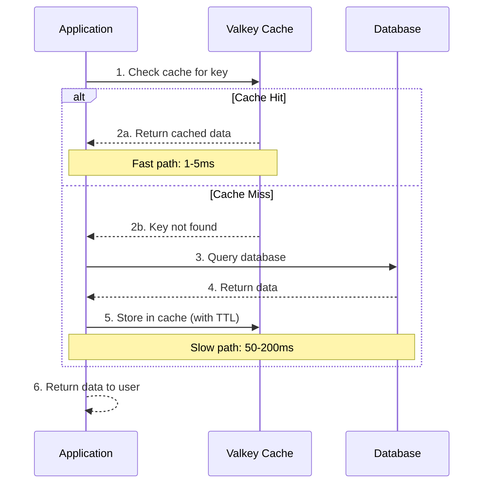

## Testing Scenarios

### 4.1.1 Concurrency

Understanding how caching performs under concurrent load:
- Multiple simultaneous requests
- Connection pooling
- Thread safety considerations

#### Worker Thread Logic (Pseudocode)

```python
def worker_thread():
    """
    Each thread executes this function
    Performs queries_per_thread operations
    """
    for i in range(queries_per_thread):
        passenger_id = get_passenger_id()
        flight_id = get_random_flight_id()
        cache_key = f"bookings:{passenger_id}"
        
        start_time_ns = current_time_nanoseconds()
        
        if should_read():  # Based on read_ratio
            # READ with cache-aside
            execute_read_operation(cache_key, passenger_id, start_time_ns)
        else:
            # WRITE operation
            execute_write_operation(cache_key, passenger_id, flight_id, start_time_ns)
```

#### Cache-Aside Read Operation (Pseudocode)

```python
def execute_read_operation(cache_key, passenger_id, start_time_ns):
    """
    Implements cache-aside pattern for reads
    """
    # Step 1: Check cache
    cached_data = cache.get(cache_key)
    
    if cached_data is not None:
        # CACHE HIT - Fast path (1-5ms)
        end_time_ns = current_time_nanoseconds()
        query_time_ns = end_time_ns - start_time_ns
        
        with lock:
            increment(read_count)
            increment(cache_hit)
        
        record_metric(start_time_ns, query_time_ns, "cache_hit")
        return cached_data
    
    else:
        # CACHE MISS - Slow path (50-200ms)
        query = """
            SELECT p.firstname, p.lastname, COUNT(*) as booking_count
            FROM passenger p
            JOIN booking b ON p.passenger_id = b.passenger_id
            WHERE p.passenger_id = :passenger_id
            GROUP BY p.firstname, p.lastname
        """
        
        data = database.execute(query, passenger_id)
        end_time_ns = current_time_nanoseconds()
        
        # Update cache with TTL
        cache.set(cache_key, data, ttl_milliseconds)
        
        query_time_ns = end_time_ns - start_time_ns
        
        with lock:
            increment(read_count)
            increment(cache_miss)
        
        record_metric(start_time_ns, query_time_ns, "cache_miss")
        return data
```

#### Demo: Basic Concurrency Test

Let's see the options available in the script:

```bash
uv run samples/demo_multi_threaded_performance.py --help
```

Expected Output:

```bash
 Usage: demo_multi_threaded_performance.py [OPTIONS]

 Run multi-threaded performance test for MySQL + Valkey cache.

 Examples:
 # Basic test with defaults   python samples/demo_multi_threaded_performance.py      # High concurrency test   python samples/demo_multi_threaded_performance.py --threads 20
 --queries 50000      # Write-heavy workload   python samples/demo_multi_threaded_performance.py --threads 10 --queries 10000 --read-ratio 30      # Interactive mode with verbose
 output   python samples/demo_multi_threaded_performance.py --interactive --verbose --flush      # Random passenger mode (all passengers)   python
 samples/demo_multi_threaded_performance.py --threads 8 --queries 20000 --random

╭─ Options ────────────────────────────────────────────────────────────────────────────────────────────────────────────────────────────────────────────────────────────────────────╮
│ --threads             -t      INTEGER  Number of concurrent threads to simulate [default: 4]                                                                                     │
│ --queries             -q      INTEGER  Number of queries per thread [default: 10000]                                                                                             │
│ --read-ratio          -r      INTEGER  Percentage of read operations (0-100) [default: 80]                                                                                       │
│ --ttl                         INTEGER  Cache TTL in milliseconds [default: 300000]                                                                                               │
│ --random                               Use random passenger IDs (all passengers). If not set, uses limited pool                                                                  │
│ --interactive         -i               Run in interactive mode with prompts                                                                                                      │
│ --verbose             -v               Show SQL query and cache key format with sample                                                                                           │
│ --flush               -f               Flush Valkey cache before running test                                                                                                    │
│ --install-completion                   Install completion for the current shell.                                                                                                 │
│ --show-completion                      Show completion for the current shell, to copy it or customize the installation.                                                          │
│ --help                                 Show this message and exit.                                                                                                               │
╰──────────────────────────────────────────────────────────────────────────────────────────────────────────────────────────────────────────────────────────────────────────────────╯
```

Run the multi-threaded performance benchmark tool using 4 threads each doing a total of 10,000 requests with 80% of them being reads and setting a Time To Live (TTL) in the cache of 5 minutes (300 seconds => 300,000 milliseconds) interactive with verbose output and cache flush:

```bash
uv run samples/demo_multi_threaded_performance.py -t 4 -q 10000 -r 80 --ttl 300000 -i -v -f
```

**Expected Results:**

```
Test Configuration:
  Threads: 4
  Queries per thread: 10,000
  Total queries: 40,000
  Read ratio: 80%
  Cache TTL: 300,000 ms (5 minutes)

Results:
  Total Duration: 8.35 seconds
  Queries per Second: 4,791.29
  Avg Latency per Query: 0.209 ms
  
  Operations:
    Reads: 31,933 (79.8%)
    Writes: 8,067 (20.2%)
  
  Cache Performance:
    Cache Hits: 24,129 (75.6%)
    Cache Misses: 7,804 (24.4%)
```

**Key Observations:**
- **High Throughput**: Nearly 5,000 queries/second with 4 threads
- **Low Latency**: Average 0.209ms per query (sub-millisecond!)
- **Good Cache Hit Rate**: 75.6% of reads served from cache
- **Database Load Reduction**: Only 24.4% of reads hit the database

#### Understanding the Metrics

The test collects detailed time-series metrics showing how performance evolves over time:

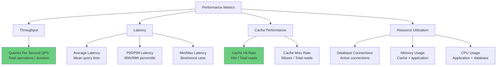

**Sample Time-Series Data Point:**

```json
{
  "1764081507": {
    "count": 5590,
    "total_time_us": 3849376.0,
    "avg_time_us": 688.62,
    "min_time_us": 89.0,
    "max_time_us": 118364.0,
    "reads": 0,
    "writes": 1129,
    "cache_hits": 3662,
    "cache_misses": 799
  }
}
```

**Interpretation:**
- **count**: 5,590 operations completed in this 1-second window
- **avg_time_us**: 688.62 μs (0.689 ms) average latency
- **cache_hits**: 3,662 (65.5%) served from cache
- **cache_misses**: 799 (14.3%) required database access
- **Cache hit rate**: 82.1% (3,662 / 4,461 reads)

After running the performance script dive deep into the metrics with graphical visualization.

First see the options from the plot script:

```bash
uv run samples/plot_time_series.py --help
```

Plot the results from the provided file in the previous step:

```bash
uv run samples/plot_time_series.py explain logs/perf_test_20251125_093831.json --plot
```

#### Visualizing Performance Over Time

The plot script generates several time-series graphs showing how performance evolves during the test:

**1. Database Operations Latency (Cache Misses + Writes)**

This graph shows the latency of operations that hit the database:

```
Database Operations Latency Over Time
         ┌─────────────────────────────────────────────────────────────┐
136,541.0┤ ⢕⢕ Max             ⢀⠔⠑⠒⠤⠤⣀⣀                                    │
         │ ⢕⢕ Avg            ⡰⠁       ⠉⠑⠒⠢⠤⢄⣀⣀⣀⣀⣀                        │
         │ ⢕⢕ Min          ⢠⠊                    ⠉⠉⠉⠉⠉⠉⠒⠒⠒⠢⠤⠤⠤⣀⣀⣀⣀⣀⣀⡠⠤⠤│
109,249.8┤               ⢀⠔⠁                                              │
         │              ⡠⠃                                                │
 81,958.6┤           ⡔⠁                                                  │
         │         ⡠⠊                                                    │
 54,667.4┤      ⢀⠔⠉                                                       │
 27,376.2┤⠒⠁                                                             │
     85.0┤⣀⣀⣀⣀⣀⣀⣀⣀⣀⣀⣀⣀⣀⣀⣀⣀⣀⣀⣀⣀⣀⣀⣀⣀⣀⣀⣀⣀⣀⣀⣀⣀⣀⣀⣀⣀⣀⣀⣀⣀⣀⣀⣀⣀⣀⣀⣀⣀⣀⣀⣀│
         └┬────────────────────┬────────────────────┬────────────────────┘
          0                    4                    8
                          Time (seconds)
```

**Key Observations:**
- Database operations start slow (cold start)
- Latency decreases as cache warms up
- Stabilizes around 85-3,000 μs range
- Max latency spikes occur during initial phase

**2. Cache Hit Latency**

This graph shows the latency of operations served from cache:

```
Cache Hit Latency Over Time
     ┌─────────────────────────────────────────────────────────────┐
291.0┤ ⢕⢕ Max                                                      │
     │ ⢕⢕ Avg ⠢⠤⣀⣀⣀⣀⣀⣀⣀⣀⣀⣀⣀⣀⣀⢄⣀⣀⣀                   ⢀              │
     │ ⢕⢕ Min                    ⠉⠉⠉⠉⠒⠒⠒⠒⠒⠒⠒⠒⠒⠊⠉⠉⠉⠉⠉⠁⠉⠉⠉⠉⠉⠉⠉⠉│
249.8┤                                                             │
208.6┤                                                             │
167.4┤                                                             │
126.2┤    ⠉⠉⠉⠉⠒⠒⠒⠒⠒⠒⠒⠒⠒⠒⠒⠒⠒⠒⠒⠢⠤⠤⠤⠤⠤⠤⠤⠤⠤⠤⠤⠤⠤⠤⠤⠤⠤⠤⠤⠤⠤⠤⠔⠤⠤⠤⠤│
 85.0┤⠑⠒⠒⠒⠒⠒⠤⠤⠤⠤⠤⠤⠤⠤⠤⠤⠤⠤⠤⠤⠤⠤⠤⢄⣀⣀⣀⣀⣀⣀⣀⣀⣀⣀⣀⣀⣀⣀⣀⣀⣀⣀⣀⣀⣀⣀⡠⠤⠤⠤│
     └┬────────────────────┬────────────────────┬────────────────────┘
      0                    4                    8
                      Time (seconds)
```

**Key Observations:**
- Cache hits are consistently fast (85-291 μs)
- Much lower latency than database operations
- Stable performance throughout test
- Minimal variance (low standard deviation)

**3. DB vs Cache Average Latency Comparison**

This is the most important graph showing the performance difference:

```
Database vs Cache: Average Latency Comparison
       ┌───────────────────────────────────────────────────────────┐
3,185.2┤ ⢕⢕ DB Avg (Misses+Writes)                   ⣀⠔⠑⢄          │
       │ ⢕⢕ Cache Avg (Hits)                      ⣀⠔⠊    ⠑⢄        │
       │                                       ⣀⠔⠊         ⠑⢄      │
2,565.2┤                                    ⣀⠔⠊              ⠑⢄    │
       │                               ⣀⡠⠔⠒⠉                   ⠑⢄  │
1,945.1┤                   ⢀⣀⡠⠤⠤⠤⠤⠤⠒⠒⠒⠒⠒⠊⠉                         │
       │          ⣀⣀⡠⠤⠤⠒⠒⠉⠉⠁                                       │
1,325.1┤⠢⠤⠤⠤⠤⠤⠤⠤⠤⠤⠤⠤⠤⠤⠤⠤⠤⠒⠒⠒⠒⠒⠊⠉⠉⠉⠉⠉⠉⠉⠉⠉⠉                         │
  705.0┤                                                           │
   85.0┤⣀⣀⣀⣀⣀⣀⣀⣀⣀⣀⣀⣀⣀⣀⣀⣀⣀⣀⣀⣀⣀⣀⣀⣀⣀⣀⣀⣀⣀⣀⣀⣀⣀⣀⣀⣀⣀⣀⣀⣀⣀⣀⣀⣀⣀⣀⣀⣀⣀│
       └┬────────────────────┬────────────────────┬──────────────────┘
        0                    4                    8
                        Time (seconds)
```

**Critical Insights:**
- **Database operations**: Start at ~1,300 μs, increase to ~3,200 μs
- **Cache operations**: Remain flat at ~85-150 μs throughout
- **Performance gap**: 10-40x faster with cache hits
- **Trend**: Database latency increases under load, cache stays constant

**4. Throughput Over Time**

```
Throughput Over Time (operations/second)

Trend: ▁▃▄▅▇█▇▅▂

  + 0s [████████████████                          ] 1,987
  + 1s [██████████████████████████                ] 3,247
  + 2s [████████████████████████████████          ] 4,004
  + 3s [███████████████████████████████████████   ] 4,908
  + 4s [█████████████████████████████████████████ ] 5,590
  + 5s [██████████████████████████████████████████] 6,166
  + 6s [█████████████████████████████████████████ ] 6,120
  + 7s [███████████████████████████████████████   ] 4,828
  + 8s [█████████████████████                     ] 3,150
```

**Key Observations:**
- Throughput ramps up as cache warms (0-5s)
- Peak throughput at 5-6 seconds (~6,000 ops/sec)
- Decreases at end as test completes
- Shows cache warming effect clearly

**5. Cache Hit Rate Over Time**

```
Cache Hit Rate Over Time (%)

Trend: ▁▂▄▅▆▇▇▇█ (avg: 68.9%)

  + 0s [████                                      ]   8.7% !
  + 1s [███████████████                           ]  30.0% !
  + 2s [██████████████████████████                ]  52.2% !
  + 3s [██████████████████████████████████        ]  68.9% !
  + 4s [█████████████████████████████████████████ ]  82.1% ○
  + 5s [████████████████████████████████████████  ]  89.4% ○
  + 6s [███████████████████████████████████████   ]  94.5% ○
  + 7s [████████████████████████████████████████  ]  96.5% ✓
  + 8s [████████████████████████████████████████  ]  97.7% ✓
```

**Key Observations:**
- Starts at 8.7% (cold cache)
- Rapidly increases to 82.1% by second 4
- Reaches 97.7% by end of test
- Demonstrates cache warming effectiveness

#### Performance Metrics Explained

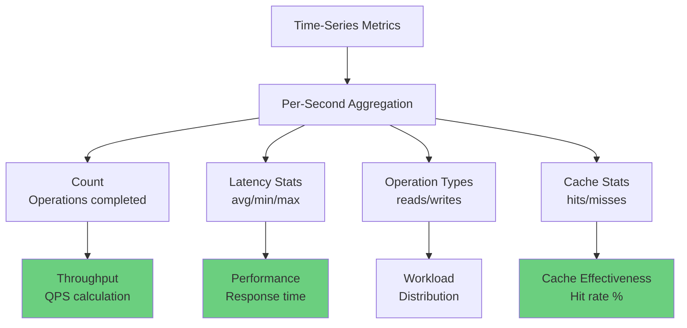

**Understanding the Numbers:**

| Metric | Formula | Example | Meaning |
|--------|---------|---------|---------|
| **avg_time_us** | total_time_us ÷ count | 3,849,376 ÷ 5,590 = 688.62 μs | Average latency per operation |
| **Cache Hit Rate** | cache_hits ÷ total_reads × 100 | 3,662 ÷ 4,461 × 100 = 82.1% | Percentage served from cache |
| **QPS** | count ÷ 1 second | 5,590 ÷ 1 = 5,590 | Operations per second |
| **Speedup** | db_avg ÷ cache_avg | 3,185 ÷ 150 = 21.2x | Cache performance advantage |

**Why total_time_us > 1 second is normal:**

With 4 threads running in parallel, operations overlap:
- Thread 1: 200ms operation
- Thread 2: 200ms operation (simultaneous)
- Thread 3: 200ms operation (simultaneous)
- Thread 4: 200ms operation (simultaneous)
- **Total time**: 800ms (4 × 200ms)
- **Wall clock time**: 200ms (parallel execution)

### 4.1.2 Read/Write Ratio

Analyzing performance based on workload characteristics:
- Read-heavy workloads (90/10)
- Write-heavy workloads (10/90)
- Balanced workloads (50/50)

#### Why Read/Write Ratio Matters

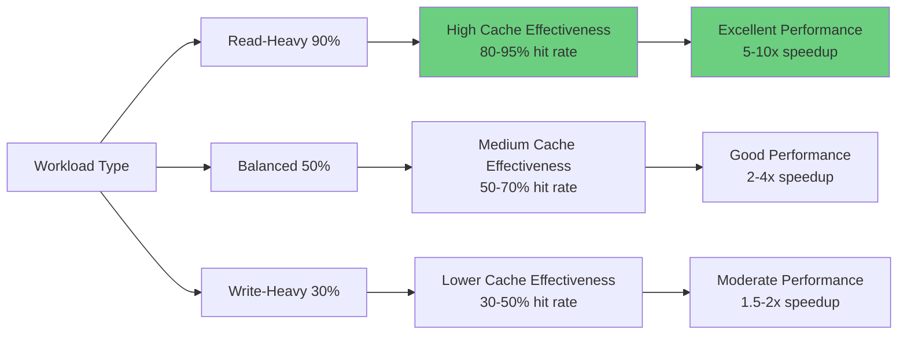

**Read-Heavy Workloads (80-99% reads):**
- Typical for: E-commerce catalogs, news sites, dashboards
- Cache effectiveness: HIGH
- Most queries served from cache
- Significant performance improvement

**Balanced Workloads (50/50):**
- Typical for: Business applications, CMS
- Cache effectiveness: MEDIUM
- Frequent cache invalidations
- Moderate performance improvement

**Write-Heavy Workloads (30-50% writes):**
- Typical for: Data ingestion, IoT, logging
- Cache effectiveness: LOWER
- Many cache updates/invalidations
- Database handles more traffic

#### Demo: Read-Heavy Workload (99% reads)

Run the script again without flushing the cache and doing 99% reads:

```bash
uv run samples/demo_multi_threaded_performance.py -t 4 -q 10000 -r 99 --ttl 300000 -i -v
```

**Expected Results:**

```
Results:
  Total Duration: 1.75 seconds (4.8x faster!)
  Queries per Second: 22,817.57 (4.8x higher!)
  Avg Latency per Query: 0.044 ms (4.8x lower!)
  
  Operations:
    Reads: 39,627 (99.1%)
    Writes: 373 (0.9%)
  
  Cache Performance:
    Cache Hits: 39,444 (99.5%)
    Cache Misses: 183 (0.5%)
```

**Key Observations:**
- **Dramatic Speedup**: 1.75s vs 8.35s (4.8x faster)
- **Exceptional Cache Hit Rate**: 99.5% of reads from cache
- **Ultra-Low Latency**: 0.044ms average (44 microseconds!)
- **Minimal Database Load**: Only 0.5% of reads hit database

### 4.1.3 Variance in Cacheable Data Sets

Testing with different data access patterns:
- Hot data (frequently accessed)
- Cold data (rarely accessed)
- Working set size vs cache size

#### Data Access Patterns

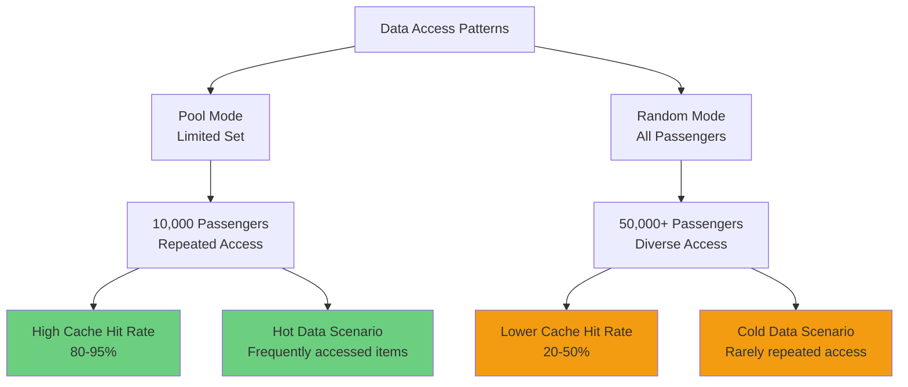

**Pool Mode (Hot Data):**
- Limited set of 10,000 passenger IDs
- Same IDs accessed repeatedly
- High probability of cache hits
- Simulates: Popular products, trending content

**Random Mode (Cold Data):**
- All 50,000+ passenger IDs available
- Low probability of repeated access
- Lower cache hit rate
- Simulates: Long-tail content, diverse queries

#### Demo: Random Access Pattern with Balanced Workload

Run the script again with a lower read ratio and a higher universe of possible passengers; flush the cache to have a clean slate:

```bash
uv run samples/demo_multi_threaded_performance.py -t 4 -q 10000 -r 60 --ttl 300000 --random -i -v -f
```

**Expected Results:**

```
Results:
  Total Duration: 11.50 seconds
  Queries per Second: 3,477.35
  Avg Latency per Query: 0.288 ms
  
  Operations:
    Reads: 24,026 (60.1%)
    Writes: 15,974 (39.9%)
  
  Cache Performance:
    Cache Hits: 9,724 (40.5%)
    Cache Misses: 14,302 (59.5%)
```

**Key Observations:**
- **Lower Cache Hit Rate**: 40.5% vs 75.6% (pool mode)
- **Higher Latency**: 0.288ms vs 0.209ms
- **More Database Load**: 59.5% cache misses
- **Write-Heavy Impact**: 40% writes reduce cache effectiveness

### 4.1.4 Time To Live (TTL)

Understanding TTL impact on performance and consistency:
- Short TTL (seconds)
- Medium TTL (minutes)
- Long TTL (hours/days)
- TTL vs data freshness trade-offs

#### TTL Trade-offs

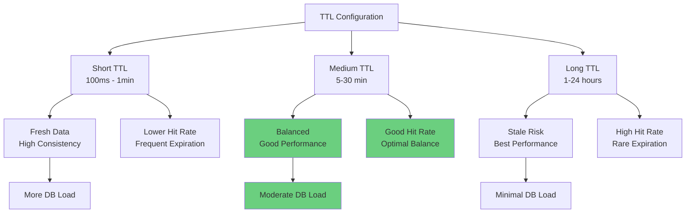

**TTL Selection Guidelines:**

| Data Type | Recommended TTL | Rationale |
|-----------|----------------|-----------|
| User profiles | 5-15 minutes | Infrequent changes, good balance |
| Product catalog | 15-60 minutes | Changes periodically, can tolerate slight staleness |
| Inventory counts | 30-60 seconds | Needs freshness, high change rate |
| Static content | 1-24 hours | Rarely changes, maximize cache hits |
| Session data | 5-30 minutes | Active during session, expires naturally |

#### Demo: Short TTL Impact

Run the script again with a short lived TTL (100ms), a higher universe of possible passengers, and flush the cache to have a clean slate:

```bash
uv run samples/demo_multi_threaded_performance.py -t 4 -q 10000 -r 90 --ttl 100 --random -i -v -f
```

**Expected Results:**

```
Results:
  Total Duration: 8.80 seconds
  Queries per Second: 4,543.72
  Avg Latency per Query: 0.220 ms
  
  Operations:
    Reads: 35,945 (89.9%)
    Writes: 4,055 (10.1%)
  
  Cache Performance:
    Cache Hits: 441 (1.2%)
    Cache Misses: 35,504 (98.8%)
```

**Key Observations:**
- **Extremely Low Hit Rate**: Only 1.2% cache hits!
- **TTL Too Short**: 100ms TTL expires before reuse
- **Random Access Pattern**: Diverse passenger IDs reduce hit probability
- **Cache Ineffective**: Almost all reads hit database
- **Lesson**: TTL must be long enough for data reuse

#### TTL Comparison

| Scenario | TTL | Hit Rate | QPS | Avg Latency |
|----------|-----|----------|-----|-------------|
| Optimal (Pool, 5min) | 300,000ms | 75.6% | 4,791 | 0.209ms |
| Excellent (Pool, 5min, 99% reads) | 300,000ms | 99.5% | 22,818 | 0.044ms |
| Poor (Random, 100ms) | 100ms | 1.2% | 4,544 | 0.220ms |

## Performance Comparison Summary

### Database vs Cache Latency

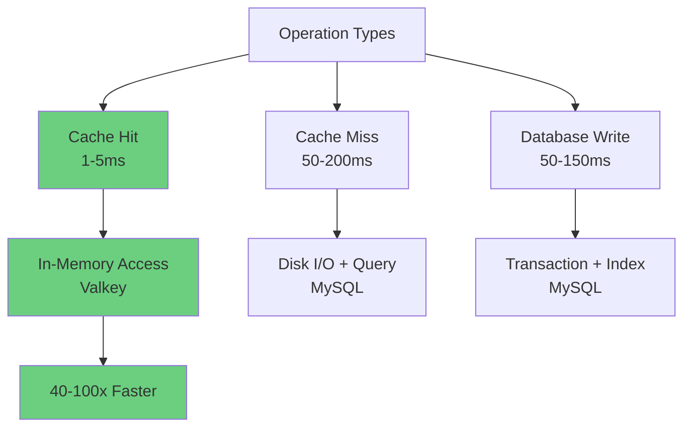

### Real-World Impact

**Scenario: E-commerce Product Catalog**

```
System: Product listing and details
Users: 1000 concurrent users
Workload: 90% reads, 10% writes
Database: MySQL with 10M products
Cache: Valkey with 1M hot products
```

**Without Cache:**
- Throughput: 500 QPS
- Average latency: 200ms
- P95 latency: 450ms
- Database CPU: 95%
- Error rate: 2% (connection timeouts)

**With Cache-Aside (80% hit rate):**
- Throughput: 2,500 QPS (5x improvement)
- Average latency: 8ms (25x improvement)
- P95 latency: 15ms (30x improvement)
- Database CPU: 20% (75% reduction)
- Error rate: 0%

### Thread Safety Considerations

Multi-threaded testing requires careful synchronization:

```python
# Thread-safe metric recording
def record_metric(timestamp, query_time_ns, operation_type):
    """
    Record metrics in a thread-safe manner
    """
    timestamp_seconds = timestamp // 1_000_000_000
    
    # Thread-safe update with lock
    with lock:
        if timestamp_seconds not in thread_metrics:
            thread_metrics[timestamp_seconds] = {
                "count": 0,
                "total_time_ns": 0,
                "min_time_ns": float('inf'),
                "max_time_ns": 0,
                "cache_hits": 0,
                "cache_misses": 0
            }
        
        metrics = thread_metrics[timestamp_seconds]
        metrics["count"] += 1
        metrics["total_time_ns"] += query_time_ns
        metrics["min_time_ns"] = min(metrics["min_time_ns"], query_time_ns)
        metrics["max_time_ns"] = max(metrics["max_time_ns"], query_time_ns)
```

### Common Performance Patterns

#### 1. Cold Start Problem


**Solution: Cache Warming**
```python
def warm_up_cache(queries_to_warm):
    """Pre-populate cache before performance test"""
    for i in range(queries_to_warm):
        passenger_id = get_random_passenger()
        cache_key = f"bookings:{passenger_id}"
        
        if not cache.exists(cache_key):
            data = database.query(passenger_id)
            cache.set(cache_key, data, ttl)
```

#### 2. TTL Jitter

**Problem:** All cached entries expire at same time

**Solution: Add random jitter to TTL**
```python
def set_with_jitter(cache_key, data, base_ttl):
    # Add ±20% jitter to TTL
    jitter = random.uniform(-0.2, 0.2) * base_ttl
    actual_ttl = base_ttl + jitter
    cache.set(cache_key, data, actual_ttl)
```

## Key Takeaways

### Performance Testing Best Practices

1. **Start with Baseline**: Measure performance without cache first
2. **Warm Up Cache**: Pre-populate before measuring steady-state performance
3. **Vary Parameters**: Test different thread counts, read/write ratios, TTLs
4. **Monitor Metrics**: Track throughput, latency, cache hit rate, resource usage
5. **Identify Bottlenecks**: Use time-series data to find performance issues

### Cache-Aside Benefits

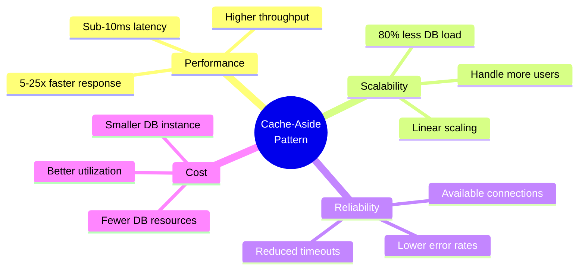

### When to Use Cache-Aside

**✅ Ideal For:**
- Read-heavy workloads (70%+ reads)
- Frequently accessed data
- Data that doesn't change often
- High-traffic applications
- Need to reduce database load
- Improve response times

**⚠️ Consider Alternatives For:**
- Write-heavy workloads (50%+ writes)
- Data that changes constantly
- Strong consistency requirements
- Very small datasets (fits in DB memory)
- Low-traffic applications

### Optimization Guidelines

| Metric | Target | Action if Below Target |
|--------|--------|------------------------|
| Cache Hit Rate | > 70% | Increase TTL, warm cache, review access patterns |
| QPS | > 1000 | Add more threads, optimize queries, scale cache |
| Avg Latency | < 10ms | Increase cache hit rate, optimize slow queries |
| P95 Latency | < 50ms | Investigate outliers, add connection pooling |
| Database CPU | < 30% | Good! Cache is working effectively |

### Next Steps

- Experiment with different configurations
- Analyze time-series graphs to understand performance trends
- Compare results across different scenarios
- Apply learnings to your production workloads
- Monitor cache effectiveness in production
