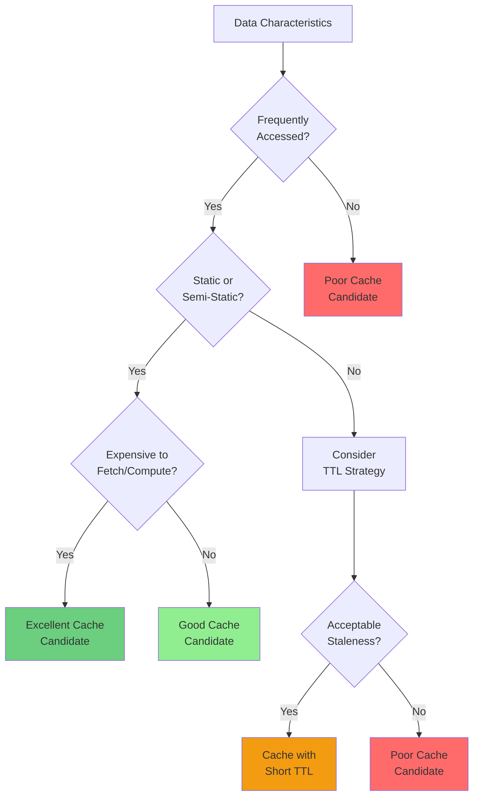
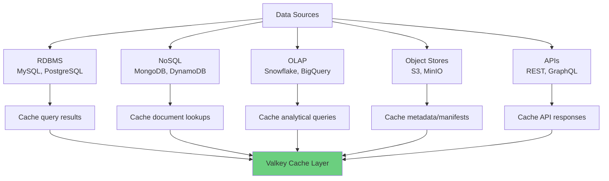
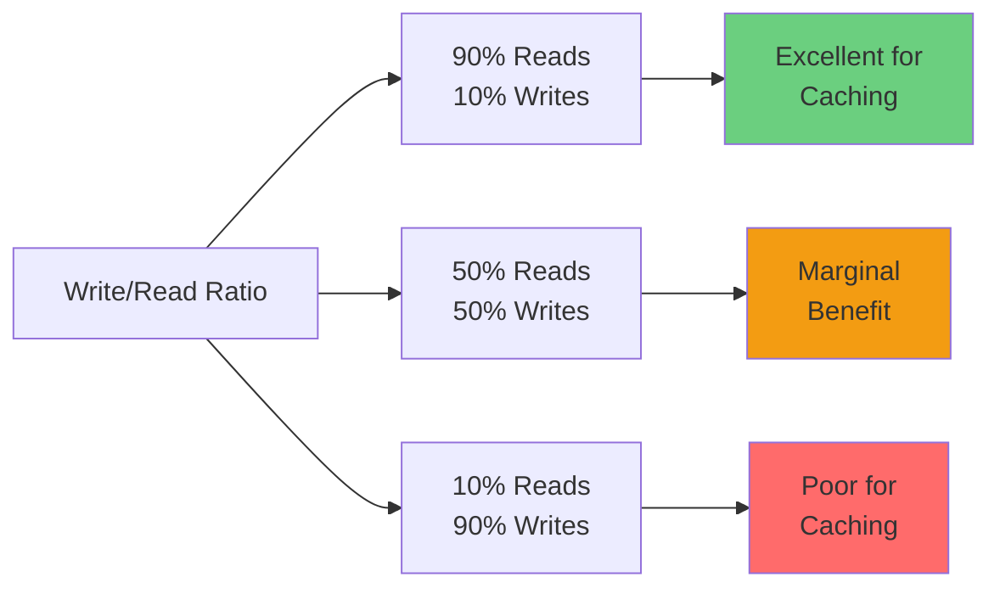
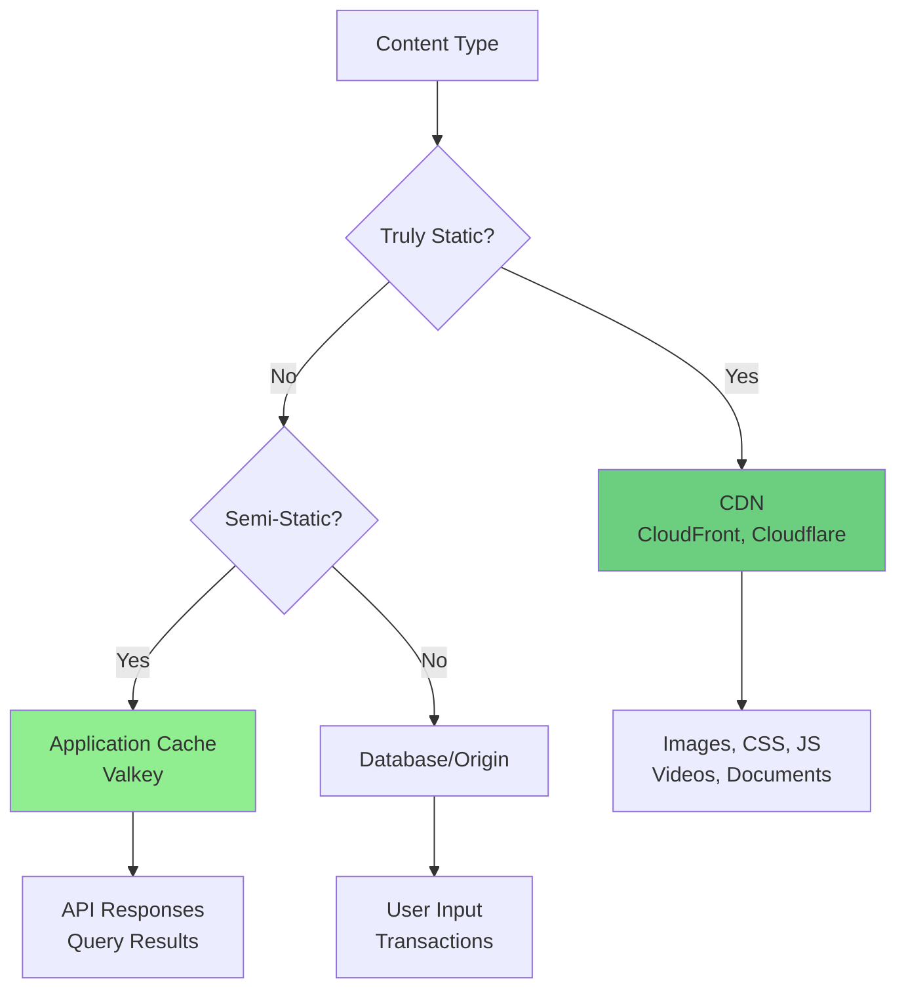
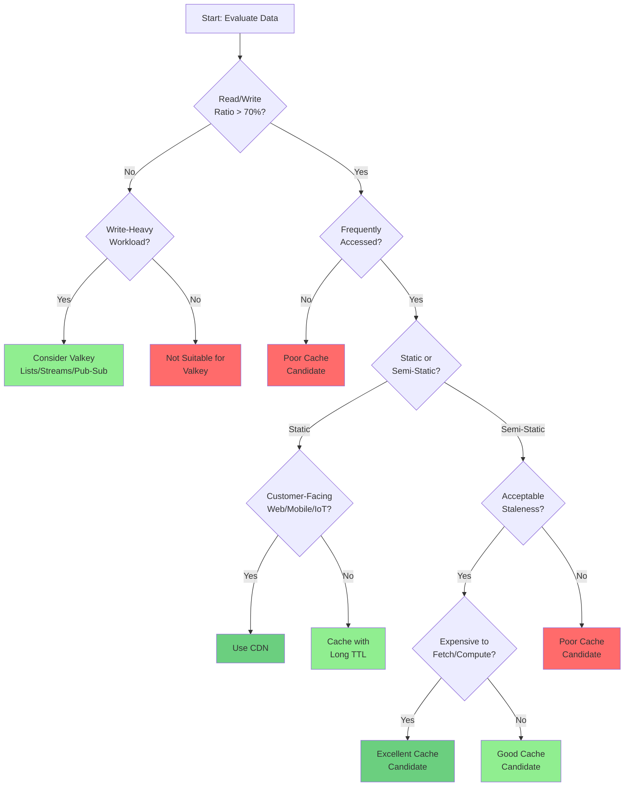

# 4.2 Use Case Identification

## Overview

Learn to identify which use cases are good candidates for caching and which are not. While "anything that can be queried can be cached," not everything **should** be cached. Understanding the characteristics of your data and access patterns is crucial for effective caching strategies.


## Core Principle: Frequently Accessed, Static or Semi-Static Data

The ideal caching candidate is data that is:
1. **Frequently accessed** (high read volume)
2. **Static or semi-static** (changes infrequently)
3. **Expensive to compute or fetch** (database queries, API calls, computations)
4. **Tolerant of slight staleness** (eventual consistency acceptable)



## Good Caching Candidates

### 1. Reference Data (Static/Semi-Static)

Reference data changes infrequently and is accessed frequently, making it ideal for caching.

#### Airport Application Examples

**Airports Data**
```python
# Cache airport information
cache_key = "airport:SEA"
ttl = 86400000  # 24 hours

# Airports rarely change
airport_data = {
    "code": "SEA",
    "name": "Seattle-Tacoma International Airport",
    "city": "Seattle",
    "country": "USA",
    "timezone": "America/Los_Angeles"
}
```

**Why it's a good candidate:**
- ✅ Airports don't change frequently
- ✅ Accessed by many users/queries
- ✅ Long TTL acceptable (hours/days)
- ✅ Reduces database load significantly

**Airlines Data**
```python
# Cache airline information
cache_key = "airline:AA"
ttl = 43200000  # 12 hours

airline_data = {
    "code": "AA",
    "name": "American Airlines",
    "country": "USA",
    "alliance": "Oneworld"
}
```

**Why it's a good candidate:**
- ✅ Airline information is stable
- ✅ Referenced in many flight queries
- ✅ High read-to-write ratio (99:1 or better)
- ✅ Perfect for cache-aside pattern

**Flight Schedules (Current and Upcoming)**
```python
# Cache current and upcoming flights
cache_key = "flights:upcoming:SEA:2025-11-25"
ttl = 300000  # 5 minutes

# Focus on current and near-future flights
flight_data = {
    "flight_number": "AA123",
    "departure": "2025-11-25T14:30:00Z",
    "arrival": "2025-11-25T18:45:00Z",
    "status": "On Time",
    "gate": "B12"
}
```

**Why it's a good candidate:**
- ✅ Current/upcoming flights are frequently queried
- ✅ Status updates are acceptable with 5-minute delay
- ✅ High traffic during peak hours
- ✅ Reduces load on flight status database
- ⚠️ Don't cache all historical flights (low reuse)

### 2. User-Specific Data (Contextual Caching)

Not all user data should be cached—only data for active users with high access probability.

**Passenger Bookings (Active Travelers Only)**
```python
# Cache bookings for passengers with upcoming flights
cache_key = "bookings:passenger:12345"
ttl = 600000  # 10 minutes

# Only cache if passenger has upcoming flight within 48 hours
if has_upcoming_flight_within_48h(passenger_id):
    booking_data = get_passenger_bookings(passenger_id)
    cache.set(cache_key, booking_data, ttl)
```

**Why selective caching matters:**
- ✅ Active travelers check bookings frequently
- ✅ High probability of cache reuse
- ❌ Don't cache all 50,000+ passengers
- ❌ Don't cache historical bookings (low reuse)
- ✅ Cache only current/upcoming 10 flights, not past flights

**Decision Matrix for Passenger Data:**

| Passenger Status | Cache? | TTL | Rationale |
|-----------------|--------|-----|-----------|
| Flight in next 24h | ✅ Yes | 10 min | Very high access probability |
| Flight in next 48h | ✅ Yes | 30 min | High access probability |
| Flight in next week | ⚠️ Maybe | 1 hour | Moderate access probability |
| No upcoming flights | ❌ No | N/A | Low access probability |
| Historical data only | ❌ No | N/A | Very low reuse |

### 3. Third-Party API Calls

External API calls are expensive (latency, rate limits, cost) and excellent caching candidates.

**Weather API Example**
```python
# Cache weather data for airports
cache_key = "weather:SEA:current"
ttl = 600000  # 10 minutes

weather_data = {
    "airport": "SEA",
    "temperature": 15,
    "conditions": "Partly Cloudy",
    "wind_speed": 12,
    "visibility": 10,
    "timestamp": "2025-11-25T14:30:00Z"
}
```

**Why it's a good candidate:**
- ✅ External API calls are slow (100-500ms)
- ✅ Weather doesn't change every second
- ✅ Many users query same airport weather
- ✅ Reduces API costs and rate limit issues
- ✅ 10-minute staleness is acceptable

**Other Third-Party API Examples:**
- Currency exchange rates (TTL: 1-5 minutes)
- Stock prices (TTL: 1-60 seconds, depending on use case)
- Geolocation data (TTL: hours/days)
- Translation services (TTL: days/weeks)
- Map/routing data (TTL: hours)

### 4. Expensive Computations

Complex calculations, aggregations, or data transformations benefit from caching.

**Flight Statistics**
```python
# Cache aggregated flight statistics
cache_key = "stats:airline:AA:monthly:2025-11"
ttl = 3600000  # 1 hour

stats = {
    "total_flights": 15420,
    "on_time_percentage": 87.5,
    "average_delay_minutes": 12.3,
    "cancellation_rate": 1.2
}
```

**Why it's a good candidate:**
- ✅ Expensive aggregation query (scans thousands of rows)
- ✅ Result doesn't change frequently
- ✅ Multiple users view same statistics
- ✅ Hourly updates are sufficient

### 5. Data Sources Beyond RDBMS

Caching isn't just for relational databases—many data sources benefit from caching.



**NoSQL Databases (MongoDB, DynamoDB)**
```python
# Cache frequently accessed documents
cache_key = "user:profile:12345"
ttl = 900000  # 15 minutes

# Even NoSQL databases benefit from caching hot data
user_profile = cache.get(cache_key)
if not user_profile:
    user_profile = mongodb.users.find_one({"_id": 12345})
    cache.set(cache_key, user_profile, ttl)
```

**OLAP/Data Warehouses (Snowflake, BigQuery)**
```python
# Cache expensive analytical queries
cache_key = "analytics:revenue:daily:2025-11-25"
ttl = 3600000  # 1 hour

# Data warehouse queries can be very expensive
revenue_data = cache.get(cache_key)
if not revenue_data:
    revenue_data = snowflake.execute(expensive_aggregation_query)
    cache.set(cache_key, revenue_data, ttl)
```

**Object Stores (S3, MinIO)**
```python
# Cache object metadata or small objects
cache_key = "s3:metadata:bucket/path/file.json"
ttl = 1800000  # 30 minutes

# Avoid repeated S3 API calls for metadata
metadata = cache.get(cache_key)
if not metadata:
    metadata = s3.head_object(Bucket="bucket", Key="path/file.json")
    cache.set(cache_key, metadata, ttl)
```

## Poor Caching Candidates

### 1. High Write-to-Read Ratio

When data changes as often as it's read, caching provides minimal benefit.



**Examples of Poor Candidates:**
- Real-time sensor data (IoT devices reporting every second)
- Live auction bids (constant updates)
- Stock ticker data (sub-second changes)
- Chat messages (write-heavy, low reuse)
- Log entries (write-once, rarely read)

**When Read/Write Ratio is Unacceptable:**

| Scenario | Read% | Write% | Cache? | Alternative |
|----------|-------|--------|--------|-------------|
| IoT sensor stream | 10% | 90% | ❌ No | Valkey Streams |
| Message queue | 20% | 80% | ❌ No | Valkey Lists |
| Real-time notifications | 30% | 70% | ❌ No | Valkey Pub/Sub |
| Session state | 60% | 40% | ⚠️ Maybe | Valkey as primary store |
| Product catalog | 95% | 5% | ✅ Yes | Cache-aside pattern |

### 2. Data Requiring Strong Consistency

When stale data is unacceptable, caching introduces consistency challenges.

**Examples:**
- Financial transactions (account balances)
- Inventory counts (stock availability)
- Seat reservations (booking conflicts)
- Authentication tokens (security risk)
- Legal/compliance data (audit requirements)

**Mitigation Strategies:**
- Use very short TTLs (seconds)
- Implement cache invalidation on writes
- Consider write-through caching
- Use Valkey as primary store (not cache)

### 3. Large Objects with Low Access Frequency

Caching large objects that are rarely accessed wastes memory.

**Poor Candidates:**
- Video files (use CDN instead)
- Large reports (generate on-demand)
- Historical archives (low access frequency)
- User-uploaded files (use object storage)

**Memory Efficiency:**
```python
# Bad: Cache large, rarely accessed data
cache_key = "report:annual:2020:full"  # 50MB report
ttl = 86400000  # 24 hours
# Wastes 50MB for data accessed once per day

# Good: Cache summary, generate full report on-demand
cache_key = "report:annual:2020:summary"  # 50KB summary
ttl = 86400000  # 24 hours
# Uses 50KB, full report generated when needed
```

### 4. Highly Volatile Data

Data that changes constantly provides minimal cache benefit.

**Examples:**
- Live sports scores (changes every few seconds)
- Real-time traffic data (constant updates)
- Active bidding systems (sub-second changes)
- Live streaming metrics (continuous updates)

## Valkey Beyond Caching

When traditional caching isn't suitable, Valkey offers other powerful use cases:

### 1. Message Queues (Valkey Lists)

For write-heavy workloads that need ordered processing:

```python
# Producer: Add tasks to queue
valkey.lpush("task_queue", json.dumps(task_data))

# Consumer: Process tasks from queue
while True:
    task = valkey.brpop("task_queue", timeout=5)
    if task:
        process_task(json.loads(task[1]))
```

**Use Cases:**
- Background job processing
- Task queues
- Event processing
- Order fulfillment pipelines

### 2. Pub/Sub (Valkey Pub/Sub)

For broadcasting messages to multiple subscribers:

```python
# Publisher: Broadcast notifications
valkey.publish("flight_updates", json.dumps({
    "flight": "AA123",
    "status": "Delayed",
    "new_departure": "15:30"
}))

# Subscriber: Receive real-time updates
pubsub = valkey.pubsub()
pubsub.subscribe("flight_updates")
for message in pubsub.listen():
    handle_flight_update(message)
```

**Use Cases:**
- Real-time notifications
- Live dashboards
- Chat applications
- Event broadcasting
- Microservice communication

### 3. Streaming (Valkey Streams)

For append-only logs and event sourcing:

```python
# Producer: Add events to stream
valkey.xadd("sensor_data", {
    "sensor_id": "temp_01",
    "temperature": 23.5,
    "timestamp": time.time()
})

# Consumer: Read events from stream
events = valkey.xread({"sensor_data": "0"}, count=100)
for stream, messages in events:
    for message_id, data in messages:
        process_sensor_data(data)
```

**Use Cases:**
- IoT sensor data
- Application logs
- Event sourcing
- Audit trails
- Time-series data

## Static Content: Use CDN Instead

For truly static content in customer-facing applications (web, mobile, IoT), use a CDN rather than application-level caching.



**CDN Use Cases:**
- Static assets (images, CSS, JavaScript)
- Videos and media files
- PDF documents
- Mobile app assets
- IoT firmware updates

**Why CDN over Application Cache:**
- ✅ Global edge locations (lower latency)
- ✅ Massive scale (petabytes of storage)
- ✅ Offloads bandwidth from origin
- ✅ Built-in compression and optimization
- ✅ DDoS protection

**When to Use Application Cache (Valkey):**
- Dynamic content (personalized responses)
- Database query results
- API responses
- Session data
- Computed results

## Decision Framework

Use this framework to evaluate caching suitability:



### Evaluation Checklist

**✅ Good Caching Candidate If:**
- [ ] Read/write ratio > 70%
- [ ] Data accessed frequently (multiple times per minute/hour)
- [ ] Data is static or semi-static
- [ ] Staleness is acceptable (seconds to hours)
- [ ] Expensive to fetch or compute
- [ ] Multiple users/requests access same data
- [ ] Data size is reasonable (< 1MB per item)

**❌ Poor Caching Candidate If:**
- [ ] Read/write ratio < 50%
- [ ] Data accessed infrequently (once per day or less)
- [ ] Data changes constantly
- [ ] Strong consistency required
- [ ] User-specific with low reuse
- [ ] Very large objects (> 10MB)
- [ ] Better served by CDN (truly static content)

**⚠️ Consider Alternatives If:**
- [ ] Write-heavy workload → Valkey Lists/Streams
- [ ] Real-time broadcasting → Valkey Pub/Sub
- [ ] Truly static content → CDN
- [ ] Strong consistency → Write-through or primary store

## Airport Application: Caching Strategy Summary

### ✅ Excellent Candidates

| Data Type | TTL | Rationale |
|-----------|-----|-----------|
| Airports | 24 hours | Static reference data |
| Airlines | 12 hours | Rarely changes |
| Aircraft types | 24 hours | Static reference data |
| Current/upcoming flights | 5 minutes | High access, acceptable staleness |
| Active passenger bookings | 10 minutes | Upcoming flights only |
| Weather data | 10 minutes | Third-party API, acceptable staleness |

### ❌ Poor Candidates

| Data Type | Why Not Cache | Alternative |
|-----------|---------------|-------------|
| All passengers | Low reuse probability | Cache active travelers only |
| Historical flights | Rarely accessed | Query on-demand |
| Past bookings | Low reuse | Query on-demand |
| Real-time flight tracking | Constant updates | Valkey Streams |
| Booking transactions | Strong consistency | Direct database |

### 🎯 Optimization Strategy

1. **Cache reference data** (airports, airlines) with long TTL
2. **Cache current/upcoming flights** with moderate TTL (5 min)
3. **Selectively cache passenger data** (active travelers only)
4. **Cache third-party APIs** (weather) with appropriate TTL
5. **Don't cache historical data** (low access frequency)
6. **Don't cache all users** (focus on active subset)

## Key Takeaways

### Caching Best Practices

1. **Focus on Hot Data**: Cache frequently accessed data, not everything
2. **Right-Size TTL**: Balance freshness vs performance
3. **Selective Caching**: Cache active users/current data, not historical
4. **Monitor Hit Rates**: Aim for > 70% cache hit rate
5. **Consider Alternatives**: CDN for static, Valkey data structures for write-heavy

### Cost-Benefit Analysis

**Benefits of Caching:**
- 10-100x faster response times
- 70-90% reduction in database load
- Lower infrastructure costs
- Better user experience
- Reduced third-party API costs

**Costs of Caching:**
- Memory usage (cache storage)
- Complexity (invalidation logic)
- Potential staleness (consistency trade-offs)
- Monitoring and maintenance

**When Benefits Outweigh Costs:**
- High-traffic applications
- Expensive data sources (APIs, complex queries)
- Read-heavy workloads
- Acceptable staleness tolerance

### Remember

> "Cache what's frequently accessed and expensive to fetch. Everything else is a trade-off."

Not everything should be cached, but the right caching strategy can transform application performance and scalability. Use this framework to make informed decisions about what, when, and how to cache.
