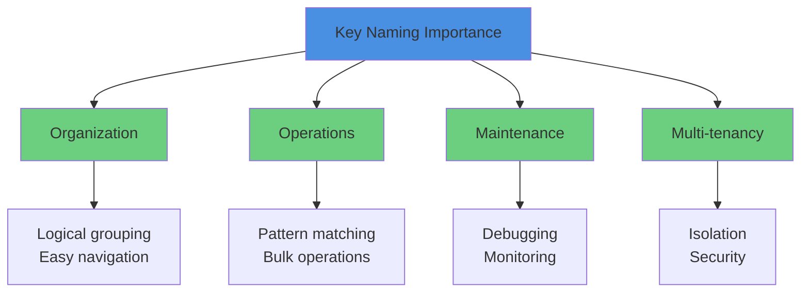

# 4.3 Key Naming Strategies

## Overview

Learn proper key naming conventions for effective key management in Valkey's flat keyspace. Unlike relational databases with tables and schemas, Valkey uses a flat keyspace where all keys exist at the same level. Proper naming conventions are essential for organization, maintenance, and efficient operations.

## Why Key Naming Matters



### The Flat Keyspace Challenge

**Relational Database (Structured):**
```sql
-- Tables provide natural organization
SELECT * FROM airports WHERE code = 'SEA';
SELECT * FROM airlines WHERE code = 'AA';
SELECT * FROM flights WHERE flight_number = 'AA123';
```

**Valkey (Flat Keyspace):**
```
# All keys exist at the same level
airport:SEA
airline:AA
flight:AA123
user:12345
session:xyz789
cache:query:abc123
```

Without proper naming conventions, the keyspace becomes chaotic:
```
# Bad: No organization
SEA
AA
AA123
12345
xyz789
abc123
```

## Key Naming Best Practices

### 1. Hierarchical Naming with Delimiters

Use colons (`:`) to create logical hierarchies:

```
<namespace>:<entity>:<identifier>[:<attribute>]
```

**Airport Application Examples:**

```bash
# Airport data
airport:SEA                          # Seattle airport
airport:LAX                          # Los Angeles airport
airport:JFK                          # New York JFK airport

# Airline data
airline:AA                           # American Airlines
airline:DL                           # Delta Airlines
airline:UA                           # United Airlines

# Flight data
flight:AA123                         # Flight by number
flight:AA123:status                  # Flight status
flight:AA123:gate                    # Gate information
flight:date:2025-11-25:SEA           # Flights by date and origin

# Passenger bookings
bookings:passenger:12345             # Passenger's bookings
bookings:flight:AA123                # Flight's bookings

# Weather data
weather:airport:SEA:current          # Current weather
weather:airport:SEA:forecast         # Weather forecast
```

### 2. Namespace Prefixes for Environments

Separate environments using prefixes:

```bash
# Production
prod:airport:SEA
prod:flight:AA123
prod:bookings:passenger:12345

# Development
dev:airport:SEA
dev:flight:AA123
dev:bookings:passenger:12345

# Staging
staging:airport:SEA
staging:flight:AA123
staging:bookings:passenger:12345

# Testing
test:airport:SEA
test:flight:AA123
test:bookings:passenger:12345
```

### 3. Application/Service Prefixes

For multi-application deployments:

```bash
# Airport application
airport-app:cache:flight:AA123
airport-app:session:user:12345
airport-app:queue:notifications

# Booking service
booking-svc:cache:passenger:12345
booking-svc:lock:seat:12A
booking-svc:counter:bookings:daily

# Weather service
weather-svc:cache:airport:SEA
weather-svc:api:rate-limit:client:123
```

### 4. Version Management

Include versions for schema evolution:

```bash
# Version 1
v1:passenger:12345
v1:flight:AA123

# Version 2 (new schema)
v2:passenger:12345
v2:flight:AA123

# Allows gradual migration
# Old code reads v1, new code reads v2
```

### 5. Temporal Keys

Include timestamps for time-based data:

```bash
# Daily aggregations
stats:flights:daily:2025-11-25
stats:bookings:daily:2025-11-25

# Hourly metrics
metrics:api:hourly:2025-11-25:14
metrics:cache:hourly:2025-11-25:14

# Session with timestamp
session:user:12345:1732550400

# Temporary locks
lock:booking:flight:AA123:seat:12A:1732550400
```

### 6. Composite Keys for Relationships

Express relationships in key names:

```bash
# Many-to-many relationships
booking:passenger:12345:flight:AA123
booking:flight:AA123:passenger:12345

# Hierarchical relationships
airport:SEA:terminal:N:gate:12
airline:AA:fleet:aircraft:N12345

# Aggregations
stats:airline:AA:route:SEA-LAX:monthly:2025-11
```

## Hands-on Examples

### Example 1: Setting Up Airport Data

Let's populate the cache with properly named keys:

```bash
# Connect to Valkey
valkey-cli

# Set airport data
SET airport:SEA '{"code":"SEA","name":"Seattle-Tacoma International","city":"Seattle","country":"USA"}'
SET airport:LAX '{"code":"LAX","name":"Los Angeles International","city":"Los Angeles","country":"USA"}'
SET airport:JFK '{"code":"JFK","name":"John F. Kennedy International","city":"New York","country":"USA"}'
SET airport:ORD '{"code":"ORD","name":"O'\''Hare International","city":"Chicago","country":"USA"}'
SET airport:DFW '{"code":"DFW","name":"Dallas/Fort Worth International","city":"Dallas","country":"USA"}'

# Set airline data
SET airline:AA '{"code":"AA","name":"American Airlines","country":"USA","alliance":"Oneworld"}'
SET airline:DL '{"code":"DL","name":"Delta Air Lines","country":"USA","alliance":"SkyTeam"}'
SET airline:UA '{"code":"UA","name":"United Airlines","country":"USA","alliance":"Star Alliance"}'
SET airline:WN '{"code":"WN","name":"Southwest Airlines","country":"USA","alliance":"None"}'

# Set flight data
SET flight:AA123 '{"number":"AA123","airline":"AA","origin":"SEA","destination":"LAX","status":"On Time"}'
SET flight:DL456 '{"number":"DL456","airline":"DL","origin":"JFK","destination":"ORD","status":"Delayed"}'
SET flight:UA789 '{"number":"UA789","airline":"UA","origin":"LAX","destination":"DFW","status":"On Time"}'

# Set passenger bookings
SET bookings:passenger:12345 '{"passenger_id":12345,"flights":["AA123","DL456"],"total_bookings":2}'
SET bookings:passenger:67890 '{"passenger_id":67890,"flights":["UA789"],"total_bookings":1}'

# Set weather data
SET weather:airport:SEA:current '{"temp":15,"conditions":"Partly Cloudy","wind":12,"visibility":10}'
SET weather:airport:LAX:current '{"temp":22,"conditions":"Sunny","wind":8,"visibility":15}'
```

### Example 2: Using SCAN to Find Patterns

The `SCAN` command is crucial for working with key patterns in production. Unlike `KEYS`, `SCAN` is safe to use in production as it doesn't block the server.

**Basic SCAN Usage:**

```bash
# Scan all keys (returns cursor and keys)
SCAN 0

# Output:
# 1) "17"  <- Next cursor (0 means complete)
# 2) 1) "airport:SEA"
#    2) "airline:AA"
#    3) "flight:AA123"
#    ...
```

**SCAN with Pattern Matching:**

```bash
# Find all airport keys
SCAN 0 MATCH airport:*

# Output:
# 1) "0"
# 2) 1) "airport:SEA"
#    2) "airport:LAX"
#    3) "airport:JFK"
#    4) "airport:ORD"
#    5) "airport:DFW"

# Find all airline keys
SCAN 0 MATCH airline:*

# Output:
# 1) "0"
# 2) 1) "airline:AA"
#    2) "airline:DL"
#    3) "airline:UA"
#    4) "airline:WN"

# Find all flight keys
SCAN 0 MATCH flight:*

# Output:
# 1) "0"
# 2) 1) "flight:AA123"
#    2) "flight:DL456"
#    3) "flight:UA789"

# Find all passenger bookings
SCAN 0 MATCH bookings:passenger:*

# Output:
# 1) "0"
# 2) 1) "bookings:passenger:12345"
#    2) "bookings:passenger:67890"

# Find all weather data
SCAN 0 MATCH weather:*

# Output:
# 1) "0"
# 2) 1) "weather:airport:SEA:current"
#    2) "weather:airport:LAX:current"
```

**SCAN with COUNT (Hint for Batch Size):**

```bash
# Request more keys per iteration
SCAN 0 MATCH airport:* COUNT 100

# Useful for large keyspaces
# COUNT is a hint, not a guarantee
```

**Iterating with SCAN (Complete Scan):**

```bash
# Start with cursor 0
SCAN 0 MATCH flight:*

# If cursor is not 0, continue scanning
# 1) "17"  <- Use this cursor for next iteration
# 2) ...

SCAN 17 MATCH flight:*

# Continue until cursor returns 0
# 1) "0"  <- Scan complete
# 2) ...
```

### Example 3: Pattern-Based Operations

**Count Keys by Pattern:**

```bash
# Count all airports (using SCAN in a loop)
# In valkey-cli, you can use --scan
valkey-cli --scan --pattern "airport:*" | wc -l

# Output: 5
```

**Get All Values for a Pattern:**

```bash
# Get all airport data
valkey-cli --scan --pattern "airport:*" | xargs -I {} valkey-cli GET {}

# Output:
# {"code":"SEA","name":"Seattle-Tacoma International",...}
# {"code":"LAX","name":"Los Angeles International",...}
# {"code":"JFK","name":"John F. Kennedy International",...}
# ...
```

**Delete Keys by Pattern (Carefully!):**

```bash
# Delete all test keys (use with caution!)
valkey-cli --scan --pattern "test:*" | xargs -I {} valkey-cli DEL {}

# Better: Delete with confirmation
valkey-cli --scan --pattern "test:*" | while read key; do
    echo "Deleting: $key"
    valkey-cli DEL "$key"
done
```

### Example 4: Python Code with Key Naming

```python
import valkey
import json

# Connect to Valkey
client = valkey.Valkey(host='localhost', port=6379, decode_responses=True)

# Helper function for consistent key naming
def make_key(*parts):
    """Create a hierarchical key from parts"""
    return ":".join(str(part) for part in parts)

# Set airport data
def cache_airport(airport_code, airport_data):
    key = make_key("airport", airport_code)
    client.set(key, json.dumps(airport_data))
    return key

# Get airport data
def get_airport(airport_code):
    key = make_key("airport", airport_code)
    data = client.get(key)
    return json.loads(data) if data else None

# Set passenger bookings
def cache_passenger_bookings(passenger_id, bookings_data):
    key = make_key("bookings", "passenger", passenger_id)
    client.set(key, json.dumps(bookings_data))
    return key

# Find all airports using SCAN
def get_all_airports():
    airports = []
    cursor = 0
    
    while True:
        cursor, keys = client.scan(cursor, match="airport:*", count=100)
        
        for key in keys:
            data = client.get(key)
            if data:
                airports.append(json.loads(data))
        
        if cursor == 0:
            break
    
    return airports

# Find all passenger bookings
def get_all_passenger_bookings():
    bookings = []
    cursor = 0
    
    while True:
        cursor, keys = client.scan(cursor, match="bookings:passenger:*", count=100)
        
        for key in keys:
            data = client.get(key)
            if data:
                bookings.append(json.loads(data))
        
        if cursor == 0:
            break
    
    return bookings

# Usage examples
if __name__ == "__main__":
    # Cache airport
    cache_airport("SEA", {
        "code": "SEA",
        "name": "Seattle-Tacoma International",
        "city": "Seattle"
    })
    
    # Get airport
    airport = get_airport("SEA")
    print(f"Airport: {airport}")
    
    # Get all airports
    all_airports = get_all_airports()
    print(f"Total airports: {len(all_airports)}")
    
    # Cache passenger bookings
    cache_passenger_bookings(12345, {
        "passenger_id": 12345,
        "flights": ["AA123", "DL456"],
        "total_bookings": 2
    })
    
    # Get all passenger bookings
    all_bookings = get_all_passenger_bookings()
    print(f"Total bookings: {len(all_bookings)}")
```

### Example 5: Advanced Pattern Matching

```bash
# Find specific flight by airline
SCAN 0 MATCH flight:AA*

# Output:
# 1) "0"
# 2) 1) "flight:AA123"

# Find weather for specific airport
SCAN 0 MATCH weather:airport:SEA:*

# Output:
# 1) "0"
# 2) 1) "weather:airport:SEA:current"

# Find all bookings (any type)
SCAN 0 MATCH bookings:*

# Output:
# 1) "0"
# 2) 1) "bookings:passenger:12345"
#    2) "bookings:passenger:67890"
#    3) "bookings:flight:AA123"

# Find keys with multiple wildcards
SCAN 0 MATCH *:airport:*

# Output:
# 1) "0"
# 2) 1) "weather:airport:SEA:current"
#    2) "weather:airport:LAX:current"
```

## Key Naming Patterns for Common Use Cases

### 1. Cache Keys

```bash
# Query result cache
cache:query:<query_hash>
cache:query:abc123def456

# API response cache
cache:api:<endpoint>:<params_hash>
cache:api:flights:search:xyz789

# Computed result cache
cache:computed:<operation>:<input_hash>
cache:computed:stats:monthly:abc123
```

### 2. Session Keys

```bash
# User sessions
session:user:<user_id>
session:user:12345

# Session with device info
session:user:<user_id>:device:<device_id>
session:user:12345:device:mobile-abc

# Temporary session data
session:temp:<session_id>
session:temp:xyz789abc123
```

### 3. Lock Keys

```bash
# Distributed locks
lock:<resource>:<identifier>
lock:booking:flight:AA123:seat:12A
lock:payment:transaction:tx123

# Lock with timestamp
lock:<resource>:<identifier>:<timestamp>
lock:booking:flight:AA123:seat:12A:1732550400
```

### 4. Counter Keys

```bash
# Simple counters
counter:<metric>
counter:api:requests
counter:bookings:daily

# Counters with dimensions
counter:<metric>:<dimension>:<value>
counter:api:requests:endpoint:flights
counter:bookings:airline:AA:daily:2025-11-25
```

### 5. Queue Keys

```bash
# Task queues
queue:<queue_name>
queue:email:notifications
queue:booking:confirmations

# Priority queues
queue:<queue_name>:priority:<level>
queue:notifications:priority:high
queue:notifications:priority:low
```

### 6. Pub/Sub Channels

```bash
# Event channels
channel:<event_type>
channel:flight:updates
channel:booking:confirmations

# Channels with scope
channel:<scope>:<event_type>
channel:airport:SEA:announcements
channel:airline:AA:notifications
```

## Anti-Patterns to Avoid

### ❌ Bad: Generic Names

```bash
# No context, impossible to understand
data1
cache2
temp3
key123
value456
```

### ❌ Bad: No Delimiters

```bash
# Hard to parse, no hierarchy
userprofile12345
flightAA123status
airportSEAweather
```

### ❌ Bad: Inconsistent Conventions

```bash
# Mixed styles, confusing
airport:SEA
Airport_LAX
AIRPORT-JFK
airport.ORD
```

### ❌ Bad: Too Generic Prefixes

```bash
# Not specific enough
data:airport:SEA
info:flight:AA123
cache:passenger:12345
```

### ❌ Bad: Overly Complex

```bash
# Too many levels, hard to manage
app:v1:prod:region:us-west-2:service:api:cache:query:endpoint:flights:params:origin:SEA:dest:LAX:date:2025-11-25:hash:abc123
```

### ✅ Good: Clear and Consistent

```bash
# Clear hierarchy, consistent style
airport:SEA
airline:AA
flight:AA123
bookings:passenger:12345
weather:airport:SEA:current
cache:query:flights:abc123
```

## SCAN vs KEYS: Production Safety

### ⚠️ KEYS Command (Dangerous in Production)

```bash
# KEYS blocks the server until complete
# DO NOT USE IN PRODUCTION!
KEYS airport:*

# Problems:
# - Blocks all other operations
# - O(N) complexity (scans entire keyspace)
# - Can cause timeouts
# - No way to stop once started
```

### ✅ SCAN Command (Production Safe)

```bash
# SCAN is cursor-based and non-blocking
# SAFE FOR PRODUCTION
SCAN 0 MATCH airport:* COUNT 100

# Benefits:
# - Non-blocking (returns quickly)
# - Cursor-based iteration
# - Can be stopped anytime
# - Configurable batch size
# - O(1) per iteration
```

**SCAN Best Practices:**

```python
def safe_scan_keys(client, pattern, count=100):
    """
    Safely scan keys matching pattern
    Production-safe implementation
    """
    cursor = 0
    keys = []
    
    while True:
        # Non-blocking scan
        cursor, batch = client.scan(
            cursor=cursor,
            match=pattern,
            count=count
        )
        
        keys.extend(batch)
        
        # Check if scan is complete
        if cursor == 0:
            break
        
        # Optional: Add rate limiting
        # time.sleep(0.001)  # 1ms delay between iterations
    
    return keys

# Usage
airports = safe_scan_keys(client, "airport:*")
print(f"Found {len(airports)} airports")
```

## Monitoring and Debugging with Key Names

### Finding Keys by Pattern

```bash
# Debug: Find all keys for a specific passenger
SCAN 0 MATCH *:passenger:12345

# Debug: Find all cache keys
SCAN 0 MATCH cache:*

# Debug: Find all keys for a specific date
SCAN 0 MATCH *:2025-11-25*

# Debug: Find all temporary keys
SCAN 0 MATCH temp:*
```

### Analyzing Key Distribution

```bash
# Count keys by prefix
valkey-cli --scan --pattern "airport:*" | wc -l
valkey-cli --scan --pattern "airline:*" | wc -l
valkey-cli --scan --pattern "flight:*" | wc -l
valkey-cli --scan --pattern "bookings:*" | wc -l

# Sample output:
# Airports: 5
# Airlines: 4
# Flights: 3
# Bookings: 2
```

### Memory Analysis by Pattern

```bash
# Get memory usage for specific pattern
valkey-cli --scan --pattern "airport:*" | while read key; do
    valkey-cli MEMORY USAGE "$key"
done | awk '{sum+=$1} END {print "Total bytes:", sum}'
```

## Hands-on Exercise

### Exercise 1: Implement Key Naming for Airport App

Create a consistent key naming scheme for the airport application:

```python
# TODO: Implement these functions with proper key naming

def cache_airport(code, data):
    """Cache airport data with proper key naming"""
    # Your implementation here
    pass

def cache_flight(flight_number, data):
    """Cache flight data with proper key naming"""
    # Your implementation here
    pass

def cache_passenger_bookings(passenger_id, data):
    """Cache passenger bookings with proper key naming"""
    # Your implementation here
    pass

def find_all_airports():
    """Find all cached airports using SCAN"""
    # Your implementation here
    pass

def find_flights_by_airline(airline_code):
    """Find all flights for a specific airline using SCAN"""
    # Your implementation here
    pass
```

### Exercise 2: Pattern Matching Practice

Using the Valkey CLI, practice pattern matching:

```bash
# 1. Set up test data
SET airport:SEA '{"code":"SEA"}'
SET airport:LAX '{"code":"LAX"}'
SET airline:AA '{"code":"AA"}'
SET airline:DL '{"code":"DL"}'
SET flight:AA123 '{"number":"AA123"}'
SET flight:AA456 '{"number":"AA456"}'
SET flight:DL789 '{"number":"DL789"}'

# 2. Find all airports
SCAN 0 MATCH airport:*

# 3. Find all American Airlines flights
SCAN 0 MATCH flight:AA*

# 4. Find all entities (airports, airlines, flights)
SCAN 0 MATCH *:*

# 5. Count keys by type
# (Use the commands above and count results)
```

## Key Takeaways

### Essential Principles

1. **Use Hierarchical Naming**: `namespace:entity:identifier:attribute`
2. **Be Consistent**: Choose a convention and stick to it
3. **Use Delimiters**: Colons (`:`) are standard in Valkey/Redis
4. **Include Context**: Make keys self-documenting
5. **Plan for Scale**: Consider multi-tenancy and versioning
6. **Use SCAN, Not KEYS**: Always use SCAN in production

### Key Naming Checklist

**✅ Good Key Names:**
- [ ] Use consistent delimiters (`:`)
- [ ] Include namespace/prefix
- [ ] Self-documenting (clear purpose)
- [ ] Support pattern matching
- [ ] Reasonable length (< 100 chars)
- [ ] No special characters (except `:`, `-`, `_`)

**❌ Avoid:**
- [ ] Generic names (data1, cache2)
- [ ] No delimiters (userprofile12345)
- [ ] Inconsistent conventions
- [ ] Overly complex hierarchies
- [ ] Special characters that need escaping

### Remember

> "Good key naming is like good variable naming in code—it makes your system self-documenting and maintainable."

Proper key naming conventions are foundational to effective Valkey usage. They enable efficient operations, simplify debugging, and make your caching layer maintainable as it scales.
