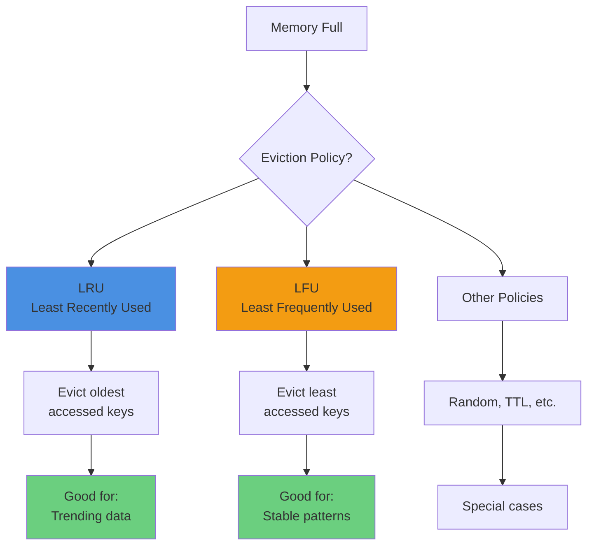
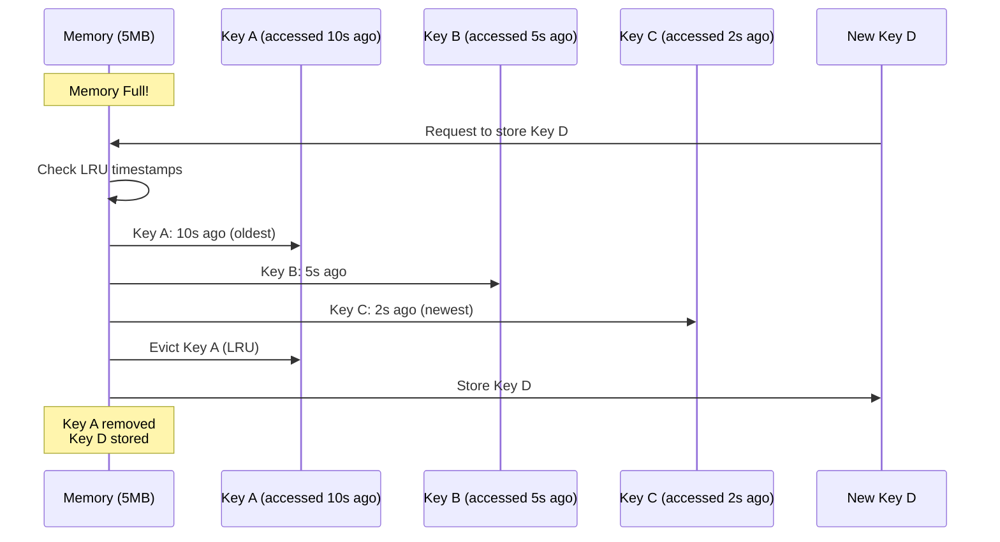
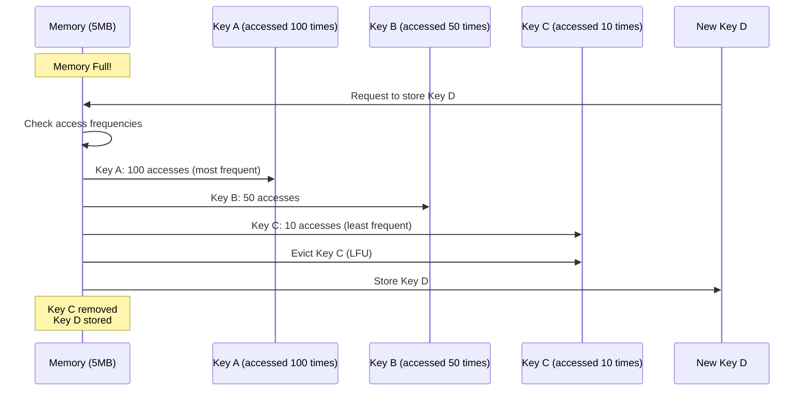
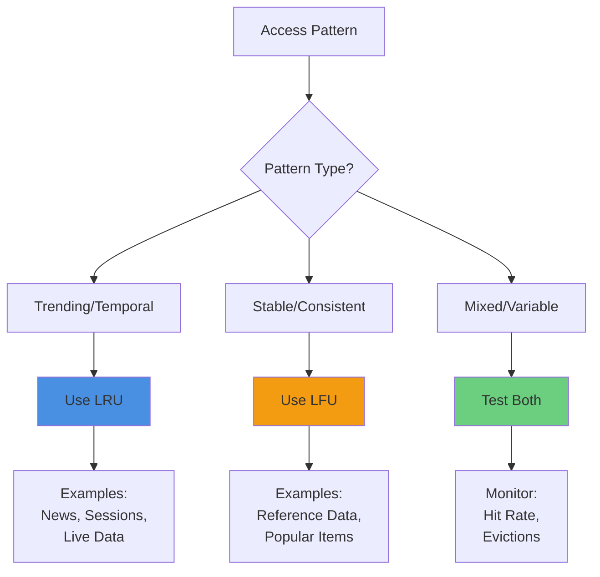
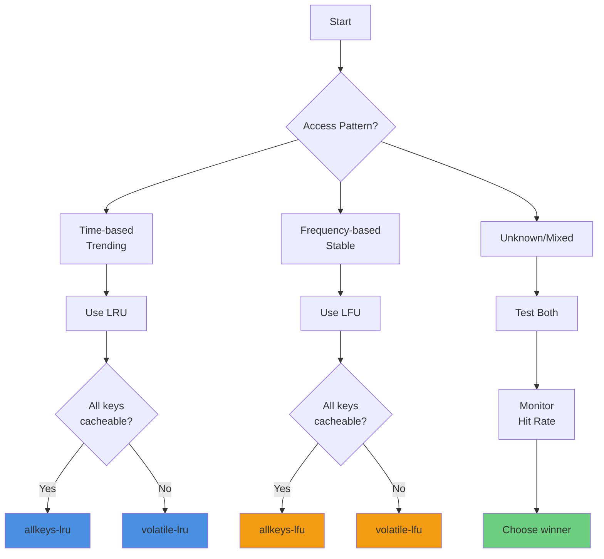

# 4.4 Eviction Policies: LRU vs LFU

## Overview

When Valkey reaches its memory limit, it must decide which keys to evict to make room for new data. Understanding eviction policies is crucial for optimizing cache performance and ensuring the right data stays in memory.



## Least Recently Used (LRU)

### How LRU Works

LRU evicts keys that haven't been accessed for the longest time. It tracks the last access time for each key and removes the "oldest" ones when memory is full.



**LRU Characteristics:**
- ✅ Favors recently accessed data
- ✅ Good for time-sensitive content
- ✅ Adapts quickly to changing patterns
- ⚠️ Can evict frequently used but not recently accessed data
- ⚠️ Vulnerable to cache pollution from one-time scans

### Best Use Cases for LRU

**1. Trending Content**
```python
# News articles, social media posts
# Recent articles get more traffic
cache_key = "article:trending:12345"
# LRU keeps hot trending content in cache
```

**2. Session Data**
```python
# Active user sessions
# Recently active users are more likely to return
cache_key = "session:user:67890"
# LRU evicts inactive sessions first
```

**3. Time-Sensitive Data**
```python
# Current flight status, live scores
# Recent data is more relevant
cache_key = "flight:status:AA123:current"
# LRU prioritizes current information
```

**4. User Activity Streams**
```python
# Recent user actions, notifications
# Latest activity is most important
cache_key = "activity:user:12345:recent"
# LRU keeps recent activity accessible
```

### LRU Configuration

```conf
# Basic LRU configuration
maxmemory 5mb
maxmemory-policy allkeys-lru

# LRU with sampling (default: 5)
# Higher = more accurate but slower
lru-samples 5
```

## Least Frequently Used (LFU)

### How LFU Works

LFU evicts keys that are accessed least frequently. It tracks access count for each key and removes the ones with the lowest access frequency when memory is full.



**LFU Characteristics:**
- ✅ Favors frequently accessed data
- ✅ Good for stable access patterns
- ✅ Resistant to cache pollution from scans
- ⚠️ Slow to adapt to changing patterns
- ⚠️ Can keep old popular data too long
- ⚠️ New keys start with low frequency (cold start)

### Best Use Cases for LFU

**1. Reference Data**
```python
# Airports, airlines, countries
# Accessed frequently, stable over time
cache_key = "airport:SEA"
# LFU keeps frequently referenced data
```

**2. Popular Products**
```python
# Best-sellers, top-rated items
# Consistently high access frequency
cache_key = "product:bestseller:12345"
# LFU maintains popular items in cache
```

**3. Configuration Data**
```python
# Application settings, feature flags
# Accessed on every request
cache_key = "config:app:settings"
# LFU ensures config stays cached
```

**4. Static Content**
```python
# Logos, common images, templates
# High frequency, stable access
cache_key = "static:logo:company"
# LFU keeps frequently used assets
```

### LFU Configuration

```conf
# Basic LFU configuration
maxmemory 5mb
maxmemory-policy allkeys-lfu

# LFU decay time (minutes)
# How fast frequency counter decays
lfu-decay-time 1

# LFU log factor
# Controls counter increment rate
lfu-log-factor 10
```

**LFU Parameters Explained:**

- **lfu-decay-time**: How quickly access frequency decays over time (in minutes)
  - Lower value = faster decay (adapts quicker to new patterns)
  - Higher value = slower decay (maintains historical frequency longer)
  - Default: 1 minute

- **lfu-log-factor**: Controls how quickly the counter increments
  - Higher value = slower increment (more accesses needed to increase counter)
  - Lower value = faster increment (fewer accesses needed)
  - Default: 10

## LRU vs LFU: Head-to-Head Comparison

### Access Pattern Scenarios



### Comparison Table

| Aspect | LRU | LFU |
|--------|-----|-----|
| **Eviction Criteria** | Last access time | Access frequency |
| **Tracks** | When key was last accessed | How many times key was accessed |
| **Best For** | Trending, time-sensitive data | Stable, frequently accessed data |
| **Adapts to Changes** | Fast (immediately) | Slow (gradual decay) |
| **Cache Pollution** | Vulnerable (one-time scans) | Resistant (requires multiple accesses) |
| **Cold Start** | No penalty | New keys start with low frequency |
| **Memory Overhead** | Low (timestamp only) | Medium (counter + timestamp) |
| **Use Cases** | News, sessions, live data | Reference data, popular items |

### Example: Airport Application

**Scenario 1: Flight Status (Use LRU)**
```python
# Flight status changes frequently
# Users check current flights, not old ones
# Recent data is most relevant

cache_key = "flight:status:AA123:2025-11-25"
# LRU: Keeps current flight status
# Evicts old flight status from yesterday
```

**Scenario 2: Airport Information (Use LFU)**
```python
# Airport data rarely changes
# Major airports accessed frequently
# Stable access pattern

cache_key = "airport:SEA"
# LFU: Keeps frequently accessed airports (SEA, LAX, JFK)
# Evicts rarely accessed small airports
```

## All Eviction Policies

Valkey supports multiple eviction policies for different scenarios:

### 1. LRU Policies

```conf
# allkeys-lru: LRU among all keys
maxmemory-policy allkeys-lru

# volatile-lru: LRU among keys with TTL only
maxmemory-policy volatile-lru
```

**When to use:**
- `allkeys-lru`: When all keys are cache candidates
- `volatile-lru`: When mixing cache (with TTL) and persistent data (no TTL)

### 2. LFU Policies

```conf
# allkeys-lfu: LFU among all keys
maxmemory-policy allkeys-lfu

# volatile-lfu: LFU among keys with TTL only
maxmemory-policy volatile-lfu
```

**When to use:**
- `allkeys-lfu`: When all keys are cache candidates with stable patterns
- `volatile-lfu`: When mixing cache and persistent data with stable access

### 3. Random Policies

```conf
# allkeys-random: Random eviction among all keys
maxmemory-policy allkeys-random

# volatile-random: Random eviction among keys with TTL
maxmemory-policy volatile-random
```

**When to use:**
- Simple, no tracking overhead
- When access patterns are truly random
- Testing/development environments

### 4. TTL Policy

```conf
# volatile-ttl: Evict keys with shortest TTL first
maxmemory-policy volatile-ttl
```

**When to use:**
- When TTL represents data importance
- Short TTL = less important, evict first
- Long TTL = more important, keep longer

### 5. No Eviction

```conf
# noeviction: Return errors when memory full
maxmemory-policy noeviction
```

**When to use:**
- When data loss is unacceptable
- Using Valkey as primary store (not cache)
- Prefer errors over data loss

## Hands-on Demo: LRU vs LFU

Let's compare LRU and LFU behavior with a practical experiment using limited memory (5MB) and 1KB keys.

### Step 1: Create Configuration Files

**Create `valkey_lru.conf`:**

```bash
cat > valkey_lru.conf << 'EOF'
# Valkey LRU Configuration
# Port for LRU instance
port 6380

# Memory limit: 5MB
maxmemory 5mb

# Eviction policy: LRU
maxmemory-policy allkeys-lru

# LRU samples (higher = more accurate)
maxmemory-samples 5

# Disable persistence for testing
save ""
appendonly no

# Logging
loglevel notice
logfile ""

# Bind to localhost only
bind 127.0.0.1

# Disable protected mode for local testing
protected-mode no
EOF
```

**Create `valkey_lfu.conf`:**

```bash
cat > valkey_lfu.conf << 'EOF'
# Valkey LFU Configuration
# Port for LFU instance
port 6381

# Memory limit: 5MB
maxmemory 5mb

# Eviction policy: LFU
maxmemory-policy allkeys-lfu

# LFU decay time (1 minute)
lfu-decay-time 1

# LFU log factor (10 = default)
lfu-log-factor 10

# Disable persistence for testing
save ""
appendonly no

# Logging
loglevel notice
logfile ""

# Bind to localhost only
bind 127.0.0.1

# Disable protected mode for local testing
protected-mode no
EOF
```

### Step 2: Start Both Valkey Instances

```bash
# Start LRU instance on port 6380
valkey-server valkey_lru.conf &

# Start LFU instance on port 6381
valkey-server valkey_lfu.conf &

# Verify both are running
ps aux | grep valkey-server

# Expected output:
# valkey-server *:6380 (LRU)
# valkey-server *:6381 (LFU)
```

### Step 3: Populate with valkey-benchmark

The benchmark will create keys with 1KB of data. With 5MB memory, we can fit approximately 5,000 keys (5MB / 1KB = 5,000).

**Populate LRU instance:**

```bash
# Populate LRU instance (port 6380)
# -d 1024: 1KB data size
# -n 10000: 10,000 requests (will trigger evictions)
# -t set: Only SET operations
# -r 10000: Random keys from 0-9999

valkey-benchmark -p 6380 -d 1024 -n 10000 -t set -r 10000 -q

# Expected output:
# SET: 50000.00 requests per second
```

**Populate LFU instance:**

```bash
# Populate LFU instance (port 6381)
valkey-benchmark -p 6381 -d 1024 -n 10000 -t set -r 10000 -q

# Expected output:
# SET: 50000.00 requests per second
```

### Step 4: Check Memory Usage with INFO

**Check LRU instance:**

```bash
valkey-cli -p 6380 INFO memory

# Key metrics to observe:
# used_memory_human: ~5.00M (at limit)
# used_memory_peak_human: ~5.00M
# maxmemory_human: 5.00M
# maxmemory_policy: allkeys-lru
# evicted_keys: ~5000 (approximately)
```

**Check LFU instance:**

```bash
valkey-cli -p 6381 INFO memory

# Key metrics to observe:
# used_memory_human: ~5.00M (at limit)
# used_memory_peak_human: ~5.00M
# maxmemory_human: 5.00M
# maxmemory_policy: allkeys-lfu
# evicted_keys: ~5000 (approximately)
```

**Compare eviction stats:**

```bash
# LRU evictions
valkey-cli -p 6380 INFO stats | grep evicted_keys

# LFU evictions
valkey-cli -p 6381 INFO stats | grep evicted_keys

# Both should show similar eviction counts
# since we filled memory beyond capacity
```

### Step 5: Analyze Key Distribution

**Count keys in each instance:**

```bash
# Count keys in LRU instance
valkey-cli -p 6380 DBSIZE

# Count keys in LFU instance
valkey-cli -p 6381 DBSIZE

# Both should have ~5000 keys (5MB / 1KB)
```

**Sample keys and check TTL:**

```bash
# LRU instance: Sample 10 random keys
for i in {1..10}; do
    key=$(valkey-cli -p 6380 RANDOMKEY)
    ttl=$(valkey-cli -p 6380 TTL "$key")
    echo "LRU - Key: $key, TTL: $ttl"
done

# LFU instance: Sample 10 random keys
for i in {1..10}; do
    key=$(valkey-cli -p 6381 RANDOMKEY)
    ttl=$(valkey-cli -p 6381 TTL "$key")
    echo "LFU - Key: $key, TTL: $ttl"
done

# Expected: TTL = -1 (no expiration set by benchmark)
```

### Step 6: Test Access Pattern Differences

**Scenario: Access some keys multiple times**

```bash
# Access key:1 multiple times in both instances
for i in {1..100}; do
    valkey-cli -p 6380 GET key:1 > /dev/null
    valkey-cli -p 6381 GET key:1 > /dev/null
done

# Access key:2 multiple times
for i in {1..100}; do
    valkey-cli -p 6380 GET key:2 > /dev/null
    valkey-cli -p 6381 GET key:2 > /dev/null
done

# Access key:3 once
valkey-cli -p 6380 GET key:3 > /dev/null
valkey-cli -p 6381 GET key:3 > /dev/null
```

**Now add new keys to trigger evictions:**

```bash
# Add 100 new keys to trigger evictions
for i in {20000..20100}; do
    valkey-cli -p 6380 SET "newkey:$i" "$(head -c 1024 /dev/urandom | base64)" > /dev/null
    valkey-cli -p 6381 SET "newkey:$i" "$(head -c 1024 /dev/urandom | base64)" > /dev/null
done
```

**Check if frequently accessed keys survived:**

```bash
# Check key:1 (accessed 100 times)
echo "LRU - key:1 exists: $(valkey-cli -p 6380 EXISTS key:1)"
echo "LFU - key:1 exists: $(valkey-cli -p 6381 EXISTS key:1)"

# Check key:2 (accessed 100 times)
echo "LRU - key:2 exists: $(valkey-cli -p 6380 EXISTS key:2)"
echo "LFU - key:2 exists: $(valkey-cli -p 6381 EXISTS key:2)"

# Check key:3 (accessed once)
echo "LRU - key:3 exists: $(valkey-cli -p 6380 EXISTS key:3)"
echo "LFU - key:3 exists: $(valkey-cli -p 6381 EXISTS key:3)"

# Expected results:
# LRU: key:1 and key:2 likely exist (recently accessed)
# LFU: key:1 and key:2 likely exist (frequently accessed)
# Both: key:3 may be evicted (low access)
```

### Step 7: Detailed Memory Analysis

**Get detailed memory stats:**

```bash
# LRU instance detailed stats
valkey-cli -p 6380 INFO memory | grep -E "used_memory|maxmemory|evicted"

# Sample output:
# used_memory:5242880
# used_memory_human:5.00M
# maxmemory:5242880
# maxmemory_human:5.00M
# maxmemory_policy:allkeys-lru
# evicted_keys:5123

# LFU instance detailed stats
valkey-cli -p 6381 INFO memory | grep -E "used_memory|maxmemory|evicted"

# Sample output:
# used_memory:5242880
# used_memory_human:5.00M
# maxmemory:5242880
# maxmemory_human:5.00M
# maxmemory_policy:allkeys-lfu
# evicted_keys:5098
```

**Check eviction statistics:**

```bash
# LRU eviction stats
valkey-cli -p 6380 INFO stats | grep -E "evicted_keys|expired_keys|keyspace"

# LFU eviction stats
valkey-cli -p 6381 INFO stats | grep -E "evicted_keys|expired_keys|keyspace"
```

### Step 8: Visualize Key Distribution

**Create a script to analyze key distribution:**

```bash
cat > analyze_keys.sh << 'EOF'
#!/bin/bash

PORT=$1
POLICY=$2

echo "=== $POLICY Instance (Port $PORT) ==="
echo ""

# Total keys
TOTAL=$(valkey-cli -p $PORT DBSIZE)
echo "Total keys: $TOTAL"

# Memory usage
MEMORY=$(valkey-cli -p $PORT INFO memory | grep used_memory_human | cut -d: -f2 | tr -d '\r')
echo "Memory used: $MEMORY"

# Evicted keys
EVICTED=$(valkey-cli -p $PORT INFO stats | grep evicted_keys | cut -d: -f2 | tr -d '\r')
echo "Evicted keys: $EVICTED"

# Sample 20 keys and check if they exist
echo ""
echo "Sampling keys (key:1 to key:20):"
for i in {1..20}; do
    EXISTS=$(valkey-cli -p $PORT EXISTS "key:$i")
    if [ "$EXISTS" -eq 1 ]; then
        echo "  key:$i - EXISTS"
    else
        echo "  key:$i - EVICTED"
    fi
done

echo ""
EOF

chmod +x analyze_keys.sh

# Run analysis
./analyze_keys.sh 6380 "LRU"
./analyze_keys.sh 6381 "LFU"
```

### Step 9: Test Cache Pollution Resistance

**LRU is vulnerable to cache pollution from one-time scans:**

```bash
# Scan through many keys once (cache pollution)
for i in {30000..30500}; do
    valkey-cli -p 6380 SET "scan:$i" "$(head -c 1024 /dev/urandom | base64)" > /dev/null
    valkey-cli -p 6381 SET "scan:$i" "$(head -c 1024 /dev/urandom | base64)" > /dev/null
done

# Check if our frequently accessed keys survived
echo "After cache pollution scan:"
echo "LRU - key:1 exists: $(valkey-cli -p 6380 EXISTS key:1)"
echo "LFU - key:1 exists: $(valkey-cli -p 6381 EXISTS key:1)"

# Expected:
# LRU: key:1 may be evicted (scan keys are more recent)
# LFU: key:1 likely survives (higher frequency count)
```

### Step 10: Cleanup

```bash
# Stop both instances
valkey-cli -p 6380 SHUTDOWN NOSAVE
valkey-cli -p 6381 SHUTDOWN NOSAVE

# Remove configuration files (optional)
rm valkey_lru.conf valkey_lfu.conf analyze_keys.sh
```

## Interpreting Results

### Expected Observations

**LRU Behavior:**
- ✅ Recently accessed keys stay in cache
- ✅ Quick adaptation to new access patterns
- ⚠️ Vulnerable to cache pollution from scans
- ⚠️ Frequently accessed but not recent keys may be evicted

**LFU Behavior:**
- ✅ Frequently accessed keys stay in cache
- ✅ Resistant to cache pollution from one-time scans
- ⚠️ Slower to adapt to changing patterns
- ⚠️ New keys start with low frequency (cold start problem)

### Key Metrics to Monitor

```bash
# Memory metrics
used_memory_human          # Current memory usage
maxmemory_human           # Memory limit
mem_fragmentation_ratio   # Memory fragmentation

# Eviction metrics
evicted_keys              # Total keys evicted
evicted_keys_per_sec      # Eviction rate

# Hit rate metrics
keyspace_hits             # Successful lookups
keyspace_misses           # Failed lookups
# Hit rate = hits / (hits + misses)
```

## Choosing the Right Policy

### Decision Framework



### Recommendation Matrix

| Scenario | Recommended Policy | Rationale |
|----------|-------------------|-----------|
| News website | `allkeys-lru` | Recent articles get most traffic |
| Product catalog | `allkeys-lfu` | Popular products accessed frequently |
| User sessions | `allkeys-lru` | Recent sessions are active |
| Reference data | `allkeys-lfu` | Stable, frequently accessed |
| Mixed workload | Test both | Monitor hit rate and choose |
| API rate limiting | `volatile-ttl` | TTL represents limit window |
| Primary data store | `noeviction` | Cannot lose data |

## Production Best Practices

### 1. Monitor Eviction Metrics

```bash
# Check eviction rate
valkey-cli INFO stats | grep evicted_keys

# Calculate hit rate
HITS=$(valkey-cli INFO stats | grep keyspace_hits | cut -d: -f2)
MISSES=$(valkey-cli INFO stats | grep keyspace_misses | cut -d: -f2)
HIT_RATE=$(echo "scale=2; $HITS / ($HITS + $MISSES) * 100" | bc)
echo "Hit rate: $HIT_RATE%"

# Target: > 80% hit rate
```

### 2. Right-Size Memory

```bash
# Monitor memory usage over time
valkey-cli INFO memory | grep used_memory_human

# If frequently hitting maxmemory:
# - Increase maxmemory
# - Reduce TTL
# - Review what's being cached
```

### 3. Test Before Production

```bash
# Test with production-like workload
# Compare LRU vs LFU hit rates
# Choose policy with better performance
```

### 4. Use Appropriate Policy Variants

```bash
# If mixing cache and persistent data:
# Use volatile-* policies

# Cache data (with TTL)
SET cache:key value EX 3600

# Persistent data (no TTL)
SET persistent:key value

# Policy: volatile-lru or volatile-lfu
# Only cache keys (with TTL) are evicted
```

## Key Takeaways

### LRU vs LFU Summary

**Use LRU when:**
- ✅ Access patterns change frequently
- ✅ Recent data is more important
- ✅ Trending/time-sensitive content
- ✅ Need quick adaptation to new patterns

**Use LFU when:**
- ✅ Access patterns are stable
- ✅ Frequency matters more than recency
- ✅ Reference/configuration data
- ✅ Need resistance to cache pollution

### Essential Principles

1. **Match policy to access pattern**: LRU for temporal, LFU for stable
2. **Monitor hit rate**: Target > 80% for effective caching
3. **Test in production-like conditions**: Real workload reveals best policy
4. **Right-size memory**: Frequent evictions indicate insufficient memory
5. **Use volatile-* for mixed workloads**: Separate cache from persistent data

### Remember

> "The best eviction policy is the one that keeps your most valuable data in cache. Test with real workloads to find out which that is."

Understanding eviction policies and choosing the right one for your access patterns is crucial for optimal cache performance. Use the hands-on exercises to experiment and find what works best for your application.
