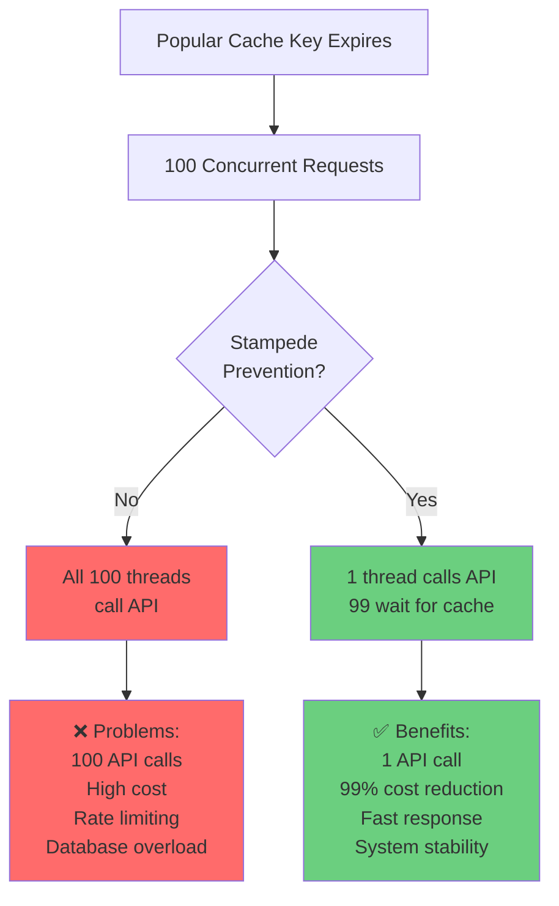
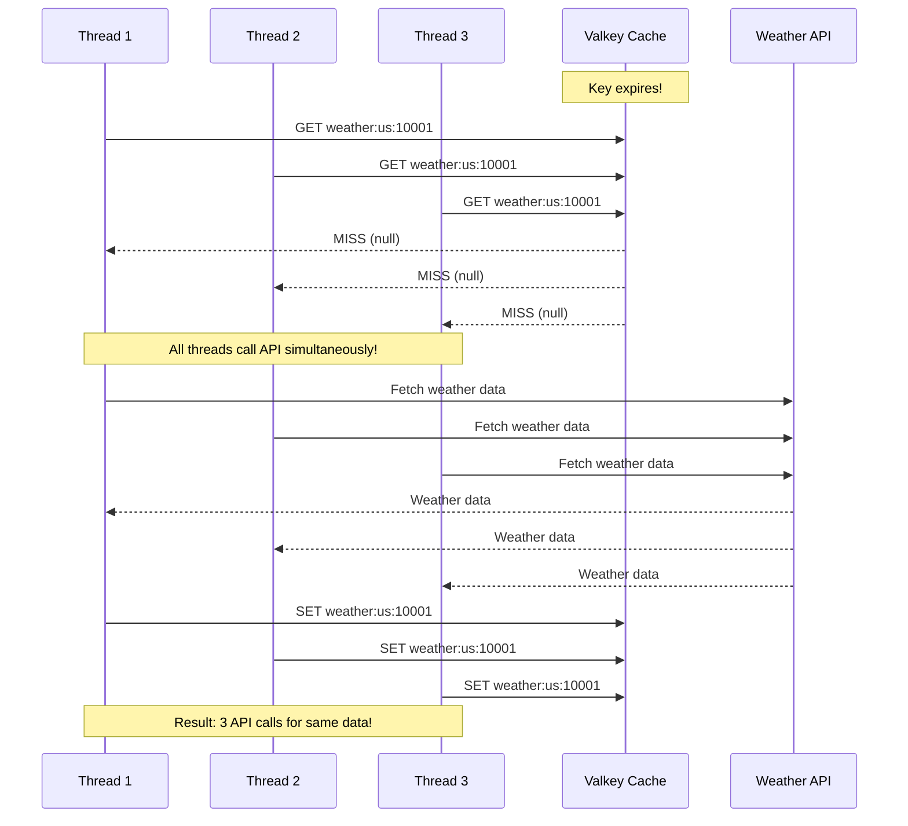
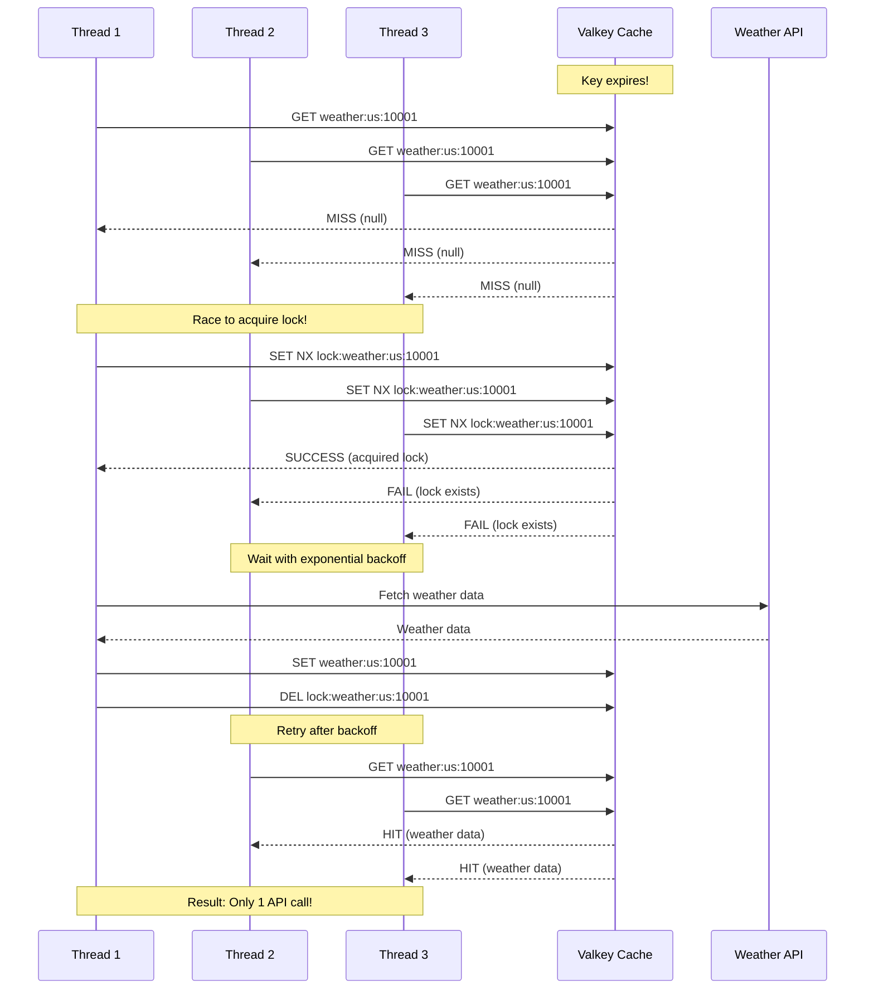
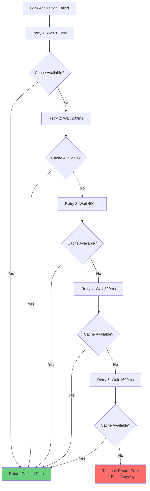
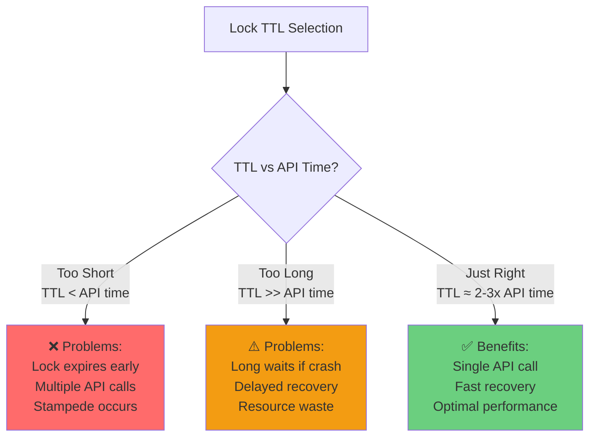

# 4.5 Stampede Prevention Techniques

## Overview

Cache stampede (also known as "thundering herd") occurs when multiple concurrent requests try to fetch the same missing cache entry simultaneously, resulting in multiple expensive operations (e.g., API calls, database queries) for the same data. Learn to prevent cache stampedes using distributed locks and exponential backoff.



## What is a Cache Stampede?

When a popular cache key expires, multiple clients simultaneously try to regenerate it, causing:

### The Problem Visualized

**Without Stampede Prevention:**



**Problems:**
- ❌ **Database/API Overload**: 100 requests = 100 API calls
- ❌ **Duplicate Work**: All threads fetch the same data
- ❌ **High Costs**: Unnecessary API calls cost money
- ❌ **Rate Limiting**: May hit API rate limits
- ❌ **Cascading Failures**: Can overwhelm downstream systems
- ❌ **Poor Performance**: All threads wait for slow API

## Prevention Techniques

### 1. Distributed Locks

Using Valkey to implement distributed locking ensures only one thread regenerates the cache:

**With Stampede Prevention:**



**Benefits:**
- ✅ **Single API Call**: Only one thread fetches data
- ✅ **Cost Reduction**: 99% fewer API calls
- ✅ **System Stability**: No overload
- ✅ **Fast Response**: Other threads get cached data quickly

### 2. Distributed Lock Implementation

**Pseudocode for Lock Acquisition:**

```python
def acquire_lock(cache_key, timeout_seconds=10):
    """
    Acquire a distributed lock using SET NX (set if not exists)
    
    Args:
        cache_key: The cache key to lock
        timeout_seconds: Lock timeout (prevents deadlocks)
    
    Returns:
        True if lock acquired, False otherwise
    """
    lock_key = f"lock:{cache_key}"
    
    # SET NX: Set if Not eXists
    # EX: Set expiration time
    success = valkey.set(lock_key, "1", nx=True, ex=timeout_seconds)
    
    return success  # True if lock acquired, False if already locked

def release_lock(cache_key):
    """Release the distributed lock"""
    lock_key = f"lock:{cache_key}"
    valkey.delete(lock_key)
```

**Pseudocode for Stampede-Protected Fetch:**

```python
def fetch_with_stampede_protection(cache_key):
    """
    Fetch data with stampede prevention
    
    Flow:
    1. Try cache first
    2. On miss, try to acquire lock
    3. If lock acquired: fetch data, cache it, release lock
    4. If lock failed: wait with exponential backoff, retry
    """
    
    # Step 1: Try cache first
    cached_data = cache.get(cache_key)
    if cached_data:
        return cached_data  # Cache hit - fast path
    
    # Step 2: Cache miss - try to acquire lock
    if acquire_lock(cache_key, timeout=10):
        try:
            # Double-check cache after acquiring lock
            # Another thread might have populated it
            cached_data = cache.get(cache_key)
            if cached_data:
                return cached_data
            
            # Fetch from source (API, database, etc.)
            data = fetch_from_api(cache_key)
            
            # Cache the result
            cache.set(cache_key, data, ttl=600)  # 10 minutes
            
            return data
            
        finally:
            # Always release lock
            release_lock(cache_key)
    
    else:
        # Could not acquire lock - another thread is fetching
        # Wait with exponential backoff
        return wait_for_cache_with_backoff(cache_key)
```

### 3. Exponential Backoff

When a thread fails to acquire the lock, it should retry with exponential backoff to reduce contention:



**Pseudocode for Exponential Backoff:**

```python
def wait_for_cache_with_backoff(cache_key, max_retries=5):
    """
    Wait for cache with exponential backoff
    
    Backoff sequence: 100ms, 200ms, 400ms, 800ms, 1600ms
    Total max wait: ~3 seconds
    """
    base_delay = 0.1  # 100ms
    
    for retry in range(max_retries):
        # Calculate delay with exponential backoff
        # Add random jitter to prevent synchronized retries
        delay = base_delay * (2 ** retry) + random.uniform(0, 0.1)
        
        # Wait before retry
        time.sleep(delay)
        
        # Try to get from cache
        cached_data = cache.get(cache_key)
        if cached_data:
            return cached_data  # Success!
    
    # Timeout after max retries
    # Options:
    # 1. Return None (fail fast)
    # 2. Fetch from source anyway (fallback)
    # 3. Return stale data if available
    return None  # or fetch_from_api(cache_key)
```

**Why Exponential Backoff Works:**

| Retry | Delay | Cumulative Wait | Rationale |
|-------|-------|-----------------|-----------|
| 1 | 100ms | 100ms | Quick first retry |
| 2 | 200ms | 300ms | Give lock holder more time |
| 3 | 400ms | 700ms | Reduce contention |
| 4 | 800ms | 1.5s | API call likely complete |
| 5 | 1600ms | 3.1s | Final attempt before timeout |

## Hands-on Demo: Weather API

Let's see stampede prevention in action with the weather API demo.

### Demo Options

```bash
uv run samples/demo_stampede_prevention.py --help
```

**Key Parameters:**
- `--requests` (-r): Number of concurrent requests per city (simulates traffic)
- `--threads` (-t): Number of worker threads (simulates concurrency)
- `--cities` (-c): Number of cities to test
- `--lock-ttl` (-l): Lock TTL in milliseconds (critical parameter!)
- `--interactive` (-i): Step-by-step mode with prompts
- `--verbose` (-v): Show detailed thread information
- `--flush` (-f): Clear cache before test

### Scenario 1: Short Lock TTL (Stampede Risk)

Run with a very short lock TTL (100ms) to demonstrate stampede:

```bash
uv run samples/demo_stampede_prevention.py -r 100 -t 4 -c 2 -l 100 -i -f
```

**Configuration:**
```
Concurrent requests per city: 100
Worker threads: 4
Number of cities: 2
Lock TTL: 100ms (0.1s) ⚠️  <- Too short!
```

**Expected Results (from demo log):**

```
TEST #1: New York, US (100 concurrent requests)
─────────────────────────────────────────────────
Total Requests:      100
Cache Hits:          0 (0.0% hit rate)
Cache Misses:        0
API Calls:           0  ← Should be 1!
Lock Acquisitions:   0
Lock Waits:          100
Timeouts:            100  ← All requests timed out!

Min Latency:         3.222s
Avg Latency:         3.373s
Max Latency:         3.559s

Stampede Prevention: ✓ SUCCESS (but with timeouts)
```

**What Happened:**
- ⚠️ Lock TTL (100ms) was too short
- ⚠️ Lock expired before API call completed (~300ms)
- ⚠️ All threads timed out waiting
- ⚠️ High latency due to retries and timeouts
- ❌ **Problem**: Lock TTL must be longer than API call time!

### Scenario 2: Proper Lock TTL (Stampede Prevention)

Run with appropriate lock TTL (60 seconds) for effective stampede prevention:

```bash
uv run samples/demo_stampede_prevention.py -r 100 -t 4 -c 2 -l 60000 -i -f
```

**Configuration:**
```
Concurrent requests per city: 100
Worker threads: 4
Number of cities: 2
Lock TTL: 60000ms (60.0s)  ← Appropriate!
```

**Expected Results (from demo log):**

```
TEST #1: Houston, US (100 concurrent requests)
───────────────────────────────────────────────
Total Requests:      100
Cache Hits:          99 (99.0% hit rate)  ← Excellent!
Cache Misses:        1
API Calls:           1  ← Perfect! Only 1 API call
Lock Acquisitions:   1
Lock Waits:          3 (Avg wait: 447.2ms)

Min Latency:         0.2ms  ← Cache hits are fast!
Avg Latency:         8.9ms
Max Latency:         466.5ms  ← API call latency

Cache Hit Latency:   7.3ms
API Call Latency:    318.0ms
Cache Speedup:       43.4x faster  ← Huge improvement!

Stampede Prevention: ✓ SUCCESS
```

**What Happened:**
- ✅ Lock TTL (60s) was sufficient for API call (~300ms)
- ✅ Only 1 thread made the API call
- ✅ 99 threads got data from cache
- ✅ 99% cache hit rate
- ✅ 43.4x faster average response time
- ✅ **Success**: Prevented 99 unnecessary API calls!

### Overall Summary (2 Cities, 200 Total Requests)

```
Aggregate Results:
──────────────────
Total Tests:                 2
Total Requests:              200
Total API Calls:             2  ← Ideal: 1 per city
API Call Reduction:          99.0%  ← Prevented 198 calls!
Cache Hits:                  198 (99.0% hit rate)
Lock Waits:                  6
Stampede Prevention Success: 2/2

Min Latency:                 0.1ms
Avg Latency:                 12.7ms
Max Latency:                 908.1ms

Avg Cache Hit Latency:       10.2ms
Avg API Call Latency:        494.9ms
Overall Cache Speedup:       48.4x faster
```

**Key Insights:**
- 🎯 **99% API Call Reduction**: 200 requests → 2 API calls
- ⚡ **48.4x Faster**: Cache hits vs API calls
- 💰 **Significant Cost Savings**: 198 fewer API calls
- 🔒 **Effective Locking**: Only 6 threads waited for lock
- ✅ **System Stability**: No API overload

## Lock TTL Considerations

The lock TTL is the most critical parameter for stampede prevention:



### Lock TTL Guidelines

| API Call Time | Recommended Lock TTL | Rationale |
|---------------|---------------------|-----------|
| 100ms | 500ms - 1s | 5-10x buffer for safety |
| 300ms | 1s - 3s | 3-10x buffer |
| 1s | 5s - 10s | 5-10x buffer |
| 5s | 15s - 30s | 3-6x buffer |
| 10s+ | 30s - 60s | 3-6x buffer, max 60s |

**Formula:**
```
Lock TTL = API Call Time × (2 to 10)

- Minimum: 2x API call time (tight but risky)
- Recommended: 5x API call time (safe)
- Maximum: 10x API call time (very safe)
```

### TTL Trade-offs

**Too Short (100ms for 300ms API call):**
```
T0:   Thread 1 acquires lock
T0:   Thread 1 starts API call (300ms)
T100: Lock expires (100ms TTL)
T100: Thread 2 acquires lock
T100: Thread 2 starts API call (duplicate!)
T300: Thread 1 completes, caches data
T400: Thread 2 completes, caches data (wasted!)

Result: 2 API calls instead of 1 = stampede!
```

**Too Long (60s for 300ms API call):**
```
T0:   Thread 1 acquires lock
T0:   Thread 1 starts API call
T0:   Thread 1 crashes!
T0-60: Lock held by crashed thread
T0-60: All other threads wait
T60:  Lock expires
T60:  Thread 2 acquires lock
T60:  Thread 2 completes API call

Result: 60 second delay due to crash
```

**Just Right (3s for 300ms API call):**
```
T0:   Thread 1 acquires lock
T0:   Thread 1 starts API call
T0.3: Thread 1 completes, caches data
T0.3: Thread 1 releases lock
T0.3: Other threads get cached data

If Thread 1 crashes:
T0:   Thread 1 acquires lock
T0:   Thread 1 crashes
T3:   Lock expires (3s TTL)
T3:   Thread 2 acquires lock
T3.3: Thread 2 completes API call

Result: 3 second delay (acceptable)
```

## Key Features of Stampede Prevention

### 1. Double-Check Pattern

Always check cache after acquiring lock:

```python
if acquire_lock(cache_key):
    try:
        # Double-check cache
        cached_data = cache.get(cache_key)
        if cached_data:
            return cached_data  # Another thread populated it!
        
        # Fetch and cache
        data = fetch_from_api()
        cache.set(cache_key, data)
        return data
    finally:
        release_lock(cache_key)
```

**Why?** Another thread might have populated the cache while we were waiting to acquire the lock.

### 2. Lock Timeout (Auto-Expiration)

Locks automatically expire after TTL:

```python
# Lock with 10 second timeout
valkey.set("lock:key", "1", nx=True, ex=10)

# If holder crashes, lock expires after 10s
# Prevents indefinite waiting
```

**Why?** Prevents deadlocks if lock holder crashes.

### 3. Fail-Fast Behavior

Maximum retry limit prevents infinite waiting:

```python
for retry in range(max_retries):  # max_retries = 5
    time.sleep(backoff_delay)
    cached_data = cache.get(cache_key)
    if cached_data:
        return cached_data

# After 5 retries (~3 seconds), give up
return None  # or fetch anyway
```

**Why?** Prevents system hangs and provides predictable behavior.

### 4. Random Jitter

Add randomness to backoff delays:

```python
delay = base_delay * (2 ** retry) + random.uniform(0, 0.1)
```

**Why?** Prevents synchronized retries (thundering herd of retries).

## Performance Benefits

### Without Stampede Prevention

```
100 concurrent requests for same data:
├─ 100 API calls
├─ 100 × $0.001 = $0.10 cost
├─ 100 × 300ms = 30 seconds total API time
├─ Risk of rate limiting
└─ Database/API overload
```

### With Stampede Prevention

```
100 concurrent requests for same data:
├─ 1 API call
├─ 1 × $0.001 = $0.001 cost (99% savings!)
├─ 1 × 300ms = 300ms API time
├─ 99 cache hits @ 10ms = 990ms cache time
├─ Total: 1.29 seconds (23x faster!)
└─ No overload risk
```

**Savings:**
- **API Calls**: 100 → 1 (99% reduction)
- **Cost**: $0.10 → $0.001 (99% savings)
- **Time**: 30s → 1.29s (23x faster)
- **Stability**: No overload risk

## Use Cases for Stampede Prevention

### 1. High-Traffic Scenarios

```python
# Popular cities weather data
cache_key = "weather:us:10001"  # New York
# 10,000 requests/minute
# Without protection: 10,000 API calls
# With protection: 1 API call per cache expiration
```

### 2. Expensive Operations

```python
# Complex database aggregation
cache_key = "analytics:revenue:daily:2025-11-25"
# Query takes 5 seconds
# 100 concurrent requests
# Without protection: 100 × 5s = 500s of DB time
# With protection: 1 × 5s = 5s of DB time
```

### 3. Rate-Limited APIs

```python
# Third-party API with rate limit
cache_key = "api:exchange-rate:USD:EUR"
# Rate limit: 100 requests/minute
# 1000 concurrent requests
# Without protection: Rate limit exceeded!
# With protection: 1 request, no limit issue
```

### 4. Cost Optimization

```python
# Expensive ML model inference
cache_key = "ml:prediction:user:12345"
# Inference cost: $0.01 per request
# 1000 concurrent requests
# Without protection: $10.00
# With protection: $0.01 (99.9% savings!)
```

## Monitoring Metrics

Track these metrics to measure stampede prevention effectiveness:

```python
# Key metrics
api_call_reduction = (requests - api_calls) / requests * 100
cache_hit_rate = cache_hits / total_requests * 100
lock_wait_rate = lock_waits / total_requests * 100
avg_wait_time = total_wait_time / lock_waits
timeout_rate = timeouts / total_requests * 100

# Target values
# api_call_reduction: > 95%
# cache_hit_rate: > 90%
# lock_wait_rate: < 10%
# avg_wait_time: < 500ms
# timeout_rate: < 1%
```

## Best Practices

### 1. Lock TTL Selection

```python
# ✅ Good: TTL = 5x API call time
api_call_time = 300  # ms
lock_ttl = api_call_time * 5  # 1500ms = 1.5s

# ❌ Bad: TTL too short
lock_ttl = 100  # ms (< API call time)

# ⚠️ Acceptable: TTL = 2x API call time (minimum)
lock_ttl = api_call_time * 2  # 600ms
```

### 2. Retry Strategy

```python
# ✅ Good: 5 retries with exponential backoff
max_retries = 5  # Total wait: ~3 seconds
base_delay = 0.1  # 100ms

# ❌ Bad: No retries
max_retries = 0  # Give up immediately

# ❌ Bad: Too many retries
max_retries = 20  # Wait too long
```

### 3. Cache TTL

```python
# ✅ Good: Cache TTL > Lock TTL
lock_ttl = 10  # seconds
cache_ttl = 600  # 10 minutes

# ❌ Bad: Cache TTL < Lock TTL
lock_ttl = 10  # seconds
cache_ttl = 5  # 5 seconds (expires too soon!)
```

### 4. Error Handling

```python
# ✅ Good: Graceful degradation
try:
    data = fetch_with_stampede_protection(cache_key)
    if data is None:
        # Fallback: fetch anyway or return stale data
        data = fetch_from_api(cache_key)
except Exception as e:
    logger.error(f"Stampede protection failed: {e}")
    # Fallback strategy
    return fetch_from_api(cache_key)
```

## Key Takeaways

### Essential Principles

1. **Stampedes Overwhelm Systems**: 100 requests = 100 API calls without protection
2. **Distributed Locks Work**: Only 1 thread fetches, others wait for cache
3. **Lock TTL is Critical**: Must be longer than API call time
4. **Exponential Backoff Reduces Contention**: Progressive delays spread load
5. **Double-Check Pattern Prevents Waste**: Check cache after acquiring lock
6. **Fail-Fast Prevents Hangs**: Maximum retries ensure predictable behavior

### Performance Impact

```
Stampede Prevention Results:
├─ API Call Reduction: 99%
├─ Cost Savings: 99%
├─ Response Time: 48x faster (cache vs API)
├─ System Stability: No overload
└─ Scalability: Handle 100x more traffic
```

### When to Use

**✅ Use Stampede Prevention When:**
- High-traffic scenarios (many concurrent requests)
- Expensive operations (API calls, complex queries)
- Rate-limited APIs (prevent limit exhaustion)
- Cost optimization (reduce unnecessary calls)

**⚠️ May Not Need When:**
- Low traffic (< 10 concurrent requests)
- Fast operations (< 10ms)
- Unique keys per request (no sharing)
- Strong consistency required (can't wait)

### Remember

> "Stampede prevention is like a traffic light for your cache—it ensures only one thread does the expensive work while others wait for the result."

Distributed locking with exponential backoff is a powerful technique for preventing cache stampedes. The demo shows dramatic improvements: 99% API call reduction, 48x faster response times, and significant cost savings. Proper lock TTL tuning is critical for success.
