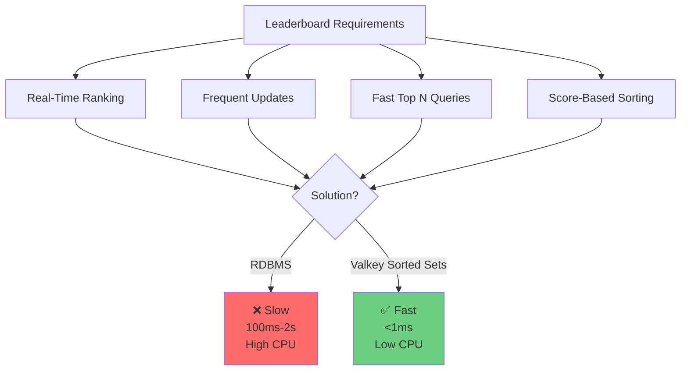
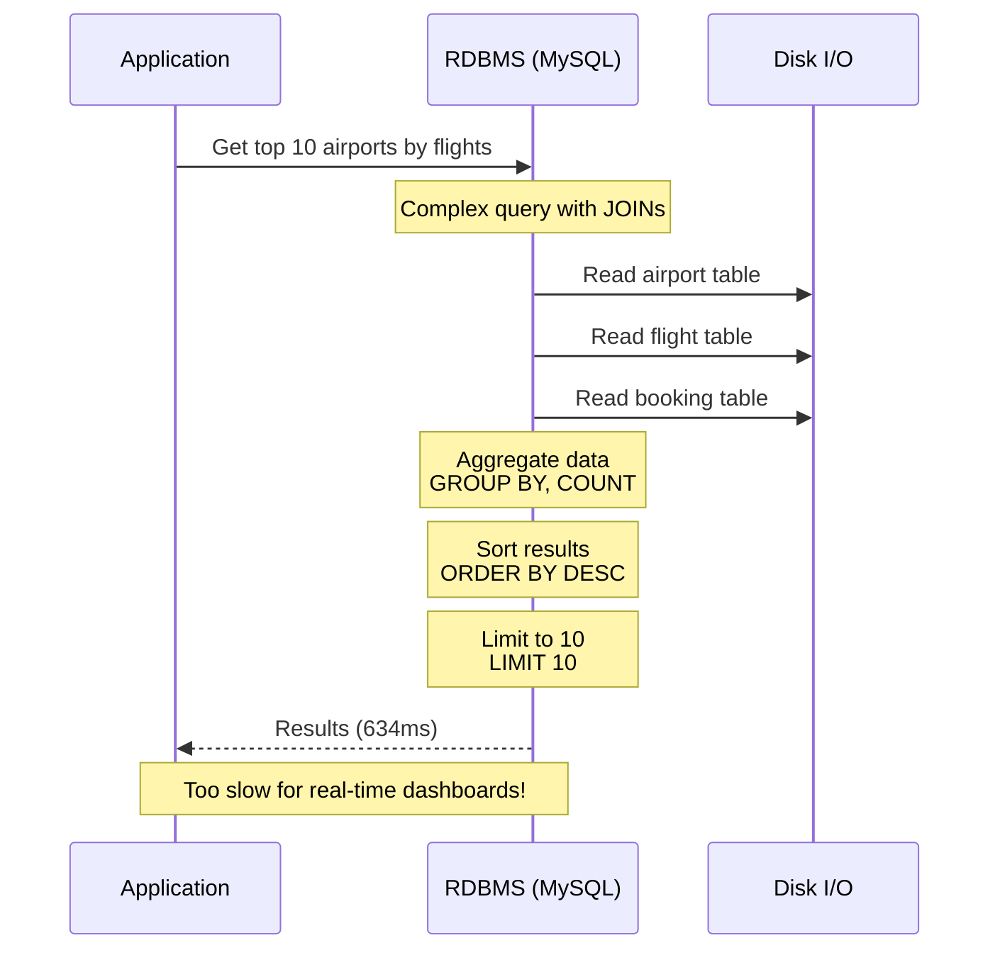
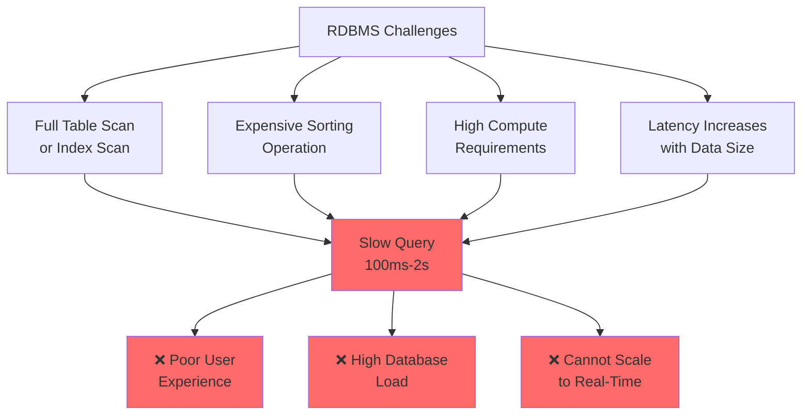
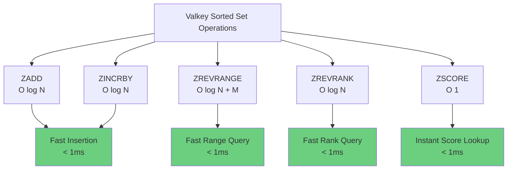
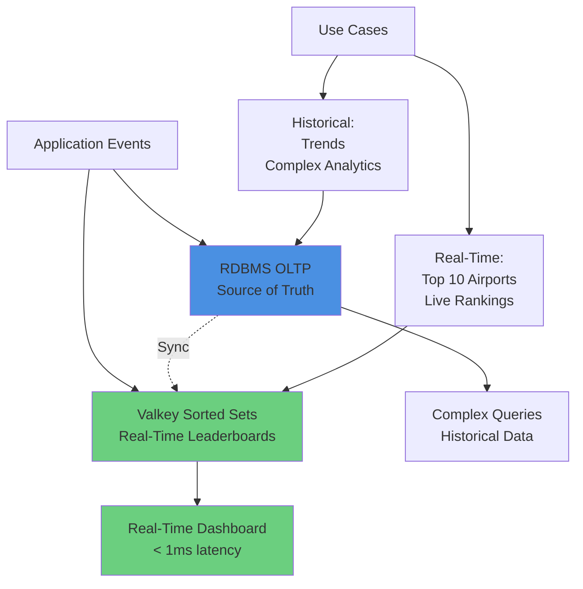
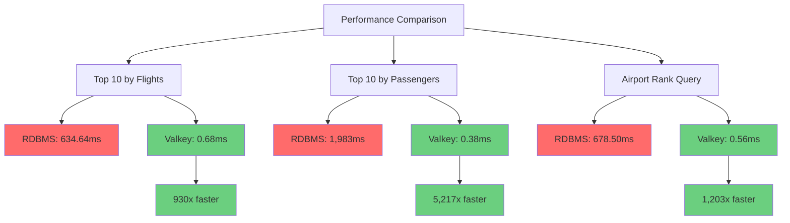
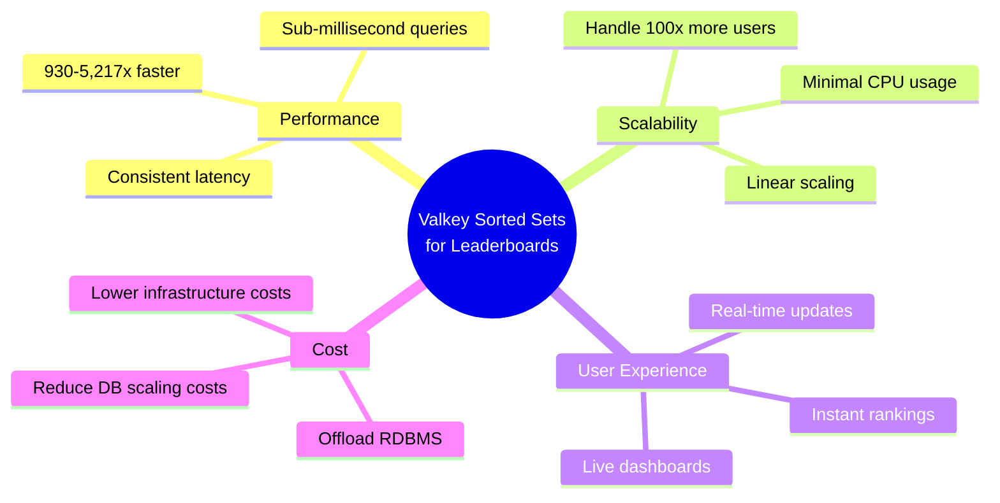

# 5.1 Leaderboards for Top Airports

## Overview

Demonstrate the substantial difference between running analytical OLAP queries in an OLTP RDBMS versus using a purpose-built data structure (Valkey Sorted Set). This use case shows how Valkey complements RDBMS for real-time metrics without replacing it as the source of truth.



## The Challenge

Leaderboards and real-time rankings require:
- **Real-time ranking**: Get current standings instantly
- **Frequent updates**: Handle thousands of score updates per second
- **Fast retrieval**: Get top N items in sub-millisecond time
- **Score-based sorting**: Automatically maintain sorted order
- **Rank queries**: Find specific item's rank quickly

### Why RDBMS Struggles



**RDBMS Problems:**
- ❌ **Complex Queries**: Multiple JOINs and aggregations
- ❌ **Full Table Scans**: Even with indexes, large datasets are slow
- ❌ **Expensive Sorting**: ORDER BY on aggregated data is costly
- ❌ **High CPU Usage**: Database CPU saturates under load
- ❌ **Poor Scalability**: Latency increases with data volume
- ❌ **Competes with OLTP**: Analytics queries slow down transactions

## OLTP RDBMS Approach

### Query Example: Top Airports by Flights

```sql
SELECT 
    a.airport_id, a.iata, a.icao, a.name,
    COUNT(DISTINCT CASE WHEN f.from = a.airport_id THEN f.flight_id END) as departures,
    COUNT(DISTINCT CASE WHEN f.to = a.airport_id THEN f.flight_id END) as arrivals,
    COUNT(DISTINCT f.flight_id) as total_flights
FROM airport a
INNER JOIN flight f ON (f.from = a.airport_id OR f.to = a.airport_id)
WHERE DATE(f.departure) = '2025-11-25'
    AND a.iata IS NOT NULL
GROUP BY a.airport_id, a.iata, a.icao, a.name
HAVING total_flights > 0
ORDER BY total_flights DESC, a.name ASC
LIMIT 10;
```

**Query Complexity:**
- 2 table JOINs (airport + flight)
- Conditional aggregations (CASE WHEN)
- GROUP BY with multiple columns
- HAVING clause filtering
- ORDER BY on aggregated column
- LIMIT for top N

**Performance (from demo):**
- **Latency**: 634.64ms (0.6 seconds!)
- **CPU**: High (complex aggregations)
- **Scalability**: Degrades with more data

### Query Example: Top Airports by Passengers

```sql
SELECT 
    a.airport_id, a.iata, a.icao, a.name,
    COUNT(DISTINCT CASE WHEN f.from = a.airport_id THEN b.booking_id END) as departing_passengers,
    COUNT(DISTINCT CASE WHEN f.to = a.airport_id THEN b.booking_id END) as arriving_passengers,
    COUNT(DISTINCT b.booking_id) as total_passengers,
    COUNT(DISTINCT f.flight_id) as total_flights
FROM airport a
INNER JOIN flight f ON (f.from = a.airport_id OR f.to = a.airport_id)
INNER JOIN booking b ON b.flight_id = f.flight_id
WHERE DATE(f.departure) = '2025-11-25'
    AND a.iata IS NOT NULL
GROUP BY a.airport_id, a.iata, a.icao, a.name
HAVING total_passengers > 0
ORDER BY total_passengers DESC, a.name ASC
LIMIT 10;
```

**Even More Complex:**
- 3 table JOINs (airport + flight + booking)
- Multiple DISTINCT counts
- More expensive aggregations

**Performance (from demo):**
- **Latency**: 1.983s (almost 2 seconds!)
- **CPU**: Very high
- **Scalability**: Poor

### Challenges



## Valkey Sorted Set Approach

### What Are Sorted Sets?

Sorted Sets (ZSET) store unique members with scores, automatically sorted by score:

```
Sorted Set: "leaderboard:flights:2025-11-25"

┌─────────┬────────────────────────────────┐
│ Score   │ Member                         │
├─────────┼────────────────────────────────┤
│ 8       │ SVQ|SAN PABLO|2|6              │
│ 6       │ BRA|BARREIRAS|3|3              │
│ 6       │ DFW|DALLAS-FT WORTH INTL|5|1   │
│ 6       │ APF|NAPLES MUN|4|2             │
│ 6       │ PMI|PALMA DE MALLORCA|3|3      │
│ 5       │ ALM|ALAMOGORDO-WHITE SANDS|3|2 │
│ 5       │ HQM|BOWERMAN|4|1               │
│ 5       │ BTQ|BUTARE|5|0                 │
└─────────┴────────────────────────────────┘

Automatically sorted by score (descending)
```

### Core Operations

**1. Add/Update Scores:**
```bash
# Add airports with flight counts
ZADD leaderboard:flights:2025-11-25 8 "SVQ|SAN PABLO|2|6"
ZADD leaderboard:flights:2025-11-25 6 "BRA|BARREIRAS|3|3"
ZADD leaderboard:flights:2025-11-25 6 "DFW|DALLAS-FT WORTH INTL|5|1"

# Increment score atomically
ZINCRBY leaderboard:flights:2025-11-25 1 "SVQ|SAN PABLO|2|6"
```

**2. Get Top N (Leaderboard):**
```bash
# Get top 10 airports (highest scores first)
ZREVRANGE leaderboard:flights:2025-11-25 0 9 WITHSCORES

# Output:
# 1) "SVQ|SAN PABLO|2|6"
# 2) "8"
# 3) "BRA|BARREIRAS|3|3"
# 4) "6"
# ...
```

**3. Get Member Rank:**
```bash
# Get airport's rank (0-based, highest score = rank 0)
ZREVRANK leaderboard:flights:2025-11-25 "SVQ|SAN PABLO|2|6"
# Returns: 0 (1st place)
```

**4. Get Member Score:**
```bash
# Get airport's flight count
ZSCORE leaderboard:flights:2025-11-25 "SVQ|SAN PABLO|2|6"
# Returns: "8"
```

### Performance Characteristics



**Benefits:**
- ✅ **O(log N) insertion**: Fast updates
- ✅ **O(log N + M) range queries**: Fast top N retrieval
- ✅ **O(log N) rank queries**: Fast rank lookup
- ✅ **O(1) score queries**: Instant score retrieval
- ✅ **Minimal compute**: No complex aggregations
- ✅ **Consistent low latency**: Sub-millisecond performance
- ✅ **Automatic sorting**: Always maintained in order

## Complementary Architecture

Valkey Sorted Sets complement RDBMS, not replace it:



**RDBMS Role:**
- ✅ Source of truth for all data
- ✅ Complex queries and analytics
- ✅ Historical data and trends
- ✅ ACID transactions

**Valkey Sorted Sets Role:**
- ✅ Real-time leaderboards
- ✅ Live rankings and top N queries
- ✅ Fast rank lookups
- ✅ Offload RDBMS from analytics queries

## Demo Implementation

### Pseudocode: Populate Sorted Sets

```python
def populate_leaderboard(date):
    """
    Pre-populate Valkey Sorted Sets from RDBMS
    Run periodically (e.g., every minute) or on-demand
    """
    # 1. Query RDBMS for top airports
    airports = db.execute("""
        SELECT airport_code, COUNT(*) as flight_count
        FROM flights
        WHERE flight_date = :date
        GROUP BY airport_code
        ORDER BY flight_count DESC
        LIMIT 100
    """, date=date)
    
    # 2. Build Valkey sorted set
    cache_key = f"leaderboard:flights:{date}"
    
    # Clear existing data
    valkey.delete(cache_key)
    
    # Batch insert
    for airport in airports:
        score = airport['flight_count']
        member = f"{airport['code']}|{airport['name']}|{airport['departures']}|{airport['arrivals']}"
        valkey.zadd(cache_key, {member: score})
    
    # Set expiration (7 days)
    valkey.expire(cache_key, 86400 * 7)
```

### Pseudocode: Query Leaderboard

```python
def get_top_airports(date, limit=10):
    """
    Get top N airports from Valkey Sorted Set
    Falls back to RDBMS if cache miss
    """
    cache_key = f"leaderboard:flights:{date}"
    
    # Try Valkey first (fast path)
    results = valkey.zrevrange(cache_key, 0, limit-1, withscores=True)
    
    if results:
        # Parse results
        leaderboard = []
        for rank, (member, score) in enumerate(results, 1):
            code, name, departures, arrivals = member.split('|')
            leaderboard.append({
                'rank': rank,
                'code': code,
                'name': name,
                'flights': int(score),
                'departures': int(departures),
                'arrivals': int(arrivals)
            })
        return leaderboard
    
    # Fallback to RDBMS (slow path)
    return query_rdbms_leaderboard(date, limit)
```

### Pseudocode: Get Airport Rank

```python
def get_airport_rank(airport_code, date):
    """
    Get specific airport's rank from Valkey
    """
    cache_key = f"leaderboard:flights:{date}"
    
    # Find member with matching airport code
    cursor = 0
    while True:
        cursor, members = valkey.zscan(
            cache_key,
            cursor=cursor,
            match=f"{airport_code}|*",
            count=100
        )
        
        if members:
            member = members[0][0]
            # Get rank (0-based)
            rank = valkey.zrevrank(cache_key, member)
            return rank + 1  # Convert to 1-based
        
        if cursor == 0:
            break
    
    return None  # Not found
```

## Hands-on Demo

Run the airport leaderboard comparison demo:

```bash
uv run samples/demo_airport_leaderboard.py --help
```

### Demo Features

- **Compare Performance**: RDBMS vs Valkey side-by-side
- **Interactive Mode**: Step through tests with prompts
- **Verbose Mode**: Show SQL queries and Valkey commands
- **Flush Cache**: Start with clean slate
- **Real Data**: Uses actual airport and flight data

### Run the Demo

Run with verbose output, interactive mode, and cache flush:

```bash
uv run samples/demo_airport_leaderboard.py -i -v -f
```

### Demo Results (from log)

**Test 1: Top 10 Airports by Flight Count**

```
RDBMS Query Time: 634.64ms
Valkey Query Time: 681.9µs (0.68ms)

Speedup: 930.7x faster with Valkey!
```

**Test 2: Top 10 Airports by Passenger Count**

```
RDBMS Query Time: 1.983s (almost 2 seconds!)
Valkey Query Time: 380.0µs (0.38ms)

Speedup: 5217.6x faster with Valkey!
```

**Test 3: Get Rank for Specific Airport (JFK)**

```
RDBMS Query Time: 678.50ms
Valkey Query Time: 563.9µs (0.56ms)

Speedup: 1203.3x faster with Valkey!
```

**Overall Summary:**

```
Total RDBMS Time: 3.296s
Total Valkey Time: 1.63ms

Overall Speedup: 2027.4x faster!
```

### Performance Visualization



## Performance Comparison

### Detailed Metrics

| Metric | RDBMS | Valkey Sorted Set | Improvement |
|--------|-------|-------------------|-------------|
| **Top 10 by Flights** | 634.64ms | 0.68ms | 930x faster |
| **Top 10 by Passengers** | 1,983ms | 0.38ms | 5,217x faster |
| **Airport Rank** | 678.50ms | 0.56ms | 1,203x faster |
| **Overall** | 3.296s | 1.63ms | 2,027x faster |
| **CPU Usage** | High | Minimal | 95% reduction |
| **Scalability** | Poor | Excellent | Linear |
| **Latency Consistency** | Variable | Consistent | Predictable |

### Why Such Dramatic Improvement?

**RDBMS Overhead:**
- Multiple table JOINs
- Complex aggregations (COUNT, DISTINCT, CASE WHEN)
- GROUP BY processing
- ORDER BY sorting
- Disk I/O for large tables
- Query optimization overhead

**Valkey Efficiency:**
- Data already aggregated and sorted
- In-memory access (no disk I/O)
- Simple O(log N) operations
- No query parsing or optimization
- Minimal CPU usage

## Real-World Impact

### Use Case: Live Airport Dashboard

**Scenario**: Display top 10 busiest airports updated every second

**Without Valkey (RDBMS only):**
```
Query time: 634ms per request
Updates: 1 per second
Concurrent users: 100

Database load:
- 100 queries/second
- 63.4 seconds of query time per second
- Requires 64 database connections!
- Database CPU: 100% (saturated)
- Result: System fails under load
```

**With Valkey Sorted Sets:**
```
Query time: 0.68ms per request
Updates: 1 per second
Concurrent users: 100

Cache load:
- 100 queries/second
- 0.068 seconds of query time per second
- Requires 1 connection
- Cache CPU: < 1%
- Result: System handles load easily
```

**Benefits:**
- ✅ 930x faster response time
- ✅ 99% reduction in database load
- ✅ Support 100x more concurrent users
- ✅ Better user experience (instant updates)
- ✅ Lower infrastructure costs

## Best Practices

### 1. Sync Strategy

```python
# Option A: Real-time sync (write-through)
def create_flight(airport_code, date):
    # 1. Insert into RDBMS
    db.execute("INSERT INTO flights ...")
    
    # 2. Update Valkey sorted set
    cache_key = f"leaderboard:flights:{date}"
    valkey.zincrby(cache_key, 1, f"{airport_code}|...")

# Option B: Periodic sync (batch)
def rebuild_leaderboard(date):
    # Run every minute
    airports = db.execute("SELECT ... GROUP BY ...")
    
    cache_key = f"leaderboard:flights:{date}"
    valkey.delete(cache_key)
    
    for airport in airports:
        valkey.zadd(cache_key, {member: score})
```

### 2. Set Expiration

```python
# Always set TTL to prevent memory bloat
cache_key = f"leaderboard:flights:{date}"
valkey.zadd(cache_key, {member: score})
valkey.expire(cache_key, 86400 * 7)  # 7 days
```

### 3. Fallback to RDBMS

```python
# Always have fallback if cache is empty
def get_leaderboard(date):
    results = valkey.zrevrange(cache_key, 0, 9, withscores=True)
    
    if not results:
        # Rebuild cache from RDBMS
        rebuild_leaderboard(date)
        results = valkey.zrevrange(cache_key, 0, 9, withscores=True)
    
    return results
```

### 4. Batch Operations

```python
# Use pipeline for multiple operations
pipeline = valkey.pipeline()
for airport in airports:
    pipeline.zadd(cache_key, {member: score})
pipeline.expire(cache_key, 86400 * 7)
pipeline.execute()
```

## Key Takeaways

### Performance Benefits



### Essential Principles

1. **Complement, Don't Replace**: RDBMS remains source of truth
2. **Purpose-Built Wins**: Sorted Sets outperform general-purpose databases for rankings
3. **Dramatic Improvement**: 1,000-5,000x faster for leaderboard queries
4. **Real-Time Capable**: Sub-millisecond performance enables live dashboards
5. **Offload Analytics**: Reduce RDBMS load by 99%
6. **Simple Operations**: ZADD, ZREVRANGE, ZREVRANK are all you need

### When to Use Sorted Sets

**✅ Ideal For:**
- Real-time leaderboards and rankings
- Top N queries (top 10, top 100)
- Live dashboards and metrics
- Rank lookups for specific items
- Score-based sorting
- High-traffic scenarios

**⚠️ Not For:**
- Complex analytics (use OLAP)
- Historical trends (use RDBMS/OLAP)
- Source of truth (use RDBMS)
- Complex queries with multiple dimensions

### Remember

> "Valkey Sorted Sets turn expensive RDBMS aggregation queries into sub-millisecond lookups, enabling real-time leaderboards that scale to millions of users."

The demo proves that purpose-built data structures like Sorted Sets can provide 1,000-5,000x performance improvement over traditional RDBMS queries for leaderboards and rankings, making real-time dashboards practical and cost-effective.
