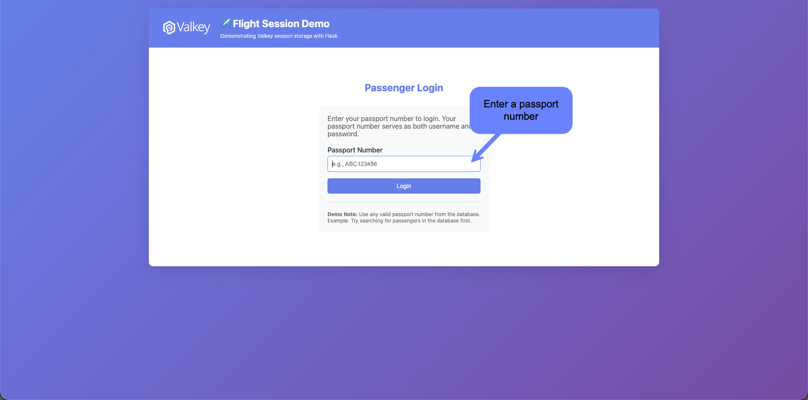
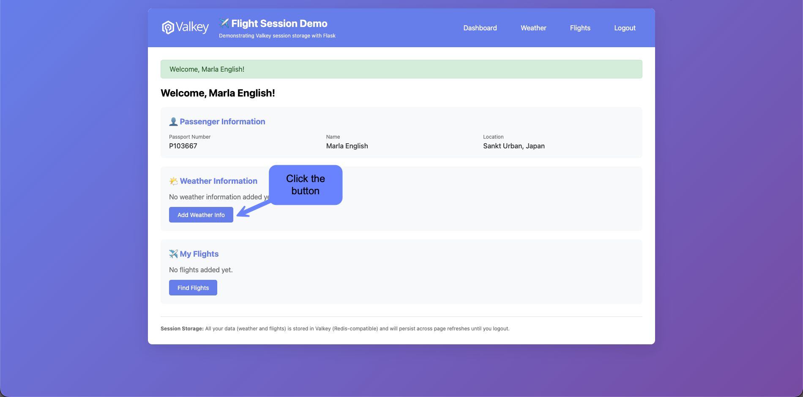
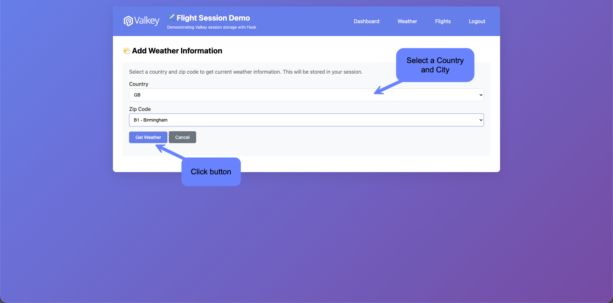
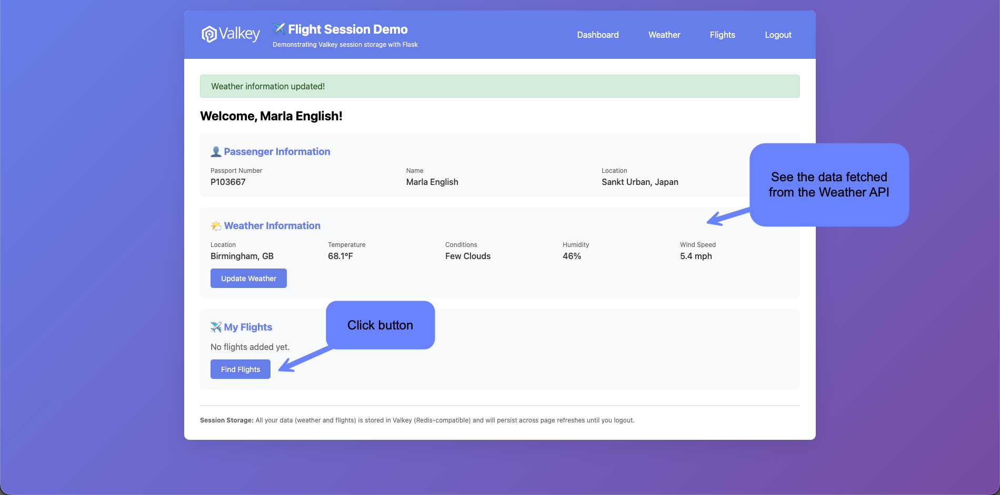
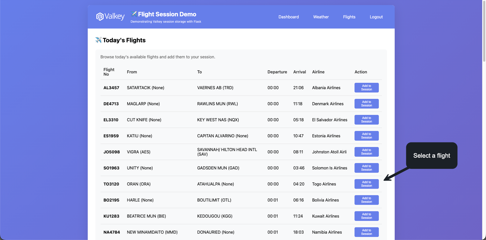
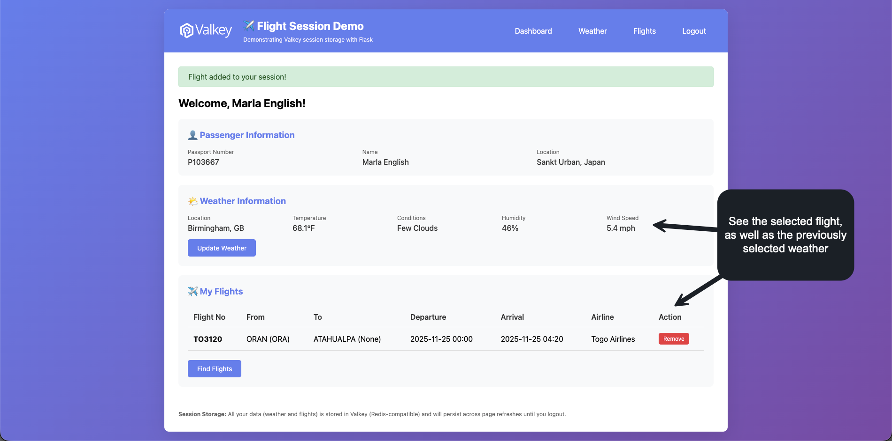
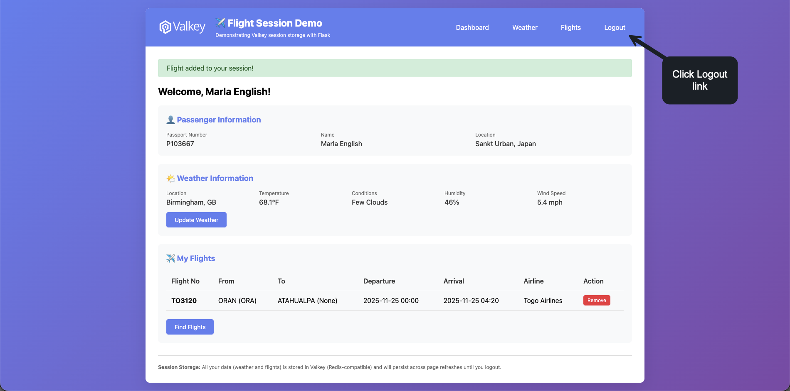
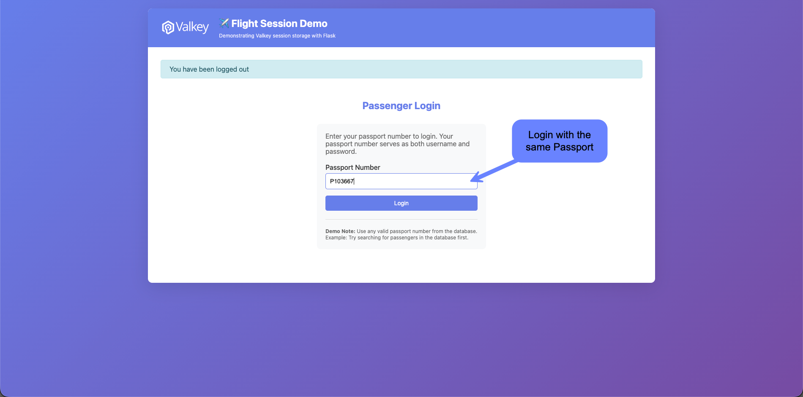
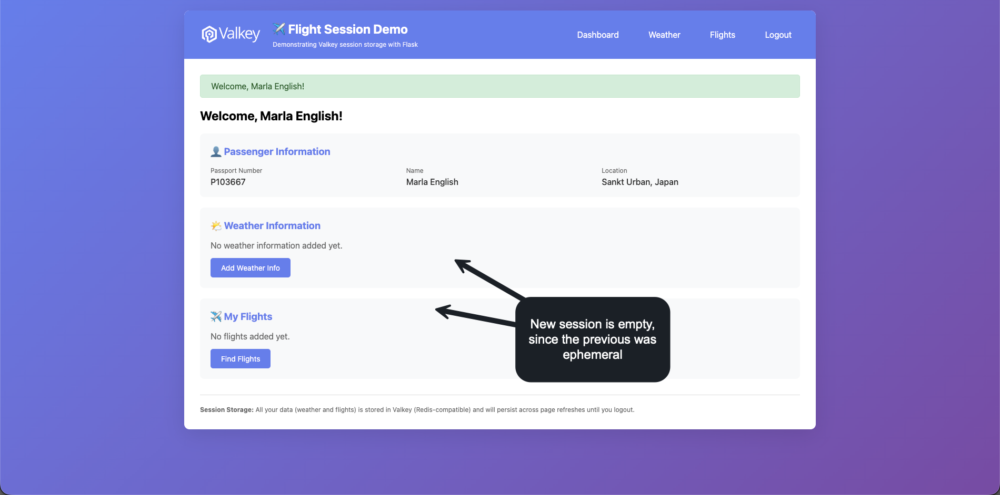

# 5.2 Session Store

## Overview

Demonstrate a simple application that uses Valkey as the Session Store for Flask, showcasing ephemeral data management.

## Why Valkey for Sessions?

- Fast read/write operations
- Automatic expiration with TTL
- Distributed session sharing
- Horizontal scalability

## Use Case

A Flask application where users can:
- Add a Zip Code and fetch weather
- Add a Flight to their session
- View session data
- Logout (data is ephemeral)

## Implementation

### Flask Session Configuration
```python
from flask import Flask, session
from flask_session import Session

app = Flask(__name__)
app.config['SESSION_TYPE'] = 'redis'
app.config['SESSION_REDIS'] = valkey_client
```

## Hands-on Demo

### User Flow
1. User logs in
2. Add zip code to session
3. Fetch weather for that location
4. Add flight information
5. View all session data
6. Logout - data disappears

### Key Features
- Session data stored in Valkey
- Automatic TTL management
- Data persists across requests
- Ephemeral - gone on logout

## Session Data Structure

```json
{
  "user_id": "12345",
  "zip_code": "10001",
  "weather": {...},
  "flights": [...]
}
```

### Step by step flow

Demonstrate a simple application using Valkey as the session store for Flask.

1. Run the Flash application from the CLI.

```bash
# Run the session demo
FLASK_APP=session_demo/app.py uv run flask run --port 5001
```

Find a passenger passport using SQL:

```sql
SELECT * FROM passenger 
WHERE passenger_id >= (
    SELECT FLOOR(RAND() * (SELECT MAX(passenger_id) FROM passenger))
)
LIMIT 10;
```

2. Go to the URL http://localhost:5001 and enter a Passport number selected from the previous query.



3. Click the _Add Weather Info_ button



4. Select a Country from the dropdown, then select a City and click the _Get Weather_ button.



5. See the data fetched from the _Weather API_ and continue to click on the _Add Flights_ button.



6. Select a flight from the list (try to remember the details for validation)



7. When we come back to our dashboard we still see the previously fetched Weather without having to go back to the API; and we also see populated the Flights in the table.



8. Scroll up to the top and click _Logout_ link to terminate the session.



9. Log back in with the same passport as before.



10. The new session is created and the previous data is gone, since it is ephemeral by nature.



### Valkey Commands

Valkey Commands Behind the Scenes done by Flask Session manager

```bash
1764092913.262149 [0 [::1]:62828] "CLIENT" "SETINFO" "LIB-NAME" "redis-py"
1764092913.262372 [0 [::1]:62828] "CLIENT" "SETINFO" "LIB-VER" "7.1.0"
1764092913.262615 [0 [::1]:62828] "SET" "flight_session:yHa6C0krPLGGMoC-AhQD2e0CfLEIm_YV-8EQclRfsgs" "\x83\xacpassenger_id\xcd\x02\x91\xa9passenger\x86\xaapassportno\xa7P103667\xa9firstname\xa5Marla\xa8lastname\xa7English\xa4city\xabSankt Urban\xa7country\xa5Japan\xa3zip\xcd%X\xa8_flashes\x91\x92\xa7success\xb7Welcome, Marla English!" "EX" "2678400"
1764092913.268679 [0 [::1]:62828] "GET" "flight_session:yHa6C0krPLGGMoC-AhQD2e0CfLEIm_YV-8EQclRfsgs"
1764092913.276670 [0 [::1]:62828] "SET" "flight_session:yHa6C0krPLGGMoC-AhQD2e0CfLEIm_YV-8EQclRfsgs" "\x82\xacpassenger_id\xcd\x02\x91\xa9passenger\x86\xaapassportno\xa7P103667\xa9firstname\xa5Marla\xa8lastname\xa7English\xa4city\xabSankt Urban\xa7country\xa5Japan\xa3zip\xcd%X" "EX" "2678400"
1764092926.372278 [0 [::1]:62828] "GET" "flight_session:yHa6C0krPLGGMoC-AhQD2e0CfLEIm_YV-8EQclRfsgs"
1764092926.382986 [0 [::1]:62828] "SET" "flight_session:yHa6C0krPLGGMoC-AhQD2e0CfLEIm_YV-8EQclRfsgs" "\x82\xacpassenger_id\xcd\x02\x91\xa9passenger\x86\xaapassportno\xa7P103667\xa9firstname\xa5Marla\xa8lastname\xa7English\xa4city\xabSankt Urban\xa7country\xa5Japan\xa3zip\xcd%X" "EX" "2678400"
1764092960.294404 [0 [::1]:62828] "GET" "flight_session:yHa6C0krPLGGMoC-AhQD2e0CfLEIm_YV-8EQclRfsgs"
1764092960.978266 [0 [::1]:62828] "SET" "flight_session:yHa6C0krPLGGMoC-AhQD2e0CfLEIm_YV-8EQclRfsgs" "\x84\xacpassenger_id\xcd\x02\x91\xa9passenger\x86\xaapassportno\xa7P103667\xa9firstname\xa5Marla\xa8lastname\xa7English\xa4city\xabSankt Urban\xa7country\xa5Japan\xa3zip\xcd%X\xa7weather\x87\xa4city\xaaBirmingham\xa7country\xa2GB\xa3zip\xa2B1\xa4temp\xcb@Q\x06fffff\xabdescription\xaafew clouds\xa8humidity.\xaawind_speed\xcb@\x15\x99\x99\x99\x99\x99\x9a\xa8_flashes\x91\x92\xa7success\xbcWeather information updated!" "EX" "2678400"
1764092960.985779 [0 [::1]:62828] "GET" "flight_session:yHa6C0krPLGGMoC-AhQD2e0CfLEIm_YV-8EQclRfsgs"
1764092960.987155 [0 [::1]:62828] "SET" "flight_session:yHa6C0krPLGGMoC-AhQD2e0CfLEIm_YV-8EQclRfsgs" "\x83\xacpassenger_id\xcd\x02\x91\xa9passenger\x86\xaapassportno\xa7P103667\xa9firstname\xa5Marla\xa8lastname\xa7English\xa4city\xabSankt Urban\xa7country\xa5Japan\xa3zip\xcd%X\xa7weather\x87\xa4city\xaaBirmingham\xa7country\xa2GB\xa3zip\xa2B1\xa4temp\xcb@Q\x06fffff\xabdescription\xaafew clouds\xa8humidity.\xaawind_speed\xcb@\x15\x99\x99\x99\x99\x99\x9a" "EX" "2678400"
1764092971.187024 [0 [::1]:62828] "GET" "flight_session:yHa6C0krPLGGMoC-AhQD2e0CfLEIm_YV-8EQclRfsgs"
1764092971.455045 [0 [::1]:62828] "SET" "flight_session:yHa6C0krPLGGMoC-AhQD2e0CfLEIm_YV-8EQclRfsgs" "\x83\xacpassenger_id\xcd\x02\x91\xa9passenger\x86\xaapassportno\xa7P103667\xa9firstname\xa5Marla\xa8lastname\xa7English\xa4city\xabSankt Urban\xa7country\xa5Japan\xa3zip\xcd%X\xa7weather\x87\xa4city\xaaBirmingham\xa7country\xa2GB\xa3zip\xa2B1\xa4temp\xcb@Q\x06fffff\xabdescription\xaafew clouds\xa8humidity.\xaawind_speed\xcb@\x15\x99\x99\x99\x99\x99\x9a" "EX" "2678400"
1764092991.977245 [0 [::1]:62828] "GET" "flight_session:yHa6C0krPLGGMoC-AhQD2e0CfLEIm_YV-8EQclRfsgs"
1764092991.992944 [0 [::1]:62828] "SET" "flight_session:yHa6C0krPLGGMoC-AhQD2e0CfLEIm_YV-8EQclRfsgs" "\x85\xacpassenger_id\xcd\x02\x91\xa9passenger\x86\xaapassportno\xa7P103667\xa9firstname\xa5Marla\xa8lastname\xa7English\xa4city\xabSankt Urban\xa7country\xa5Japan\xa3zip\xcd%X\xa7weather\x87\xa4city\xaaBirmingham\xa7country\xa2GB\xa3zip\xa2B1\xa4temp\xcb@Q\x06fffff\xabdescription\xaafew clouds\xa8humidity.\xaawind_speed\xcb@\x15\x99\x99\x99\x99\x99\x9a\xa7flights\x91\x89\xa9flight_id\xce\x00\x06\xd06\xa8flightno\xa6TO3120\xacfrom_airport\xa4ORAN\xa9from_iata\xa3ORA\xaato_airport\xa9ATAHUALPA\xa7to_iata\xc0\xa9departure\xb02025-11-25 00:00\xa7arrival\xb02025-11-25 04:20\xa7airline\xadTogo Airlines\xa8_flashes\x91\x92\xa7success\xbdFlight added to your session!" "EX" "2678400"
1764092991.997938 [0 [::1]:62828] "GET" "flight_session:yHa6C0krPLGGMoC-AhQD2e0CfLEIm_YV-8EQclRfsgs"
1764092991.998904 [0 [::1]:62828] "SET" "flight_session:yHa6C0krPLGGMoC-AhQD2e0CfLEIm_YV-8EQclRfsgs" "\x84\xacpassenger_id\xcd\x02\x91\xa9passenger\x86\xaapassportno\xa7P103667\xa9firstname\xa5Marla\xa8lastname\xa7English\xa4city\xabSankt Urban\xa7country\xa5Japan\xa3zip\xcd%X\xa7weather\x87\xa4city\xaaBirmingham\xa7country\xa2GB\xa3zip\xa2B1\xa4temp\xcb@Q\x06fffff\xabdescription\xaafew clouds\xa8humidity.\xaawind_speed\xcb@\x15\x99\x99\x99\x99\x99\x9a\xa7flights\x91\x89\xa9flight_id\xce\x00\x06\xd06\xa8flightno\xa6TO3120\xacfrom_airport\xa4ORAN\xa9from_iata\xa3ORA\xaato_airport\xa9ATAHUALPA\xa7to_iata\xc0\xa9departure\xb02025-11-25 00:00\xa7arrival\xb02025-11-25 04:20\xa7airline\xadTogo Airlines" "EX" "2678400"
1764093009.343134 [0 [::1]:62828] "GET" "flight_session:yHa6C0krPLGGMoC-AhQD2e0CfLEIm_YV-8EQclRfsgs"
1764093009.343991 [0 [::1]:62828] "SET" "flight_session:yHa6C0krPLGGMoC-AhQD2e0CfLEIm_YV-8EQclRfsgs" "\x82\xaa_permanent\xc2\xa8_flashes\x91\x92\xa4info\xb8You have been logged out" "EX" "2678400"
1764093009.354991 [0 [::1]:62828] "GET" "flight_session:yHa6C0krPLGGMoC-AhQD2e0CfLEIm_YV-8EQclRfsgs"
1764093009.355703 [0 [::1]:62828] "DEL" "flight_session:yHa6C0krPLGGMoC-AhQD2e0CfLEIm_YV-8EQclRfsgs"
```

A totally new sessionm when the users logs in:

```bash
1764093020.062278 [0 [::1]:62828] "SET" "flight_session:aJAGyfP1KeCDRjp4e0G7uJs91o2DIakErJYZUW9pXmM" "\x83\xacpassenger_id\xcd\x02\x91\xa9passenger\x86\xaapassportno\xa7P103667\xa9firstname\xa5Marla\xa8lastname\xa7English\xa4city\xabSankt Urban\xa7country\xa5Japan\xa3zip\xcd%X\xa8_flashes\x91\x92\xa7success\xb7Welcome, Marla English!" "EX" "2678400"
1764093020.068215 [0 [::1]:62828] "GET" "flight_session:aJAGyfP1KeCDRjp4e0G7uJs91o2DIakErJYZUW9pXmM"
1764093020.069256 [0 [::1]:62828] "SET" "flight_session:aJAGyfP1KeCDRjp4e0G7uJs91o2DIakErJYZUW9pXmM" "\x82\xacpassenger_id\xcd\x02\x91\xa9passenger\x86\xaapassportno\xa7P103667\xa9firstname\xa5Marla\xa8lastname\xa7English\xa4city\xabSankt Urban\xa7country\xa5Japan\xa3zip\xcd%X" "EX" "2678400"
1764093864.941071 [0 [::1]:62828] "GET" "flight_session:aJAGyfP1KeCDRjp4e0G7uJs91o2DIakErJYZUW9pXmM"
1764093864.942723 [0 [::1]:62828] "SET" "flight_session:aJAGyfP1KeCDRjp4e0G7uJs91o2DIakErJYZUW9pXmM" "\x82\xaa_permanent\xc2\xa8_flashes\x91\x92\xa4info\xb8You have been logged out" "EX" "2678400"
1764093864.949699 [0 [::1]:62828] "GET" "flight_session:aJAGyfP1KeCDRjp4e0G7uJs91o2DIakErJYZUW9pXmM"
1764093864.951112 [0 [::1]:62828] "DEL" "flight_session:aJAGyfP1KeCDRjp4e0G7uJs91o2DIakErJYZUW9pXmM"
```

## Key Takeaways

- Valkey is excellent for session management
- TTL ensures automatic cleanup
- Ephemeral data is handled efficiently
- Scales horizontally for distributed applications
