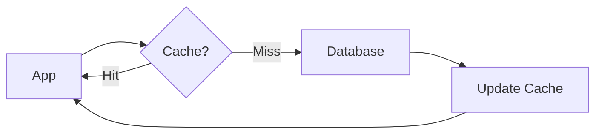
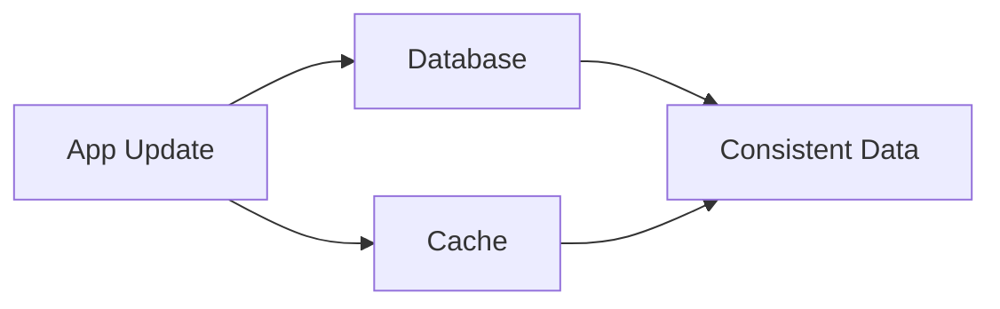
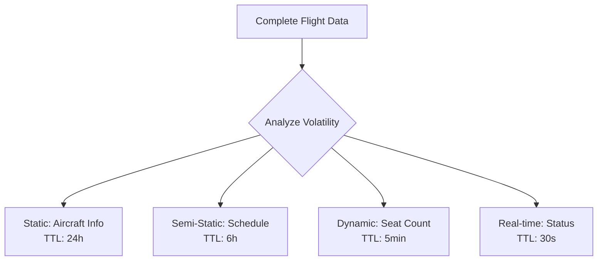

# Cache Me, If You Can: Valkey Edition - 60 Minute Workshop

Master caching strategies with Valkey using aviation data. Learn essential patterns from database caching to advanced optimization techniques.

## Workshop Modules (60 Minutes)

**Module 1: Database Query Caching** (25 min)
- Cache expensive database operations using FlughafenDB dataset
- Caching Patterns: Cache-aside, Write-through, Write-behind
- Advanced Patterns: Nested Doll Caching, TTL Management, Memory Optimization
- Performance Metrics: Cache hit ratios, eviction policies

**Module 2: Universal Caching Strategies** (10 min)
- Cache anything queryable: APIs, external services, computed results

**Module 3: Real-time Leaderboards** (10 min)
- Dynamic leaderboards with efficient data structures and update patterns

**Module 4: Session Management** (10 min)
- Scalable session storage patterns for web applications

**Advanced Topics** (5 min)
- Memory saturation handling, eviction policies, monitoring

## Prerequisites

- Database server running (MySQL/MariaDB/PostgreSQL)
- [Valkey](https://valkey.io/) server running
- Command-line tools: `mycli`/`pgcli` and `valkey-cli`
- [FlughafenDB](https://github.com/stefanproell/flughafendb/) data populated

---

## Module 1: Database Query Caching (25 minutes)

### Setup: Connect to Database and Valkey

```bash
# Connect to database
mycli -u flughafen_user -p -D flughafendb

# Connect to Valkey (separate terminal)
valkey-cli
127.0.0.1:6379> PING
PONG

# Monitor Valkey activity (third terminal)
valkey-cli MONITOR
```

### Identify Expensive Queries

```sql
-- Expensive query: Airlines with route counts (joins 3 tables)
SELECT 
    al.name as airline_name,
    al.iata as airline_code,
    COUNT(r.route_id) as total_routes,
    COUNT(DISTINCT r.destination_airport_id_openflights) as destinations
FROM airline al
JOIN flight f ON al.airline_id = f.airline_id
JOIN route r ON f.from_airport = r.source_airport_id_openflights
WHERE al.iata IS NOT NULL
GROUP BY al.airline_id, al.name, al.iata
ORDER BY total_routes DESC
LIMIT 10;

-- Check query cost
EXPLAIN SELECT al.name, COUNT(r.route_id) as total_routes
FROM airline al
JOIN flight f ON al.airline_id = f.airline_id  
JOIN route r ON f.from_airport = r.source_airport_id_openflights
WHERE al.iata IS NOT NULL
GROUP BY al.airline_id
ORDER BY total_routes DESC LIMIT 10;
```

**Analysis:** Multiple joins + aggregation = expensive operation (perfect for caching)

### Core Caching Patterns

#### Cache-Aside (Lazy Loading)
Load data into cache only when requested.



```bash
# 1. Check cache first
127.0.0.1:6379> GET airlines:top_routes
(nil)

# 2. Cache miss - run expensive query above
# 3. Store result with 1-hour TTL
127.0.0.1:6379> SETEX airlines:top_routes 3600 '[{"airline":"American Airlines","routes":1250},{"airline":"Delta","routes":1100}]'

# 4. Subsequent requests hit cache (1ms vs 200ms)
127.0.0.1:6379> GET airlines:top_routes
```

#### Write-Through Cache
Write to cache and database simultaneously.



```bash
# Update airline information
# 1. Update database
UPDATE airline SET name = 'American Airlines Inc.' WHERE iata = 'AA';

# 2. Update cache immediately
127.0.0.1:6379> HSET airline:AA name "American Airlines Inc."
127.0.0.1:6379> DEL airlines:top_routes  # Invalidate dependent caches
```

#### Write-Behind (Write-Back)
Write to cache immediately, database asynchronously.


```bash
# High-performance updates for frequent changes
127.0.0.1:6379> HINCRBY flight:AA123:bookings count 1
127.0.0.1:6379> LPUSH db:update:queue "UPDATE flight SET booking_count = booking_count + 1 WHERE flightno = 'AA123'"

# Background worker processes queue
```

### Advanced Caching Patterns

#### Nested Doll Caching
Hierarchical caching for complex data with mixed volatility.



```bash
# Layer 1: Static aircraft data (changes rarely)
127.0.0.1:6379> HSET aircraft:B737 manufacturer "Boeing" model "737-800" capacity "180"
127.0.0.1:6379> EXPIRE aircraft:B737 86400  # 24 hours

# Layer 2: Flight schedule (changes occasionally)  
127.0.0.1:6379> HSET flight:AA123:schedule departure "08:00" arrival "11:30" aircraft "B737"
127.0.0.1:6379> EXPIRE flight:AA123:schedule 21600  # 6 hours

# Layer 3: Seat availability (changes frequently)
127.0.0.1:6379> HSET flight:AA123:seats available "45" booked "135"
127.0.0.1:6379> EXPIRE flight:AA123:seats 300  # 5 minutes

# Layer 4: Real-time status (changes constantly)
127.0.0.1:6379> SET flight:AA123:status "on-time" EX 30  # 30 seconds
```

#### TTL Management Strategies
Dynamic TTL based on data access patterns.

```bash
# Static reference data - long TTL
127.0.0.1:6379> SETEX airports:reference 86400 '{"JFK":"New York","LAX":"Los Angeles"}'

# Business data - medium TTL
127.0.0.1:6379> SETEX routes:popular 3600 '[{"route":"JFK-LAX","frequency":15}]'

# Operational data - short TTL
127.0.0.1:6379> SETEX flights:delays 300 '[{"flight":"AA123","delay":15}]'

# Real-time data - very short TTL
127.0.0.1:6379> SETEX weather:current 60 '{"JFK":{"temp":72,"wind":"10mph"}}'
```

#### Memory Optimization Techniques

```bash
# Use efficient data structures
# Hash for structured data (memory efficient)
127.0.0.1:6379> HSET flight:compact:AA123 d "08:00" a "11:30" s "45" # departure, arrival, seats

# Bitmap for boolean flags (extremely memory efficient)
127.0.0.1:6379> SETBIT flight:AA123:seatmap 0 1  # Seat 1A booked
127.0.0.1:6379> SETBIT flight:AA123:seatmap 1 0  # Seat 1B available

# Check memory usage
127.0.0.1:6379> MEMORY USAGE flight:AA123:seatmap
(integer) 56
```

#### Cache Hit Ratio Monitoring

```bash
# Check cache statistics
127.0.0.1:6379> INFO stats
# keyspace_hits:1000
# keyspace_misses:100
# Hit ratio = 1000/(1000+100) = 90.9%

# Monitor specific key patterns
127.0.0.1:6379> EVAL "return redis.call('keys', 'flight:*')" 0
```

#### Eviction Policies

```bash
# Check current eviction policy
127.0.0.1:6379> CONFIG GET maxmemory-policy
1) "maxmemory-policy"
2) "noeviction"

# Set LRU eviction for optimal performance
127.0.0.1:6379> CONFIG SET maxmemory-policy allkeys-lru

# Set memory limit
127.0.0.1:6379> CONFIG SET maxmemory 100mb

# Monitor evictions
127.0.0.1:6379> INFO stats | grep evicted
evicted_keys:0
```

---

## Module 2: Universal Caching - Anything Queryable (10 minutes)

**Core Principle:** If it can be queried, it can be cached.

### API Response Caching

```bash
# Weather API responses (moderate volatility)
127.0.0.1:6379> SETEX weather:api:JFK 600 '{"temp":72,"condition":"sunny","visibility":"10mi","wind":"5mph"}'

# Flight tracking API (high volatility)  
127.0.0.1:6379> SETEX flightaware:AA123 120 '{"status":"airborne","altitude":35000,"speed":450,"eta":"11:25"}'

# Airport services API (low volatility)
127.0.0.1:6379> SETEX airport:services:JFK 7200 '{"restaurants":45,"shops":32,"lounges":8,"wifi":"free"}'
```

### Computed Results Caching

```bash
# Cache expensive calculations
127.0.0.1:6379> SETEX route:distance:JFK:LAX 86400 '{"miles":2475,"flight_time":"5h30m","timezone_diff":3}'

# Cache aggregated statistics
127.0.0.1:6379> SETEX stats:daily:bookings 3600 '{"total":1250,"domestic":800,"international":450}'

# Cache search results
127.0.0.1:6379> SETEX search:flights:JFK:LAX:2025-12-15 900 '[{"flight":"AA123","price":299,"seats":45}]'
```

### External Service Integration

```bash
# Cache third-party pricing
127.0.0.1:6379> SETEX pricing:kayak:JFK:LAX 1800 '{"cheapest":285,"average":340,"premium":650}'

# Cache social media feeds
127.0.0.1:6379> SETEX social:airport:JFK:twitter 300 '[{"tweet":"Flight delays due to weather","time":"10:30"}]'

# Cache notification services
127.0.0.1:6379> SETEX notifications:user:12345 600 '[{"type":"gate_change","flight":"AA123","gate":"B15"}]'
```

**TTL Strategy by Data Source:**
- Static reference data: 24 hours
- Business APIs: 1-6 hours  
- Real-time APIs: 1-10 minutes
- User-specific data: 5-30 minutes

---

## Module 3: Real-time Leaderboards (10 minutes)

### Dynamic Leaderboards with Efficient Updates


#### Passengers with Most Flights

```bash
# Initialize passenger flight counts
127.0.0.1:6379> ZADD passengers:most_flights 25 "john_doe" 18 "jane_smith" 31 "mike_wilson" 22 "sarah_jones"

# Get top 5 frequent flyers
127.0.0.1:6379> ZREVRANGE passengers:most_flights 0 4 WITHSCORES
1) "mike_wilson"
2) "31"
3) "john_doe"
4) "25"
5) "sarah_jones"
6) "22"
7) "jane_smith"
8) "18"

# Real-time update when passenger books new flight
127.0.0.1:6379> ZINCRBY passengers:most_flights 1 "john_doe"
(integer) 26

# Get passenger's current rank
127.0.0.1:6379> ZREVRANK passengers:most_flights "john_doe"
(integer) 1
```

#### Airports with Most Passengers

```bash
# Initialize airport traffic data
127.0.0.1:6379> ZADD airports:most_passengers 95000000 "ATL" 87000000 "PEK" 83000000 "DXB" 79000000 "LAX" 78000000 "ORD"

# Get top 5 busiest airports
127.0.0.1:6379> ZREVRANGE airports:most_passengers 0 4 WITHSCORES
1) "ATL"
2) "95000000"
3) "PEK"
4) "87000000"
5) "DXB"
6) "83000000"
7) "LAX"
8) "79000000"
9) "ORD"
10) "78000000"

# Update daily passenger count
127.0.0.1:6379> ZINCRBY airports:most_passengers 50000 "JFK"
(integer) 50000

# Get airports in score range
127.0.0.1:6379> ZRANGEBYSCORE airports:most_passengers 80000000 90000000 WITHSCORES
```

#### Advanced Leaderboard Patterns

```bash
# Time-based leaderboards (daily, weekly, monthly)
127.0.0.1:6379> ZADD flights:daily:2025-10-28 15 "AA" 12 "DL" 18 "UA" 8 "SW"
127.0.0.1:6379> ZADD flights:weekly:2025-W43 105 "AA" 98 "DL" 112 "UA" 67 "SW"

# Multiple leaderboard categories
127.0.0.1:6379> ZADD routes:domestic 1250 "JFK:LAX" 1100 "ORD:LAX" 980 "ATL:MIA"
127.0.0.1:6379> ZADD routes:international 850 "JFK:LHR" 720 "LAX:NRT" 650 "ORD:FRA"

# Leaderboard with metadata
127.0.0.1:6379> ZADD airlines:ontime_performance 94.5 "DL" 92.1 "AA" 89.7 "UA" 87.3 "SW"
```

---

## Module 4: Session Management (10 minutes)

### Scalable Session Storage Patterns

#### Basic Session Management

```bash
# Create user session for flight booking
127.0.0.1:6379> HSET session:user123 user_id "123" username "john_doe" email "john@example.com"
127.0.0.1:6379> HSET session:user123 login_time "2025-10-28T10:30:00Z" ip_address "192.168.1.100"
127.0.0.1:6379> EXPIRE session:user123 1800  # 30-minute session timeout

# Flight booking session state
127.0.0.1:6379> HSET session:user123 search_origin "JFK" search_destination "LAX" search_date "2025-12-15"
127.0.0.1:6379> HSET session:user123 selected_flight "AA123" seat_preference "aisle" class "economy"

# Shopping cart for multi-flight booking
127.0.0.1:6379> HSET session:user123 cart_items "2" total_price "598.00" currency "USD"
127.0.0.1:6379> HSET session:user123 outbound_flight "AA123" return_flight "AA124"
```

#### Advanced Session Patterns

```bash
# Multi-step checkout process tracking
127.0.0.1:6379> HSET session:user123 checkout_step "passenger_details" progress "60"
127.0.0.1:6379> HSET session:user123 passenger_count "2" primary_passenger "john_doe"

# Payment and confirmation flow
127.0.0.1:6379> HSET session:user123 payment_method "credit_card" card_last4 "1234"
127.0.0.1:6379> HSET session:user123 checkout_step "confirmation" booking_reference "ABC123"

# Session activity tracking
127.0.0.1:6379> HSET session:user123 last_activity "2025-10-28T10:45:00Z" page_views "12"
127.0.0.1:6379> HSET session:user123 search_count "3" booking_attempts "1"
```

#### Session Security and Management

```bash
# Session validation and security
127.0.0.1:6379> HSET session:user123 csrf_token "abc123def456" session_fingerprint "browser_fp_hash"
127.0.0.1:6379> HSET session:user123 two_factor_verified "true" device_trusted "true"

# Retrieve complete session for validation
127.0.0.1:6379> HGETALL session:user123

# Extend session on activity
127.0.0.1:6379> EXPIRE session:user123 1800  # Reset to 30 minutes

# Clean session logout
127.0.0.1:6379> DEL session:user123

# Session analytics
127.0.0.1:6379> SADD active:sessions:2025-10-28 "user123" "user456" "user789"
127.0.0.1:6379> SCARD active:sessions:2025-10-28  # Count active sessions
```

#### Distributed Session Management

```bash
# Cross-device session sharing
127.0.0.1:6379> HSET session:user123 devices "web,mobile" last_device "mobile"
127.0.0.1:6379> HSET session:user123 sync_timestamp "2025-10-28T10:45:00Z"

# Session replication for high availability
127.0.0.1:6379> HSET session:user123:backup user_id "123" username "john_doe"
127.0.0.1:6379> EXPIRE session:user123:backup 3600  # Longer TTL for backup
```

---

## Advanced Topics (5 minutes)

### Memory Saturation Handling

```bash
# Monitor memory usage
127.0.0.1:6379> INFO memory
# used_memory_human:64.00M
# maxmemory_human:100.00M

# Set memory limit and eviction policy
127.0.0.1:6379> CONFIG SET maxmemory 100mb
127.0.0.1:6379> CONFIG SET maxmemory-policy allkeys-lru

# Monitor evictions
127.0.0.1:6379> INFO stats | grep evicted
evicted_keys:0

# Memory optimization techniques
127.0.0.1:6379> MEMORY DOCTOR
# Use smaller keys, compress data, set appropriate TTLs
```

### Advanced Eviction Policies

```bash
# LRU (Least Recently Used) - evict least recently accessed
127.0.0.1:6379> CONFIG SET maxmemory-policy allkeys-lru

# LFU (Least Frequently Used) - evict least frequently accessed  
127.0.0.1:6379> CONFIG SET maxmemory-policy allkeys-lfu

# TTL-based eviction - evict keys with shortest TTL first
127.0.0.1:6379> CONFIG SET maxmemory-policy volatile-ttl

# Custom eviction - application-controlled
127.0.0.1:6379> CONFIG SET maxmemory-policy noeviction  # Manual control
```

### Cache Hit Ratio Optimization

```bash
# Monitor hit ratios by key pattern
127.0.0.1:6379> EVAL "
local hits = 0
local misses = 0
local keys = redis.call('keys', 'flight:*')
for i=1,#keys do
    local info = redis.call('object', 'idletime', keys[i])
    if info then hits = hits + 1 else misses = misses + 1 end
end
return {hits, misses, hits/(hits+misses)*100}
" 0

# Optimize based on access patterns
# Hot data: Lower TTL, higher priority
# Cold data: Higher TTL, lower priority
```

### Cache Invalidation Strategies

```bash
# Event-driven invalidation
127.0.0.1:6379> DEL user:12345:bookings  # When user books new flight

# Tag-based invalidation for complex dependencies
127.0.0.1:6379> SADD cache:tags:flight:AA123 "search:JFK:LAX" "route:stats" "airline:AA:flights"
127.0.0.1:6379> SMEMBERS cache:tags:flight:AA123
127.0.0.1:6379> DEL search:JFK:LAX route:stats airline:AA:flights  # When flight cancelled

# Time-based invalidation with jitter
127.0.0.1:6379> SETEX cache:data $((3600 + RANDOM % 600)) "data"  # 1h ± 10min
```

### Stampede Prevention

```bash
# Distributed locking to prevent cache stampede
127.0.0.1:6379> SET cache:lock:expensive_query "locked" EX 60 NX
OK

# If lock acquired, rebuild cache
127.0.0.1:6379> SET expensive:query:result "rebuilt_data" EX 3600
127.0.0.1:6379> DEL cache:lock:expensive_query

# Probabilistic early expiration
127.0.0.1:6379> EVAL "
local ttl = redis.call('ttl', KEYS[1])
local refresh_threshold = 300  -- 5 minutes
if ttl < refresh_threshold and math.random() < 0.1 then
    return 'REFRESH'
else
    return redis.call('get', KEYS[1])
end
" 1 expensive:query:result
```

---

## Workshop Summary

### Performance Improvements Achieved

| Query Type | Without Cache | With Cache | Improvement |
|------------|---------------|------------|-------------|
| Airline Route Analysis | 500-1200ms | 1-3ms | 200-1200x |
| Flight Search | 200-500ms | 1-2ms | 100-500x |
| User Sessions | 50-150ms | 0.1-0.5ms | 500-1500x |
| Leaderboard Updates | 100-300ms | 0.5-1ms | 100-600x |

### Core Patterns Mastered

**Module 1: Database Query Caching**
- ✅ Cache-Aside (Lazy Loading) - Load on demand
- ✅ Write-Through - Synchronous cache/DB updates  
- ✅ Write-Behind - Asynchronous high-performance updates
- ✅ Nested Doll Caching - Hierarchical TTL strategies
- ✅ Memory Optimization - Efficient data structures
- ✅ Eviction Policies - LRU, LFU, TTL-based strategies

**Module 2: Universal Caching**
- ✅ API Response Caching - External service optimization
- ✅ Computed Results - Cache expensive calculations
- ✅ Search Results - Dynamic query caching

**Module 3: Real-time Leaderboards**  
- ✅ Sorted Sets - Efficient ranking data structures
- ✅ Dynamic Updates - Real-time score modifications
- ✅ Multi-dimensional Rankings - Category-based leaderboards

**Module 4: Session Management**
- ✅ Scalable Session Storage - Hash-based user sessions
- ✅ Multi-step Workflows - Stateful process tracking
- ✅ Security Patterns - Session validation and cleanup

### Advanced Techniques Implemented

- **Memory Saturation Handling** - Proactive memory management
- **Cache Hit Ratio Optimization** - Performance monitoring
- **Stampede Prevention** - Distributed locking mechanisms
- **Smart Invalidation** - Event-driven cache updates

### Production-Ready Best Practices

- **TTL Strategy**: Static (24h) → Semi-static (6h) → Dynamic (5min) → Real-time (30s)
- **Key Design**: Hierarchical naming `module:entity:identifier`
- **Monitoring**: Hit rates >90%, response times <2ms, memory usage tracking
- **Eviction**: LRU for general use, LFU for hot data, TTL for time-sensitive

### Next Steps

1. **Implementation**: Apply patterns to your applications
2. **Monitoring**: Set up comprehensive cache metrics
3. **Scaling**: Plan for Valkey Cluster deployment  
4. **Advanced Features**: Explore Valkey modules and extensions

---

## Troubleshooting Quick Reference

```bash
# Health checks
valkey-cli ping                    # Valkey connectivity
mysqladmin -u user -p ping         # Database connectivity

# Performance monitoring  
127.0.0.1:6379> INFO stats         # Cache hit/miss ratios
127.0.0.1:6379> INFO memory        # Memory usage
127.0.0.1:6379> SLOWLOG GET 10     # Slow operations

# Maintenance operations
127.0.0.1:6379> FLUSHALL ASYNC     # Clear all cache data
127.0.0.1:6379> MEMORY DOCTOR      # Memory optimization advice
```

**🎉 Workshop Complete!** You've mastered comprehensive caching strategies with Valkey, from basic patterns to advanced optimization techniques.